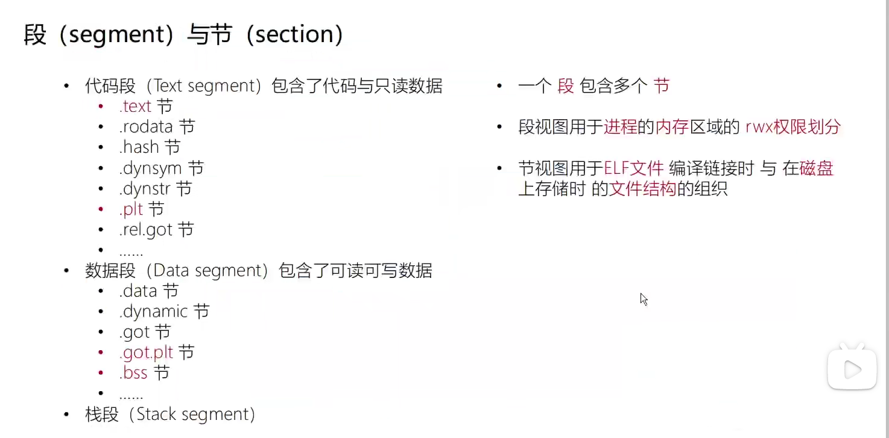
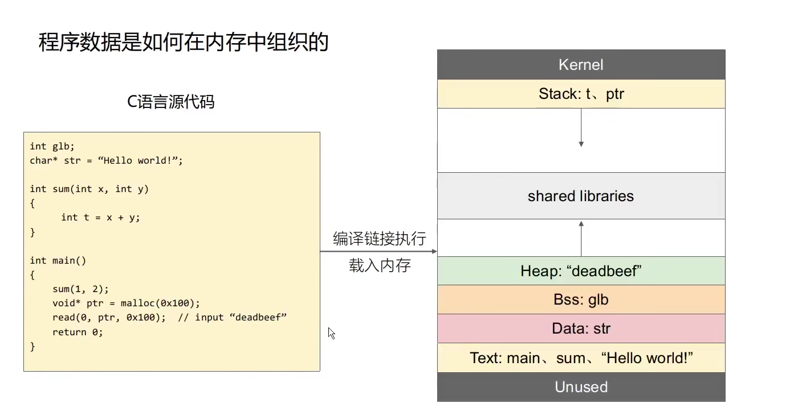
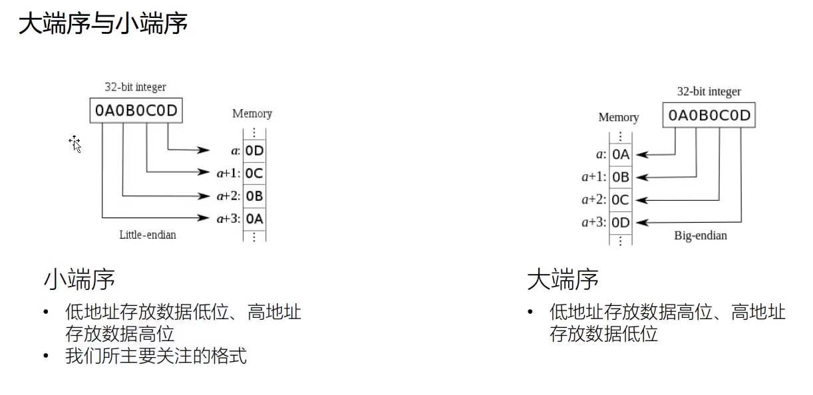

# C/C++语言基础

## GCC的编译

```shell
#include<stdio.h>
int main(){
    puts("hello world");
}


gcc hello.c
./a.out
hello,world

```

包括四个步骤，==预处理==、==编译==、==汇编==和==链接==。

```shell
//预处理
gcc -E hello.c -o hello.i
//编译
gcc -S hello.c -o hello.s
//汇编
$ gcc -c hello.s -o hello.o
或者
$gcc -c hello.c -o hello.o
//链接
gcc hello.o -o hello
```


- 编译：把预处理完的文件进行一系列词法分析、语法分析、语义分析及优化后生成相应的汇编代码文件。
- 汇编：汇编器将汇编代码转变成机器可以执行的指令。
- 链接：目标文件需要链接一大堆文件才能得到最终的可执行文件（上面只展示了链接后的 main 函数，可以和 hello.o 中的 main 函数作对比）。链接过程主要包括地址和空间分配（Address and Storage Allocation）、符号决议（Symbol Resolution）和重定向（Relocation）等。


加上`-save-temps`可以保留临时的中间文件。

```shell
gcc -save-temps hello.c
```


glibc 即 GNU C Library，是为 GNU 操作系统开发的一个 C 标准库。glibc 主要由两部分组成，一部分是头文件，位于 `/usr/include`；另一部分是库的二进制文件。二进制文件部分主要是 C 语言标准库，有动态和静态两个版本，动态版本位于 `/lib/libc.so.6`，静态版本位于 `/usr/lib/libc.a`。

# Linux ELF

光理论看的脑子疼，所以只简单的记录了，之后学的多了，对ELF理解更深了再来补充。

Linux 可执行文件格式 ELF （Executable Linkable Format）文件的三种类型：

可重定位文件（Relocatable file）

- 包含了代码和数据，可以和其他目标文件链接生成一个可执行文件或共享目标文件。
- elfDemo.o


可执行文件（Executable File）

- 包含了可以直接执行的文件。
- elfDemo_static.out


共享目标文件（Shared Object File）

- 包含了用于链接的代码和数据，分两种情况。一种是链接器将其与其他的可重定位文件和共享目标文件链接起来，生产新的目标文件。另一种是动态链接器将多个共享目标文件与可执行文件结合，作为进程映像的一部分。
- elfDemo.out
- `libc-2.25.so`


所以共享目标文件有动态链接和静态链接两种（好像是？）


简化的结构是这样：


在这个简化的 ELF 文件中，开头是一个“文件头”，之后分别是代码段、数据段和.bss段。程序源代码编译后，执行语句变成机器指令，保存在`.text`段；已初始化的全局变量和局部静态变量都保存在`.data`段；未初始化的全局变量和局部静态变量则放在`.bss`段。

把程序指令和程序数据分开存放有许多好处，从安全的角度讲，当程序被加载后，数据和指令分别被映射到两个虚拟区域。由于数据区域对于进程来说是可读写的，而指令区域对于进程来说是只读的，所以这两个虚存区域的权限可以被分别设置成可读写和只读，可以防止程序的指令被改写和利用。


`.rodata` 段保存只读数据，包括只读变量和字符串常量。








其他的细节之后再补了。	

# 参考链接

https://firmianay.gitbook.io/ctf-all-in-one/

https://www.bilibili.com/video/BV1Uv411j7fr?p=2

