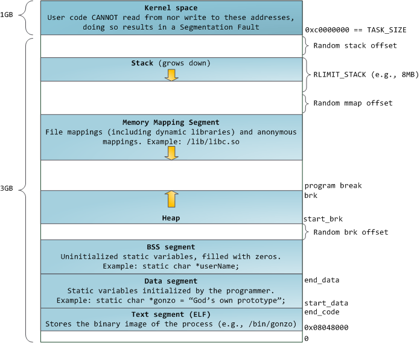
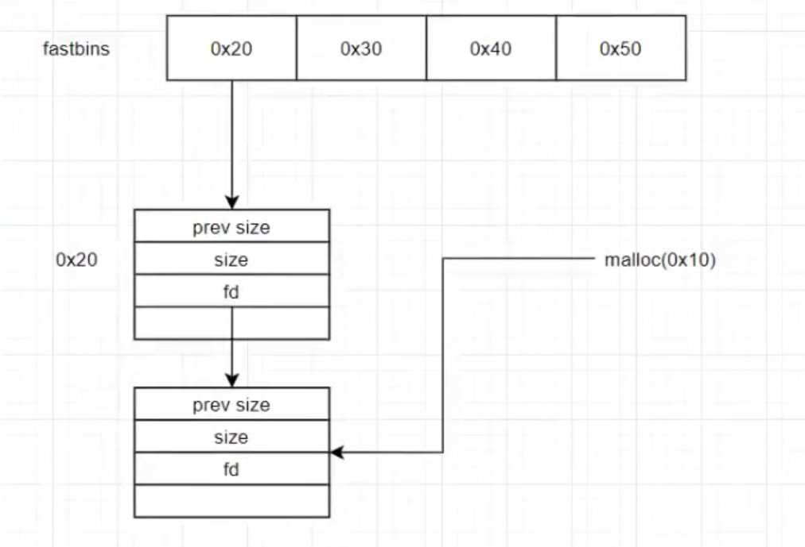
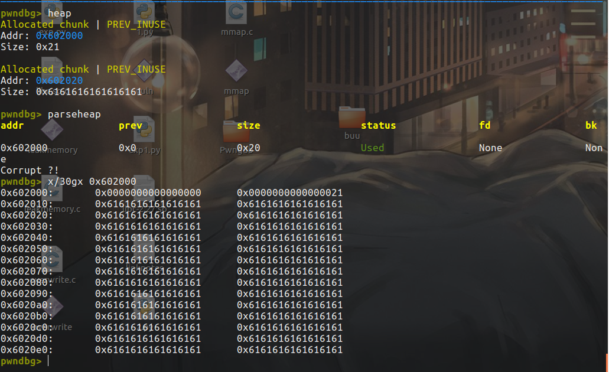
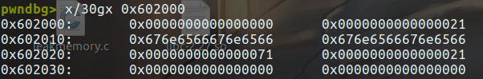
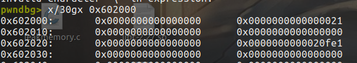
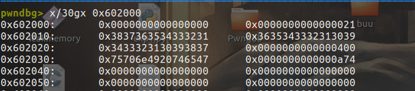

# 前言

开始很难的堆的学习，加油加油。

学习自ctfwiki，yichen的信安知识库，星盟b栈的视频以及《CTF-ALL-IN-ONE》和华庭的《glibc内存管理ptmalloc源代码分析》等。

# 堆概述

在程序运行过程中，堆可以提供动态分配的内存，允许程序申请大小未知的内存。堆其实就是程序虚拟地址空间的一块连续的线性区域，它由低地址向高地址方向增长。我们一般称管理堆的那部分程序为堆管理器。

堆管理器处于用户和内核中间，一般内核会先预先分配很大的一块连续内存然后让堆管理器管理，用户请求和释放的时候都由堆管理器管理，直到这块内存不够用的时候堆管理器才再与内核交互。

目前 Linux 标准发行版中使用的堆分配器是 glibc 中的堆分配器：ptmalloc2。ptmalloc2 主要是通过 malloc/free 函数来分配和释放内存块。



上面是高地址下面是低地址，栈是由高地址向低地址增长，而堆是由低地址向高地址增长。

 

## 基本操作

2个基本操作的函数就是`malloc()`和`free()`，一个请求分配一个是释放。

```c
malloc(size_t n)
free(void* p)
```

malloc 函数返回对应大小字节的内存块的指针。此外，该函数还对一些异常情况进行了处理

- 当 n=0 时，返回当前系统允许的堆的最小内存块。
- 当 n 为负数时，由于在大多数系统上，**size_t 是无符号数（这一点非常重要）**，所以程序就会申请很大的内存空间，但通常来说都会失败，因为系统没有那么多的内存可以分配。


free 函数会释放由 p 所指向的内存块。这个内存块有可能是通过 malloc 函数得到的，也有可能是通过相关的函数 realloc 得到的。

此外，该函数也同样对异常情况进行了处理

- **当 p 为空指针时，函数不执行任何操作。**
- 当 p 已经被释放之后，再次释放会出现乱七八糟的效果，这其实就是 `double free`。
- 除了被禁用 (mallopt) 的情况下，当释放很大的内存空间时，程序会将这些内存空间还给系统，以便于减小程序所使用的内存空间。


可是`malloc`和`free`并不是与系统交互的函数，背后调用的是`brk()`、`sbrk()`、`mmap()`和`munmap()`。

根据上面的图可以看到，Heap是在data和bss段上面的。brk 指示堆结束地址，start_brk 指示堆开始地址。BSS segment 和 heap 之间有一段 Random brk offset，这是由于 ASLR 的作用，如果关闭了 ASLR，则 Random brk offset 为 0，堆结束地址和数据段开始地址重合。


## brk和sbrk

```c
#include <unistd.h>

int brk(void *addr);

void *sbrk(intptr_t increment);
```

参数 `*addr` 是进程数据段的结束地址，`brk()` 通过改变该地址来改变数据段的大小，当结束地址向高地址移动，进程内存空间增大，当结束地址向低地址移动，进程内存空间减小。`brk()`调用成功时返回 0，失败时返回 -1。 `sbrk()` 与 `brk()` 类似，但是参数 `increment` 表示增量，即增加或减少的空间大小，调用成功时返回变化前数据段的结束地址，失败时返回 -1。

## mmap和munmap

```c
#include <sys/mman.h>

void *mmap(void *addr, size_t len, int prot, int flags,
    int fildes, off_t off);
int munmap(void *addr, size_t len);
```

`mmap()` 函数用于创建新的虚拟内存区域，并将对象映射到这些区域中，当它不将地址空间映射到某个文件时，我们称这块空间为匿名（Anonymous）空间，匿名空间可以用来作为堆空间。`mmap()` 函数要求内核创建一个从地址 `addr` 开始的新虚拟内存区域，并将文件描述符 `fildes` 指定的对象的一个连续的片（chunk）映射到这个新区域。连续的对象片大小为 `len` 字节，从距文件开始处偏移量为 `off` 字节的地方开始。`prot` 描述虚拟内存区域的访问权限位，`flags` 描述被映射对象类型的位组成。

`munmap()` 则用于删除虚拟内存区域。

具体使用参考书上了。


## bin

### fastbin



具有prev size,size,fd和user data，单向链表（只有fastbin是单向的），是LIFO的（后进先出）。且它的P标志为1，防止被合并。

### unsorted bin

可视为large bin和small bin的缓冲区。

除了fastbin之外，别的bin都是双向链表且先进先出。


### large bin

具有`fd_nextsize`和`bk_nextsize `，共63个bin，每个bin中的chunk大小不一致，而是处在一定区间范围。

### small bin

| 下标 | SIZE_SZ=4（32 位） | SIZE_SZ=8（64 位） |
| :--- | :----------------- | :----------------- |
| 2    | 16                 | 32                 |
| 3    | 24                 | 48                 |
| 4    | 32                 | 64                 |
| 5    | 40                 | 80                 |
| x    | 2*4*x              | 2*8*x              |
| 63   | 504                | 1008               |


## 分配内存

1. 获取分配区的锁，为了防止多个线程同时访问同一个分配区，在进行分配之前需要 取得分配区域的锁。线程先查看线程私有实例中是否已经存在一个分配区，如果存 在尝试对该分配区加锁，如果加锁成功，使用该分配区分配内存，否则，该线程搜 索分配区循环链表试图获得一个空闲（没有加锁）的分配区。如果所有的分配区都 已经加锁，那么 ptmalloc 会开辟一个新的分配区，把该分配区加入到全局分配区循 环链表和线程的私有实例中并加锁，然后使用该分配区进行分配操作。开辟出来的 新分配区一定为非主分配区，因为主分配区是从父进程那里继承来的。开辟非主分 配区时会调用 mmap()创建一个 sub-heap，并设置好 top chunk。 
2. 将用户的请求大小转换为实际需要分配的 chunk 空间大小。
3. 判断所需分配chunk的大小是否满足chunk_size <= max_fast (max_fast 默认为 64B)， 如果是的话，则转下一步，否则跳到第 5 步。
4. 首先尝试在 fast bins 中取一个所需大小的 chunk 分配给用户。如果可以找到，则分 配结束。否则转到下一步。 
5.  判断所需大小是否处在 small bins 中，即判断 chunk_size < 512B 是否成立。如果 chunk 大小处在 small bins 中，则转下一步，否则转到第 7 步。 
6.  根据所需分配的 chunk 的大小，找到具体所在的某个 small bin，从该 bin 的尾部摘 取一个恰好满足大小的 chunk。若成功，则分配结束，否则，转到下一步。 
7. 到了这一步，说明需要分配的是一块大的内存，或者 small bins 中找不到合适的 chunk。于是，ptmalloc 首先会遍历 fast bins 中的 chunk，将相邻的 chunk 进行合并， 并链接到 unsorted bin 中，然后遍历 unsorted bin 中的 chunk，如果 unsorted bin 只 有一个 chunk，并且这个 chunk 在上次分配时被使用过，并且所需分配的 chunk 大 小属于 small bins，并且 chunk 的大小大于等于需要分配的大小，这种情况下就直 接将该 chunk 进行切割，分配结束，否则将根据 chunk 的空间大小将其放入 small bins 或是 large bins 中，遍历完成后，转入下一步。
8. 到了这一步，说明需要分配的是一块大的内存，或者 small bins 和 unsorted bin 中 都找不到合适的 chunk，并且 fast bins 和 unsorted bin 中所有的 chunk 都清除干净 了。从 large bins 中按照“smallest-first，best-fit”原则，找一个合适的 chunk，从 中划分一块所需大小的 chunk，并将剩下的部分链接回到 bins 中。若操作成功，则 分配结束，否则转到下一步。 
9. 如果搜索 fast bins 和 bins 都没有找到合适的 chunk，那么就需要操作 top chunk 来 进行分配了。判断 top chunk 大小是否满足所需 chunk 的大小，如果是，则从 top chunk 中分出一块来。否则转到下一步。 
10. 到了这一步，说明 top chunk 也不能满足分配要求，所以，于是就有了两个选择: 如 果是主分配区，调用 sbrk()，增加 top chunk 大小；如果是非主分配区，调用 mmap 来分配一个新的 sub-heap，增加 top chunk 大小；或者使用 mmap()来直接分配。在 这里，需要依靠 chunk 的大小来决定到底使用哪种方法。判断所需分配的 chunk 大小是否大于等于 mmap 分配阈值，如果是的话，则转下一步，调用 mmap 分配， 否则跳到第 12 步，增加 top chunk 的大小。 
11. 使用 mmap 系统调用为程序的内存空间映射一块 chunk_size align 4kB 大小的空间。 然后将内存指针返回给用户。 
12. 判断是否为第一次调用 malloc，若是主分配区，则需要进行一次初始化工作，分配一块大小为(chunk_size + 128KB) align 4KB 大小的空间作为初始的 heap。若已经初 始化过了，主分配区则调用 sbrk()增加 heap 空间，分主分配区则在 top chunk 中切 割出一个 chunk，使之满足分配需求，并将内存指针返回给用户。


# 堆溢出

## 介绍

堆溢出是指程序向某个堆块中写入的字节数超过了堆块本身可使用的字节数（**之所以是可使用而不是用户申请的字节数，是因为堆管理器会对用户所申请的字节数进行调整，这也导致可利用的字节数都不小于用户申请的字节数**），因而导致了数据溢出，并覆盖到**物理相邻的高地址**的下一个堆块。

其实和栈溢出有点类似，不同的是堆溢出没有可控的ret，因此常见的利用是这样：

1. 覆盖与其

   物理相邻的下一个 chunk的内容。

   - prev_size
   - size，主要有三个比特位，以及该堆块真正的大小。
     - NON_MAIN_ARENA
     - IS_MAPPED
     - PREV_INUSE
     - the True chunk size
   - chunk content，从而改变程序固有的执行流。

2. 利用堆中的机制（如 unlink 等 ）来实现任意地址写入（ Write-Anything-Anywhere）或控制堆块中的内容等效果，从而来控制程序的执行流。


## 示例

```c
#include <stdio.h>

int main(void) 
{
  char *chunk;
  chunk=malloc(24);
  puts("Get input:");
  gets(chunk);
  return 0;
}
```

可以发现当输入的长度不限的时候，会造成堆溢出：



需要注意一下分配24长度，为什么的size却是0x20（不管标志位）。首先对于该chunk，prev size占8字节，size占8字节，本来分配得到的0x18的用户数据，加起来应该是0x28字节的，但是因为该chunk不是free的，所以下一个chunk，也就是top chunk的prev size无用处，所以该字段也给我们分配的chunk用了（空间复用），所以user data给了0x10，实际上下一个chunk的prev size的0x08也是我们的这个chunk的。

## 另外2个分配函数

`calloc` 在分配后会自动进行清空，这对于某些信息泄露漏洞的利用来说是致命的。

```c
calloc(0x20);
//等同于
ptr=malloc(0x20);
memset(ptr,0,0x20);
```

另外一种是`realloc()`：

```c
  char *chunk,*chunk1;
  chunk=malloc(16);
  chunk1=realloc(chunk,32);
```

- 当 realloc(ptr,size) 的 size 不等于 ptr 的 size 时
  - 如果申请 size > 原来 size
    - 如果 chunk 与 top chunk 相邻，直接扩展这个 chunk 到新 size 大小
    - 如果 chunk 与 top chunk 不相邻，相当于 free(ptr),malloc(new_size)
  - 如果申请 size < 原来 size
    - 如果相差不足以容得下一个最小 chunk(64 位下 32 个字节，32 位下 16 个字节)，则保持不变
    - 如果相差可以容得下一个最小 chunk，则切割原 chunk 为两部分，free 掉后一部分
- 当 realloc(ptr,size) 的 size 等于 0 时，相当于 free(ptr)
- 当 realloc(ptr,size) 的 size 等于 ptr 的 size，不进行任何操作

# Off-By-One

说白了就是只溢出1个字节，常见的2种情形：

```c
int my_gets(char *ptr,int size)
{
    int i;
    for(i=0;i<=size;i++)
    {
        ptr[i]=getchar();
    }
    return i;
}
int main()
{
    void *chunk1,*chunk2;
    chunk1=malloc(16);
    chunk2=malloc(16);
    puts("Get Input:");
    my_gets(chunk1,16);
    return 0;
}
```

以为循环了16次，因为for边界没设置好导致了循环17次：



覆盖到了chunk2的prev_size。


第二种情形就是字符串操作不当：

```c
int main(void)
{
    char buffer[40]="";
    void *chunk1;
    chunk1=malloc(24);
    puts("Get Input");
    gets(buffer);
    if(strlen(buffer)==24)
    {
        strcpy(chunk1,buffer);
    }
    return 0;

}
```

strlen计算字符串长度的时候不算上`\x00`，但是strcpy会把`\x00`复制过去，所以其实复制过去了25个字节：





可以发现，0x602020那一行最后的1被覆盖成了`\x00`。

## 实例1：Asis CTF 2016 B00ks

