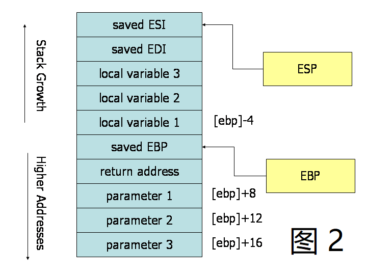

# 前言

汇编也是学习PWN必须懂得一个东西，之前问得一个师傅，他是这样跟我说得：

> 你需要练习到能把汇编当小说看，然后汇编就合格了
>
> 常用汇编包括x86/64 arm mips risc-v
>
> 你先学第一种
>
> 做异构pwn需要会arm
>
> 等你二转再说
>
> x86有两种格式，王爽是intel格式，另外一个at&t也要会

所以要懂得东西好多啊呜呜，慢慢学习了，先大致的简单学习一种汇编，然后慢慢在学PWN的过程中再慢慢学习慢慢补充了。


# 《汇编语言》王爽书中的汇编

直接网上找pdf学就行了，我先是把这本书给看完了一遍的，王爽的汇编是intel格式，寄存器都是16位。虽然这本书中的汇编和x86/64的汇编有一定的区别，但是这本书讲解的是确实非常好，非常容易入门而且讲解的很详细，像我这种计组和操作系统都没学好的小白，看了这本书对于CPU、寄存器、内存都加深了理解，再去学x86/64的汇编也就不是很难了。

# x86  at&t格式的汇编

X86和X64区别在于X86是32位的，X64是64位的。其他的区别以后再学。


首先得稍微知道一下intel格式的汇编和AT&T格式汇编的区别。

1. AT&T汇编中寄存器前面要加上`% `作为前缀。比如`inc %eax`
2. AT&T汇编中立即数前面要加上`$`作为前缀。比如`push $1`
3. AT&T汇编中绝大多数指令的源操作数和目标操作数的位置和intel格式的汇编位置是相反的。比如王爽书中的`add ax,bx`在AT&T中应为`add %ebx,%eax`
4. AT&T 汇编格式中，操作数的字长由操作符的最后一个字母决定，后缀'b'、'w'、'l'分别表示操作数为字节（byte，8 比特）、字（word，16 比特）和长字（long，32比特）；而在 Intel 汇编格式中，操作数的字长是用 "byte ptr" 和 "word ptr" 等前缀来表示的。
5. 远程转移指令和远程子调用指令的操作码，在 AT&T 汇编格式中为 "ljump" 和 "lcall"，而在 Intel 汇编格式中则为 "jmp far" 和 "call far"
6. ret指令同理，AT&T中为`lret`，在intel中为`ret far`
7. 在 AT&T 汇编格式中，内存操作数的寻址方式是`section:disp(base, index, scale)`，而intel格式中的内存操作数的寻址方式是`section:[base + index*scale + disp]`。


## 寄存器

X86机器中的寄存器名字前面基本都加了E，比如EAX。8个通用寄存器是EAX,EBX,ECX,EDX,ESI,EDI,ESP,EBP，而且它们全都是32位的。

当然同样可以拆开使用，可以将 `EAX` 的最低的 2 位字节视为 16 位寄存器 ( `AX` ). 还可以将 `AX` 的最低位的 1 个字节看成 8 位寄存器来用 ( `AL` ), 当然 `AX` 的高位的 1 个字节也可以看成是一个 8 位寄存器 ( `AH` )。


## 一些声明

`.data`用于声明数据。`.byte`, `.short` 和 `.long` 可以分别用来声明 1 个字节, 2 个字节和 4 个字节的数据。

直接放一下书上的例子：

```
.data
var :
       .byte 64 #声明一个字节型变量 var, 其所对应的数据是64
       .byte 10 #声明一个数据 10, 这个数据没有所谓的 " 标签 ", 它的内存地址就是 var+1.

x :
       .short 42 #声明一个大小为 2 个字节的数据, 这个数据有个标签 " x "

y :
       .long 30000 #声明一个大小为 4 个字节的数据, 这个数据标签是 " y ",  y 的值被初始化为 30000
s :
       .long 1, 2, 3 #声明 3 个大小为 4 字节的数据 1, 2, 3. 内存中 s+8 这个标签所对应的数据就是 3.

barr:
       .zero 10 #从 barr 这个标签的位置开始, 声明 10 个字节的数据, 这些数据被初始化为 0.

str :
       .string "hello" #从 str 这个标签的位置开始, 声明 6 个字节的数据, 即 hello 对应的 ASCII 值, 这最后还跟有一个 nul(0) 字节.
```


## 常见指令

```
<reg32 任意的 32 位寄存器 (%eax, %ebx, %ecx, %edx, %esi, %edi, %esp 或者 %eb)
<reg16 任意的 16 位寄存器 (%ax, %bx, %cx 或者 %dx)
<reg8 任意的 8 位寄存器 (%ah, %al, %bh, %bl, %ch, %cl, %dh, %dl)
<reg 任意的寄存器
<mem 一个内存地址, 例如 (%eax), 4+var, (%eax, %ebx, 1)
<con32 32 位常数
<con16 16 位常数
<con8 8 位常数
<con 任意 32位, 16 位或者 8 位常数
```


### mov

没啥好说的，注意源和目的顺序就行。

```
mov %ebx,%eax #将EBX中的值复制到EAX中
```

```
mov <reg, <reg
mov <reg, <mem
mov <mem, <reg
mov <con, <reg
mov <con, <mem
```

### push

先ESP的值减4（留32位），然后将数据放入。

ESP ( 栈指针 ) 会随着不断入栈从而持续递减, 即栈内存是从高地址单元到低地址单元增长.

```
push <reg32
push <mem
push <con32
```

### pop

和王爽那本书的指令没啥区别的就不细说了。

```
pop <reg32
pop <mem
```

### lea

`lea`指令将其第一个参数指定的内存单元 放入到 第二个参数指定的寄存器中. 注意, 该指令不加载内存单元中的内容, 只是计算有效地址并将其放入寄存器。

`lea <mem, <reg32`

比如:

```
LEA 0x4(%esp)， %ecx
```

将ESP中的值取出加上4，但是不再寻址，直接将这个值放入ECX中。

### add

结果放第二个参数中。

```
add <reg, <reg
add <mem, <reg
add <reg, <mem
add <con, <reg
add <con, <mem
```

### sub

第二个参数减去第一个参数，结果放第二个参数中。

```
sub <reg, <reg
sub <mem, <reg
sub <con, <reg
sub <con, <mem
```

### inc、dec

自增自减。

```
inc <reg
inc <mem
dec <reg
dec <mem
```

### imul

相乘，两种格式。

2 个参数的这种格式, 先是将两个参数相乘, 然后把结果存到第二个参数中. 运算结果 ( 即第二个参数 ) 必须是一个寄存器.

3 个参数的这种格式, 先是将它的第 1 个参数和第 2 个参数相乘, 然后把结果存到第 3 个参数中, 当然, 第 3 个参数必须是一个寄存器. 此外, 第 1 个参数必须是一个常数.

### idiv

操作数是除数（➗后面的那个，比如a➗b，b就是除数，a是被除数），被除数的高32位在EDX，低32位在EAX，除法的商在EAX，余数在EDX中。

```
idiv <reg32
idiv <mem
```

### and,or,xor

逻辑运算，需要注意的是运算结果保存在第一个参数中。

### not

非操作，翻转参数中的所有位。

### neg

取负

### shl, shr

按位左移右移，移动过后的空位补0.

```
shl <con8, <reg
shl <con8, <mem
shl %cl, <reg
shl %cl, <mem

shr <con8, <reg
shr <con8, <mem
shr %cl, <reg
shr %cl, <mem
```

### jmp

将程序跳转到参数指定的内存地址, 然后执行该内存地址的指令。

```
jmp <label
```

### cmp

比较两个参数的值, 适当地设置机器状态字中的条件代码. 此指令与sub指令类似, 但是cmp不用将计算结果保存在操作数中。

### 条件跳转

```
je  <label #当相等的时候跳转
jne <label #当不相等的时候跳转
jz  <label #当最后结果为 0 的时候跳转
jg  <label #当大于的时候跳转
jge <label #当大于等于的时候跳转
jl  <label #当小于的时候跳转
jle <label #当小于等于的时候跳转
```

没啥好说的，配合cmp使用，原因在于cmp修改了flag。

### call, ret

实现子程序的调用和返回. `call` 指令首先将当前代码位置推到内存中硬件支持的栈内存上 ( 请看 `push` 指令 ), 然后无条件跳转到标签参数指定的代码位置. 与简单的 `jmp` 指令不同, `call` 指令保存了子程序完成时返回的位置. 就是 `call` 指令结束后, 返回到调用之前的地址.

`ret` 指令实现子程序的返回. 该指令首先从栈中取出代码 ( 类似于 `pop` 指令 ). 然后它无条件跳转到检索到的代码位置。

其实就是将eip寄存器中的值入栈和出栈然后再jmp。

## 调用约定



调用子程序的时候，ebp+8，ebp+12和ebp+16分别对应第一个、第二个和第三个参数。

ebp+4是入栈的返回地址。

注意x86中的ebp感觉有点像王爽书中的那个ss寄存器，用来标志栈的底部。而esp指示栈顶。

再注意一下EAX寄存器存放函数的返回值。


根据惯例，寄存器%eax、%edx和%ecx为主调函数保存寄存器(caller-saved registers)，当函数调用时，若主调函数希望保持这些寄存器的值，则必须在调用前显式地将其保存在栈中；被调函数可以覆盖这些寄存器，而不会破坏主调函数所需的数据。寄存器%ebx、%esi和%edi为被调函数保存寄存器(callee-saved registers)，即被调函数在覆盖这些寄存器的值时，必须先将寄存器原值压入栈中保存起来，并在函数返回前从栈中恢复其原值，因为主调函数可能也在使用这些寄存器。此外，被调函数必须保持寄存器%ebp和%esp，并在函数返回后将其恢复到调用前的值，亦即必须恢复主调函数的栈帧。


函数调用时入栈顺序为：

==实参N~1→主调函数返回地址→主调函数帧基指针EBP→被调函数局部变量1~N==


基于以上指令，使用C调用约定的被调函数典型的函数序和函数跋实现如下：

|                                                              | **指令序列**                                                 | **含义**                                                     |
| ------------------------------------------------------------ | ------------------------------------------------------------ | ------------------------------------------------------------ |
| 函数序(prologue)                                             | push %ebp                                                    | 将主调函数的帧基指针%ebp压栈，即保存旧栈帧中的帧基指针以便函数返回时恢复旧栈帧 |
| mov %esp, %ebp                                               | 将主调函数的栈顶指针%esp赋给被调函数帧基指针%ebp。此时，%ebp指向被调函数新栈帧的起始地址(栈底)，亦即旧%ebp入栈后的栈顶 |                                                              |
| sub <n>, %esp                                                | 将栈顶指针%esp减去指定字节数(栈顶下移)，即为被调函数局部变量开辟栈空间。<n>为立即数且通常为16的整数倍(可能大于局部变量字节总数而稍显浪费，但gcc采用该规则保证数据的严格对齐以有效运用各种优化编译技术) |                                                              |
| push <r>                                                     | 可选。如有必要，被调函数负责保存某些寄存器(%edi/%esi/%ebx)值 |                                                              |
| 函数跋(epilogue)                                             | pop <r>                                                      | 可选。如有必要，被调函数负责恢复某些寄存器(%edi/%esi/%ebx)值 |
| mov %ebp, %esp==*==                                          | 恢复主调函数的栈顶指针%esp，将其指向被调函数栈底。此时，局部变量占用的栈空间被释放，但变量内容未被清除(跳过该处理) |                                                              |
| pop %ebp==*==                                                | 主调函数的帧基指针%ebp出栈，即恢复主调函数栈底。此时，栈顶指针%esp指向主调函数栈顶(espßesp-4)，亦即返回地址存放处 |                                                              |
| ret                                                          | 从栈顶弹出主调函数压在栈中的返回地址到指令指针寄存器%eip中，跳回主调函数该位置处继续执行。再由主调函数恢复到调用前的栈 |                                                              |
| ==*==：这两条指令序列也可由leave指令实现，具体用哪种方式由编译器决定。 |                                                              |                                                              |

| **调用方式**                                                 | **stdcall(Win32)** | **cdecl** | **fastcall**                   | **thiscall(C++)**       | **naked call** |
| ------------------------------------------------------------ | ------------------ | --------- | ------------------------------ | ----------------------- | -------------- |
| **参数压栈顺序**                                             | 从右至左           | 从右至左  | 从右至左，Arg1在ecx，Arg2在edx | 从右至左，this指针在ecx | 自定义         |
| **参数位置**                                                 | 栈                 | 栈        | 栈 + 寄存器                    | 栈，寄存器ecx           | 自定义         |
| **负责清栈的函数**                                           | 被调函数           | 主调函数  | 被调函数                       | 被调函数                | 自定义         |
| **支持可变参数**                                             | 否                 | 是        | 否                             | 否                      | 自定义         |
| **函数名字格式**                                             | _name@number       | _name     | @name@number                   |                         | 自定义         |
| **参数表开始标识**                                           | "@@YG"             | "@@YA"    | "@@YI"                         |                         | 自定义         |
| 注：C++因支撑函数重载、命名空间和成员函数等语法特征，采用更为复杂的名字修饰策略。C++函数修饰名以"?"开始，后面紧跟函数名、参数表开始标识和按照类型代号拼出的返回值参数表。例如，函数int Function(char *var1,unsigned long)对应的stdcall修饰名为"?Function@@YGHPADK@Z"。 |                    |           |                                |                         |                |


剩下细节直接看：

https://firmianay.gitbook.io/ctf-all-in-one/1_basic/1.5_reverse_basic/1.5.2_assembly#3352-%E8%A2%AB%E8%B0%83%E7%94%A8%E8%80%85%E7%BA%A6%E5%AE%9A-callee-rules

https://www.cnblogs.com/clover-toeic/p/3755401.html

https://www.cnblogs.com/clover-toeic/p/3756668.html


# 参考链接

https://firmianay.gitbook.io/ctf-all-in-one/1_basic/1.5_reverse_basic/1.5.2_assembly#3352-%E8%A2%AB%E8%B0%83%E7%94%A8%E8%80%85%E7%BA%A6%E5%AE%9A-callee-rules

https://www.cnblogs.com/clover-toeic/p/3755401.html

https://www.cnblogs.com/clover-toeic/p/3756668.html

https://www.bilibili.com/video/BV1Uv411j7fr