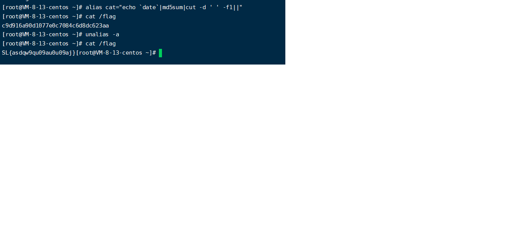
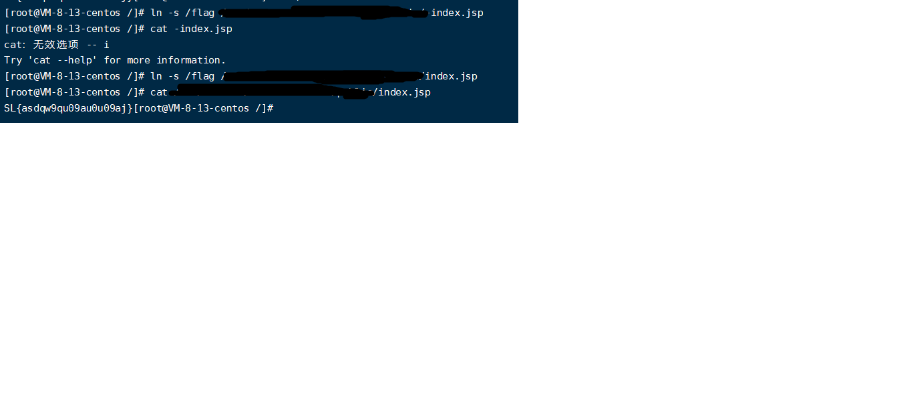

# README

## 备份

压缩文件：

```
tar -cvf web.tar /var/www/html
zip -q -r web.zip /var/www/html
```

解压文件：

```
tar -xvf web.tar -c /var/www/html
unzip web.zip -d /var/www/html
```

备份到服务器：

```
mv web.tar /tmp
mv web.zip /home/xxx
```

上传下载文件：

```
scp username@servername:/path/filename /tmp/local_destination #从服务器下载单个文件到本地
scp /path/local_filename username@servername:/path  #从本地上传单个文件到服务器
scp -r username@servername:remote_dir/ /tmp/local_dir #从服务器下载整个目录到本地
scp -r /tmp/local_dir username@servername:remote_dir #从本地上传整个目录到服务器
```

SSH相关工具：

```
Xshell、SecureCRT、finalshell
```

FTP相关工具：

```
FileZilla 、WinSCP、SmartFTP
```


数据库配置信息一般可以通过如config.php/web.conf等文件获取。
以MySQL数据库备份数据为例：

备份指定数据库：

```
mysqldump –u username –p password databasename > bak.sql
```

备份所有数据库：

```
mysqldump –all -databases > bak.sql
```

导入数据库：

```
mysql –u username –p password database < bak.sql
```


## waf

```
上waf：
$ find . -path ./waffffff -prune -o -type f -name "*.php" -print | xargs sed -i "s/<?php/<?php include_once(\"\/var\/www\/html\/waffffff\/waf.php\");/g"

下waf：
$ find . -path ./waffffff -prune -o -type f -name "*.php" -print | xargs sed -i "s/<?php include_once(\"\/var\/www\/html\/waffffff\/waf.php\");/<?php/g"
```

## 读flag


骚姿势

在awd比赛中，往往有一些大师傅热衷于去搅屎，而在这里也贴出自己团队大师傅说的一些骚姿势

**起别名**

在Linux系统中，可以通过`alias`对系统命令起一些别名，这样子用本来的名字时会出现你事先设置好的东西，而不是执行这个命令。
比如：`alias cat="echo`date`|md5sum|cut -d ' ' -f1||"` 这个命令用于在输入`cat`时输出一串类似flag的字符串。



想要删除时只需要输入`alias -a`即可。

**软链接**

在得到对方shell之后，对方肯定会发现后门文件，就会想办法进行修补，这时候可以用Linux中的软链接功能，把flag软链接道到一个可写可读文件中。

。

