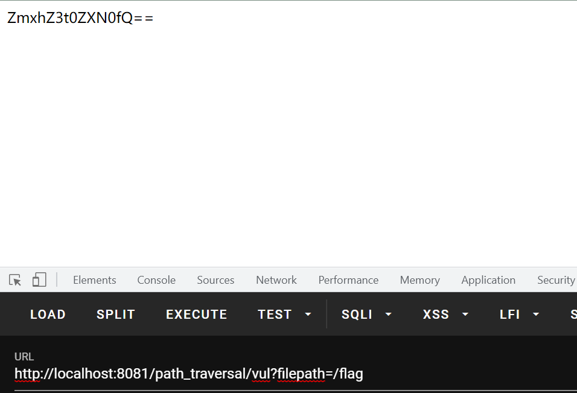
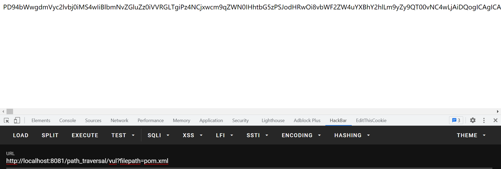
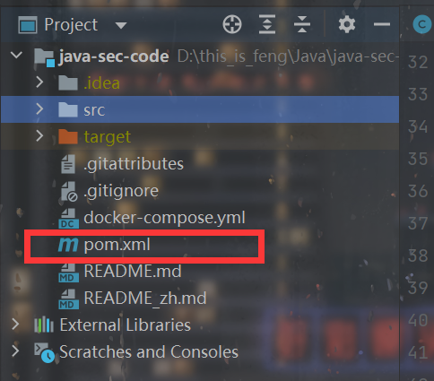

# 前言

目前JavaWeb刚学到Servlet，看了一下接下来的东西，还剩下一大堆要学，脑子疼，照这种进度看下去得2-3个月才能看到SpringBoot，把SpringBoot看完就正式去全身心Java代审了。不过太浮躁了，暂时还是想学学Java代码审计，正好有个比较适合入门的Java安全项目：`Java-sec-code`。用`SpringBoot`写的，把许多的漏洞都给了个demo还有修复。正好我之前稍微接触过`SpringBoot`，勉强能看得懂，就也稍微跟着这个项目学习一下。其实主要还是长长见识，只是换一种方式看漏洞罢了。这些漏洞大部分之前都是在PHP里面接触，只是换了一种代码形式罢了，本质还是没有变得。所以其实，就当是再熟一下Java了，顺便提前接触一下Java代码审计。

这篇看的是目录穿越。比较简单。


# 分析

这是一个得到图片base64的功能：

```java
    @GetMapping("/path_traversal/vul")
    public String getImage(String filepath) throws IOException {
        return getImgBase64(filepath);
    }
```

```java
    private String getImgBase64(String imgFile) throws IOException {

        logger.info("Working directory: " + System.getProperty("user.dir"));
        logger.info("File path: " + imgFile);

        File f = new File(imgFile);
        if (f.exists() && !f.isDirectory()) {
            byte[] data = Files.readAllBytes(Paths.get(imgFile));
            return new String(Base64.encodeBase64(data));
        } else {
            return "File doesn't exist or is not a file.";
        }
    }
```

传入一个文件路径，然后产生一个`File`对象，判断对象存在而且不是目录的话，就利用`Files`类读取这个文件字节数组，并转成base64展示给前端。


说是目录穿越，其实不如叫任意文件读取更合适。因为对传入的文件路径没有过滤，导致了可以目录穿越，任意文件读取：



一般的利用肯定就是读pom.xml了，去看项目的依赖是否可以利用，比如fastjson这样的。

还有一个东西就是路径的问题了，这玩意等以后再好好总结一下，就是这种文件还有资源操作的问题，它的当前目录到底在哪。之前我记得有的是在target里面，有的就是项目目录下面。

这个项目的直接读pom.xml可以读到，说明就是当前项目下面：







# 修复

项目给出的修复：

```java
    public static String pathFilter(String filepath) {
        String temp = filepath;

        // use while to sovle multi urlencode
        while (temp.indexOf('%') != -1) {
            try {
                temp = URLDecoder.decode(temp, "utf-8");
            } catch (UnsupportedEncodingException e) {
                logger.info("Unsupported encoding exception: " + filepath);
                return null;
            } catch (Exception e) {
                logger.info(e.toString());
                return null;
            }
        }

        if (temp.contains("..") || temp.charAt(0) == '/') {
            return null;
        }

        return filepath;
    }
```

很容易理解的就是如果存在URL编码，就先解码，然后判断是否有`..`这样的目录穿越和是否以`/`开头，防止了目录穿越和绝对路径的文件读取。

个人认为为了防止任意文件读取的话，既然是读取图片，还应该再加上一层是否是在img目录的判断更好。


