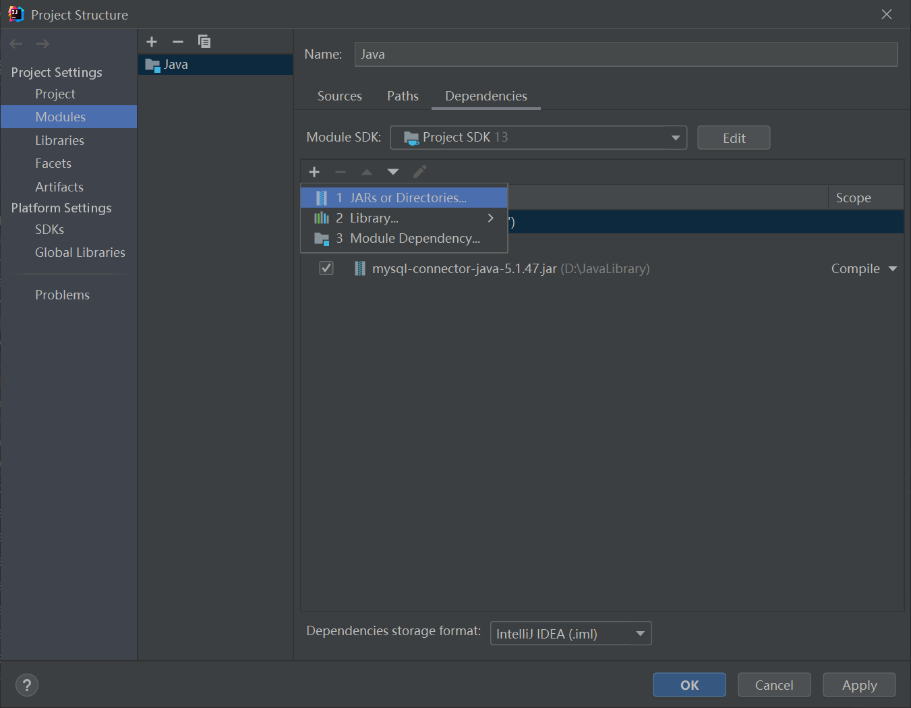
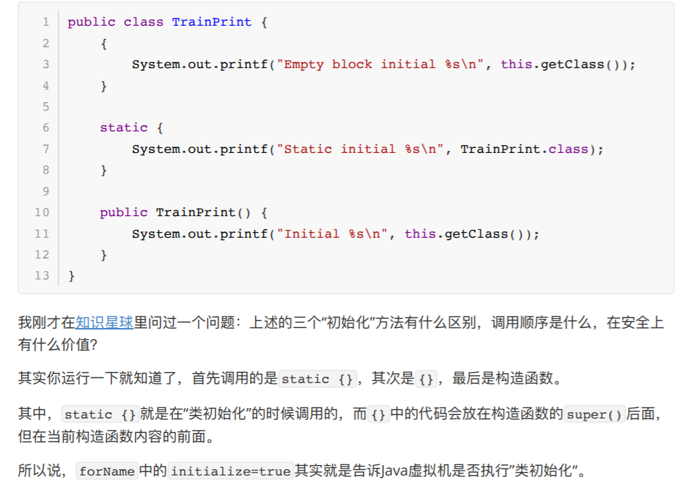
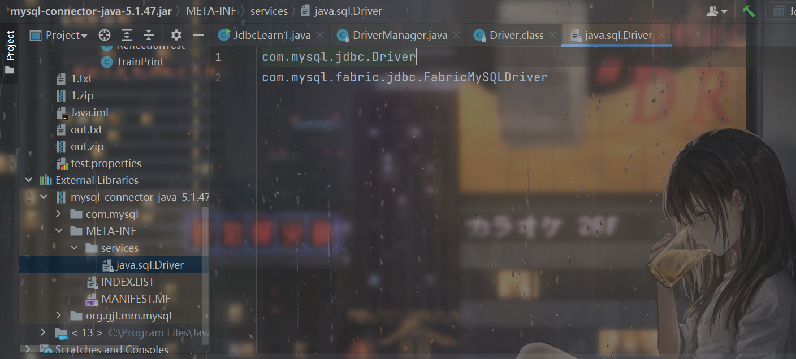
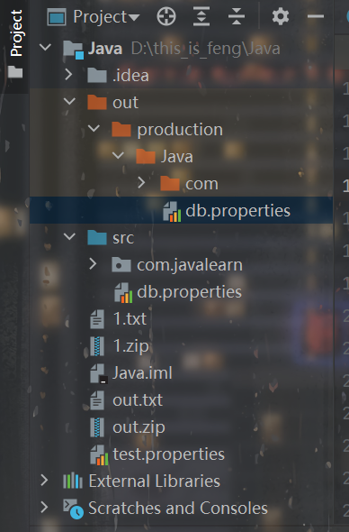

# 前言

开始JDBC的学习，学习自bilibili的《狂神说Java》，简要记录一下学习的东西，以及学习的过程中产生的疑惑以及通过查阅得到的解答。


# IDEA导入`JDBC`驱动的jar包

因为还没学maven，只能这样导入jar包。从官网下载mysql的jdbc驱动，里面有`mysql-connector-java-5.1.47.jar`，我把它拉出来单独放在一个路径下。

然后点IDEA里面的project structure：



点那个加号，然后选`jars...`那个，然后把对应的jar包选中，然后点OK就行了。


# 一个JDBC程序例子

```java
package com.javalearn.summer.jdbc;

import java.sql.*;

public class JdbcLearn1 {
    public static void main(String[] args) throws ClassNotFoundException, SQLException {
        //1. 加载驱动
        Class.forName("com.mysql.jdbc.Driver");

        //2. 用户信息和url
        //useUnicode=true-支持中文编码、characterEncoding=utf8-设定中文字符集、useSSL=true-设置为安全连接
        String url = "jdbc:mysql://127.0.0.1:3306/security?useUnicode=true&characterEncoding=utf8&useSSL=true";
        String username = "root";
        String password = "root";

        //3. 连接数据库 connection是数据库对象
        Connection connection = DriverManager.getConnection(url, username, password);

        //4. 执行sql的对象 statement是执行sql的对象
        Statement statement = connection.createStatement();

        //5. 用statement对象执行sql语句
        String sql = "select * from users";
        ResultSet resultSet = statement.executeQuery(sql); //链表形式
        while (resultSet.next()){
            // 不知道数据类型可直接用getObject
            System.out.println("id:"+resultSet.getObject("id")+",username:"+resultSet.getObject("username")+",password:"+resultSet.getObject("password"));
        }

        //6. 释放连接 注意和创建对象的顺序相反
        // 十分耗资源，用完要关掉
        resultSet.close();
        statement.close();
        connection.close();

    }
}

```


# 为什么要使用反射加载驱动

注意到第一步的加载驱动：

```java
        //1. 加载驱动
        Class.forName("com.mysql.jdbc.Driver");
```

不是很理解，这是为什么。看一下`Driver`类：

```java
public class Driver extends NonRegisteringDriver implements java.sql.Driver {
    public Driver() throws SQLException {
    }

    static {
        try {
            DriverManager.registerDriver(new Driver());
        } catch (SQLException var1) {
            throw new RuntimeException("Can't register driver!");
        }
    }
}
```

发现有`static{}`。P神在Java漫谈中谈到过这个知识点：



默认`forName`会进行类的初始化，也就是`static{}`里的代码。

因此相当于执行`DriverManager.registerDriver(new Driver());`


但是我尝试把第一步加载驱动的代码注释掉，发现程序还是可以跑通。查了一下，原因就是：

> 在JDBC 4.0之后，可以通过SPI的方式加载驱动。
>
> 在驱动相应的jar包里，META-INF/services目录下，会有名为java.sql.Driver的文件，里面的内容是驱动的全路径名。





而且**通过SPI方式注册驱动时如果有一个驱动加载出问题，会影响后续的驱动加载。**


# JDBC中的一些对象

## URL

```java
String url = "jdbc:mysql://localhost:3306/jdbcstudy?useUnicode=true&characterEncoding=utf8&useSSL=true";
// jdbc:mysql://主机地址:端口号/数据库名？参数1&参数2...
// mysql端口号3306
// oracle--1521 url = "jdbc:oracle:thin:@localhost:1521:sid"
```

## Connection（数据库对象）

```java
Connection connection = DriverManager.getConnection(url,username,password);
connection.commit(); // 提交
connection.rollback(); // 回滚
connection.setAutoCommit();
...
```


## Statement 执行sql的对象

```java
String sql = " sql语句";
Statement statement = connection.createStatement();
statement.excute(sql); //执行任何一条sql
ResultSet resultSet = statement.excuteQuery(sql); // 执行一条查询的sql语句 返回结果集
statement.update(); //执行一条更新、插入、删除的sql语句 返回受影响的行数
```

## ResultSet 存储查询的结果集，链表结构

```java
// 参数为字段名
resultSet.getObject();// 不知道列类型时使用
resultSet.getString();
resultSet.getInt();
resultSet.getFloat();
resultSet.getDate();

// 遍历
while(resultSet.next()) {...}
```

`ResultSet`具体可以参考：
https://www.cnblogs.com/lyuweigh/p/eb16d79e30a2e4a9f606770ff591fc7b.html

# 提取为工具类

```java
package com.javalearn.summer.util;

import javax.xml.transform.Result;
import java.io.IOException;
import java.io.InputStream;
import java.sql.*;
import java.util.Properties;

public class JdbcUtil {
    private static String driver;
    private static String url;
    private static String username;
    private static String password;
    static{
        try {
            InputStream in = JdbcUtil.class.getClassLoader().getResourceAsStream("db.properties");
            Properties properties = new Properties();
            properties.load(in);
            driver = properties.getProperty("driver");
            url = properties.getProperty("url");
            username = properties.getProperty("username");
            password = properties.getProperty("password");

            // 1.驱动只用加载一次,因此放在static块里
            Class.forName(driver);

        } catch (IOException | ClassNotFoundException e) {
            e.printStackTrace();
        }
    }
    //连接数据库
    public static Connection getConnection() throws SQLException {
        return DriverManager.getConnection(url,username,password);
    }

    //释放连接
    public static void release(ResultSet resultSet, Statement statement, Connection connection) throws SQLException {
        if (resultSet!=null){
            resultSet.close();
        }
        if (statement!=null){
            statement.close();
        }
        if (connection!=null){
            connection.close();
        }
    }
}

```


写一个`db.properties`：

```
driver=com.mysql.jdbc.Driver
url=jdbc:mysql://127.0.0.1:3306/security?useUnicode=true&characterEncoding=utf8&useSSL=true
username=root
password=root
```


一个疑惑的地方在于这里，即`getResourceAsStream`函数的使用：

```java
InputStream in = JdbcUtil.class.getClassLoader().getResourceAsStream("db.properties");
```

1. `Class.getResourceAsStream(String path)` ： path 不以’/'开头时默认是从此类所在的包下取资源，以’/'开头则是从`ClassPath`根下获取。其只是通过path构造一个绝对路径，最终还是由`ClassLoader`获取资源。

2. `Class.getClassLoader.getResourceAsStream(String path)` ：默认则是从`ClassPath`根下获取，path不能以’/'开头，最终是由`ClassLoader`获取资源。

因此这种写法是直接从`ClassPath`根下获取。

通过`System.out.println(JdbcUtil.class.getClassLoader().getResource(""));`得到我这里的`ClassPath`是：

```
file:/D:/this_is_feng/Java/out/production/Java/
```


`db.properties`的位置：




正好符合。这也说明了，在IDEA里面，`src`目录相当于`ClassPath`的根目录（表述可能不准确，但是大致的意思我觉得是这样）。


```java
package com.javalearn.summer.jdbc;

import com.javalearn.summer.util.JdbcUtil;

import java.sql.Connection;
import java.sql.ResultSet;
import java.sql.SQLException;
import java.sql.Statement;

public class JdbcLearn2 {
    public static void main(String[] args) throws SQLException {
        Connection connection = JdbcUtil.getConnection();
        Statement statement = connection.createStatement();
        String sql = "select * from users";
/*        String insertSql = "insert into users values(987,'feng','feng')";
        int num = statement.executeUpdate(insertSql);
        if (num > 0){
            System.out.println("插入成功");
        }*/
        ResultSet resultSet = statement.executeQuery(sql);
        while (resultSet.next()){
            System.out.println("id:"+resultSet.getObject("id")+",username:"+resultSet.getObject("username")+",password:"+resultSet.getObject("password"));
        }
        JdbcUtil.release(null,statement,connection);
    }
}

```


# PreparedStatement

一般不用`Statement`，用`PreparedStatement`。可以防止SQL注入且更好。

```java
package com.javalearn.summer.jdbc;

import com.javalearn.summer.util.JdbcUtil;

import java.sql.Connection;
import java.sql.PreparedStatement;
import java.sql.ResultSet;
import java.sql.SQLException;

public class JdbcLearn3 {
    public static void main(String[] args) throws SQLException {
        Connection connection = null;
        PreparedStatement pst = null;
        ResultSet resultSet = null;
        connection = JdbcUtil.getConnection();

        String sql = "select * from users where username = ? and password = ?";
        pst = connection.prepareStatement(sql);// 预编译SQL，先写sql但先不执行

        //手动给参数赋值
        pst.setString(1,"feng");
        pst.setString(2,"feng");

        //执行sql
        resultSet = pst.executeQuery();

        while (resultSet.next()){
            System.out.println(resultSet.getString("id"));
        }
        JdbcUtil.release(resultSet,pst,connection);

    }
}

```


需要注意，`PreparedStatement`用的是`java.sql.PreparedStatement;`。

# 参考链接

https://blog.csdn.net/SSY_1992/article/details/88344709?utm_medium=distribute.pc_relevant.none-task-blog-2%7Edefault%7EBlogCommendFromBaidu%7Edefault-3.control&dist_request_id=1328769.69833.16176885990289287&depth_1-utm_source=distribute.pc_relevant.none-task-blog-2%7Edefault%7EBlogCommendFromBaidu%7Edefault-3.control

https://www.cnblogs.com/lyuweigh/p/eb16d79e30a2e4a9f606770ff591fc7b.html

https://blog.csdn.net/kkkdjbb/article/details/115444875

https://blog.csdn.net/icanlove/article/details/44097839