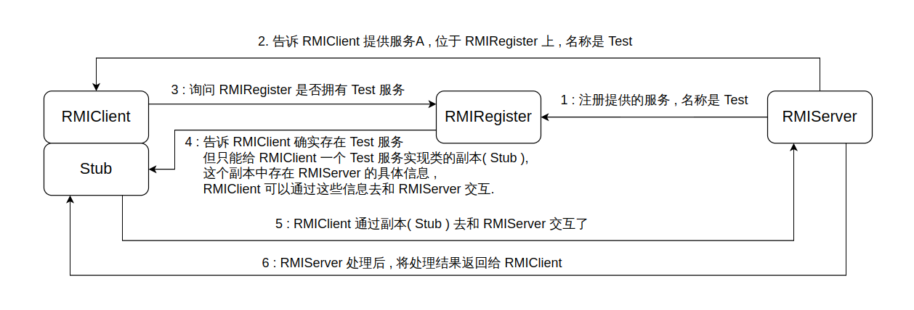
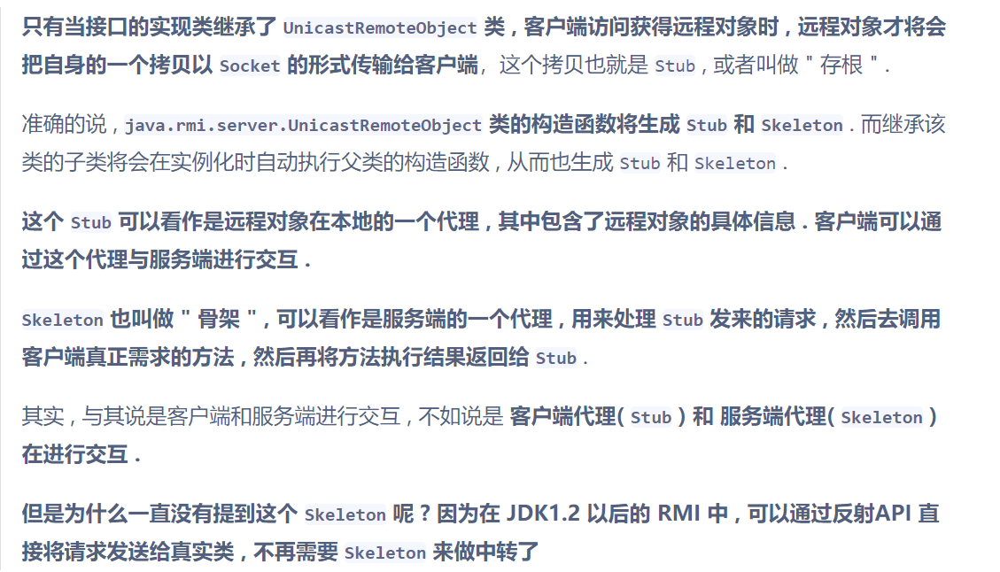
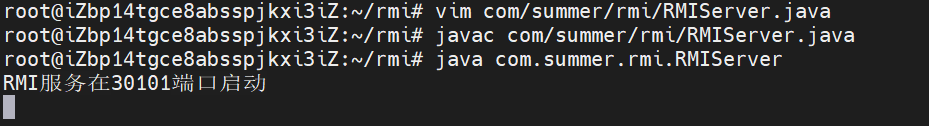
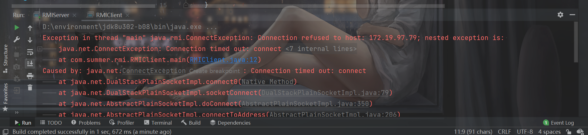
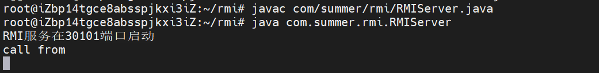

# 前言

开始学习一下Java中RMI的相关知识。RMI是我目前为止学起来比较难的一块，主要的原因就是一我没学过计网，对于这种通信相对来说有点陌生，很多文章后面的抓包分析我也看不懂。二就是初学Java，很多东西不了解，也不太懂怎么去看底层的东西。三就是很多文章涉及到了攻击还有反序列化这方面，目前还没接触过，所以也看不太懂。

因此目前更多的是了解，关于更多的细节我没有去接触，不好高骛远，等慢慢对Java接触的多了，再回来把这些基础更深入的了解一波。说简单一点就是，目前的学习，是从使用的角度来学习。以后再来从源码分析的角度来学习。

之后学习的东西会慢慢的补上。


# RMI的基础概念

**RMI ( Remote Method Invocation , 远程方法调用 ) 能够让在某个 Java虚拟机 上的对象像调用本地对象一样调用另一个 Java虚拟机 中的对象上的方法 , 这两个 Java虚拟机 可以是运行在同一台计算机上的不同进程, 也可以是运行在网络中不同的计算机上 .**


**客户端:**

存根/桩(Stub):远程对象在客户端上的代理;
远程引用层(Remote Reference Layer):解析并执行远程引用协议;
传输层(Transport):发送调用、传递远程方法参数、接收远程方法执行结果。

**服务端:**

骨架(Skeleton):读取客户端传递的方法参数，调用服务器方的实际对象方法， 并接收方法执行后的返回值;
远程引用层(Remote Reference Layer):处理远程引用后向骨架发送远程方法调用;
传输层(Transport):监听客户端的入站连接，接收并转发调用到远程引用层。

**注册表(Registry):**以URL形式注册远程对象，并向客户端回复对远程对象的引用。


说简单一点就是，服务端那里有一个对象，客户端想要调用服务端里的那个对象的方法，而注册表就像一个中间人，服务端( `RMIServer` ) 会将自己提供的服务的实现类交给这个中间人 , 并公开一个名称 . 任何客户端( `RMIClient` )都可以通过公开的名称找到这个实现类 , 并调用它 .





光看概念可能比较难理解，对于概念的讲解，参考链接中的文章讲解的也都很好了，所以对我来说，肯定还是直接先看代码再理解概念会比较容易。


# RMI的简单实现

这里先演示一下本地的RMI方法调用。

## 远程接口

首先需要写一个远程接口，这个接口继承自`Remote`接口。`Remote`里面也没有需要实现的方法，该接口用于标识其子类的方法可以被非本地的Java虚拟机调用。

```java
package com.summer.rmi;

import java.rmi.Remote;
import java.rmi.RemoteException;

public interface IRemoteHelloWorld extends Remote {
    public String hello() throws RemoteException;
}

```


## 远程接口的实现类

然后需要写这个远程接口的实现类：

```java
package com.summer.rmi;

import java.rmi.Naming;
import java.rmi.RemoteException;
import java.rmi.registry.LocateRegistry;
import java.rmi.server.UnicastRemoteObject;

public class RMIServer extends UnicastRemoteObject implements IRemoteHelloWorld {

    private RMIServer() throws RemoteException {
        super();
    }
    @Override
    public String hello() throws RemoteException {
        System.out.println("call from");
        return "Hello World!";
    }

    public void start() throws Exception {
        RMIServer h = new RMIServer();
        LocateRegistry.createRegistry(30101);
        Naming.rebind("rmi://127.0.0.1:30101/Feng",h);
        System.out.println("RMI服务在30101端口启动");
    }

    public static void main(String[] args) throws Exception {
        new RMIServer().start();
    }
}


```

这个类还需要继承自`UnicastRemoteObject`类：




看的有点迷，暂时可以不用太纠结于这样的细节。

注意这个`start`方法：

```java
    public void start() throws Exception {
        RMIServer h = new RMIServer();
        LocateRegistry.createRegistry(30101);
        Naming.rebind("rmi://127.0.0.1:30101/Feng",h);
        System.out.println("RMI服务在30101端口启动");
    }
```

`LocateRegistry.createRegistry(30101);`即创建了注册表，注册表会在30101端口上进行监听。

需要注意的是，默认的RMI端口是1099，这里我也是改了端口。

然后是`Naming.rebind("rmi://127.0.0.1:30101/Feng",h);`，相当于把`RMIServer`对象绑定到了这个`rmi://127.0.0.1:30101/Feng`地址上，

这个地址的`rmi:`是可以忽略不写的，主机和端口也是可以忽略的，默认是`localhost`和1099。

## 客户端

客户端的代码就比较简单：

```java
package com.summer.rmi;

import java.net.MalformedURLException;
import java.rmi.Naming;
import java.rmi.NotBoundException;
import java.rmi.RemoteException;
import java.util.Arrays;

public class RMIClient {
    public static void main(String[] args) throws Exception {
        IRemoteHelloWorld h = (IRemoteHelloWorld) Naming.lookup("rmi://127.0.0.1:30101/Feng");
        String ret = h.hello();

        System.out.println(ret);
    }
}

```

通过`Naming.lookup`找到了注册表中名字是`feng`的那个对象，然后正常的调用这个远程对象的方法即可。


通过结果也可以知道，这个方法的调用，实际上也还是在服务端，而不是客户端。


# Wireshark抓包分析

没学过计网，也没用过wireshark，不太懂这个，网上的分析有很多了，暂时放一下结论，等自己下学期学过了计网再回来抓包分析一下。

```
⾸先客户端连接Registry，并在其中寻找Name是Feng的对象，这个对应数据
流中的Call消息；然后Registry返回⼀个序列化的数据，这个就是找到的Name=Feng的对象，这个对应
数据流中的ReturnData消息；客户端反序列化该对象，发现该对象是⼀个远程对象，地址
在 192.168.135.142:33769 ，于是再与这个地址建⽴TCP连接；在这个新的连接中，才执⾏真正远程
⽅法调⽤，也就是 hello() 。

RMI Registry就像⼀个⽹关，他⾃⼰是不会执⾏远程⽅法的，但RMI Server可以在上⾯注册⼀个Name
到对象的绑定关系；RMI Client通过Name向RMI Registry查询，得到这个绑定关系，然后再连接RMI
Server；最后，远程⽅法实际上在RMI Server上调⽤。
```


# 不同主机实现RMI

之前是在同一个主机，说直白点就是都在127.0.0.1这里。我尝试把服务端放在VPS上，再调用，发现出了点问题。这里说一下我遇到的问题和解决的办法。

## 问题一

```
no security manager: RMI classloader disable
```

这个主要的原因就是我本地IDEA这里的包名是`package com.summer.rmi;`。当然这个问题总的可以归结于：

```
服务端返回来的这个对象和客户端的不一致。RMI要求这两个类必须一致，包括包名和方法属性等。
```


我这里就是名包不一致导致的，VPS上弄一下包名让这两个类一样即可即可。

## 问题二

包名一样后，我客户端的代码ip改成VPS后`IRemoteHelloWorld h = (IRemoteHelloWorld) Naming.lookup("rmi://118.31.168.198:30101/Feng");`，再尝试：




但是还不行，客户端会说连接不上：




最疑惑的就是这个`host: 172.19.97.79`，我的VPS明明是118.31.168.198呀。

我查了一下，找到了一个比较合理的解释，只不过它这里的是127.0.0.1：

```java
原因是由于客户端首先通过socket连接到rmi服务器时候，rmi服务器会向客户端发送一个“rmi服务ip”，此“rmi服务ip”用于客户端查找对应资源，rmi server会通过java.net.InetAddress.getLocalHost取本机ip作为“rmi服务ip”返回给客户端,在windows下取到的是正确的对外ip，而在linux下取到的是127.0.1.1，这样如果客户端拿到的是127.0.1.1就会去客户端本机查找，所以就会出错。
```


因此相当于我的VPS发送的对外IP是172.19.97.79，这应该只能在“本地”可以访问到，而我的客户端时访问不到的。因此需要让服务端发出的对外ip也是118.31.168.198。

尝试了在`java`命令的时候加上`-Djava.rmi.server.hostname=118.31.168.198`，发现还是不行。最终参考了参考链接中文章的解决办法，加上了这么一句话：

```java
System.setProperty("java.rmi.server.hostname","118.31.168.198");
```

```java
    public void start() throws Exception {
        System.setProperty("java.rmi.server.hostname","118.31.168.198");
        RMIServer h = new RMIServer();
        LocateRegistry.createRegistry(30101);
        Naming.rebind("rmi://127.0.0.1:30101/Feng",h);
        System.out.println("RMI服务在30101端口启动");
    }
```

这样就可以了：




暂时浅显的学习到这里。

# 参考链接

《Java安全漫谈》

https://xz.aliyun.com/t/6660

https://xz.aliyun.com/t/9261

https://www.guildhab.top/2020/03/java-rmi-ldap-%E6%B5%81%E7%A8%8B%E5%88%86%E6%9E%90/

https://yq1ng.github.io/

https://blog.csdn.net/conquer0715/article/details/44653563