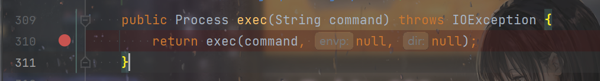
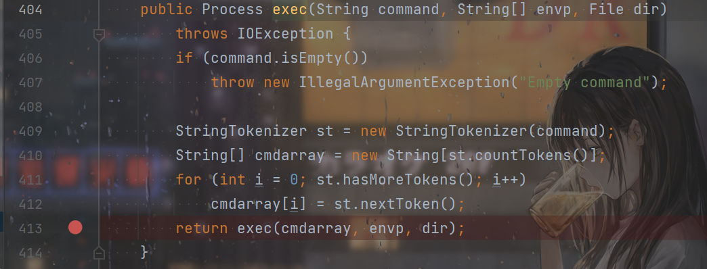
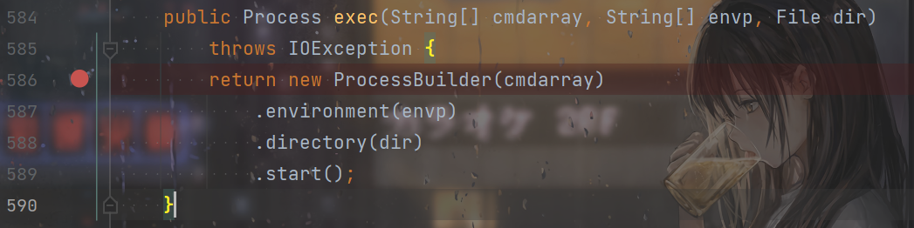
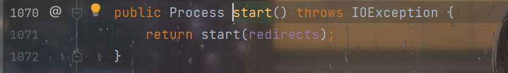
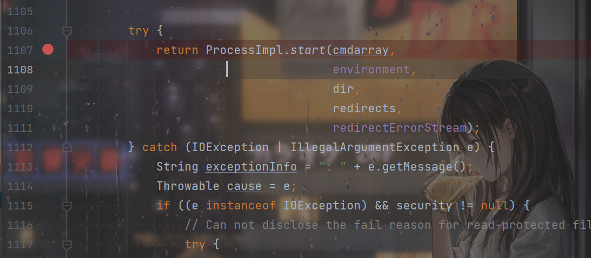
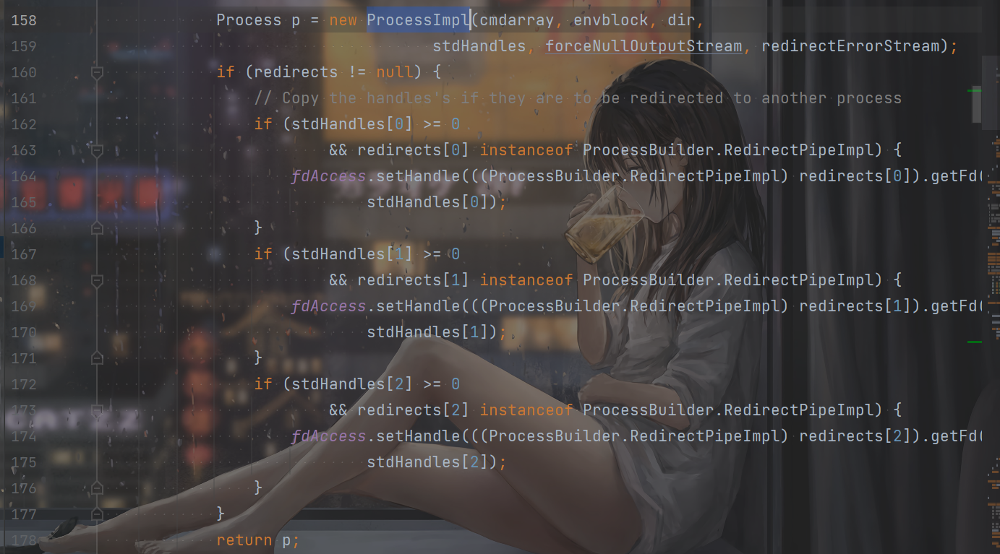
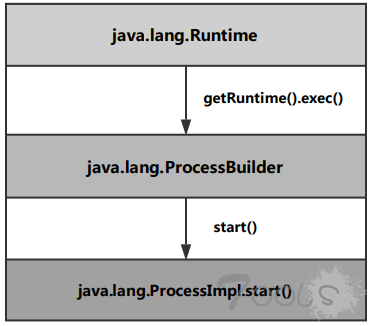
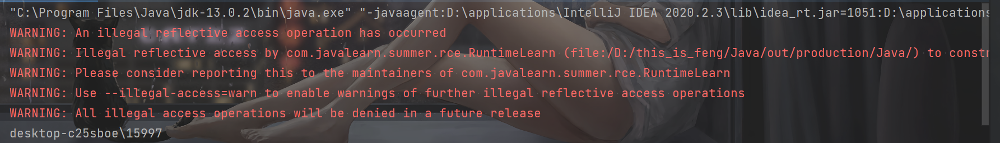
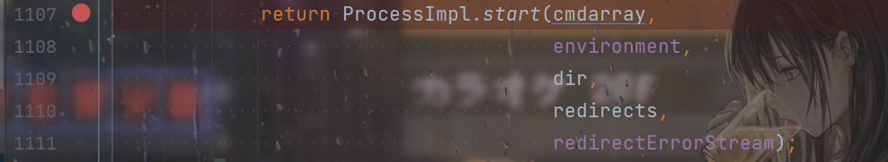
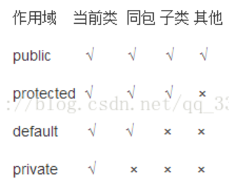

# 前言

开始学习一下Java的命令执行，虽然都是一些很小的知识点，但是还是每个知识点都写篇博客总结一下。

考虑到自己刚学Java，很多的东西都不太懂，太多的类没见过，不知道怎么用，很多概念不懂，就连学过的东西也一直在忘，所以这种学习新东西的过程中，我更多的还是把握住，主要的知识点。比如后面的看`Runtime的exec`方法的调用链，自己也看不懂细节上的东西，只要能把握住，整体的调用链是这样的，就可以了，更加细节的东西，等自己以后慢慢学习的深入了，再慢慢的回头看。

# Runtime

`Runtime`类，顾名思义就是运行时环境：

```java
public class Runtime {
    private static final Runtime currentRuntime = new Runtime();

    private static Version version;

    /**
     * Returns the runtime object associated with the current Java application.
     * Most of the methods of class {@code Runtime} are instance
     * methods and must be invoked with respect to the current runtime object.
     *
     * @return  the {@code Runtime} object associated with the current
     *          Java application.
     */
    public static Runtime getRuntime() {
        return currentRuntime;
    }

    /** Don't let anyone else instantiate this class */
    private Runtime() {}
```

也是学习到了，这种设计模式叫单例模式：

```
单例模式（Singleton）的目的是为了保证在一个进程中，某个类有且仅有一个实例。

因为这个类只有一个实例，因此，自然不能让调用方使用new Xyz()来创建实例了。所以，单例的构造方法必须是private，这样就防止了调用方自己创建实例，但是在类的内部，是可以用一个静态字段来引用唯一创建的实例的。

那么问题来了，外部调用方如何获得这个唯一实例？

答案是提供一个静态方法，直接返回实例：

或者直接把static变量暴露给外部：
```

Java进程中仅有一个`Runtime`类的对象，这个对象通过`getRuntime`方法来得到：

```java
    private static final Runtime currentRuntime = new Runtime();
    public static Runtime getRuntime() {
        return currentRuntime;
    }
```


## exec方法的调用链

命令执行使用的就是`exec`方法，有如下几种重载：

```java
public Process exec(String command)-----在单独的进程中执行指定的字符串命令。
public Process exec(String [] cmdArray)---在单独的进程中执行指定命令和变量
public Process exec(String command, String [] envp)----在指定环境的独立进程中执行指定命令和变量
public Process exec(String [] cmdArray, String [] envp)----在指定环境的独立进程中执行指定的命令和变量
public Process exec(String command,String[] envp,File dir)----在有指定环境和工作目录的独立进程中执行指定的字符串命令
public Process exec(String[] cmdarray,String[] envp,File dir)----在指定环境和工作目录的独立进程中执行指定的命令和变量
```

选第一个跟进一下，看一下这整个的调用链是什么样的：



进入一个新的`exec`方法：



继续跟进这个新的`exec`方法：



返回了一个`ProcessBuilder`对象，调用了它的`start`方法，继续跟进：



产生了一个`ProcessImpl`对象，调用了它的`start`方法：



`ProcessImple`类的`start`方法，返回了一个`ProcessImpl`对象：



至此这个调用链也就理清了：



至于细节上的话，目前还看不太懂，懂以后学的多了，再来理解细节上的东西。


## exec获得返回值

正常的命令执行肯定就一行：

```java
Runtime.getRuntime().exec("whoami");
```

但是如果要获得命令执行的结果的话，还需要一定的处理。一开始我的处理方式是这样的：

```java
        InputStream in = Runtime.getRuntime().exec("whoami").getInputStream();
	    int n;
        while ((n = in.read()) != -1){
            System.out.print((char)n);
        }
        in.close();
```

当时IO流学的不太好，看了一下别的师傅的文章，是这里：

> 在读取流的时候，一次读取一个字节并不是最高效的方法。很多流支持一次性读取多个字节到缓冲区，对于文件和网络流来说，利用缓冲区一次性读取多个字节效率往往要高很多。`InputStream`提供了两个重载方法来支持读取多个字节：
>
> `int read(byte[] b)`：读取若干字节并填充到byte[]数组，返回读取的字节数
> `int read(byte[] b, int off, int len)`：指定byte[]数组的偏移量和最大填充数


因此更好的，是设置一个缓冲区来读：

```java
        InputStream in = Runtime.getRuntime().exec("whoami").getInputStream();
        byte[] bcache = new byte[1024];
        int readSize = 0;
        try(ByteArrayOutputStream outputStream = new ByteArrayOutputStream()){
            while ((readSize =in.read(bcache))!=-1){
                outputStream.write(bcache,0,readSize);
            }
            System.out.println(outputStream.toString());
        }
```


`exec`方法返回的是一个`Process`对象，它有这些方法：

```java
 destroy() 
   杀掉子进程。 
 exitValue() 
   返回子进程的出口值。 
 InputStream getErrorStream() 
   获得子进程的错误流。 
 InputStream getInputStream() 
   获得子进程的输入流。 
 OutputStream getOutputStream() 
   获得子进程的输出流。 
 waitFor() 
   导致当前线程等待，如果必要，一直要等到由该 Process 对象表示的进程已经终止。
```


## 通过反射来执行Runtime类的exec方法


### 通过`getRuntime`静态方法来获得`Runtime`对象

```java
        Class clazz = Class.forName("java.lang.Runtime");
        Method execMethod = clazz.getMethod("exec", String.class);
        Method getRuntimeMethod = clazz.getMethod("getRuntime");
        Object runtime = getRuntimeMethod.invoke(Runtime.class);
        Process inProcess = (Process) execMethod.invoke(runtime, "whoami");
        InputStream in = inProcess.getInputStream();
        byte[] bcache = new byte[1024];
        int readSize = 0;
        try(ByteArrayOutputStream outputStream = new ByteArrayOutputStream()){
            while ((readSize =in.read(bcache))!=-1){
                outputStream.write(bcache,0,readSize);
            }
            System.out.println(outputStream.toString());
        }
```

### 通过构造器来获得`Runtime`对象

```java
        Class clazz = Class.forName("java.lang.Runtime");
        Constructor cons = clazz.getDeclaredConstructor();
        cons.setAccessible(true);
        Object runtime = cons.newInstance();
        Method execMethod = clazz.getMethod("exec", String.class);
        Process inProcess = (Process) execMethod.invoke(runtime, "whoami");
        InputStream in = inProcess.getInputStream();
        byte[] bcache = new byte[1024];
        int readSize = 0;
        try(ByteArrayOutputStream outputStream = new ByteArrayOutputStream()){
            while ((readSize =in.read(bcache))!=-1){
                outputStream.write(bcache,0,readSize);
            }
            System.out.println(outputStream.toString());
        }
```

注意点就是，因为是单例模式，`Runtime`类的构造器是`private`的，所以需要`setAccessible(true);`，而且需要用`getDeclaredConstructor`，`getConstructor`只能获得`public`的。

而且抛出了警告：




这是因为从JDK9开始的新特性，开始对反射做出限制了。


## 复杂的命令执行

当命令开始复杂的时候，`exec`就不能很好的工作了，原因可以参考这篇文章：

https://xz.aliyun.com/t/7046

一般的解决办法都是换另一种重载的`exec`：

```java
public Process exec(String [] cmdArray)---在单独的进程中执行指定命令和变量
```


在windows中，以`cmd /c`开头。

而在linux下，可以以`/bin/sh -c`开头：

```java
String[] command = { "/bin/sh", "-c", "echo 2333 2333 2333 && echo 2333 2333 2333" };
InputStream in = Runtime.getRuntime().exec(command).getInputStream();
```


# ProcessBuilder

根据`Runtime`的`exec`方法的调用链，可以知道在中间调用了`ProcessBuilder`类的`start`方法：


因此也可以通过`ProcessBuilder`来实现命令执行。

根据调用链，命令执行的方式就是创建`ProcessBuilder`对象的时候传入的参数是要执行的命令，然后调用`start`方法即可命令执行。

先看一下`ProcessBuilder`类的构造器：

```java
    public ProcessBuilder(String... command) {
        this.command = new ArrayList<>(command.length);
        for (String arg : command)
            this.command.add(arg);
    }

    public ProcessBuilder command(List<String> command) {
        if (command == null)
            throw new NullPointerException();
        this.command = command;
        return this;
    }
```

大致和`exec`还是差不多的。

`start`方法也是返回一个`Process`对象：

```java
    public Process start() throws IOException {
        return start(redirects);
    }
```


## 非反射命令执行

```java
        InputStream in = new ProcessBuilder("whoami").start().getInputStream();
        byte[] bcache = new byte[1024];
        int readSize = 0;
        try(ByteArrayOutputStream out = new ByteArrayOutputStream()){
            while( (readSize = in.read(bcache)) != -1){
                out.write(bcache,0,readSize);
            }
            System.out.println(out.toString());
        }
```


## 反射命令执行

```java
        Class clazz = Class.forName("java.lang.ProcessBuilder");
        Constructor cons = clazz.getConstructor(String[].class);
        Method startMethod = clazz.getMethod("start");
        Object processBuilder = cons.newInstance(new String[][]{{"whoami"}});
        InputStream in = ((Process) startMethod.invoke(processBuilder)).getInputStream();
        byte[] bcache = new byte[1024];
        int readSize = 0;
        try(ByteArrayOutputStream out = new ByteArrayOutputStream()){
            while ( (readSize = in.read(bcache))!= -1){
                out.write(bcache,0,readSize);
            }
            System.out.println(out.toString());
        }
```


主要的问题可能在这里：

```java
Object processBuilder = cons.newInstance(new String[][]{{"whoami"}});
```

因为`newInstance`接受一个可变长度的`Object`，而这个构造器传入的也是一个可变长度的`String`，叠加起来就是二维数组。


# ProcessImpl

还是那个调用链，调用了`ProcessImpl`的`start`方法：




但是注意一下这个类：

```java
final class ProcessImpl extends Process {
```

刚接触Java的我还有点难转过来，因为PHP里面没有public默认就是public的，但是Java不是。

> 类的成员不写访问修饰时默认为default。默认对于同一个包中的其他类相当于公开（public），对于不是同一个包中的其他类相当于私有（private）


​	


```java
package java.lang;
```

它是在lang包下，所以只有在lang包下面可以直接用，我们没法直接用，只能用反射了。

```java
        Class clazz = Class.forName("java.lang.ProcessImpl");
        Method startMethod = clazz.getDeclaredMethod("start", String[].class, Map.class, String.class, ProcessBuilder.Redirect[].class, boolean.class);
        startMethod.setAccessible(true);
        InputStream in = ((Process) startMethod.invoke(null, new String[]{"whoami"}, null, null, null, false)).getInputStream();
        byte[] bcache = new byte[1024];
        int readSize = 0;
        try(ByteArrayOutputStream out = new ByteArrayOutputStream()){
            while ((readSize = in.read(bcache))!=-1){
                out.write(bcache,0,readSize);
            }
            System.out.println(out.toString());
        }
```


