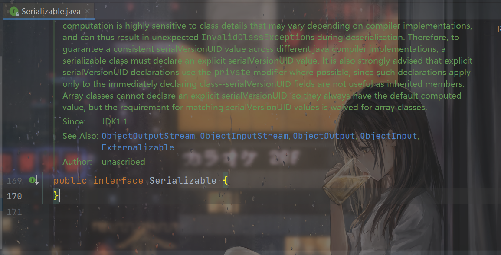
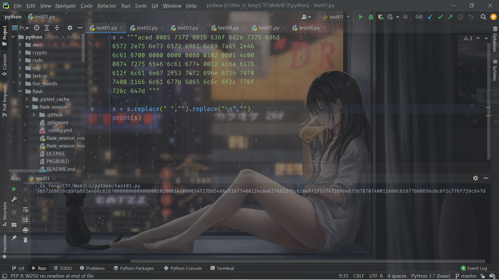
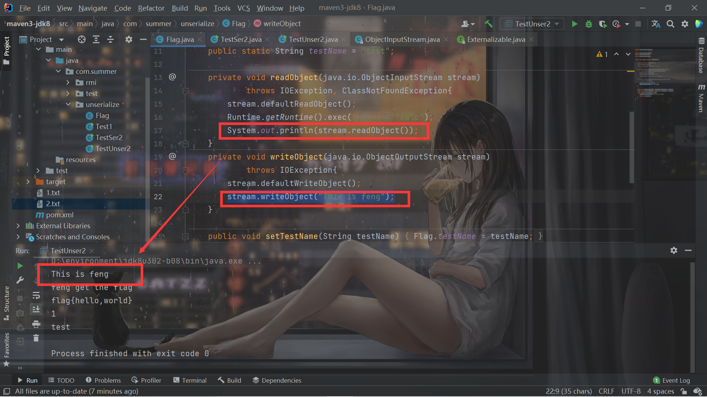
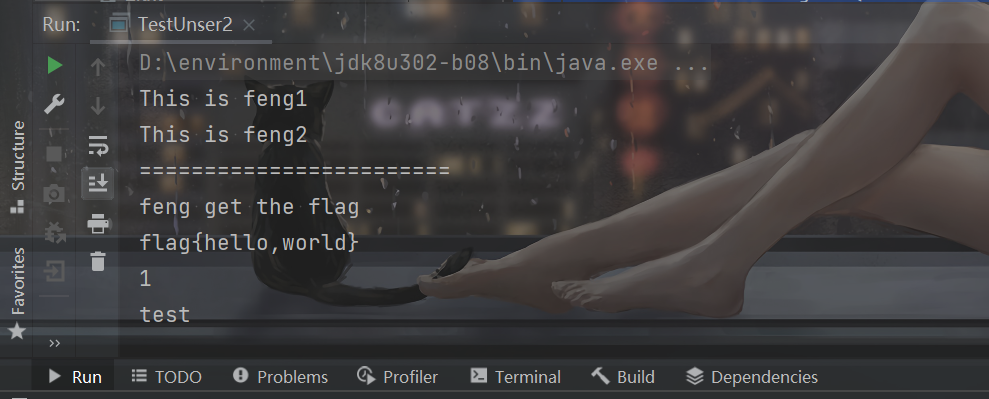

# 前言

开始学习Java反序列化的基础知识，主要学习的是**Epicccal**师傅的文章，总结的很棒。

之后就要开始学习`URLDNS`和`Commons-Collections `了。希望到时候学习CC链不会卡我太久的时间。争取七夕之前把`URLDNS`的链可以结束。

内容中概念部分主要也是摘录自Epicccal师傅的文章。

自己的笔记会忽略掉很多的细节，只记录重要的东西，方便自己查阅，推荐想学习的话，可以把参考链接中的文章都看一遍。

# Java序列化和反序列化的一些基本概念

Java 序列化就是把一个 `Java Object` 变成一个二进制字节数组 , 即 `byte[]` .

Java 反序列化就是把一个二进制字节数组(`byte[]`) 变回 Java 对象 , 即 `Java Object` .


## 序列化/反序列化的前提

一个类如果要能实现序列化操作，必须实现`Serializable`接口或者`Externalizable`接口。

最好还要有一个**`serialVersionUID`**属性：

```java
每个可序列化的类在序列化时都会关联一个版本号 , 这个版本号就是 serialVersionUID 属性 .

在反序列化过程中会根据这个版本号来判断序列化对象的发送者和接收着是否有与该序列化/反序列化过程兼容的类 .( 简单的说就是序列化过程和反序列化过程都需要被序列化的类 , 通过 serialVersionUID 属性来判断这两个类的版本是否相同 , 是否是同一个类 ) . 如果不相同 , 则会抛出 InvalidClassException 异常

serialVersionUID 属性必须通过 static final long 修饰符来修饰 .

如果可序列化的类未声明 serialVersionUID 属性 , 则 Java 序列化时会根据类的各种信息来计算默认的 serialVersionUID 值 . 但是 Oracle 官方文档强烈建议所有可序列化的类都显示声明 serialVersionUID 值 .
```


## Serializable

可以发现这是一个空接口：



因此这仅仅是一个标识接口，意味着实现了这个接口的类可以进行序列化/反序列化。

上面也写了一百多行的注释，记录了很多的东西，比如这个：

```java
 * Classes that require special handling during the serialization and
 * deserialization process must implement special methods with these exact
 * signatures:
 *
 * <PRE>
 * private void writeObject(java.io.ObjectOutputStream out)
 *     throws IOException
 * private void readObject(java.io.ObjectInputStream in)
 *     throws IOException, ClassNotFoundException;
 * private void readObjectNoData()
 *     throws ObjectStreamException;
 * </PRE>
```

这个之后会提到。

## Externalizable

可以发现这是个继承自`Serializable`接口的接口：

```java
public interface Externalizable extends java.io.Serializable {
```

这个接口使用起来相对比较麻烦：

```
我们需要手动编写 writeExternal()方法和readExternal()方法 , 这两个方法将取代定制好的 writeObject()方法和 readObject()方法 .

那什么时候会使用 Externalizable 接口呢 ? 当我们仅需要序列化类中的某个属性 , 此时就可以通过 Externalizable 接口中的 writeExternal() 方法来指定想要序列化的属性 . 同理 , 如果想让某个属性被反序列化 , 通过 readExternal() 方法来指定该属性就可以了.

此外 , Externalizable 序列化/反序列化还有一些其他特性 , 比如 readExternal() 方法在反序列化时会调用默认构造函数 , 实现 Externalizable 接口的类必须要提供一个 Public 修饰的无参构造函数等等
```


因此一般还是使用`Serializable`。


## ObjectOutputStream

官方手册写道：

```java
ObjectOutputStream将Java对象的原始数据类型和图形写入OutputStream。 可以使用ObjectInputStream读取（重构）对象。 可以通过使用流的文件来完成对象的持久存储。 如果流是网络套接字流，则可以在另一个主机或另一个进程中重新构建对象。
只有支持java.io.Serializable接口的对象才能写入流。 每个可序列化对象的类都被编码，包括类的类名和签名，对象的字段和数组的值，以及从初始对象引用的任何其他对象的闭包。

writeObject方法用于将对象写入流。 任何对象，包括字符串和数组，都是用writeObject编写的。 可以将多个对象或基元写入流中。 必须从相应的ObjectInputstream中读取对象，这些对象具有与写入时相同的类型和顺序。

也可以使用DataOutput中的适当方法将原始数据类型写入流中。 也可以使用writeUTF方法编写字符串。

对象的默认序列化机制会写入对象的类，类签名以及所有非瞬态和非静态字段的值。 对其他对象的引用（瞬态或静态字段除外）也会导致这些对象被写入。 使用引用共享机制对对单个对象的多个引用进行编码，以便可以将对象的图形恢复为与写入原始图像时相同的形状。
```

关键就是它的`writeObject`方法，将对象写入数据流中，说白一点就是将对象序列化。

需要注意这个：

```
对象的默认序列化机制会写入对象的类，类签名以及所有非瞬态和非静态字段的值。 对其他对象的引用（瞬态或静态字段除外）也会导致这些对象被写入。 
```

什么是类签名？

```
在开发 JNI( Java Native Interface , Java 本地接口 ) 时需要调用 Java 层的方法或创建引用 , 此时就会用到 Java 签名机制 . 比如基本数据类型的签名如下所示:
```


具体参考https://www.jianshu.com/p/a1438b476e82


什么是非瞬态字段？

```
瞬态变量( Transient ) 是一个 Java 关键词 , 它用于标记类的成员变量在持久化到字节流时不要被序列化 ; 在通过网络套接字流传输字节流时 , transient 关键词标记的成员变量不会被序列化 .
因此 , 如果仅想序列化某个类中部分变量 , 除了可以通过继承 Externalizable 接口来指定需要序列化的成员变量 ; 还可以将其他变量添加 transient 关键词 , 使得变量不被序列化 .
```


还需要注意，静态字段是不会被序列化的，后面的代码中也会提到这个。


## ObjectInputStream

和`ObjectOutputStream`相反，可以将数据流重构成对象。

```
ObjectInputStream 类在重构对象时会从本地 JVM 虚拟机中加载对应的类 , 以确保重构时使用的类与被序列化的类是同一个 . 也就是说 : 反序列化进程的 JVM 虚拟机中必须加载被序列化的类 .
```

```java
    public final Object readObject()
        throws IOException, ClassNotFoundException {
        return readObject(Object.class);
    }
```

具体的实现不去管，可以看到它的返回值是`Object`，因此还需要通过强制类型转换成预期的类型。


# 具体实现

写三个类来实现一下序列化和反序列化，直接看代码即可。

```java
package com.summer.unserialize;

import java.io.FileNotFoundException;
import java.io.FileOutputStream;
import java.io.IOException;
import java.io.ObjectOutputStream;

public class TestSer2 {
    public static void main(String[] args) throws IOException {
        Flag flag = new Flag();
        flag.setTrueFlag("flag{hello,world}");
        flag.setTestName("feng");
        FileOutputStream fout = new FileOutputStream("2.txt");

        ObjectOutputStream oout = new ObjectOutputStream(fout);
        oout.writeObject(flag);
        fout.close();
        oout.close();
    }
}

```

```java
package com.summer.unserialize;

import java.io.FileInputStream;
import java.io.FileNotFoundException;
import java.io.IOException;
import java.io.ObjectInputStream;

public class TestUnser2 {
    public static void main(String[] args) throws IOException, ClassNotFoundException {
        FileInputStream fin = new FileInputStream("2.txt");

        ObjectInputStream oin = new ObjectInputStream(fin);

        Flag flag = (Flag) oin.readObject();
        fin.close();
        oin.close();
        String trueFlag = flag.getFlag("feng");
        System.out.println(trueFlag);
        System.out.println(flag.serialVersionUID);
        System.out.println(flag.testName);
    }
}

```

```java
package com.summer.unserialize;

import java.io.Serializable;

public class Flag implements Serializable {
    static final long serialVersionUID = 1L;
    private String trueFlag;
    public static String testName = "test";
    public void setTestName(String testName){
        Flag.testName = testName;
    }
    public void setTrueFlag(String trueFlag){
        this.trueFlag = trueFlag;
    }
    public String getFlag(String name){
        System.out.println(name + " get the flag");
        return this.trueFlag;
    }
}

```

把`flag`对象序列化后写到`2.txt`中。之后反序列化得到这个对象。

代码非常容易理解，这也就是最简单的序列化和反序列化的实现，说一下需要注意的地方叭。

首先就是这里：

```java
    public static String testName = "test";

        flag.setTestName("feng");

        System.out.println(flag.testName);
```

前面说到了静态字段不会被序列化，因此反序列化得到的对象打印出`testName`，也还是`test`。


# 方法的implement

回到一开始看到的`Serializable`接口的文档注释里的这个：

```java
 * Classes that require special handling during the serialization and
 * deserialization process must implement special methods with these exact
 * signatures:
 *
 * <PRE>
 * private void writeObject(java.io.ObjectOutputStream out)
 *     throws IOException
 * private void readObject(java.io.ObjectInputStream in)
 *     throws IOException, ClassNotFoundException;
 * private void readObjectNoData()
 *     throws ObjectStreamException;
 * </PRE>
```

如果需要特殊的处理，类需要自己`implement`这些方法。这些方法有什么呢？

## readObject


图片中已经解释的很清楚了，直接看例子叭。还是具体实现的代码，我们在`Flag`类中写这个方法：

```java
    private void readObject(java.io.ObjectInputStream stream)
            throws IOException, ClassNotFoundException{
        stream.defaultReadObject();
        Runtime.getRuntime().exec("calc");
    }
```

然后再序列化和反序列化，这样在我们这个自定义的`readObject`方法将负责恢复当前类，因此会弹出计算器：


## 序列化数据分析

在谈自定义的`writeObject`之前，还需要先好好的了解一下这些序列化的数据。需要用到`SerializationDumper`这个工具：

https://github.com/NickstaDB/SerializationDumper

获得十六进制：




再传给工具使用：


```
STREAM_MAGIC - 0xac ed
STREAM_VERSION - 0x00 05
Contents
  TC_OBJECT - 0x73
    TC_CLASSDESC - 0x72
      className
        Length - 27 - 0x00 1b
        Value - com.summer.unserialize.Flag - 0x636f6d2e73756d6d65722e756e73657269616c697a652e466c6167
      serialVersionUID - 0x00 00 00 00 00 00 00 01
      newHandle 0x00 7e 00 00
      classDescFlags - 0x02 - SC_SERIALIZABLE
      fieldCount - 1 - 0x00 01
      Fields
        0:
          Object - L - 0x4c
          fieldName
            Length - 8 - 0x00 08
            Value - trueFlag - 0x74727565466c6167
          className1
            TC_STRING - 0x74
              newHandle 0x00 7e 00 01
              Length - 18 - 0x00 12
              Value - Ljava/lang/String; - 0x4c6a6176612f6c616e672f537472696e673b
      classAnnotations
        TC_ENDBLOCKDATA - 0x78
      superClassDesc
        TC_NULL - 0x70
    newHandle 0x00 7e 00 02
    classdata
      com.summer.unserialize.Flag
        values
          trueFlag
            (object)
              TC_STRING - 0x74
                newHandle 0x00 7e 00 03
                Length - 17 - 0x00 11
                Value - flag{hello,world} - 0x666c61677b68656c6c6f2c776f726c647d
```


具体的分析这里就不做介绍了，参考文章：

https://www.guildhab.top/2020/04/java-rmi-%e5%88%a9%e7%94%a83-java-%e5%8f%8d%e5%ba%8f%e5%88%97%e5%8c%96%e6%bc%8f%e6%b4%9e%e7%ae%80%e8%bf%b0-%e4%bb%a5%e5%8f%8a-%e6%b5%81%e9%87%8f%e5%88%86%e6%9e%90/#header-id-9


P神的《Java漫谈》里提到了这个，也可以看看：

https://docs.oracle.com/javase/8/docs/platform/serialization/spec/protocol.html


## writeObject

在对`SerializationDumper`工具得到的结果有了了解后，再来看`writeObject`的用处。把`Flag`类里面写这个：

```java
    private void readObject(java.io.ObjectInputStream stream)
            throws IOException, ClassNotFoundException{
        stream.defaultReadObject();
        Runtime.getRuntime().exec("calc");
        System.out.println(stream.readObject());
    }
    private void writeObject(java.io.ObjectOutputStream stream)
            throws IOException{
        stream.defaultWriteObject();
        stream.writeObject("This is feng");
    }
```

一开始我也是很疑惑，本来就是把`flag`对象写进了流里，`writeObject`方法里又调用了`stream.writeObject("This is feng");`写了个对象进去，这不就相当于写了两个对象吗？那`readObject`里面新加的`System.out.println(stream.readObject());`，又能干什么？

再用工具看一下：

```
STREAM_MAGIC - 0xac ed
STREAM_VERSION - 0x00 05
Contents
  TC_OBJECT - 0x73
    TC_CLASSDESC - 0x72
      className
        Length - 27 - 0x00 1b
        Value - com.summer.unserialize.Flag - 0x636f6d2e73756d6d65722e756e73657269616c697a652e466c6167
      serialVersionUID - 0x00 00 00 00 00 00 00 01
      newHandle 0x00 7e 00 00
      classDescFlags - 0x03 - SC_WRITE_METHOD | SC_SERIALIZABLE
      fieldCount - 1 - 0x00 01
      Fields
        0:
          Object - L - 0x4c
          fieldName
            Length - 8 - 0x00 08
            Value - trueFlag - 0x74727565466c6167
          className1
            TC_STRING - 0x74
              newHandle 0x00 7e 00 01
              Length - 18 - 0x00 12
              Value - Ljava/lang/String; - 0x4c6a6176612f6c616e672f537472696e673b
      classAnnotations
        TC_ENDBLOCKDATA - 0x78
      superClassDesc
        TC_NULL - 0x70
    newHandle 0x00 7e 00 02
    classdata
      com.summer.unserialize.Flag
        values
          trueFlag
            (object)
              TC_STRING - 0x74
                newHandle 0x00 7e 00 03
                Length - 17 - 0x00 11
                Value - flag{hello,world} - 0x666c61677b68656c6c6f2c776f726c647d
        objectAnnotation
          TC_STRING - 0x74
            newHandle 0x00 7e 00 04
            Length - 12 - 0x00 0c
            Value - This is feng - 0x546869732069732066656e67
          TC_ENDBLOCKDATA - 0x78
```


注意这个`objectAnnotation`：

```
        objectAnnotation
          TC_STRING - 0x74
            newHandle 0x00 7e 00 04
            Length - 12 - 0x00 0c
            Value - This is feng - 0x546869732069732066656e67
          TC_ENDBLOCKDATA - 0x78
```

可以看到它的值就是`This is feng`，即：

```java
stream.writeObject("This is feng");
```

再看看反序列化的结果：




因此可以总结成，在自定义的`writeObject`中，调用传入的`ObjectOutputStream`的`writeObject`方法写入的对象，会写入到`objectAnnotation`中。

而自定义的`readObject`方法中，调用传入的`ObjectInputStream`的`readObject`方法读入的对象，则是`objectAnnotation`中存储的对象。

> 这个特性就让Java的开发变得非常灵活。比如后面将会讲到的HashMap，其就是将Map中的所有键、 值都存储在 objectAnnotation 中，而并不是某个具体属性里。


再试试，如果多次调用呢？

```java
    private void readObject(java.io.ObjectInputStream stream)
            throws IOException, ClassNotFoundException{
        stream.defaultReadObject();
        Runtime.getRuntime().exec("calc");
        System.out.println(stream.readObject());
        System.out.println(stream.readObject());
        System.out.println("========================");
    }
    private void writeObject(java.io.ObjectOutputStream stream)
            throws IOException{
        stream.defaultWriteObject();
        stream.writeObject("This is feng1");
        stream.writeObject("This is feng2");
    }
```

```
STREAM_MAGIC - 0xac ed
STREAM_VERSION - 0x00 05
Contents
  TC_OBJECT - 0x73
    TC_CLASSDESC - 0x72
      className
        Length - 27 - 0x00 1b
        Value - com.summer.unserialize.Flag - 0x636f6d2e73756d6d65722e756e73657269616c697a652e466c6167
      serialVersionUID - 0x00 00 00 00 00 00 00 01
      newHandle 0x00 7e 00 00
      classDescFlags - 0x03 - SC_WRITE_METHOD | SC_SERIALIZABLE
      fieldCount - 1 - 0x00 01
      Fields
        0:
          Object - L - 0x4c
          fieldName
            Length - 8 - 0x00 08
            Value - trueFlag - 0x74727565466c6167
          className1
            TC_STRING - 0x74
              newHandle 0x00 7e 00 01
              Length - 18 - 0x00 12
              Value - Ljava/lang/String; - 0x4c6a6176612f6c616e672f537472696e673b
      classAnnotations
        TC_ENDBLOCKDATA - 0x78
      superClassDesc
        TC_NULL - 0x70
    newHandle 0x00 7e 00 02
    classdata
      com.summer.unserialize.Flag
        values
          trueFlag
            (object)
              TC_STRING - 0x74
                newHandle 0x00 7e 00 03
                Length - 17 - 0x00 11
                Value - flag{hello,world} - 0x666c61677b68656c6c6f2c776f726c647d
        objectAnnotation
          TC_STRING - 0x74
            newHandle 0x00 7e 00 04
            Length - 13 - 0x00 0d
            Value - This is feng1 - 0x546869732069732066656e6731
          TC_STRING - 0x74
            newHandle 0x00 7e 00 05
            Length - 13 - 0x00 0d
            Value - This is feng2 - 0x546869732069732066656e6732
          TC_ENDBLOCKDATA - 0x78
```




会依次写入多个对象，每次调用`stream.readObject`都会按写入的顺序读出一个。


# 总结

浅显的学习了一下Java的序列化/反序列化，有的文章已经深入了底层去跟源码了，自己暂时还看不太懂，等以后再来补一下底层了。

# 参考链接

https://www.guildhab.top/2020/04/java-rmi-%e5%88%a9%e7%94%a83-java-%e5%8f%8d%e5%ba%8f%e5%88%97%e5%8c%96%e6%bc%8f%e6%b4%9e%e7%ae%80%e8%bf%b0-%e4%bb%a5%e5%8f%8a-%e6%b5%81%e9%87%8f%e5%88%86%e6%9e%90/

https://www.liaoxuefeng.com/wiki/1252599548343744/1298366845681698

https://blog.csdn.net/dan15188387481/article/details/49977421

https://www.lagou.com/lgeduarticle/94091.html

https://docs.oracle.com/javase/8/docs/platform/serialization/spec/protocol.html

https://www.anquanke.com/post/id/238480