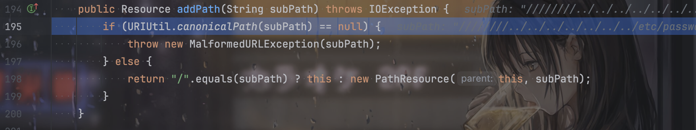

# CVE-2024-4956

是一个目录遍历的任意文件读取漏洞，具体的分析可以参考1ue师傅的，这里只简单介绍一下漏洞的代码。

直接定位到`ContextHandler.class`的`getResource`：


猜得出来是路径的拼接，看具体的处理代码；




`canonicalPath`是将路径规范化，实际上就是处理`.`和`../`这样的。

需要返回值不为`null`，也就是路径规范化后不能是空路径。

```java
    public static String canonicalPath(String path) {
        if (path != null && !path.isEmpty()) {
            boolean slash = true;
            int end = path.length();

            int i;
            label68:
            for(i = 0; i < end; ++i) {
                char c = path.charAt(i);
                switch (c) {
                    case '.':
                        if (slash) {
                            break label68;
                        }

                        slash = false;
                        break;
                    case '/':
                        slash = true;
                        break;
                    default:
                        slash = false;
                }
            }

            if (i == end) {
                return path;
            } else {
                StringBuilder canonical = new StringBuilder(path.length());
                canonical.append(path, 0, i);
                int dots = 1;
                ++i;

                for(; i < end; ++i) {
                    char c = path.charAt(i);
                    switch (c) {
                        case '.':
                            if (dots > 0) {
                                ++dots;
                            } else if (slash) {
                                dots = 1;
                            } else {
                                canonical.append('.');
                            }

                            slash = false;
                            continue;
                        case '/':
                            if (doDotsSlash(canonical, dots)) {
                                return null;
                            }

                            slash = true;
                            dots = 0;
                            continue;
                    }

                    while(dots-- > 0) {
                        canonical.append('.');
                    }

                    canonical.append(c);
                    dots = 0;
                    slash = false;
                }

                if (doDots(canonical, dots)) {
                    return null;
                } else {
                    return canonical.toString();
                }
            }
        } else {
            return path;
        }
    }

    private static boolean doDots(StringBuilder canonical, int dots) {
        switch (dots) {
            case 0:
            case 1:
                break;
            case 2:
                if (canonical.length() < 2) {
                    return true;
                }

                canonical.setLength(canonical.length() - 1);
                canonical.setLength(canonical.lastIndexOf("/") + 1);
                break;
            default:
                while(dots-- > 0) {
                    canonical.append('.');
                }
        }

        return false;
    }

    private static boolean doDotsSlash(StringBuilder canonical, int dots) {
        switch (dots) {
            case 0:
                canonical.append('/');
                break;
            case 1:
                return false;
            case 2:
                if (canonical.length() < 2) {
                    return true;
                }

                canonical.setLength(canonical.length() - 1);
                canonical.setLength(canonical.lastIndexOf("/") + 1);
                return false;
            default:
                while(true) {
                    if (dots-- <= 0) {
                        canonical.append('/');
                        break;
                    }

                    canonical.append('.');
                }
        }

        return false;
    }
```

debug跟着逻辑走一遍就可以理解，在遇到`../`的时候，会回溯一层路径，例如将`/a/b/../`变成`/a/`。因此就像1ue师傅说的，一个`../`会吃掉一个`/`。在前面添加相同数量的`/`，就可以想抵消，例如`/////../../../../etc/passwd`有4个`../`，就可以吃到前面的4个`/`，因此`canonicalPath`的结果变成`/etc/passwd`，不为`null`，成功的绕过。

后续拼接到`_baseResource`，实现路径穿越然后读取文件。

实际上如果传`aaa`，前面本来就会拼接上一个`/`，所以如果传7个`/`加7个`../`，经过处理后前面是8个`/`，所以会留下一个`/`


EXP：

```http
%2f%2f%2f%2f%2f%2f%2f..%2f..%2f..%2f..%2f..%2f..%2f..%2fetc%2fpasswd
```

