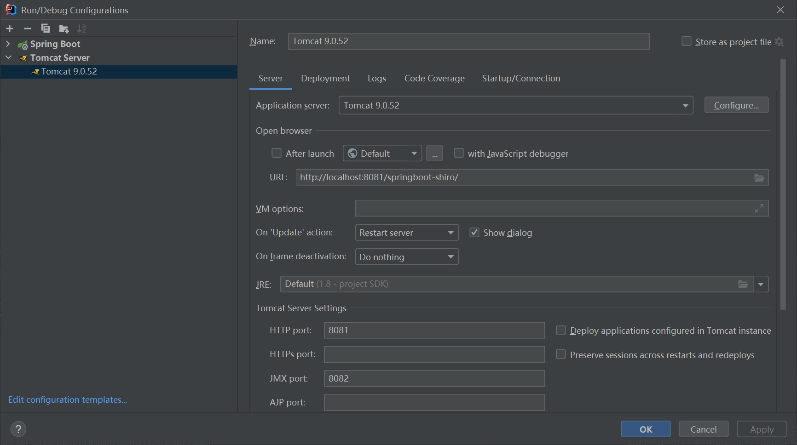
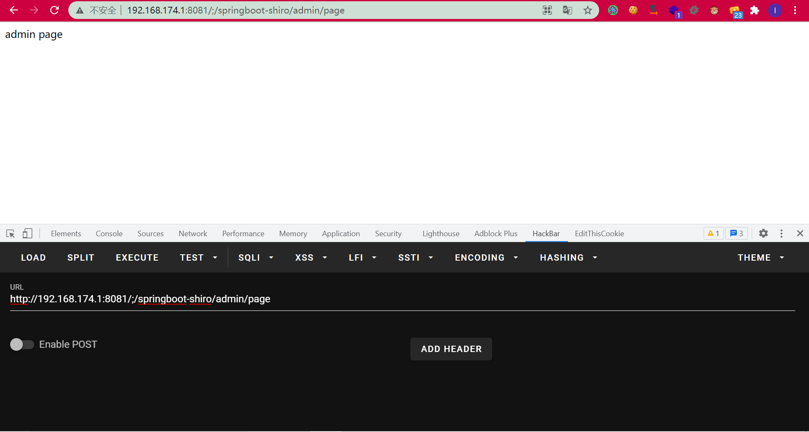
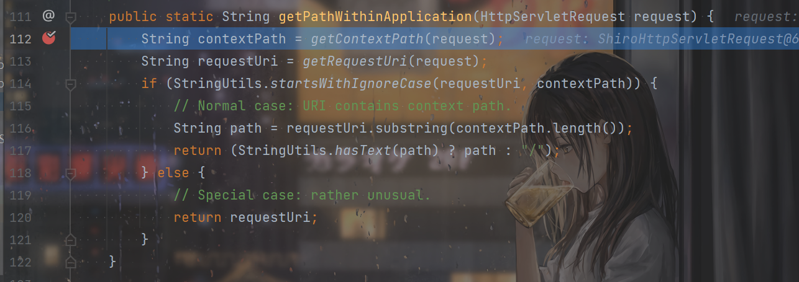
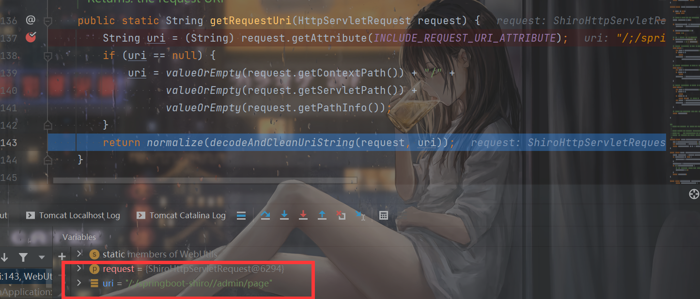
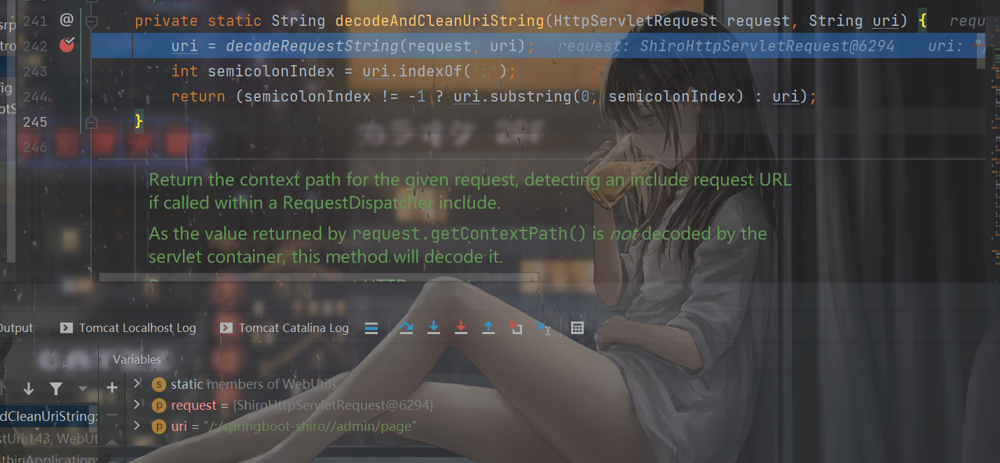
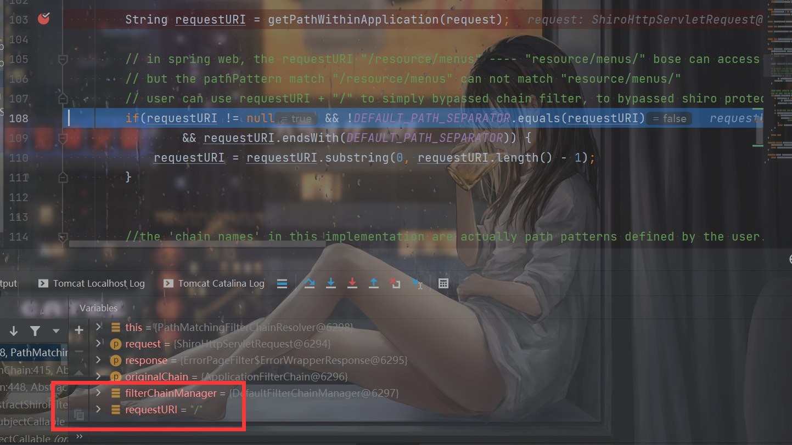

# 前言

之前学习了一波shiro权限绕过的利用，也是很久没有学Java了，接下来继续开始Java安全的学习。

有两种情况叭，一种就是项目没有部署在tomcat根目录，一种是部署在tomcat根目录上。

# 环境1

复现的环境代码利用这个：

https://github.com/l3yx/springboot-shiro

需要利用tomcat启动，拿IDEA配置一下tomcat，不要部署在tomcat根目录：



运行即可。


# 关于shiro的认证

虽然没用过shiro，但是看一下这个文章也就大致了解了：

https://zebinh.github.io/2020/03/SimpleShiro/


这样也就理解了这段代码：

```java
        ShiroFilterFactoryBean bean = new ShiroFilterFactoryBean();
        bean.setSecurityManager(securityManager());
        bean.setLoginUrl("/login");
        bean.setSuccessUrl("/index");
        bean.setUnauthorizedUrl("/unauthorizedurl");
        Map<String, String> map = new LinkedHashMap<>();
        map.put("/doLogin", "anon");
        map.put("/admin/*", "authc");
        bean.setFilterChainDefinitionMap(map);
        return  bean;
```


登录路径是`/login`，登录成功后转向`/index`，对于`/doLogin`任何人都能访问，对于`/admin/*`需要登录才能访问。


# 漏洞演示与分析1

`/admin/page`需要登录才能进入，`CVE-2020-11989`就是进行了一波权限的绕过。比如访问如下路径：

```
http://192.168.174.1:8081/;/springboot-shiro/admin/page
```

明明没有登录，却可以成功访问：



究其原因在于Shiro和Spring处理路径上方式的不同。


Shiro获取路径在`org/apache/shiro/web/filter/mgt/PathMatchingFilterChainResolver.java`的`getChain`方法：

```java
    public FilterChain getChain(ServletRequest request, ServletResponse response, FilterChain originalChain) {
        FilterChainManager filterChainManager = getFilterChainManager();
        if (!filterChainManager.hasChains()) {
            return null;
        }

        String requestURI = getPathWithinApplication(request);

        // in spring web, the requestURI "/resource/menus" ---- "resource/menus/" bose can access the resource
        // but the pathPattern match "/resource/menus" can not match "resource/menus/"
        // user can use requestURI + "/" to simply bypassed chain filter, to bypassed shiro protect
        if(requestURI != null && !DEFAULT_PATH_SEPARATOR.equals(requestURI)
                && requestURI.endsWith(DEFAULT_PATH_SEPARATOR)) {
            requestURI = requestURI.substring(0, requestURI.length() - 1);
        }


        //the 'chain names' in this implementation are actually path patterns defined by the user.  We just use them
        //as the chain name for the FilterChainManager's requirements
        for (String pathPattern : filterChainManager.getChainNames()) {
            if (pathPattern != null && !DEFAULT_PATH_SEPARATOR.equals(pathPattern)
                    && pathPattern.endsWith(DEFAULT_PATH_SEPARATOR)) {
                pathPattern = pathPattern.substring(0, pathPattern.length() - 1);
            }

            // If the path does match, then pass on to the subclass implementation for specific checks:
            if (pathMatches(pathPattern, requestURI)) {
                if (log.isTraceEnabled()) {
                    log.trace("Matched path pattern [" + pathPattern + "] for requestURI [" + Encode.forHtml(requestURI) + "].  " +
                            "Utilizing corresponding filter chain...");
                }
                return filterChainManager.proxy(originalChain, pathPattern);
            }
        }

        return null;
    }
```

先是获取`requestURI`，然后Shiro从FilterChain中不断拿出正则路由与它匹配，匹配到了进行相应的filter，正常请求`/admin/page`会和`/admin/*`匹配到，因此无法访问，但这里却出了问题。

打个断点看一下：


跟进`getPathWithinApplication()`方法：



从request中获取上下文路径是我们请求的`/;/springboot-shiro`，跟进`getRequestUri()`：



可以发现`uri`通过拼接而成，tomcat的上下文路径还有Servlet的路径，拼接起来就是`/;/springboot-shiro//admin/page`，继续跟进`decodeAndCleanUriString()`方法：



看到这里突然就恍然大悟了，先是对uri进行一次url解码，然后进行了一次截取，分割符竟然是分号，取得了分号之前的路径，之后再进行了路径的处理，去除了`./`，`../`之类的，最终得到`/`：



也就是说，这里原本应该是`/admin/page`，却因为那个分号，变成了`/`，绕过了`Servlet`的权限验证。


那么讲道理也应该访问不到我们的目标`/admin/page`的，但问题又出现了，Spring获取路径的方式和Shiro不一样。


