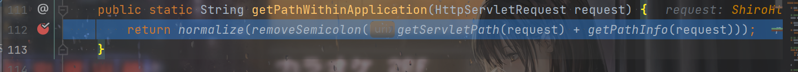
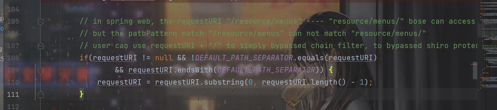

# 环境

shiro版本<=1.6.0，把上一篇文章中的1.5.2改成1.5.3即可。

后端的逻辑必须是`/xxx/{variable}`且`variable`的类型是`String`。

所以后端那里也要改成：

```java
    @GetMapping("/admin/{name}")
    public String admin() {
        return "admin page";
    }
```


# 攻击

POC：

```
/;/springboot-shiro/admin/%3Bpage
```

分号必须要url编码一次。

# 分析

Shiro在上一版本出了那个问题之后进行了修复。获取到url的逻辑变了，不再拼接前面的context了：




但是这就要提到shiro和Spring在处理分号上面的区别了。

还是老样子跟一下Shiro那里的处理，会发现传进去的`/admin/%3Bpage`，在`getServletPath()`得到的就是已经解码的，也就是`/admin/;page`，然后分割取得`/admin/`，跳出后在这里：



满足`if`，把末尾的`/`去掉，变成`/admin`，自然不满足`/admin/*`，不会被shiro拦截。

也就是说，shiro先url解码，后对分号进行处理。


而Spring却是这样的：

```java
	private String decodeAndCleanUriString(HttpServletRequest request, String uri) {
		uri = removeSemicolonContent(uri);
		uri = decodeRequestString(request, uri);
		uri = getSanitizedPath(uri);
		return uri;
	}
```

先对分号处理，然后再url解码。这就导致了漏洞的发生。

