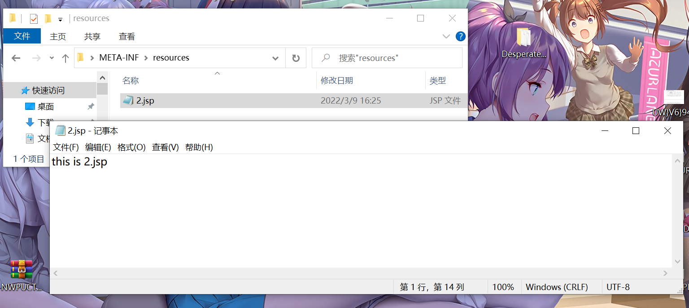
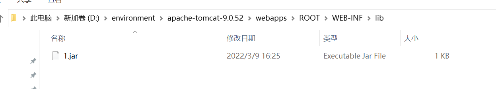

# Tomcat的知识和trick

## 前言

收集在tomcat环境中的各种trick。


## SESSION持久化

> 对于一个企业级应用而言，Session对象的管理十分重要。Sessio对象的信息一般情况下置于服务器的内存中，当服务器由于故障重启，或应用重新加载 时候，此时的Session信息将全部丢失。为了避免这样的情况，在某些场合可以将服务器的Session数据存放在文件系统或数据库中，这样的操作称为 Session对象的持久化。Session对象在持久化时，存放在其中的对象以序列化的形式存放，这就是为什么一般存放在Session中的数据需要实 现可序列化接口（java.io.Serializable）的原因了。
>
> 当一个Session开始时，Servlet容器会为Session创建一个HttpSession对象。Servlet容器在某些情况下把这些 HttpSession对象从内存中转移到文件系统或数据库中，在需要访问 HttpSession信息时再把它们加载到内存中。

> 默认配置下，Tomcat 在关闭服务的时候，会将用户 Session 中的数据以序列化的形式持久存储到本地，这样下次 Tomcat 再启动的时候，能够从本地存储的 Session 文件中恢复先前的 Session 数据内容，避免造成用户 Session 还未到期就由于服务重启而失效。

tomcat停止服务之后就会往work 应用目录下的 SESSIONS.ser中写入数据，可以通过EL表达式控制：

```
${pageContext.servletContext.classLoader.resources.context.manager.pathname=param.a}
${sessionScope[param.b]=param.c}
```

触发SESSION持久化也可以通过reload

## tomcat的reload

1. Context reloadable 配置为 true（默认是 false）；
2. /WEB-INF/classes/ 或者 /WEB-INF/lib/ 目录下的文件发生变化。
   1. /WEB-INF/classes/ 下已加载过的 class 文件内容发生了修改；
   2. /WEB-INF/lib/ 下已加载过的 jar 文件内容发生了修改，或者写入了新的 jar 文件。

具体利用参考RWCTF2022-DesperateCat

还可以利用`Tomcat Context WatchedResource`：

在 Tomcat 9 环境下，默认的 WatchedResource 包括：

- WEB-INF/web.xml
- WEB-INF/tomcat-web.xml
- ${CATALINA_HOME}/conf/web.xml

> Tomcat 会有后台线程去监控这些文件资源，在 Tomcat 开启 autoDeploy 的情况下（此值默认为 true，即默认开启 autoDeploy），一旦发现这些文件资源的 lastModified 时间被修改，也会触发 reload


## 关于jar包META-INF/resources/的利用

往jar包的`META-INF/resources/`下面写jsp马，然后放到`./WEB-INF/lib/`下面再触发reload，这个jsp马就可以被直接被访问到，这也是tomcat部署的一个知识了（之前docker tomcat部署的时候就遇到过这个）






